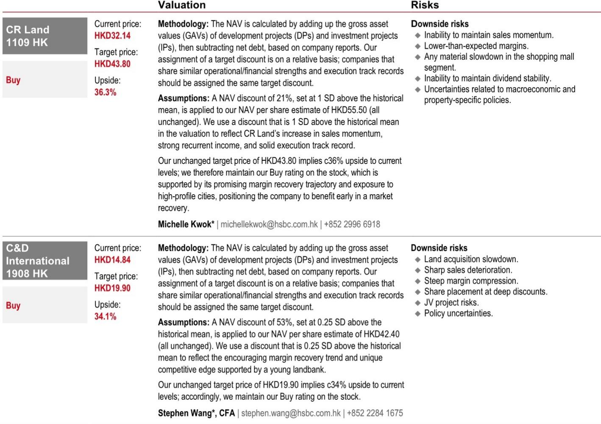
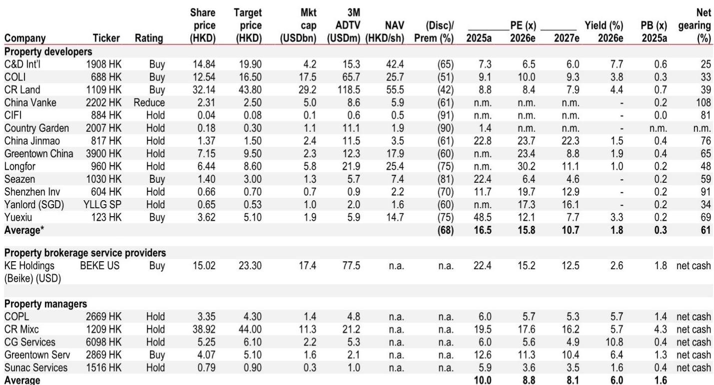
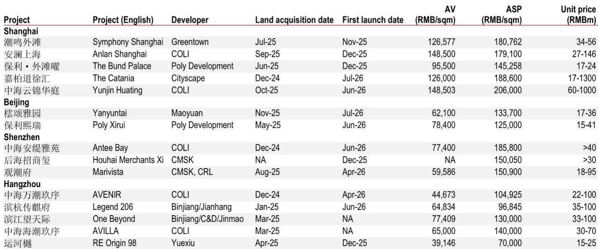

# HSBC：中国地产盈利修复被低估，毛利率每高0.5%利润上修13%

当市场还在为夏季销售淡季和房价不确定性担忧时，HSBC发布了一份值得认真对待的报告。其核心判断并非简单的“看好”或“看空”，而是一个更微妙的比较：在估值回落后，中国内地开发商相对于香港地产公司，提供了更大的意外上行空间。

报告的逻辑链条清晰，但真正值得关注的不是结论本身，而是支撑这一判断的几个结构性变化。这些变化可能正在重塑读者对内地房地产板块的定价框架。

## 1. 盈利修复的弹性被低估，毛利率每高出预期0.5个百分点，利润可能上修13-27%

市场对开发商盈利能力的悲观预期，可能忽略了两个正在发生的积极变化。一是随着房价趋稳，存货减值不确定性正在减轻，这直接改善了开发商的利润表。二是高端项目在销售结构中占比提升，而这些项目的毛利率显著高于行业平均水平。

HSBC的敏感性分析显示，如果毛利率比预期高出0.5个百分点，主要开发商2026-2028年的盈利可能上修13-27%。如果高出1个百分点，利润弹性更是达到26-54%。这种弹性在中型开发商中尤为突出，因为它们的盈利基数在2024-2025年已被压缩至周期低位。

> **KC评论：** 这个敏感性分析本身就是一个观察工具。读者可以对照报告中的项目级毛利率数据（图2），去验证哪些开发商的高端项目占比更高、存货减值不确定性更低。这比单纯看PE或PB更能判断盈利修复的真实空间。

## 2. 政策能见度与财富效应形成双重支撑，但市场尚未充分定价

报告指出了一个容易被忽视的差异：内地开发商相对香港地产公司，拥有更清晰的政策能见度。较低的利率环境使内地房地产市场基本不受全球利率波动的影响，而跨境资金流动对香港市场情绪的冲击，则使内地成为“更干净”的研究选项。

更值得关注的是财富效应。科技股的广泛上涨，为持有股权激励的公司高管和零售读者创造了可观的财富积累。这部分资金正在寻求从波动性较高的权益资产向稀缺实物资产进行多元化配置。深圳的豪宅市场，正在扮演这一角色——不仅是居住升级，更是一种财富储存手段。

## 3. 土地市场回暖是领先指标，但复苏仍是城市和细分市场层面的

报告对“市场稳定正在形成”的判断持谨慎态度。复苏并非普涨，而是由一线城市和高端细分市场引领。土地拍卖市场的回暖是一个积极信号——优质地块的稀缺性和高端需求的韧性，正在为新房价格预期提供支撑。

但报告也坦承，更广泛的宏观环境仍会为市场情绪和整体复苏制造噪音。全国层面的库存月数仍然偏高，尽管相对库存量在2023-2025年已下降约20%，深圳等城市的降幅更为明显。这种供给调整是供需再平衡的关键。

> **KC评论：** 土地市场的回暖是领先指标，但读者需要区分“补库存”和“投机性拿地”。报告强调的“优质地块稀缺”，意味着只有那些有能力获取核心城市高端地块的开发商，才能在这一轮复苏中享受定价权和利润率优势。

## 4. 报告尚未完全回答的关键问题：盈利修复的可持续性

HSBC的报告提供了一个富有洞察力的分析框架，但一个关键问题仍未完全解答：盈利修复的可持续性。

当前毛利率的改善，部分来自低基数效应和高端项目的结构性贡献。但这是否意味着行业已经进入一个可持续的盈利上行周期？如果宏观环境出现变化，或者高端需求出现边际降温，盈利弹性的假设可能需要重新审视。此外，报告对“wealth support”（财富效应）的讨论相对简略，科技股上涨带来的财富效应能否持续，本身就是一个开放性问题。

对于专业读者而言，这份报告的价值不在于给出一个明确的交易建议，而在于提供了一个可验证的分析框架。真正的观察重点应该是：在接下来的几个季度中，开发商的毛利率和减值数据，是否真的如HSBC的敏感性分析所示，开始向积极方向演变。

For informational purposes only. Portions may be generated,translated,summarized,or edited with AI assistance based on source materials and may contain omissions or errors. Please verify independently. This is not investment,legal,tax,accounting,or other professional advice.

