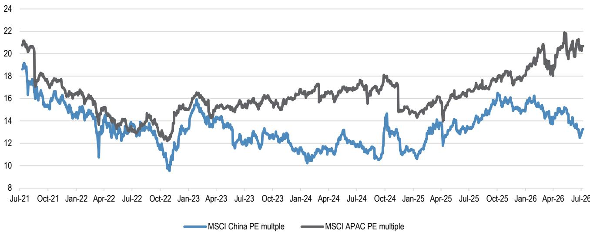
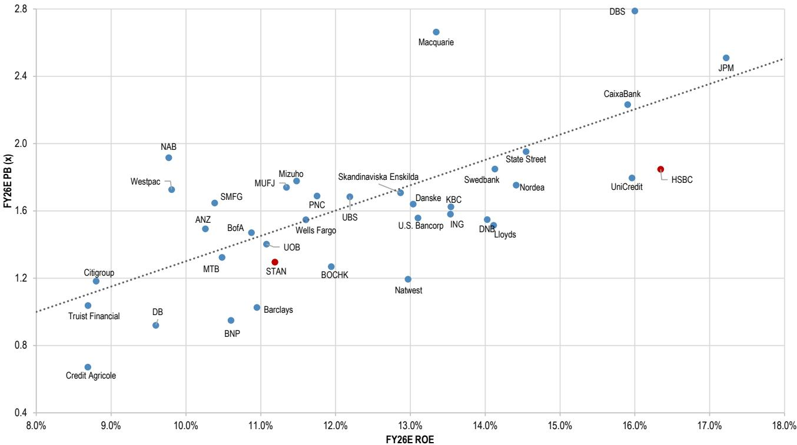
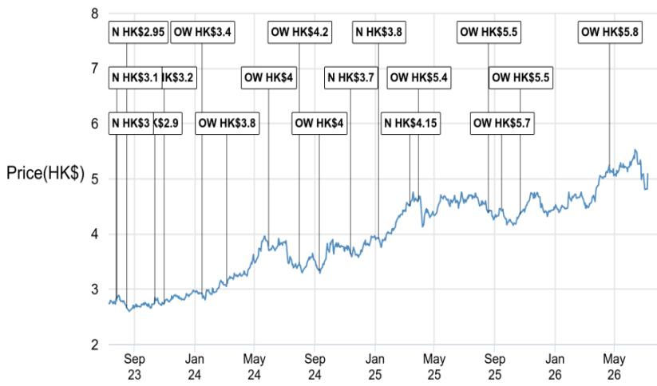
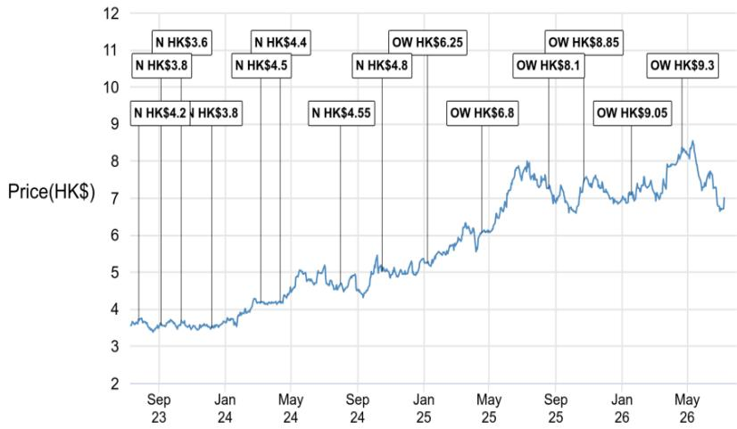
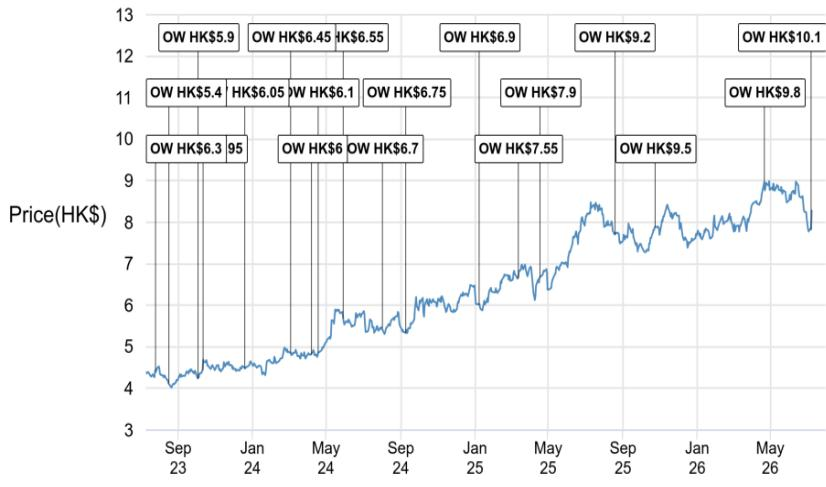
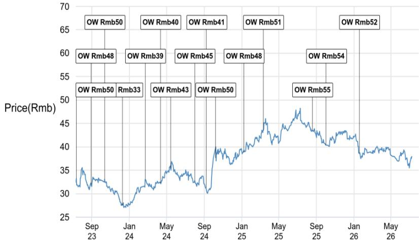
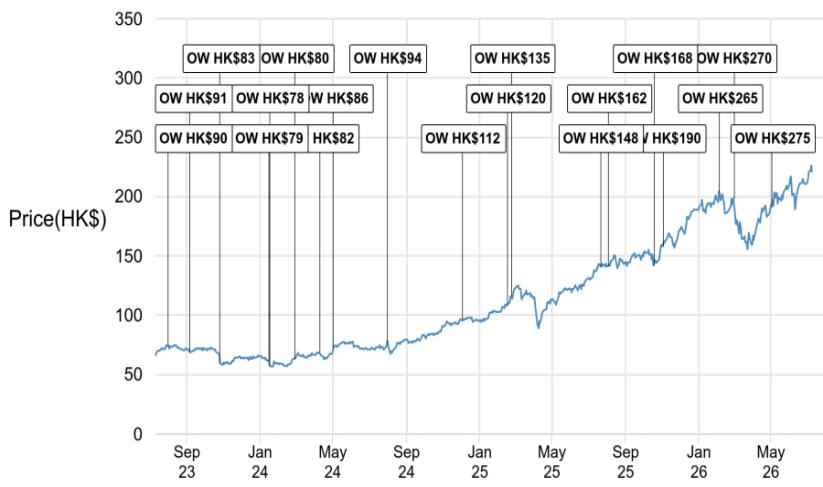

This material is neither intended to be distributed to Mainland China investors nor to provide securities investment consultancy services within the territory of Mainland China. This material or any portion hereof may not be reprinted, sold or redistributed without the written consent of JPM.

## HK/CH banks

## China banks' risk-off rotation rally may moderate; STAN pullback a chance to review

Renewed Middle East conflict concerns and profit-taking in the AI trade appear to be driving a risk-off rotation into perceived safe-haven China SOE banks, while weighing on higher-beta names such as STAN. Looking ahead, we expect today's (July 8) sharp rally in China banks to moderate and anticipate sideways trading into the late-August results season. Within SOE banks, we prefer CCB and BOC; over a six-month horizon, we favor CMB-A and Citic Bank-H for their higher dividend yields (CMB-A: 5.5%, Citic-H: 6.4%). For STAN, despite potential 2Q26 earnings growth headwinds from a high base—reflecting the prior-period disposal gain and elevated episodic income—we view any pullback into results and risk-off trade as an opportunity to review. We believe Middle East exposure risks are manageable, and STAN remains on track to lift ROTE from 11.9% in 2025 toward management's guidance of >15% by 2028 and 18% by 2030. In addition, its valuation is attractive (Figure 3), and with total return higher than the China SOE banks. STAN is our top pick among HK/CH banks.

\- The rise of geopolitical risk and profit-taking on AI trade drives banks' share price movement. On July 7, the US launched a new wave of strikes against Iran and the US President declared that the tentative ceasefire with Iran is done (link), raising concern of renewed military conflicts in the Middle East region. In our view, this exacerbates the risk-off sentiment, the resulting style rotation trades contributed to today's $5\%$ rally of China SOE banks in H shares, and $2\%$ pullback of STAN, with SOE banks outperforming the HSI by 2ppt and STAN underperforming by 5ppt.

\- Examining the drivers for today's China banks rally: First, China banks underperformed in the past month and valuation is undemanding. Prior to today's rally, the MSCI China index had corrected $8\%$ in the past month, underperforming MSCI APAC banks by 16ppt, while the consensus EPS changes for MSCI China banks and MSCI APAC banks (MXACAPBC Index) were quite muted in the same period. The MSCI China banks index was trading at FY1 5x P/E and 0.5 P/B according to Bloomberg consensus, vs MSCI APAC banks at 11x P/E and 1.3x P/B. The past month's movement was driven by style rotation, and now we see a reversal of that. Second, China banks, particularly the Big 4 SOE banks, have been viewed as a relative safe haven for risk-off trade, thus, in the month after the start of the Iran conflict (on Feb 28), MSCI China banks rose by $5\%$ , outperforming MSCI APAC banks by 15ppt and the HSI by 12ppt in that period (Figure 1). Third, we believe the SOE banks are able to sustain the growth momentum in 1Q26 by delivering mid-to-high single digit revenue growth and $3\%-5\%$ profits growth in 2Q26.

\- Understanding the STAN weakness: First, STAN is more exposed to the Middle East compared to HSBC and other HK/CH banks. Table 2 shows that the Middle East region contributed \~6% of STAN's risk exposure and 8.1% of PBT in 1Q26. Thus, renewed concern of military conflict may trigger profits taking as STAN's share price is up 28% in the past 3M, beating the HSI by 37ppt and MSCI APAC banks by 23ppt. Second, STAN is not in key HK/China indexes. Risk-off sentiment drove rotation into MSCI China, which

## Banks & Financial Services

Katherine Lei AC
(852) 2800-8552
katherine.lei@JPM.com
JPM Securities (Asia Pacific) Limited/
JPM Broking (Hong Kong) Limited

Peter Zhang
(852) 2800-8557
peter.zhang@JPM.com
JPM Securities (Asia Pacific) Limited/
JPM Broking (Hong Kong) Limited

Lincoln Yu
(852) 2800 8523
lincoln.yu@JPM.com
JPM Securities (Asia Pacific) Limited/
JPM Broking (Hong Kong) Limited

Haomin Chen
(86-21) 6106 6347
haomin.chen@JPM.com
SAC Registration Number: S1730524080002
JPM Securities (China) Company Limited

See page 5 for analyst certification and important disclosures, including non-US analyst disclosures.

underperformed MSCI APAC YTD by 33ppt and trades at 13.3x FY1 P/E vs MSCI APAC at 20.7x (Figure 2). And STAN is not a constituent stock in MSCI HK/China, nor in the HSI, despite its 167 years of operation in Hong Kong. Third, headline profits growth in 2Q26 may be lackluster due to the high base in 2Q25 with the \$0.2bn disposal gain from Solv India and elevated episodic income from the Financial Market business.

\- What to do from here? On China banks, we believe today's strong performance is not sustainable, on back of limited earnings tailwinds and dividend yields that are not attractive enough, as shown in our prior analysis (link). We expect stocks to trade sideways into results. We expect SOE banks to deliver more solid 2Q26 results than JSBs, and we prefer CCB and BOC among SOE banks. That said, we prefer CMB-A and Citic Bank-H on a 6M view, as the dividend yield of CMB-A is 140bps higher than the Big 4 A-share SOE banks, while Citic-H's dividend yield is 110bps higher than the Big 4 H-share SOE banks. On STAN, we believe the weakness may present an opportunity to review. We believe risk on ME exposure is manageable. And, in our view, STAN is on the right trajectory to deliver $>15\%$ ROTE by 2028 and $18\%$ by 2030 as guided by management, up from $11.9\%$ in 2025. Its current valuation looks attractive vs DM banks peers (Figure 3).

Figure 1: In the month after the Iran conflict started (on Feb 28), MSCI China banks rose by 5%, outperforming MSCI APAC banks by 15ppt  
  
Source: Bloomberg Finance L.P. Data as of July 8, 2026. Note that we set the price as of Dec 31, 2025, as 1.0.

Jul-21 Oct-21 Jan-22 Apr-22 Jul-22 Oct-22 Jan-23 Apr-23 Jul-23 Oct-23 Jan-24 Apr-24 Jul-24 Oct-24 Jan-25 Apr-25 Jul-25 Oct-25 Jan-26 Apr-26 Jul-26
MSCI China PE multiple MSCI APAC PE multiple

Figure 2: MSCI China is trading at 13.3x FY1 P/E, compared to 20.7x for MSCI APAC index  
  
Source: Bloomberg Finance L.P. Data as of July 8, 2026.

Table 1: Quantifying HSBC's exposure to the Middle East

<table><tr><td>In US$ mn; as of 1Q26</td><td>Total assets</td><td>Total loans (gross)</td><td>Revenue</td><td>PBT</td></tr><tr><td>HSBC Group</td><td>3,306,011</td><td>1,013,296</td><td>19,128</td><td>9,376</td></tr><tr><td>HSBC Middle East Limited</td><td>66,083</td><td>25,250</td><td>637</td><td>219</td></tr><tr><td>% of Group</td><td>2.0%</td><td>2.5%</td><td>3.3%</td><td>2.3%</td></tr><tr><td>HSBC Middle East plus Egypt, Turkey, and Saudi Arabia*</td><td></td><td></td><td></td><td>619</td></tr><tr><td>% of Group</td><td></td><td></td><td></td><td>6.6%</td></tr></table>

Source: Company data, JPM. \* Note: we include profits from associate Saudi Awwal Bank

Table 2: Quantifying STAN's exposure to the Middle East

<table><tr><td>In US$ mn unless otherwise stated; as of 1Q26</td><td>Total exposure (US$bn)</td><td>Total assets</td><td>Gross loan</td><td>Revenue</td><td>PBT</td></tr><tr><td>STAN Group</td><td>670</td><td>972,907</td><td>357,388</td><td>5,902</td><td>2,450</td></tr><tr><td>UAE</td><td>21</td><td>22,361</td><td>10,032</td><td>356</td><td>179</td></tr><tr><td>% of Group</td><td>3.1%</td><td>2.3%</td><td>2.8%</td><td>6.0%</td><td>7.3%</td></tr><tr><td>Middle East *</td><td>40</td><td></td><td></td><td></td><td>198</td></tr><tr><td>% of Group</td><td>6.0%</td><td></td><td></td><td></td><td>8.1%</td></tr></table>

Source: Company data, J.P Morgan. Note: \*STAN only disclosed its Middle East exposure in a 1Q26 presentation. For its Middle East PBT contribution, we refer to STAN's country-by-country disclosures in 2025 and calculate the PBT contributions of UAE, Bahrain, Qatar, Oman, Iraq, Saudi Arabia.

Figure 3: PB-ROE for DM banks – STAN looks attractive when compared to peers  
  
Source: Bloomberg Finance L.P., JPM estimates, Data as of July 8, 2026.

Companies Discussed in This Report (all prices in this report as of market close on 08 July 2026, unless otherwise indicated)

Bank of China - H(3988.HK/HK\$5.09/OW), China Citic Bank - H(0998.HK/HK\$7.01/OW), China Construction Bank - H(0939.HK/HK\$8.28/OW), China Merchants Bank - A(600036.SS/Rmb37.94/OW), Standard Chartered Plc (HK) (2888)(2888.HK/HK\$221.00/OW)

Analyst Certification: The Research Analyst(s) denoted by an “AC” on the cover of this report certifies (or, where multiple Research Analysts are primarily responsible for this report, the Research Analyst denoted by an “AC” on the cover or within the document individually certifies, with respect to each security or issuer that the Research Analyst covers in this research) that: (1) all of the views expressed in this report accurately reflect the Research Analyst’s personal views about any and all of the subject securities or issuers; and (2) no part of any of the Research Analyst's compensation was, is, or will be directly or indirectly related to the specific recommendations or views expressed by the Research Analyst(s) in this report. For all Korea-based Research Analysts listed on the front cover, if applicable, they also certify, as per KOFIA requirements, that the Research Analyst’s analysis was made in good faith and that the views reflect the Research Analyst’s own opinion, without undue influence or intervention.

All authors named within this report are Research Analysts who produce independent research unless otherwise specified. In Europe, Sector Specialists (Sales and Trading) may be shown on this report as contacts but are not authors of the report or part of the Research Department.

## Important Disclosures

\- Market Maker/ Liquidity Provider: JPM is a market maker and/or liquidity provider in the financial instruments of/related to Bank of China - H, China Citic Bank - H, China Construction Bank - H, China Merchants Bank - A, Standard Chartered Plc (HK) (2888) or related entities.

\- Market Maker/ Liquidity Provider (Hong Kong): JPM Securities (Asia Pacific) Limited and/or JPM Broking (Hong Kong) Limited and/or an affiliate is a market maker and/or liquidity provider in the securities of Bank of China - H, China Citic Bank - H, China Construction Bank - H, China Merchants Bank - A, Standard Chartered Plc (HK) (2888) or related entities and/or warrants or options thereon, which are listed or traded on The Stock Exchange of Hong Kong Limited.

\- Manager or Co-manager: JPM acted as manager or co-manager in a public offering of securities or financial instruments (as such term is defined in Directive 2014/65/EU) of/for Bank of China - H, China Merchants Bank - A, Standard Chartered Plc (HK) (2888) or related entities within the past 12 months.

\- Client: JPM currently has, or had within the past 12 months, the following entity(ies) as clients: Bank of China - H, China Citic Bank - H, China Construction Bank - H, China Merchants Bank - A, Standard Chartered Plc (HK) (2888) or related entities.

\- Client/Investment Banking: JPM currently has, or had within the past 12 months, the following entity(ies) as investment banking clients: Bank of China - H, China Construction Bank - H, China Merchants Bank - A, Standard Chartered Plc (HK) (2888) or related entities.

\- Client/Non-Investment Banking, Securities-Related: JPM currently has, or had within the past 12 months, the following entity(ies) as clients, and the services provided were non-investment-banking, securities-related: Bank of China - H, China Citic Bank - H, China Construction Bank - H, China Merchants Bank - A, Standard Chartered Plc (HK) (2888) or related entities.

\- Client/Non-Securities-Related: JPM currently has, or had within the past 12 months, the following entity(ies) as clients, and the services provided were non-securities-related: Bank of China - H, China Citic Bank - H, China Construction Bank - H, China Merchants Bank - A, Standard Chartered Plc (HK) (2888) or related entities.

\- Investment Banking Compensation Received: JPM has received in the past 12 months compensation for investment banking services from Bank of China - H, China Construction Bank - H, China Merchants Bank - A, Standard Chartered Plc (HK) (2888) or related entities.

\- Potential Investment Banking Compensation: JPM expects to receive, or intends to seek, compensation for investment banking services in the next three months from Bank of China - H, China Citic Bank - H, China Construction Bank - H, China Merchants Bank - A, Standard Chartered Plc (HK) (2888) or related entities.

\- Non-Investment Banking Compensation Received: JPM has received compensation in the past 12 months for products or services other than investment banking from Bank of China - H, China Citic Bank - H, China Construction Bank - H, China Merchants Bank - A, Standard Chartered Plc (HK) (2888) or related entities.

• Broker: JPM acts as Corporate Broker to Standard Chartered Plc (HK) (2888) or related entities.

\- Debt Position: JPM may hold a position in the debt securities of Bank of China - H, China Citic Bank - H, China Construction Bank - H, China Merchants Bank - A, Standard Chartered Plc (HK) (2888) or related entities, if any.

\- JPM Securities PLC and/or its affiliates is acting as a Financial Advisor to Standard Chartered Plc in connection with the company's intention to explore alternatives for the future ownership of its aviation finance business as announced on 11 January 2023.

Company-Specific Disclosures: JPM does and seeks to do business with companies covered in its research reports. As a result, investors should be aware that the firm may have a conflict of interest that could affect the objectivity of this report. Investors should consider this report as only a single factor in making their investment decision. Important disclosures, including price charts and credit opinion history tables (if applicable), are available for compendium reports and all JPM-covered companies, and certain non-covered companies, by visiting https://www.jpmm.com/research/disclosures, calling 1-800-477-0406, or e-mailing research.disclosure.inquiries@JPM.com with your request.

Bank of China - H (3988.HK, 3988 HK) Price Chart  
  
Source: Bloomberg Finance L.P. and JPM; price data adjusted for stock splits and dividends. Initiated coverage Jul 05, 2006. All share prices are as of market close on the previous business day.

China Citic Bank - H (0998.HK, 998 HK) Price Chart  
  
Source: Bloomberg Finance L.P. and JPM; price data adjusted for stock splits and dividends. Initiated coverage Nov 23, 2009. All share prices are as of market close on the previous business day.

<table><tr><td>Date</td><td>Rating</td><td>Price (HK$)</td><td>Price Target (HK$)</td></tr><tr><td>26-Jul-23</td><td>N</td><td>2.82</td><td>3</td></tr><tr><td>28-Jul-23</td><td>N</td><td>2.83</td><td>3.1</td></tr><tr><td>17-Aug-23</td><td>N</td><td>2.66</td><td>2.95</td></tr><tr><td>12-Oct-23</td><td>N</td><td>2.74</td><td>2.9</td></tr><tr><td>01-Nov-23</td><td>OW</td><td>2.74</td><td>3.2</td></tr><tr><td>17-Jan-24</td><td>OW</td><td>2.91</td><td>3.4</td></tr><tr><td>07-Mar-24</td><td>OW</td><td>3.10</td><td>3.8</td></tr><tr><td>30-May-24</td><td>OW</td><td>3.78</td><td>4</td></tr><tr><td>01-Aug-24</td><td>OW</td><td>3.48</td><td>4.2</td></tr><tr><td>10-Sep-24</td><td>OW</td><td>3.34</td><td>4</td></tr><tr><td>13-Nov-24</td><td>N</td><td>3.64</td><td>3.7</td></tr><tr><td>08-Jan-25</td><td>N</td><td>3.92</td><td>3.8</td></tr><tr><td>13-Mar-25</td><td>N</td><td>4.51</td><td>4.15</td></tr><tr><td>31-Mar-25</td><td>OW</td><td>4.59</td><td>5.4</td></tr><tr><td>19-Aug-25</td><td>OW</td><td>4.39</td><td>5.5</td></tr><tr><td>15-Sep-25</td><td>OW</td><td>4.46</td><td>5.7</td></tr><tr><td>23-Oct-25</td><td>OW</td><td>4.36</td><td>5.5</td></tr><tr><td>22-Apr-26</td><td>OW</td><td>5.25</td><td>5.8</td></tr><tr><td colspan="4"></td></tr><tr><td>Date</td><td>Rating</td><td>Price (HK$)</td><td>Price Target (HK$)</td></tr><tr><td>26-Jul-23</td><td>N</td><td>3.73</td><td>4.2</td></tr><tr><td>06-Sep-23</td><td>N</td><td>3.58</td><td>3.8</td></tr><tr><td>13-Oct-23</td><td>N</td><td>3.70</td><td>3.6</td></tr><tr><td>08-Dec-23</td><td>N</td><td>3.50</td><td>3.8</td></tr><tr><td>07-Mar-24</td><td>N</td><td>4.18</td><td>4.5</td></tr><tr><td>12-Apr-24</td><td>N</td><td>4.20</td><td>4.4</td></tr><tr><td>01-Aug-24</td><td>N</td><td>4.68</td><td>4.55</td></tr><tr><td>16-Oct-24</td><td>N</td><td>5.03</td><td>4.8</td></tr><tr><td>08-Jan-25</td><td>OW</td><td>5.25</td><td>6.25</td></tr><tr><td>18-Apr-25</td><td>OW</td><td>6.07</td><td>6.8</td></tr><tr><td>19-Aug-25</td><td>OW</td><td>7.27</td><td>8.1</td></tr><tr><td>23-Oct-25</td><td>OW</td><td>7.43</td><td>8.85</td></tr><tr><td>19-Jan-26</td><td>OW</td><td>7.10</td><td>9.05</td></tr><tr><td>22-Apr-26</td><td>OW</td><td>8.37</td><td>9.3</td></tr></table>

China Construction Bank - H (0939.HK, 939 HK) Price Chart  
  
Source: Bloomberg Finance L.P. and JPM; price data adjusted for stock splits and dividends. Initiated coverage Dec 04, 2006. All share prices are as of market close on the previous business day.

<table><tr><td>Date</td><td>Rating</td><td>Price (HK$)</td><td>Price Target (HK$)</td></tr><tr><td>26-Jul-23</td><td>OW</td><td>4.43</td><td>6.3</td></tr><tr><td>17-Aug-23</td><td>OW</td><td>4.12</td><td>5.4</td></tr><tr><td>04-Oct-23</td><td>OW</td><td>4.24</td><td>5.9</td></tr><tr><td>12-Oct-23</td><td>OW</td><td>4.44</td><td>5.95</td></tr><tr><td>20-Dec-23</td><td>OW</td><td>4.49</td><td>6.05</td></tr><tr><td>05-Mar-24</td><td>OW</td><td>4.85</td><td>6.45</td></tr><tr><td>08-Apr-24</td><td>OW</td><td>4.81</td><td>6</td></tr><tr><td>19-Apr-24</td><td>OW</td><td>4.86</td><td>6.1</td></tr><tr><td>30-May-24</td><td>OW</td><td>5.69</td><td>6.55</td></tr><tr><td>02-Aug-24</td><td>OW</td><td>5.46</td><td>6.7</td></tr><tr><td>10-Sep-24</td><td>OW</td><td>5.34</td><td>6.75</td></tr><tr><td>08-Jan-25</td><td>OW</td><td>6.02</td><td>6.9</td></tr><tr><td>13-Mar-25</td><td>OW</td><td>6.65</td><td>7.55</td></tr><tr><td>18-Apr-25</td><td>OW</td><td>6.67</td><td>7.9</td></tr><tr><td>19-Aug-25</td><td>OW</td><td>7.71</td><td>9.2</td></tr><tr><td>24-Oct-25</td><td>OW</td><td>7.88</td><td>9.5</td></tr><tr><td>22-Apr-26</td><td>OW</td><td>8.96</td><td>9.8</td></tr><tr><td>08-Jul-26</td><td>OW</td><td>7.83</td><td>10.1</td></tr></table>

China Merchants Bank - A (600036.SS, 600036 CH) Price Chart  
  
Source: Bloomberg Finance L.P. and JPM; price data adjusted for stock splits and dividends. Initiated coverage Aug 04, 2004. All share prices are as of market close on the previous business day.

<table><tr><td>Date</td><td>Rating</td><td>Price (Rmb)</td><td>Price Target (Rmb)</td></tr><tr><td>13-Jul-23</td><td>OW</td><td>33.20</td><td>50</td></tr><tr><td>30-Aug-23</td><td>OW</td><td>32.04</td><td>48</td></tr><tr><td>13-Oct-23</td><td>OW</td><td>33.07</td><td>50</td></tr><tr><td>10-Dec-23</td><td>OW</td><td>27.50</td><td>33</td></tr><tr><td>22-Feb-24</td><td>OW</td><td>33.00</td><td>39</td></tr><tr><td>12-Apr-24</td><td>OW</td><td>32.30</td><td>40</td></tr><tr><td>15-May-24</td><td>OW</td><td>35.34</td><td>43</td></tr><tr><td>01-Aug-24</td><td>OW</td><td>32.73</td><td>45</td></tr><tr><td>08-Sep-24</td><td>OW</td><td>31.25</td><td>41</td></tr><tr><td>08-Oct-24</td><td>OW</td><td>37.61</td><td>50</td></tr><tr><td>08-Jan-25</td><td>OW</td><td>38.90</td><td>48</td></tr><tr><td>12-Mar-25</td><td>OW</td><td>43.51</td><td>51</td></tr><tr><td>19-Aug-25</td><td>OW</td><td>43.51</td><td>55</td></tr><tr><td>03-Oct-25</td><td>OW</td><td>40.41</td><td>54</td></tr><tr><td>19-Jan-26</td><td>OW</td><td>38.72</td><td>52</td></tr></table>

Standard Chartered Plc (HK) (2888) (2888.HK, 2888 HK) Price Chart  
  
Source: Bloomberg Finance L.P. and JPM; price data adjusted for stock splits and dividends. Initiated coverage Sep 24, 2002. All share prices are as of market close on the previous business day.

<table><tr><td>Date</td><td>Rating</td><td>Price (HK$)</td><td>Price Target (HK$)</td></tr><tr><td>01-Aug-23</td><td>OW</td><td>74.25</td><td>90</td></tr><tr><td>07-Sep-23</td><td>OW</td><td>69.20</td><td>91</td></tr><tr><td>27-Oct-23</td><td>OW</td><td>59.75</td><td>83</td></tr><tr><td>16-Jan-24</td><td>OW</td><td>61.55</td><td>79</td></tr><tr><td>18-Jan-24</td><td>OW</td><td>57.35</td><td>78</td></tr><tr><td>28-Feb-24</td><td>OW</td><td>63.35</td><td>80</td></tr><tr><td>10-Apr-24</td><td>OW</td><td>68.25</td><td>82</td></tr><tr><td>03-May-24</td><td>OW</td><td>71.95</td><td>86</td></tr><tr><td>31-Jul-24</td><td>OW</td><td>76.90</td><td>94</td></tr><tr><td>04-Dec-24</td><td>OW</td><td>96.80</td><td>112</td></tr><tr><td>17-Feb-25</td><td>OW</td><td>108.20</td><td>120</td></tr><tr><td>24-Feb-25</td><td>OW</td><td>116.00</td><td>135</td></tr><tr><td>22-Jul-25</td><td>OW</td><td>141.30</td><td>148</td></tr><tr><td>04-Aug-25</td><td>OW</td><td>141.30</td><td>162</td></tr><tr><td>19-Oct-25</td><td>OW</td><td>142.00</td><td>168</td></tr><tr><td>03-Nov-25</td><td>OW</td><td>157.80</td><td>190</td></tr><tr><td>05-Feb-26</td><td>OW</td><td>203.40</td><td>265</td></tr><tr><td>01-Mar-26</td><td>OW</td><td>198.50</td><td>270</td></tr><tr><td>03-May-26</td><td>OW</td><td>190.80</td><td>275</td></tr></table>

The chart(s) show JPM's continuing coverage of the stocks; the current analysts may or may not have covered it over the entire period.

JPM ratings or designations: OW = Overweight, N = Neutral, UW = Underweight, NR = Not Rated

## Explanation of Equity Research Ratings, Designations and Analyst(s) Coverage Universe:

JPM uses the following rating system: Overweight (over the duration of the price target indicated in this report, we expect this stock will outperform the average total return of the stocks in the Research Analyst's, or the Research Analyst's team's, coverage universe); Neutral (over the duration of the price target indicated in this report, we expect this stock will perform in line with the average total return of the stocks in the Research Analyst's, or the Research Analyst's team's, coverage universe); and Underweight (over the duration of the price target indicated in this report, we expect this stock will underperform the average total return of the stocks in the Research Analyst's, or the Research Analyst's team's, coverage universe. NR is Not Rated. In this case, JPM has removed the rating and, if applicable, the price target, for this stock because of either a lack of a sufficient fundamental basis or for legal, regulatory or policy reasons. The previous rating and, if applicable, the price target, no longer should be relied upon. An NR designation is not a recommendation or a rating. Some stocks under coverage have a rating but no price target; in these cases, we expect the stock will outperform/perform in line/underperform the average total return of the stocks in the Research Analyst's, or the Research Analyst's team's, coverage universe of the relevant duration of the region. In our Asia (ex-Australia and ex-India) and U.K. small- and mid-cap Equity Research, each stock's expected total return is compared to the expected total return of a benchmark country market index, not to those Research Analysts' coverage universe. If it does not appear in the Important Disclosures section of this report, the certifying Research Analyst's coverage universe can be found on JPM's Research website, https://www.JPMmarkets.com.

Coverage Universe: Lei, Katherine : Agricultural Bank of China - A (601288.SS), Agricultural Bank of China - H (1288.HK), Bank of China - A (601988.SS), Bank of China - H (3988.HK), Bank of Communications - A (601328.SS), Bank of Communications - H (3328.HK), China Citic Bank - A (601998.SS), China Citic Bank - H (0998.HK), China Construction Bank - A (601939.SS), China Construction Bank - H (0939.HK), China Everbright Bank - A (601818.SS), China Everbright Bank - H (6818.HK
