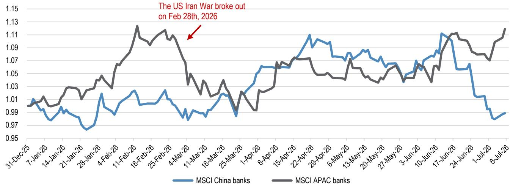

# JPM：中国银行板块避险行情观察，渣打回调引发关注

地缘政治因素叠加AI交易获利了结，引发资金向中国国有银行等方向流动。JPM在最新研究报告中判断，这种轮动行情可能难以持续，中国银行板块将进入横盘整理期，而渣打集团的回调反而提供了值得关注的窗口。

报告的核心逻辑并不复杂：7月8日中国国有银行H股单日上涨5%，渣打则回调2%，背后是同一股力量——市场避险情绪升温，资金从高波动品种撤出，涌入被视为稳健的国有银行。但JPM认为，这一轮上涨缺乏盈利支撑，股息率也不够有吸引力，行情可能很快降温。

## 1. 中国银行板块反弹的驱动力正在衰减

为什么说这轮上涨可能不可持续？JPM给出了三个层面的解释。

首先是估值层面的“补涨”逻辑。过去一个月，MSCI中国银行指数跑输MSCI亚太银行指数16个百分点，同期盈利预期几乎没有变化。换句话说，这轮上涨更多是风格轮动而非基本面改善——当资金从AI等热门板块撤出时，低估值、低波动的国有银行自然成为临时避风港。但JPM指出，这种轮动往往来得快、去得也快。

其次，历史经验表明，地缘因素引发的避险行情通常持续一个月左右。以伊朗相关事件为例，事件发生后一个月内MSCI中国银行指数上涨5%，跑赢恒生指数12个百分点。但JPM认为，当前市场已经充分定价了这一预期，后续催化有限。

第三，也是最关键的——业绩支撑不足。JPM预计，国有银行二季度营收增速在5%-8%之间，利润增速3%-5%。这个数字不算差，但不足以推动估值持续扩张。

> **KC评论：** JPM的核心判断是“不确定性偏好轮动而非基本面反转”。这种行情最忌讳追涨——一旦地缘局势缓和或AI交易重新活跃，资金可能迅速回流。对于想参与中国银行板块的读者，报告给出的框架是：短期看国有银行，但6个月维度上更偏好高股息标的，如招商银行相关市场（股息率5.5%）和中信银行H股（股息率6.4%）。

## 2. 渣打回调的真正含义：中东不确定性可控，成长叙事未变

渣打当天回调2%，跑输恒生指数和亚太银行指数。JPM认为，这更多是短期获利了结，而非基本面出现变化。

渣打的中东敞口确实高于同行。报告数据显示，中东地区贡献了渣打约8%的税前利润。但JPM判断这一不确定性是可控的——渣打在中东的业务以大型企业客户为主，信用不确定性分散，且该地区宏观环境基本面并未因相关事件而显著出现变化。

更值得关注的是渣打的长期成长叙事。报告指出，渣打2025年ROTE为11.9%，管理层目标是在2028年提升至15%以上，2030年达到18%。按当前估值测算（图3），渣打在发达市场银行中处于PB-ROE曲线的低位，性价比突出。

需要提醒的是，渣打二季度业绩可能面临高基数不确定性——去年同期有0.2亿美元的Solv India处置收益以及市场业务的高频交易收入。这意味着短期盈利增速可能不达预期，但JPM认为这正是分批关注的机会。

> **KC评论：** 渣打不是MSCI中国或恒生指数的成分股，这意味着它在不确定性偏好轮动中天然处于劣势——当资金流向指数成分股时，渣打会被“遗忘”。但这也意味着它的估值折价已经反映了这一结构性劣势。如果读者认可其2028年ROTE目标，当前的回调可能是中长期布局的窗口。

## 3. 报告尚未完全回答的关键问题

尽管JPM的框架清晰，但有几个问题值得读者进一步思考。

第一，中国国有银行的股息率吸引力究竟够不够？报告明确说“不够有吸引力”——国有银行H股股息率约5%-6%，但相比无不确定性利率和相关市场高股息标的，这个水平是否足以吸引长线资金？报告没有给出明确的阈值。

第二，中东相关事件对渣打的影响是否存在非线性不确定性？报告判断“可控”，但未讨论事件升级可能导致供应链中断、油价波动等二阶效应。读者需要自己评估尾部不确定性。

第三，中国银行板块的分红政策是否可持续？随着净息差收窄和资本补充不确定性加大，国有银行能否维持当前的股息率？报告没有深入分析这一变量。

## 4. 对读者的观察框架

基于JPM的报告，可以提炼出三个关注点。

一是关注中国银行板块二季度业绩的“含金量”。市场已经消化了5%-8%的营收增长，如果实际数据超预期，可能触发新一轮行情；反之，则可能加速轮动退出。

二是关注渣打8月业绩后的市场反应。如果市场对高基数带来的低增长反应过度，可能提供更好的关注点。

三是关注地缘政治不确定性的边际变化。当前市场对中东相关事件的定价可能已经充分，如果局势出现缓和信号，资金可能从避险资产重新流向高波动品种，届时渣打的表现可能优于国有银行。

选择哪个方向，取决于读者对不确定性偏好走势的判断。JPM的选择是明确的：短期偏好国有银行中的建行和中行，6个月维度上更看好高股息的招行相关市场和中信银行H股，而渣打则是整个板块中的首选。

For informational purposes only. Portions may be generated,translated,summarized,or edited with AI assistance based on source materials and may contain omissions or errors. Please verify independently. This is not investment,legal,tax,accounting,or other professional advice.

For informational purposes only. Portions may be generated,translated,summarized,or edited with AI assistance based on source materials and may contain omissions or errors. Please verify independently. This is not investment,legal,tax,accounting,or other professional advice.

