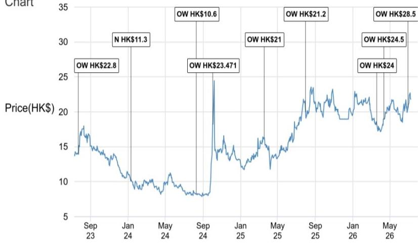
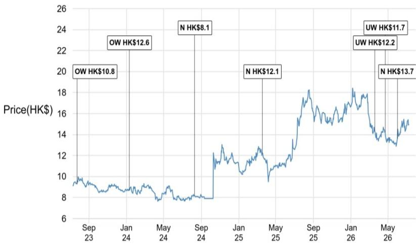
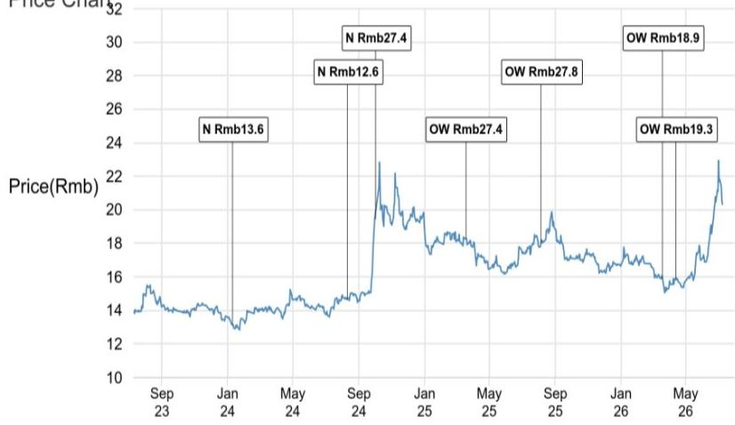

# CICC2026年第二季度业绩观察：盈利结构与市场定价之间的认知差异

中国国际金融股份有限公司（CICC）2026年上半年初步业绩向市场传递了一个清晰信号：公司的盈利能力已回升至2020-2021年市场活跃期水平，但其估值仍锚定在截然不同的现实基础上。这种差异不仅是时间或市场情绪的问题，更反映了市场预期与公司实际业务表现之间的深层分析差距。

数据表现突出。CICC2026年第二季度净利润达到41-46亿元人民币，同比增长79-102%，创下季度新高。由此推算的2026年上半年年化净资产回报率为14-15%，与彭博一致预期中2026年全年9.8%的预测形成鲜明对比。当一家公司半年的净资产回报率已超过全年一致预期40%以上时，问题已不再是预期是否会向上修正，而是修正幅度会有多大。

这一结果的战略意义不仅限于CICC本身。它提出了关于如何评估中国证券公司盈利质量、哪些业务线能带来可持续的优异表现、以及市场对这些公司的定价机制是否存在结构性效率问题的基本思考。本文梳理了报告的核心论点，审视了CICC与同业之间的质量差异，并将这些见解转化为一个分析框架。

## CICC第二季度业绩超预期：不仅是规模，更是盈利质量与可持续性

CICC2026年上半年初步公告的核心数据令人瞩目。上半年净利润77-82亿元，同比增长78-90%。但更重要的洞察在于表面之下。报告明确区分了CICC与CMS、国泰海通的表现，后两家公司在同一时期也公布了强劲的初步业绩。

关键差异在于盈利构成。CMS和国泰海通的收益中有相当一部分来自IPO联合投资和Pre-IPO投资。这些收入来源本身具有波动性，依赖于有利的市场退出条件，对IPO审批流程的监管变化敏感，且可能在二级市场情绪变化时迅速逆转。当一家证券公司报告强劲盈利主要来自其自营投资时，读者必须追问这些收益是否具有可重复性。

相比之下，CICC的业绩主要由客户需求驱动的业务推动。这一区别对估值至关重要。来自咨询、承销和机构经纪等客户驱动活动的收入更具可预测性，与资本市场发展的长期趋势联系更紧密，且受按市值计价投资头寸波动的影响较小。报告判断CICC的强劲势头更有可能持续到2026年下半年，这不仅是观点，更是基于盈利结构性构成的逻辑结论。

可持续性问题在当前市场背景下尤为重要。中国股票市场在这些业绩公布后的几周内经历了明显波动。如果CICC的盈利严重依赖投资收益，这种波动将引发对下半年业绩逆转的合理担忧。相反，CICC业绩的客户驱动性质表明其业务势头对短期市场波动更具韧性。

## 一致预期的净资产回报率显著低于实际表现，为盈利预期上调创造清晰路径

报告中最有力的论据是CICC已实现的业绩与市场预期之间的算术差异。2026年上半年年化净资产回报率为14-15%，而彭博一致预期2026年全年为9.8%。这一差距并非边际性的，而是高于一致预期约50%。

要理解为何这一点重要，需要考虑一致预期是如何形成的。分析师通常基于历史趋势、管理层指引和宏观假设来做出预测。当一家公司交付的上半年业绩大幅超过全年一致预期时，就迫使进行根本性的重新评估。要么下半年将出现前所未有的盈利下滑，要么一致预期本身就过低。

报告自身的模型提供了有用的参考。在基准情景下，报告此前预计CICC的净资产回报率到2027年将达到11.3%。在乐观情景下，估计值为13.5%。而2026年上半年的结果已经超过了2027年的乐观情景。这表明报告自身的假设——已经比一致预期更为乐观——现在可能显得保守。

对估值的含义是直接的。报告发布时，CICCH股交易于0.72倍前瞻市净率。在2020-2021年市场活跃期，当净资产回报率处于类似水平时，该股票交易于1.0至1.3倍前瞻市净率。如果市场重新定价以反映当前净资产回报率，上行空间可观。即使部分重新定价至1.0倍前瞻市净率，也将意味着从当前水平有显著变动。

这一重新定价的机制是清晰的。随着一致预期向上修正，市净率计算中的分母发生变化。更高的预期盈利推动更高的账面价值增长，进而支持更高的估值。

## 客户驱动与投资驱动盈利的区分：评估中国证券公司的最重要筛选标准

报告对CICC与CMS、国泰海通的比较分析引入了一个框架，该框架应成为任何严肃评估中国金融中介机构的核心。区分来自服务客户的盈利与来自运用公司自有资本的盈利，不仅是会计细节，更是业务质量、风险状况和估值的基本决定因素。

客户驱动业务包括投资银行咨询、股权和债券承销、机构经纪、财富管理和研究。这些业务产生基于费用的收入，具有经常性、可扩展性和较低资本密集度的特点。它们受益于中国资本市场专业化、机构资产管理增长和企业融资需求日益复杂等长期趋势。

投资驱动业务则包括自营交易、IPO联合投资、Pre-IPO配售和其他形式的本金投资。这些业务在有利市场条件下可产生可观回报，但也使公司面临按市值计价波动、集中风险和潜在大额损失。它们需要大量资本配置，并可能扭曲基础业务的真实盈利能力。

报告的观点是，CICC的结果之所以更优，不是因为规模更大，而是因为更可持续。这是一个关键的分析区别。只关注整体盈利增长的读者可能认为CMS和国泰海通同样具有吸引力。但应用质量筛选标准的读者会认识到，CICC的盈利更可预测、更少依赖市场时机，因此应享有更高的估值倍数。

这一框架对风险管理也有启示。在市场下行时，客户驱动业务可能活动减少，但很少产生亏损。而投资驱动业务则可能产生显著的负回报。报告强调CICC对A股IPO联合投资和Pre-IPO投资的较低敞口，正是对这一风险差异的直接承认。

## 报告未完全解答的问题：波动宏观环境下客户需求的可持续性

尽管分析严谨，报告仍留下几个重要问题未解决。最显著的是驱动CICC强劲表现的客户需求的可持续性。报告认为CICC的势头可能持续，因为它是客户驱动而非投资驱动。但这一论点假设客户需求本身将保持强劲。

几个因素可能挑战这一假设。首先，中国资本市场的宏观环境仍存在不确定性。经济增长放缓、监管变化和地缘政治紧张都可能减少企业对投资银行服务的需求。如果公司推迟IPO、减少并购活动或推迟融资，CICC的咨询和承销收入可能下降。

其次，竞争格局正在演变。CICC在科技行业咨询和机构经纪方面的强大特许经营权是明显优势，但竞争对手正在大力投资以获取市场份额。报告指出CICC处于独特位置以受益于科技行业增长周期，但并未充分说明这一优势能持续多久，或如果科技行业活动放缓会发生什么。

第三，监管环境仍是一个不确定因素。中国金融监管机构已表现出在认为必要时干预市场、暂停IPO审核和征收稳定基金出资的意愿。任何此类干预都将直接影响CICC的客户驱动业务，无论其质量如何。

这些不确定性并不否定报告的论点，但它们确实强调了监测条件的重要性，而非假设趋势会无限期持续。如果这些假设被证明不正确，研究逻辑将需要重新评估。

## 评估CICC及其同业的决策框架

对于希望基于报告见解采取行动的机构读者，一个结构化的决策框架至关重要。以下方法将报告的分析逻辑综合为可操作的步骤。

第一，评估盈利质量。主要筛选标准应是收入的构成。来自客户驱动活动与投资驱动活动的盈利占比是多少？这在财务报表中并不总是透明，但报告的比较分析表明，基于业务组合披露和管理层评论做出知情判断是可能的。

第二，比较已实现净资产回报率与一致预期。CICC2026年上半年净资产回报率与全年一致预期之间的差距是潜在盈利上调的最有力指标。读者应为评估的每家证券公司计算这一差距。较大的正差距表明一致预期过低，上调可能性大。较小或负差距表明市场已定价当前表现。

第三，评估业务模式的可持续性。客户驱动业务通常比投资驱动业务更可持续，但并非所有客户驱动业务都具有同等韧性。读者应评估CICC收入来源的多样性、其在关键领域的特许经营权实力，以及其对周期性与结构性增长驱动因素的敞口。

第四，在历史倍数背景下考虑估值。报告将CICC当前0.72倍前瞻市净率与2020-2021年市场活跃期1.0-1.3倍区间进行比较，提供了有用的锚点。但读者还应考虑当前环境是否证明高于或低于历史区间的倍数是合理的。利率、监管风险和竞争动态等因素都会影响适当的倍数。

第五，监测重新定价的催化剂。报告中确定的主要催化剂是一致预期盈利上调。读者应跟踪分析师修正、管理层指引和季度结果，以评估上调周期是加速还是减速。次要催化剂包括监管发展、市场成交量趋势以及CICC同行的表现。

这一框架不能替代详细的基础分析，但它提供了一种评估研究逻辑的结构化方法。严格应用它的读者将能更好地识别报告所强调的机会和风险。

## 完整报告包含支持这些结论的原始图表和详细数据

本文呈现的分析基于报告的核心论点，但必然省略了支撑这些论点的详细数据和视觉证据。原始报告包括季度净利润趋势、净资产回报率轨迹比较和估值图表，这些图表说明了CICC当前表现与其市场定价之间的差异。这些图表对于任何寻求验证分析或构建自身模型的读者都是必不可少的。

完整报告还包含详细的披露、分析师认证和重要的风险考量，这些对于做出知情决策至关重要。鼓励读者理解结论背后的假设，并在不同情景下对这些假设进行压力测试。

对于希望进行自身尽职调查的严肃机构读者，原始报告是不可或缺的资源。它提供了独立评估研究逻辑所需的数据、分析框架和透明度。仅图表本身就讲述了一个在书面摘要中无法完全捕捉的引人入胜的故事。

*仅供参考。部分内容可能基于源材料通过AI辅助生成、翻译、总结或编辑，可能存在遗漏或错误。请独立核实。这不构成任何专业建议。*

仅供参考。部分内容可能基于源材料通过AI辅助生成、翻译、总结或编辑，可能存在遗漏或错误。请独立核实。这不构成任何专业建议。

