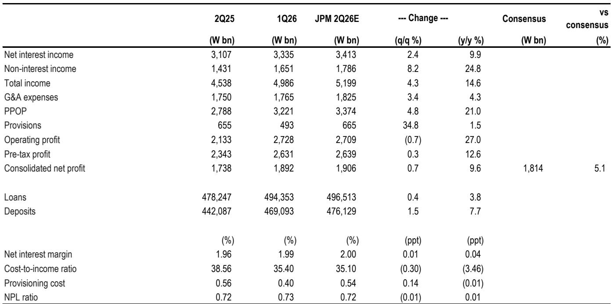
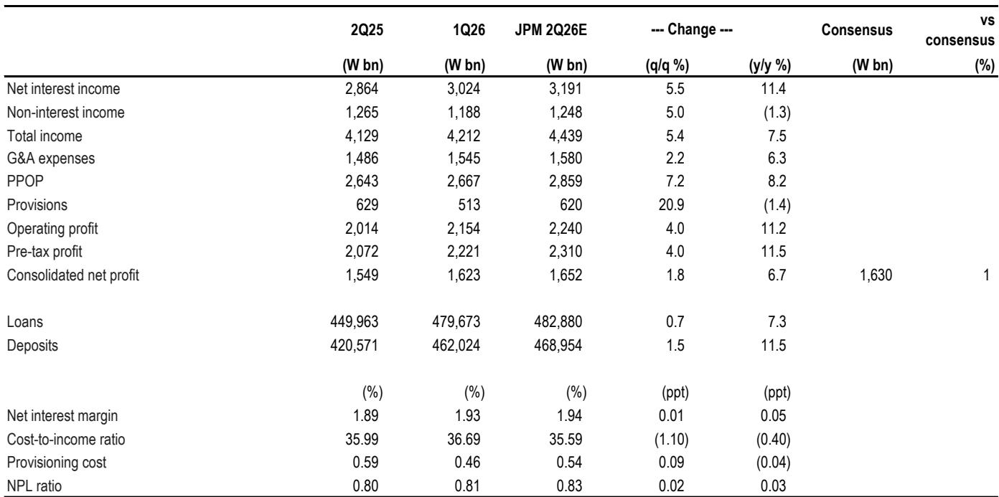
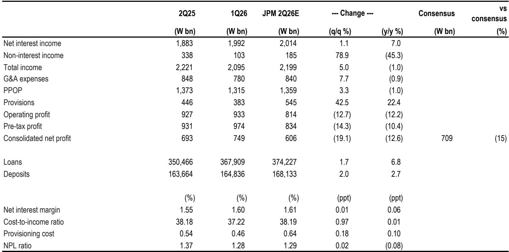

# 韩国金融板块正在进入一个多数观察者低估的重估周期

韩国金融板块的逻辑已从战术性价值机会转向结构性重估故事。自7月以来，该板块上涨8%，而KOSPI指数下跌15%，但真正的催化剂尚未被市场消化。即将到来的2026年第二季度财报季将揭示比单季超预期更持久的变化：一个自我强化的循环正在形成——更高的盈利、审慎的资本管理以及渐进式的股东回报相结合，推动可持续的净资产回报表现（ROE）提升。对于交易价格低于1.0倍市净率、中期ROE轨迹在11-12%的大型金融集团而言，这种脱节正变得不可持续。

市场仍将韩国银行视为周期性收益工具。这一框架已经过时。数据现在显示，该行业正在经历一场深思熟虑的转型，涉及资本配置、风险管理和股东价值回报方式。7月下旬即将发布的财报将作为一个验证点，但对观察者而言，战略问题在于他们是否为随之而来的更广泛行情做好了准备，而不仅仅是财报季的短期表现。

三种结构性力量正在汇聚。首先，净息差（NIM）正在逐步走高而非收窄，因为资产回报表现在高利率环境下重新定价上行。其次，非利息收入因资本市场活动而加速增长，大型金融集团在捕捉手续费收入增长方面处于最佳位置。第三，也是最关键的一点，股东回报政策正变得公式化、透明且日益慷慨。这不是一次性的股息提升。这是韩国金融集团在思考超额资本方式上的制度性转变。

进入窗口正在收窄。该板块已实现超额表现，但估值倍数相对于ROE改善仍处于压缩状态。接下来的六到八周，以财报发布和价值提升计划更新为节点，代表着一个在共识追赶之前捕捉重估的集中机会。

## 大型金融集团在净息差扩张方面的定位优于市场假设

本季度各银行的净息差趋势将出现分化，但这种分化本身揭示了一个战略故事。小型银行面临更高的融资成本和不太有利的重新定价周期带来的逆风。相比之下，大型金融集团正以结构性优势进入2026年第二季度，这种优势在融资成本方面正在扩大而非缩小。

其机制很简单。在高利率背景下，资产回报表现向上重新定价。但这种重新定价的速度和幅度取决于融资基础的构成。拥有较高比例低成本核心存款的大型集团受益于负债重新定价的滞后，这为净息差创造了顺风。这不是一个季度的现象。随着利率周期的成熟，这种优势会在连续几个季度中累积。

对于KB和Shinhan，预期净息差将环比扩大约1个基点。Hana预计将出现更明显的4个基点提升。即使是Kakao Bank，尽管规模较小，但随着其融资结构正常化，预计将实现6个基点的净息差强劲复苏。模式很清晰：拥有最具韧性融资结构的银行，也正是产生较强净息差动力的银行。

对观察者而言，这意味着净息差不是一个需要预测的单一变量。它是资产负债表结构的函数，而结构性赢家是可以识别的。市场倾向于将净息差视为宏观驱动的结果，但本季度的横截面差异表明，银行特定因素占主导地位。将所有韩国银行视为可互换的观察者，正在错过最重要的差异化因素。

## 非利息收入正成为结构性增长引擎，而非周期性附加项

第二季度将显示非利息收入环比走强，这得益于来自经纪和财富管理业务的资本市场相关费用。这不是一次性的反弹。它反映了韩国金融集团，尤其是最大几家，盈利结构的更深层次转变。

KB和Shinhan在捕捉这一增长方面处于最佳位置，这得益于其证券部门的规模和盈利结构。随着资本市场活动复苏，手续费收入在总收入中的占比上升，减少了对净利息收入的依赖，并提高了盈利稳定性。此前拖累上季度的债券交易压力正随着回报表现波动缓和而缓解，但更重要的是手续费收入的结构性增长。

这一转变的战略意义不容低估。能够以持续速度增长非利息收入的银行，在利率下降环境中受净息差压缩的影响较小。它们还能产生更高的股本回报率，因为手续费收入所需的资本少于贷款业务。市场尚未完全定价这一转变，因为它仍主要根据净息差和信贷成本轨迹来评估韩国银行。但盈利结构正在改变，估值影响是实质性的。

对观察者而言，问题不在于非利息收入本季度是否会增长。它会的。问题在于增长率是否可持续，以及哪些银行拥有能够复合增长的业务结构。答案倾向于拥有综合证券平台的大型金融集团。

## 信贷成本可控，但风险在各银行间并不对称

预计信贷成本将基本与全年指引一致，KB和Shinhan的拨备率约为0.54%，Hana略低，为0.38%。可能存在与Joongang集团法院主导的重整申请相关的一次性拨备，但由于风险敞口有限且抵押品覆盖充足，对盈利的影响有限。

总体情况是良性的，但分化很重要。资产质量指标因利率上升而面临上行压力，对脆弱行业敞口较高的小型银行面临更大风险。大型金融集团拥有更多元化的贷款组合、更强的抵押品覆盖和更大的拨备缓冲。它们并非对信贷恶化免疫，但更有能力吸收冲击。

战略洞察在于，可控的信贷成本不仅是短期安慰。它们是持续股东回报的先决条件。能够在指引范围内维持信贷成本同时增长贷款的银行，正在产生支持更高派息率的盈利稳定性。本季度的数据将确认大型集团已实现这种稳定性，这反过来支持了结构性重估的论点。

市场低估的风险并非信用事件。而是随着利率周期成熟，信贷成本在未来12至18个月可能逐步走高的可能性。但即使在这种情景下，大型集团也有盈利能力和资本缓冲来维持股东回报。小型银行则不具备。这种不对称性是支持大型金融集团的另一个理由。

## 股东回报正进入一个将推动估值重估的新阶段

该行业最重要的催化剂并非盈利。而是股东回报政策的演变。随着之前的回购在7月结束，预期将出现另一轮大规模回购和注销公告。KB和Shinhan可能因更强的盈利表现而宣布更大规模的计划，而Hana预计将更新其价值提升计划，推出基于公式的股东回报政策和更新的ROE目标。

这之所以重要，是因为它改变了估值框架。以低于账面价值交易、拥有可持续ROE轨迹和渐进式股东回报的银行，在结构上被低估。市场一直迟迟未对其进行重估，因为它将回购视为偶发性而非结构性行为。但现在模式已清晰：大型金融集团正承诺将超过CET1比率门槛的超额资本返还，而这些门槛设定在留有显著分配空间的水准。

KB的框架具有启发性。该银行的目标是13%以上的CET1比率，并承诺通过股息和回购将超过该水平的超额资本返还。考虑到中期ROE目标（近期11%，长期13%以上），隐含的公允市净率远高于当前的0.99倍。Shinhan和Hana也有类似框架，总股东回报率为50%或更高。

市场仍在定价这些银行，仿佛股东回报是可自由决定的。但事实并非如此。这些框架是公式化和透明的。资本回报是盈利和CET1水平的函数，而非管理层自由裁量。这是一个根本性变化，随着观察者认识到回报的可预测性，应导致结构性重估。

对Hana而言，即将到来的价值提升更新尤为重要。该银行预计将引入更先进的基于公式的股东回报政策，并设定更雄心勃勃的运营目标以提升ROE。如果Hana向KB和Shinhan的框架收敛，估值差距应会缩小。当前0.70倍的市净率相对于9.8%的ROE轨迹，如果股东回报政策变得更加可预测和慷慨，则显得过低。

## 报告未完全解答的问题：ROE改善的可持续性

该报告为短期盈利动力和股东回报提供了令人信服的论据，但它留下了一个重要问题未解决：大型金融集团能否在当前周期之外维持ROE改善？

大型集团11-13%的中期ROE目标在当前利率环境下是可以实现的，但维持它们需要的不只是有利的宏观条件。它需要持续的手续费收入增长、审慎的成本管理，以及不损害风险调整后回报的贷款增长。报告提供了证据表明这些条件在未来12至18个月已具备，但它并未完全解答当利率周期转向时会发生什么。

风险在于ROE改善被证明是周期性的而非结构性的。如果净利息收入因利率下降而收缩，且手续费收入增长不足以抵消拖累，那么ROE可能回归历史平均水平。股东回报框架仍将支撑估值，但上行空间将受限。

未解答的问题是，韩国金融集团能否在整个周期中产生11-13%的ROE，而不仅仅是当前的上行阶段。这是战术性重估与结构性重估之间的区别。为后者布局的观察者需要看到证据，表明盈利结构正永久性地转向更高回报、更低资本的业务。报告提供了部分证据，但完整图景只会在未来几个季度中显现。

## 韩国银行布局的决策框架

对于评估韩国金融板块敞口的观察者，决策框架应优先考虑三个因素：融资成本优势、手续费收入结构和股东回报透明度。

首先，融资成本优势决定了净息差的韧性。拥有较高比例低成本核心存款的银行，在利率上升环境中更有利于净息差扩张，在利率下降时也更有保护。大型金融集团在此具有明显优势，且差距正在扩大。

其次，手续费收入结构决定了盈利稳定性和ROE可持续性。拥有综合证券平台和不断增长的财富管理业务的银行，正从轻资本活动中产生更大比例的收入。这改善了ROE并降低了周期性。KB和Shinhan在此领先，Hana正在追赶。

第三，股东回报透明度决定了估值。拥有基于公式的回报政策（将分配与CET1水平挂钩）的银行，为观察者提供了可预测的现金流。这应比拥有自由裁量政策的银行获得更高倍数。KB和Shinhan拥有最先进的框架，Hana预计将在未来几周更新其政策。

该框架得出了一个明确结论：大型金融集团是优先选择。小型银行风险更高、ROE更低、股东回报政策透明度更差。它们可能提供战术性上行空间，但不提供大型集团所提供的结构性重估故事。

两个未解决的变量是信贷成本的轨迹和手续费收入增长的可持续性。两者都将在未来两个季度变得更加清晰。目前，风险回报比倾向于积累，尤其是在财报季和价值提升更新之前。

## 加入社区阅读完整报告并查看原始图表

以上分析基于一份详细的研究报告，其中包括盈利预览表、估值比较以及每家覆盖银行的价值提升框架摘要。完整报告包含关于净息差轨迹、贷款增长预测和信贷成本假设的精细数据，这些对于建立对个别标的的信心至关重要。它还包含原始图表，展示了市净率与ROE轨迹以及总派息率趋势，这些图表说明了重估潜力。

加入社区阅读完整报告并查看原始图表。财报季从7月23日开始，布局窗口正在关闭。数据、框架和决策工具都在完整报告中。

*仅供参考。部分内容可能基于源材料通过AI辅助生成、翻译、总结或编辑，可能包含遗漏或错误。请独立核实。这不构成专业建议。*

仅供参考。部分内容可能基于源材料通过AI辅助生成、翻译、总结或编辑，可能包含遗漏或错误。请独立核实。这不构成专业建议。

