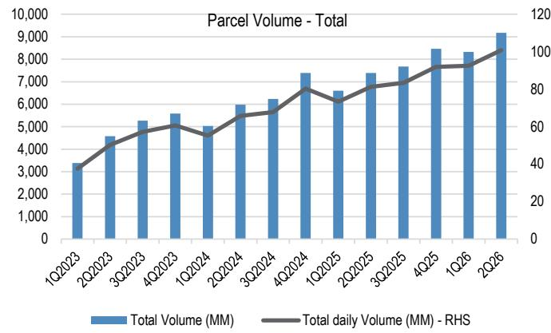
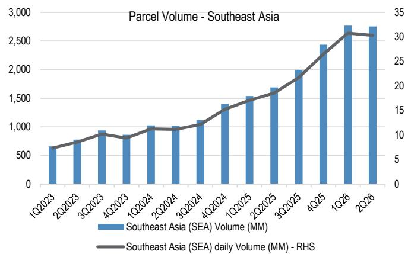
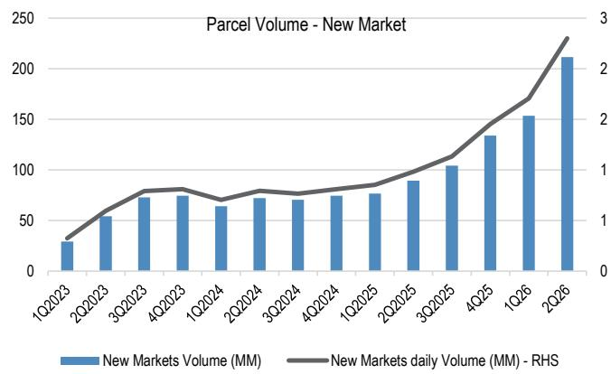
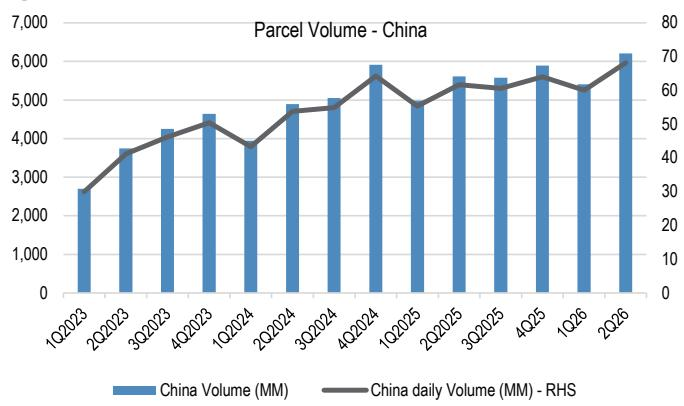
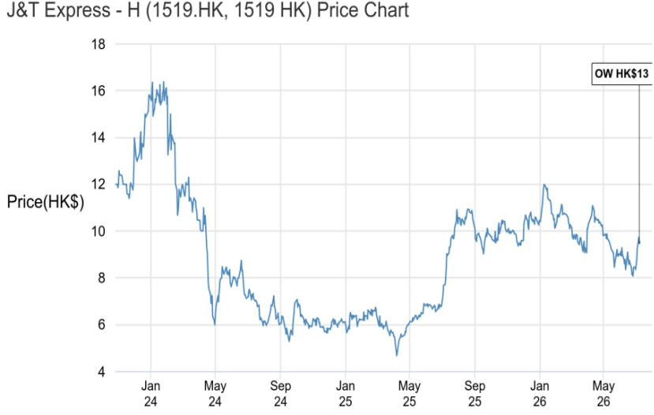

# J&T Express - H

2Q26更新：宏观环境波动不影响规模、质量与全球增长加速

J&T在今日（7月8日）举行的2Q26运营更新，标志着公司从"建设+亏损"阶段向"规模、效率与资本回报"阶段的明确转变。尽管宏观环境存在波动，J&T Express在过去一个季度中展现出稳健的运营趋势，这进一步强化了我们对公司的积极看法以及启动覆盖时的核心观点——即J&T的平台中立、可输出的运营模式正在中国以外地区实现规模化。集团共处理91.8亿件包裹（同比增长24.2%），日均包裹量首次突破1亿件——这一里程碑事件支撑了公司进一步推动单位成本下降和服务一致性的能力。值得注意的是，中国以外地区的包裹占总量的32.3%，凸显了J&T全球平台日益增长的广度。公司新宣布的20亿港元回购计划，按当前股价水平计算，相当于约2.4%的回购回报表现，在基本面改善的背景下为股价提供了切实的技术支撑。管理层重申3月指引保持不变，表明尽管宏观和行业存在波动，但对业务量和利润率趋势的持续性抱有信心。

公司观察：过去一周股价上涨约14%（同期恒生指数上涨约6%），反映了市场对强劲季度业绩的预期（今日运营更新的日期于7月1日首次公布），因此今日在我们启动覆盖后市场反应平淡并不意外——尤其是在当日因基金再平衡而出现AI驱动的资金轮动至阿里巴巴等恒指权重股的情况下。年初至今，该股仍下跌9%，但相对而言略优于恒生国企指数（下跌12%）。我们保持基本看好的立场：今日的数据和简报要点强化了估值重估的逻辑，规模、成本/自动化验证和资本回报均按计划推进。我们认为，下一个催化剂是这些运营趋势能否在中期业绩中转化为盈利上调。维持增持评级。

- 新的业务量里程碑和中国以外地区的结构转变，正在强化可持续规模与利润率杠杆的逻辑。J&T 2Q26集团包裹量达91.8亿件（同比增长24.2%），日均包裹量首次突破1亿件。这一吞吐量水平对于推动持续的单位成本下降和服务可靠性至关重要，因为它最大化了网络利用率并加速了自动化投资的回收。中国以外地区的包裹目前占总量的32.3%，支持了J&T正在稳步降低对中国单一利润池的依赖、构建更加多元化的全球增长基础这一观点。我们认为，管理层在强劲业务量数据和宏观噪音背景下决定保持指引不变，表明了对潜在增长动能以及公司将规模转化为持久利润率和现金流能力的信心。

## 增持

1519.HK, 1519 HK
价格：9.53港元
2026年7月8日
目标价：13.00港元
目标价有效期：2027年6月30日

## 基础设施、工业与运输

Karen Li, CFA AC
(852) 2800-8589
karen.yy.li@JPM.com
JPM Securities (Asia Pacific) Limited/
JPM Broking (Hong Kong) Limited

Jenny Qiu, CFA
(852) 2800 8503
jenny.qiu@JPM.com
JPM Securities (Asia Pacific) Limited/
JPM Broking (Hong Kong) Limited

Ranjan Sharma, CFA
(65) 6882-1303
ranjan.x.sharma@JPM.com
JPM Securities Singapore Private Limited

Mufan Shi
(852) 2800-8502
mufan.shi@JPM.com
JPM Securities (Asia Pacific) Limited/
JPM Broking (Hong Kong) Limited

Neil Zhang
(852) 2800-8598
neil.zhang@JPM.com
JPM Securities (Asia Pacific) Limited/
JPM Broking (Hong Kong) Limited

Beatrice Lam
(852) 2800-8738
beatrice.lam@JPM.com
JPM Securities (Asia Pacific) Limited/
JPM Broking (Hong Kong) Limited

- 东南亚仍是核心引擎，增长日益受到平台投入和物流标准提升的驱动，而不仅仅是价格因素。东南亚地区2Q26包裹量达27.5亿件（同比增长63.2%），日均包裹量3030万件。管理层将这一势头归因于电商渗透率的持续提升、平台客户在促销和免运费方面的持续投入，以及随着产品、服务质量和品牌知名度的提升，公司有意识地拓展非平台包裹业务。重要的是，平台正在提高对物流合作伙伴的要求，这促使竞争向能够提供成本、覆盖范围和可靠性的规模化运营商倾斜。我们认为，这一动态支持了J&T作为平台中立整合者的定位，其拥有结构性的成本和网络优势，并有助于在行业配送速度趋同的情况下缓解单件收入下降的风险。

- 中国市场作为稳定器并具有上行潜力，市场份额的增长得益于网络质量和客户结构的优化，而非激进定价。中国地区2Q26包裹量达62.1亿件（同比增长10.6%），日均包裹量6820万件。管理层将2026年1-5月行业增长基准定为约5%，J&T通过网络升级、服务质量提升、成本控制和技术赋能，成为市场份额的获得者。行业正从单纯追求增长转向关注规模、质量和效率，J&T正获得越来越多品牌客户和高质量客户的认可。对于观察者而言，关键在于这些市场份额的增长能否在不牺牲单位经济性的情况下持续，尤其是在竞争环境仍然结构性激烈的背景下。

- 其他市场现已成为一个可信的增量引擎，其中拉丁美洲领先，并已连续五个季度加速增长。其他市场2Q26包裹量达2.1亿件（同比增长136.5%），标志着连续第五个季度加速。管理层强调拉丁美洲是最大的贡献者，而中东地区的增长受到冲突因素的制约。市场总量逻辑具有说服力：较高的人均GDP和消费水平，但电商渗透率和人均包裹量在结构性上低于中国/东南亚，如果执行到位，将为增长提供长期空间。J&T正在输出其中国/东南亚的成功模式——自动化、路线优化、最后一公里效率——并深化与Mercado Libre和中国平台的合作。新市场进入（哥伦比亚于2Q启动，秘鲁和中美洲正在评估中）以及在欧美市场偏好轻资产、合规的进入方式，进一步支撑了长期增长故事。

- 回购、自动化和资本支出纪律现已成为公司故事的核心，将快速增长与复利质量相连接。管理层提供了可量化的自动化成果，例如坦格朗（印度尼西亚）项目将处理时间缩短了40%，并将高峰分拣效率提升了150%。公司重申全年资本支出指引为7-8亿美元，投资重点覆盖中国、东南亚和其他市场，并逐步增加对拉丁美洲的关注。新的20亿港元回购计划，按当前股价和股本计算，相当于约2.4%的回购回报表现——在市场日益要求运营势头之外的有形资本回报的背景下，这已成为情绪的重要支撑。

表1：全球物流可比公司表

<table><tr><td rowspan="2"></td><td rowspan="2">BBG代码</td><td rowspan="2">JPM评级</td><td rowspan="2">最新价 本币</td><td rowspan="2">JPM目标价 本币</td><td rowspan="2">上行/下行</td><td rowspan="2">市值 百万美元</td><td rowspan="2">年初至今 股价表现</td><td colspan="2">市盈率 (倍)</td><td colspan="2">每股盈利增长</td><td>PEG</td><td colspan="2">EV/EBITDA</td><td colspan="2">净资产回报表现 (%)</td><td colspan="2">市净率 (倍)</td></tr><tr><td>FY26E</td><td>FY27E</td><td>FY26E</td><td>FY27E</td><td>FY26E</td><td>FY26E</td><td>FY27E</td><td>FY26E</td><td>FY27E</td><td>FY26E</td><td>FY27E</td></tr><tr><td>顺丰控股 - A</td><td>002352 CH</td><td>增持</td><td>32.83</td><td>42.0</td><td>28%</td><td>25,027</td><td>-14%</td><td>13.9</td><td>12.6</td><td>22%</td><td>10%</td><td>0.6</td><td>6.1</td><td>5.7</td><td>11.5</td><td>11.4</td><td>1.5</td><td>1.4</td></tr><tr><td>顺丰控股 - H</td><td>6936 HK</td><td>增持</td><td>31.54</td><td>40.0</td><td>27%</td><td>25,027</td><td>-8%</td><td>11.3</td><td>10.3</td><td>10%</td><td>10%</td><td>1.1</td><td>4.9</td><td>4.4</td><td>11.5</td><td>11.4</td><td>1.2</td><td>1.1</td></tr><tr><td>中通快递 - US</td><td>ZTO US</td><td>增持</td><td>23.17</td><td>29.0</td><td>25%</td><td>17,839</td><td>11%</td><td>11.8</td><td>10.5</td><td>12%</td><td>13%</td><td>0.9</td><td>6.7</td><td>6.3</td><td>15.0</td><td>15.4</td><td>1.7</td><td>1.6</td></tr><tr><td>中通快递 - H</td><td>2057 HK</td><td>增持</td><td>183.10</td><td>225.0</td><td>23%</td><td>17,995</td><td>13%</td><td>11.9</td><td>10.5</td><td>19%</td><td>13%</td><td>0.6</td><td>6.8</td><td>6.3</td><td>15.0</td><td>15.4</td><td>1.7</td><td>1.6</td></tr><tr><td>京东物流</td><td>2618 HK</td><td>增持</td><td>12.44</td><td>20.0</td><td>61%</td><td>10,591</td><td>9%</td><td>9.8</td><td>8.5</td><td>22%</td><td>15%</td><td>0.5</td><td>3.2</td><td>3.1</td><td>16.3</td><td>16.7</td><td>1.1</td><td>0.9</td></tr><tr><td>圆通速递</td><td>600233 CH</td><td>未覆盖</td><td>17.08</td><td>NA</td><td>NA</td><td>8,597</td><td>4%</td><td>9.7</td><td>8.6</td><td>42%</td><td>13%</td><td>0.2</td><td>5.5</td><td>4.9</td><td>15.6</td><td>15.7</td><td>1.5</td><td>1.3</td></tr><tr><td>韵达股份</td><td>002120 CH</td><td>未覆盖</td><td>6.82</td><td>NA</td><td>NA</td><td>2,912</td><td>1%</td><td>10.0</td><td>8.9</td><td>43%</td><td>12%</td><td>0.2</td><td>4.0</td><td>3.7</td><td>8.8</td><td>9.3</td><td>0.9</td><td>0.8</td></tr><tr><td>申通快递</td><td>002468 CH</td><td>未覆盖</td><td>16.76</td><td>NA</td><td>NA</td><td>3,773</td><td>25%</td><td>12.4</td><td>10.8</td><td>55%</td><td>15%</td><td>0.2</td><td>6.5</td><td>5.8</td><td>16.9</td><td>16.5</td><td>2.0</td><td>1.7</td></tr><tr><td>中国外运</td><td>601598 CH</td><td>未覆盖</td><td>5.46</td><td>NA</td><td>NA</td><td>5,187</td><td>-10%</td><td>11.7</td><td>11.0</td><td>-8%</td><td>7%</td><td>-1.6</td><td>7.1</td><td>6.6</td><td>7.9</td><td>8.8</td><td>0.9</td><td>0.9</td></tr><tr><td>中储股份</td><td>603128 CH</td><td>未覆盖</td><td>5.28</td><td>NA</td><td>NA</td><td>1,016</td><td>-18%</td><td>15.4</td><td>13.3</td><td>5%</td><td>16%</td><td>3.1</td><td>11.3</td><td>10.2</td><td>7.2</td><td>8.4</td><td>1.1</td><td>1.1</td></tr><tr><td>极兔速递</td><td>1519 HK</td><td>增持</td><td>9.58</td><td>13.0</td><td>36%</td><td>11,841</td><td>-8%</td><td>15.3</td><td>10.2</td><td>106%</td><td>48%</td><td>0.1</td><td>8.6</td><td>6.8</td><td>18.2</td><td>20.9</td><td>NA</td><td>NA</td></tr><tr><td>满帮集团</td><td>YMM US</td><td>增持</td><td>8.35</td><td>10.0</td><td>20%</td><td>8,663</td><td>-22%</td><td>11.3</td><td>9.7</td><td>20%</td><td>16%</td><td>0.6</td><td>7.9</td><td>6.9</td><td>11.8</td><td>12.2</td><td>1.3</td><td>1.1</td></tr><tr><td>平均</td><td></td><td></td><td></td><td></td><td></td><td></td><td>-1%</td><td>12.1</td><td>10.4</td><td>29%</td><td>16%</td><td>0.6</td><td>6.5</td><td>5.9</td><td>13.0</td><td>13.5</td><td>1.4</td><td>1.2</td></tr><tr><td>联邦快递</td><td>FDX US</td><td>增持</td><td>312.88</td><td>370.4</td><td>18%</td><td>74,655</td><td>35%</td><td>15.8</td><td>15.0</td><td>10%</td><td>5%</td><td>1.5</td><td>9.6</td><td>9.5</td><td>15.6</td><td>15.2</td><td>2.4</td><td>2.2</td></tr><tr><td>联合包裹</td><td>UPS US</td><td>中性</td><td>111.96</td><td>118.0</td><td>5%</td><td>95,167</td><td>13%</td><td>15.8</td><td>14.1</td><td>3%</td><td>12%</td><td>5.0</td><td>9.5</td><td>8.9</td><td>36.8</td><td>41.3</td><td>5.9</td><td>5.5</td></tr><tr><td>DHL</td><td>DHL GR</td><td>增持</td><td>56.40</td><td>60.0</td><td>6%</td><td>74,012</td><td>21%</td><td>16.8</td><td>15.3</td><td>9%</td><td>10%</td><td>1.9</td><td>7.6</td><td>7.2</td><td>16.5</td><td>17.5</td><td>2.7</td><td>2.6</td></tr><tr><td>德迅集团</td><td>KNIN SW</td><td>减持</td><td>206.40</td><td>175.0</td><td>15%</td><td>30,816</td><td>21%</td><td>22.9</td><td>26.5</td><td>20%</td><td>-14%</td><td>1.1</td><td>11.3</td><td>11.9</td><td>47.3</td><td>38.2</td><td>10.4</td><td>9.8</td></tr><tr><td>康捷国际</td><td>EXPD US</td><td>减持</td><td>165.74</td><td>139.0</td><td>16%</td><td>21,677</td><td>11%</td><td>23.8</td><td>23.2</td><td>17%</td><td>3%</td><td>1.4</td><td>17.0</td><td>17.7</td><td>44.2</td><td>60.3</td><td>12.4</td><td>17.9</td></tr><tr><td>C.H. Robinson</td><td>CHRW US</td><td>增持</td><td>190.95</td><td>196.0</td><td>3%</td><td>22,504</td><td>19%</td><td>31.0</td><td>24.3</td><td>22%</td><td>28%</td><td>1.4</td><td>22.7</td><td>18.5</td><td>40.3</td><td>54.3</td><td>12.6</td><td>14.4</td></tr><tr><td>SAIA</td><td>SAIA US</td><td>增持</td><td>416.00</td><td>490.0</td><td>18%</td><td>11,095</td><td>27%</td><td>34.7</td><td>27.2</td><td>31%</td><td>28%</td><td>1.1</td><td>16.2</td><td>13.6</td><td>13.1</td><td>15.6</td><td>4.6</td><td>3.9</td></tr><tr><td>日本通运</td><td>9147 JP</td><td>中性</td><td>5,479</td><td>5,700</td><td>4%</td><td>8,199</td><td>64%</td><td>16.4</td><td>14.3</td><td>24%</td><td>15%</td><td>0.7</td><td>6.4</td><td>5.8</td><td>1.4</td><td>11.4</td><td>1.6</td><td>1.5</td></tr><tr><td>嘉里物流</td><td>636 HK</td><td>未覆盖</td><td>5.79</td><td>NA</td><td>NA</td><td>1,334</td><td>-18%</td><td>7.5</td><td>7.2</td><td>3%</td><td>5%</td><td>2.2</td><td>4.0</td><td>3.9</td><td>7.4</td><td>7.4</td><td>0.6</td><td>0.5</td></tr><tr><td>CJ物流</td><td>000120 KS</td><td>中性</td><td>74,500</td><td>100,000</td><td>34%</td><td>1,123</td><td>-21%</td><td>5.9</td><td>5.4</td><td>3%</td><td>10%</td><td>2.0</td><td>4.6</td><td>4.3</td><td>5.9</td><td>6.1</td><td>0.3</td><td>0.5</td></tr><tr><td>平均</td><td></td><td></td><td></td><td></td><td></td><td></td><td>17%</td><td>20.7</td><td>18.7</td><td>14%</td><td>10%</td><td>1.9</td><td>10.9</td><td>10.1</td><td>20.9</td><td>24.4</td><td>4.9</td><td>5.4</td></tr></table>

来源：彭博财经有限合伙。最新数据截至2026年7月8日。JPM估计。注：未覆盖股票的估计来自彭博财经有限合伙。过往表现并非未来结果的指标。

图1：J&T集团包裹量

来源：J&T公司数据，2026年7月8日2Q26报告资料

图2：J&T包裹量 – 东南亚

来源：J&T公司数据，2026年7月8日2Q26报告资料

图3：J&T包裹量 – 新市场

来源：J&T公司数据，2026年7月8日2Q26报告资料

图4：J&T包裹量 – 中国

来源：J&T公司数据，2026年7月8日2Q26报告资料

## 研究观点

J&T极兔速递是一家领先的平台中立、技术驱动的第三方物流运营商——在东南亚市场处于领先地位，在中国市场是不断成长的参与者，并在高增长的新市场（巴西、墨西哥、中东）中成为新兴的挑战者。公司的区域赞助商模式将创业精神与本地执行力和集中化技术相结合，实现了快速、轻资产的扩张，而中国建设的自动化和数字化管理系统被输出到各个区域，支撑了结构性的成本优势。自2023年10月上市以来，J&T的股价表现相对一般，反映了中国市场的行业价格竞争、初期亏损状态以及近期燃料价格波动等外部冲击。市场也曾质疑J&T模式在中国以外地区的可扩展性以及东南亚市场成熟后利润率的可持续性，而新市场则被认为尚处于早期阶段，难以产生实质性影响。然而，公司现已转向盈利，实现了行业领先的业务量和利润率增长，并通过与顺丰控股的合作释放新的协同效应。对J&T持增持评级。

## 估值

我们基于2027年6月市盈率的目标价13.0港元，是基于J&T FY27非国际财务报告准则每股盈利0.12美元、13倍目标市盈率（对比行业平均11倍，彭博估计，截至2026年7月7日）以及美元/港元汇率7.8计算得出。

## 评级与目标价风险

我们评级和目标价的下行风险包括：1）如果反内卷措施减弱，中国市场的结构性利润率压缩可能持续；2）东南亚电商GMV增长放缓以及来自SPX等竞争对手的竞争加剧；3）新市场在执行和盈利能力方面可能出现偏差，因为前期投入较大且加盟模式本地化速度慢于预期，可能延长实现规模化的路径；4）地缘政治、监管和贸易政策冲击可能增加合规成本，并直接对跨境包裹流量和需求构成压力。

分析师认证：本报告封面标注"AC"的研究分析师（或，当多位研究分析师主要负责本报告时，封面或文件内标注"AC"的研究分析师就本研究中该研究分析师覆盖的每个证券或发行人单独认证）：(1) 本报告中表达的所有观点准确反映了研究分析师对任何及所有标的证券或发行人的个人观点；(2) 研究分析师的任何部分薪酬过去、现在或将来均不会直接或间接地与本研究分析师在本报告中表达的具体建议或观点相关。对于封面列出的所有韩国研究分析师（如适用），他们亦根据KOFIA要求认证，该研究分析师的分析是本着诚信原则进行的，且观点反映了研究分析师自身的意见，未受到不当影响或干预。

本报告中所列的所有作者均为研究分析师，除非另有说明，他们均独立进行研究。在欧洲，本报告中可能将行业专家（销售和交易）列为联系人，但他们并非本报告的作者，也不属于研究部门。

## 重要披露

- 做市商/流动性提供者（香港）：JPM Securities (Asia Pacific) Limited 和/或 JPM Broking (Hong Kong) Limited 和/或其关联公司是 J&T Express - H 或相关实体及/或其权证或期权的做市商和/或流动性提供者，这些证券在香港联合交易所有限公司上市或交易。

- 客户：JPM目前拥有，或在过去12个月内曾拥有以下实体作为客户：J&T Express - H 或相关实体。

- 客户/投资银行：JPM目前拥有，或在过去12个月内曾拥有以下实体作为投资银行客户：J&T Express - H 或相关实体。

- 客户/非证券相关：JPM目前拥有，或在过去12个月内曾拥有以下实体作为客户，且所提供的服务为非证券相关：J&T Express - H 或相关实体。

- 已收到的投资银行报酬：JPM在过去12个月内已从J&T Express - H 或相关实体获得投资银行服务报酬。

- 潜在投资银行报酬：JPM预计在未来三个月内将从J&T Express - H 或相关实体收到或寻求投资银行服务报酬。

- 债务头寸：JPM可能持有J&T Express - H 或相关实体的债务证券头寸（如有）。

公司特定披露：JPM确实并寻求与其研究报告所覆盖的公司开展业务。因此，读者应注意，该公司可能存在利益冲突，可能影响本报告的客观性。读者应将本报告视为做出投资决策的单一因素。重要披露，包括价格图表和信用意见历史表（如适用），可通过访问 https://www.jpmm.com/research/disclosures、致电 1-800-477-0406 或发送电子邮件至 research.disclosure.inquiries@JPM.com 获取，适用于汇编报告及所有JPM覆盖的公司及某些未覆盖的公司。

J&T Express - H (1519.HK, 1519 HK) 价格图表

<table><tr><td>日期</td><td>评级</td><td>价格 (港元)</td><td>目标价 (港元)</td></tr><tr><td>2026年7月8日</td><td>增持</td><td>9.47</td><td>13</td></tr></table>

来源：彭博财经有限合伙及JPM；价格数据已根据股票分割和股息进行调整。覆盖起始日期为2026年7月7日。所有股价均为前一交易日收盘价。

图表显示JPM对这些股票的持续覆盖；当前分析师可能并非在整个期间内覆盖这些股票。

JPM评级或标识：增持 = Overweight, 中性 = Neutral, 减持 = Underweight, 未评级 = Not Rated

## 股票研究评级、标识及分析师覆盖范围说明：

JPM使用以下评级系统：增持（在本报告所示目标价有效期内，我们预期该股票的表现将优于研究分析师或其团队覆盖范围内股票的平均总回报）；中性（在本报告所示目标价有效期内，我们预期该股票的表现将与研究分析师或其团队覆盖范围内股票的平均总回报一致）；减持（在本报告所示目标价有效期内，我们预期该股票的表现将逊于研究分析师或其团队覆盖范围内股票的平均总回报。NR为未评级。在此情况下，JPM已因缺乏充分的基本面依据或出于法律、监管或政策原因而移除了该股票的评级及（如适用）目标价。先前的评级及（如适用）目标价不应再被依赖。NR标识并非推荐或评级。部分覆盖的股票有评级但无目标价；在此情况下，我们预期该股票的表现将优于/一致/逊于研究分析师或其团队覆盖范围内股票在相关区域相应期限内的平均总回报。在我们的亚洲（除澳大利亚和印度外）及英国中小盘股票研究中，每只股票的预期总回报是与基准国家市场指数的预期总回报进行比较，而非与研究分析师覆盖范围进行比较。如果本报告的重要披露部分未显示，认证研究分析师的覆盖范围可在JPM研究网站 https://www.JPMmarkets.com 上找到。

覆盖范围：Li, Karen：中远海控 - A (601919.SS), 中远海控 - H (1919.HK), 中国中车 - A (601766.SS), 中国中车 - H (1766.HK), 国泰航空 (0293.HK), 招商局港口 (0144.HK), 埃斯顿自动化 - A (002747.SZ), 长荣海运 (2603.TW), 满帮集团 (YMM), 宏发股份 - A (600885.SS), International Container Terminal Services Inc (ICT.PS), 极兔速递 - H (1519.HK), 京东物流 (2618.HK), 恒立液压 - A (601100.SS), 绿的谐波 (688017.SS), 港铁公司 (0066.HK), 东方海外国际 (0316.HK), 顺丰控股 - A (002352.SZ), 顺丰控股 - H (6936.HK), 新科工程 (STEG.SI), 三一重工 - A (600031.SS), 三一重工 - H (6031.HK), 汇川技术 - A (300124.SZ), 新加坡航空 (SIAL.SI), 德翔海运 (2510.HK), 创科实业 (0669.HK), 优必选 - H (9880.HK), 潍柴动力 - A (000338.SZ), 潍柴动力 - H (2338.HK), 徐工机械 - A (000425.SZ), 怡合达 - A (301029.SZ), 中通快递 (ZTO), 中通快递 - H (2057.HK), 浙江鼎力 - A (603338.SS), 三花智控 - A (002050.SZ), 三花智控 - H (2050.HK), 时代电气 (3898.HK), 时代电气 - A (688187.SS)

JPM股票研究评级分布，截至2026年7月4日

<table><tr><td></td><td>增持 (买入)</td><td>中性 (持有)</td><td>减持 (卖出)</td></tr><tr><td>JPM全球股票研究覆盖*</td><td>53%</td><td>36%</td><td>12%</td></tr><tr><td>投行客户**</td><td>83%</td><td>80%</td><td>73%</td></tr><tr><td>JPMS股票研究覆盖*</td><td>51%</td><td>37%</td><td>12%</td></tr><tr><td>投行客户**</td><td>95%</td><td>92%</td><td>87%</td></tr></table>

\*请注意，由于四舍五入，百分比可能不总和为100%。
\*\*在过去12个月内JPM曾提供投资银行服务的"买入"、"持有"和"卖出"类别中各标的公司的百分比。
仅就FINRA评级分布规则而言，我们的增持评级属于报告评级类别；中性评级属于持有评级类别；减持评级属于报告评级类别。请注意，标有NR的股票未包含在上述表格中。此信息截至最近一个日历季度末。

股票估值与风险：有关覆盖公司或目标价的估值方法和风险，请参阅最新的公司特定研究报告，访问 http://www.JPMmarkets.com，联系首席分析师或您的JPM代表，或发送电子邮件至 research.disclosure.inquiries@JPM.com。有关所用专有模型的重大信息，请参阅公司特定研究报告中的财务摘要和公司概况表，这些文件可在我们客户网站的公司页面上下载，网址为 http://www.JPMmarkets.com。本报告还阐述了其中使用的重要基础假设。

## 研究交流历史：

过去12个月内JPM研究交流的历史可在 http://www.JPMmarkets.com 的研究与评论页面访问，您也可以按分析师姓名、行业或金融工具进行搜索。

分析师薪酬：负责编写本报告的研究分析师的薪酬基于多种因素，包括研究的质量和准确性、客户反馈、竞争因素以及公司整体收入。

非美国分析师注册：除非另有说明，本报告封面列出的非美国分析师是非美国JPM Securities LLC关联公司的员工，可能未根据FINRA规则注册为研究分析师，可能不是JPM Securities LLC的关联人士，并且可能不受FINRA规则2241或2242关于与覆盖公司沟通、公开露面以及交易研究分析师账户持有证券的限制。

## 其他披露

JPM是JPM Chase & Co.及其全球子公司和关联公司投资银行业务的营销名称。

英国MiFID FICC研究豁免：英国客户应参阅英国MiFID研究豁免，了解JPM实施FICC研究豁免的详细信息以及相关FICC研究分类的指引。

除非相关法律特别允许，所有向客户提供的研究材料均同时在我们的客户网站JPM Markets上提供。并非所有研究内容都会重新分发、通过电子邮件发送或提供给第三方聚合商。如需获取特定股票的所有研究材料，请联系
