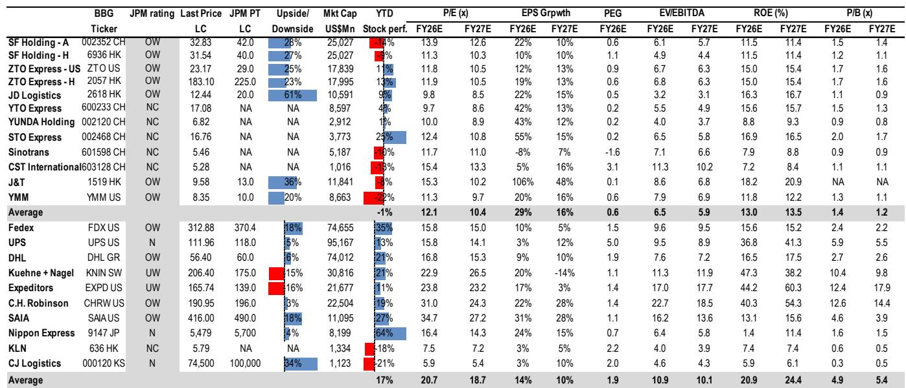

# J&T 跨越关键节点：全球快递模式进入回报阶段

2026年第二季度对J&T而言是一个重要的转折点，其发展叙事从规模增长实验转向具有可衡量回报机制的复合型业务模式。公司处理了91.8亿件包裹，日均处理量首次突破1亿件。这不仅仅是一个整数关口，而是一个结构性门槛，能够解锁持续的单元成本下降、加速自动化投资回报，并改变市场对该公司价值的评估方式。

最重要的并非包裹量增长本身，而是这一增长所反映的模式可持续性。中国以外的包裹现在占总量的32.3%，较几个季度前的较低基数显著提升。公司正在使其利润来源多元化，降低对单一地区的依赖。同时，管理层宣布了一项新的20亿港元回购计划，按当前价格计算，回购回报表现约为2.4%。对于一家不久前还在亏损的公司而言，这是一个切实的信号，表明管理层相信业务在自由现金流生成方面已迎来转折。

市场对该公司的重新定价一直较为缓慢。年初至今，股价仍下跌9%，尽管其表现略优于恒生综合指数。财报发布后股价反应平淡，反映了短期技术因素，包括人工智能驱动的资金轮动至指数权重股。但基本面正在加强。对观察者而言，问题在于这一运营势头能否在中期业绩中转化为盈利上调，以及市场是否会最终将数据中已显现的结构性改善纳入定价。

## 日均1亿件里程碑不仅是数字，更是结构性成本拐点

J&T 2026年第二季度更新中最被低估的一点是，当物流网络跨越关键吞吐量门槛时，单元经济会发生什么变化。当日均处理量超过1亿件时，分拣中心、干线运输和最后一公里配送网络的固定成本被分摊到更大的基数上。需要大量前期资本的自动化投资开始更快地产生回报，因为利用率提高，峰值产能压力减轻。

管理层提供了一个具体案例。印度尼西亚坦格朗项目将处理时间缩短了40%，峰值分拣效率提升了150%。这并非理论推测，而是证明了在中国构建并全球输出的运营模式在高增长市场中行之有效。这意味着，随着东南亚、拉丁美洲和中东地区的业务量持续增长，成本曲线应继续下降，从而扩大相对于无法达到同等处理量或自动化密度的小型竞争对手的利润率优势。

对于观察者而言，这改变了估值框架。一家能够展示结构性成本优势、并有可量化自动化成果支撑的公司，理应获得相对于仅依赖定价或业务量增长的同行更高的估值倍数。当前FY26E约15倍、FY27E降至10倍的远期市盈率，并未完全反映这一结构性变化。回购回报表现提供了底部支撑，但上行空间将来自市场尚未建模的利润率扩张。

## 东南亚不再只是业务量故事，而是质量和平台锁定故事

东南亚在2026年第二季度处理了27.5亿件包裹，同比增长63.2%。无论从哪个角度看，这都令人印象深刻，但更重要的进展是增长的结构。管理层将这一势头归因于持续的电商渗透、平台客户在促销和免运费方面的投入，以及随着品牌知名度和服务质量提升，有意向非平台包裹领域的拓展。

关键洞察在于，电商平台正在提高对物流合作伙伴的要求。行业内的配送速度趋同意味着价格不再是相对少见的差异化因素。平台需要能够同时在成本、覆盖范围和可靠性方面达标的物流运营商。这对于像J&T这样能够跨多个地区和客户类型提供一致服务的规模化、平台中立型整合者而言，是一个有利因素。

历史上困扰快递行业的回报表现侵蚀风险，在这种环境下得到缓解。当平台要求更高的服务标准时，它们不太可能仅基于边际价格差异更换物流合作伙伴。J&T作为平台中立型运营商的定位，服务于多个电商客户而不受制于任何单一平台，赋予了其简单的业务量增长指标无法捕捉的定价能力。对观察者而言，问题在于平台行为的这种结构性变化是否可持续，或者如果电商增长放缓、平台再次变得对成本更敏感，这一趋势是否会逆转。

## 中国业务发挥稳定器作用，但关键在于份额增长是否盈利

中国地区在2026年第二季度处理了62.1亿件包裹，同比增长10.6%，而行业前五个月的增长约为5%。J&T显然在获取市场份额，管理层将此归因于网络升级、服务质量改善、成本控制和技术赋能，而非激进定价。

这一叙事方向正确，但需要仔细审视。中国快递市场结构竞争激烈，多家大型参与者在价格、服务和网络密度上展开竞争。J&T在维持或改善单元经济的同时获取份额的能力，是决定其股价能否重新定价的关键变量。公司正获得越来越多品牌和高质量客户的认可，这表明产品组合正转向更高收益的包裹。

然而，竞争环境并未发生根本性改变。如果反内卷措施减弱，或竞争对手以激进定价回应份额损失，J&T的利润率轨迹可能面临压力。公司重申了全年指引，表明对当前趋势的可持续性有信心。但中国业务目前并非利润率扩张的来源，而是一个稳定器，提供现金流和规模以支持国际扩张。观察者应密切关注中国业务的利润率轨迹，特别是如果业务量增长加速至当前10-11%范围以上，这可能预示着价格驱动型竞争的回归。

## 其他市场不再是可选项，而是可信的第三引擎

2026年第二季度更新中最引人注目的数据点是其他市场的表现，处理了2.1亿件包裹，同比增长136.5%。这是连续第五个季度加速增长。拉丁美洲是最大的贡献者，中东地区则受到区域冲突的制约。

总可寻址市场的论点具有说服力。较高的人均GDP和消费水平，加上相对于中国和东南亚结构性较低的电商渗透率和人均包裹量，为增长提供了长期空间。J&T正在输出其经过验证的模式：自动化、路线优化和最后一公里效率。与Mercado Libre及拉丁美洲的中国平台的深化合作提供了需求锚点，降低了执行风险。

新市场进入，包括第二季度启动的哥伦比亚以及正在评估的秘鲁和中美洲，表明管理层的扩张是系统性的而非机会主义的。在美国和欧洲偏好轻资产、合规的进入方式，进一步支持了长期增长故事，而无需过度资本承诺。

风险在于，这些市场的执行失误，无论是由于本地化挑战、监管障碍还是业务量增长慢于预期，都可能延迟盈利路径。其他市场在分部层面仍处于亏损状态，同时在多个地区建设网络所需的投资可能在短期内对集团层面的利润率造成压力。但趋势是明确的：如果J&T能将其在东南亚的成功哪怕一小部分复制到拉丁美洲和中东，公司的长期盈利能力将是当前估值的数倍。

## 观察者的决策框架：重新定价持续需要满足哪些条件

报告提供了一组清晰的运营数据，但并未完全回答FY27E之后的盈利轨迹问题。公司指引全年资本支出为7-8亿美元，投资优先顺序覆盖中国、东南亚和其他市场，并逐步聚焦拉丁美洲。回购提供了技术性底部支撑，但基本面的重新定价取决于三个变量。

第一，J&T能否在不导致单元经济显著恶化的情况下，将东南亚的业务量增长维持在50%以上？当前63%的增长率非同寻常，但部分由平台在促销方面的投入驱动。如果平台客户削减补贴，业务量增长可能放缓，推动利润率扩张的固定成本杠杆效应可能停滞。

第二，中国市场的份额增长能否在不引发压缩利润率的竞争反应的情况下持续？中国市场结构性供应过剩，任何份额增长过快的参与者都可能引发价格战。J&T专注于网络质量和客户组合的策略是明智的，但这也需要竞争对手保持自律。

第三，其他市场需要多久才能达到盈亏平衡，以及这一过程的资本密集度如何？公司同时进入多个新市场，虽然轻资产模式降低了风险，但并未消除风险。观察者需要看到拉丁美洲和中东地区清晰的盈利路径，才能充分认可国际增长故事的价值。

报告留下了这些问题，这正是完整分析值得一读的原因。数据支持看多观点，但安全边际取决于未来两到四个季度的执行情况。对于希望了解将决定公司未来走势的详细业务量趋势、自动化指标和竞争动态的观察者，报告提供了必要的细节。

加入社区阅读完整报告并查看原始图表。

*仅供参考。部分内容可能基于源材料通过AI辅助生成、翻译、总结或编辑，可能存在遗漏或错误。请独立核实。本文不构成专业建议。*

仅供参考。部分内容可能基于源材料通过AI辅助生成、翻译、总结或编辑，可能存在遗漏或错误。请独立核实。本文不构成专业建议。

