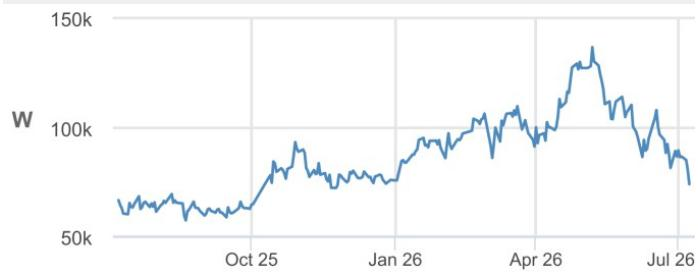
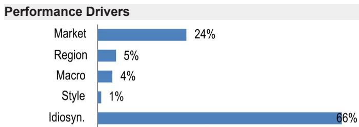
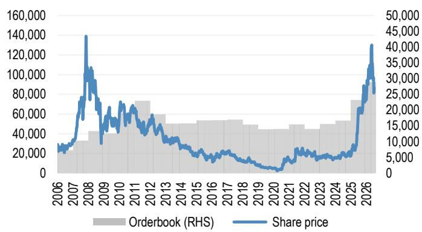
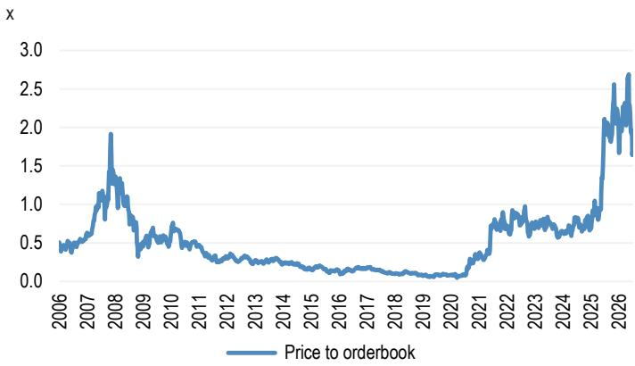

## Korea Nuclear EPC

## 2Q nuclear orders remain muted; reshuffle our nuclear order estimates

2Q order intake was solid but nuclear orders remained muted, with only a small KEPCO E&C maintenance contract (W33bn) from KHNP. Non-nuclear orders were strong: Doosan Enerbility's (Doosan) US steam turbine orders and Hyundai E&C's (HDEC) W10tn intake, including the Apgujeong 3rd District reconstruction (W5.6tn). We are reshuffling our order estimates, pushing back our overseas nuclear project assumptions by 1-2 years due to geopolitical tensions, trimming 2026-28E orderbook estimates and lowering price targets. 2Q earnings should be broadly in-line with consensus, with limited downside risk as problematic overseas projects near completion. We maintain a constructive sector view on all three names with Overweight ratings, with Doosan as our top pick.

- 2Q new orders: strong overall, but nuclear orders remain muted. The only disclosed nuclear-related award was KEPCO E&C's emergency maintenance contract for an existing nuclear plant (W33bn) from KEPCO. Outside nuclear, Doosan booked W2.4tn of new orders, highlighted by another large US steam turbine and generator contract, reinforcing continued robust US CCPP (combined-cycle gas power plant) demand. HDEC also delivered strong order momentum in 2Q, booking W10tn of new orders led by the Apgujeong 3rd District reconstruction project (W5.6tn). Looking ahead, we expect Doosan to secure the ~W3tn construction portion of the Czech Dukovany nuclear project in the coming quarter.

- Reshuffling our order estimates. Political complications and extended execution timelines have delayed several overseas nuclear projects, and we have pushed back our order assumptions by 1-2 years. In particular, we have pushed back our assumed US timeline from 2028 to 2029. In our view, this is largely dependent on intergovernmental decision-making between Korea and the US, including how Korea's planned $200bn investment over the next 10 years in US infrastructure is allocated and sequenced. As a result, we cut our 2026-28E orderbook estimates for Doosan, KEPCO E&C, and HDEC by 5-17%, 3-31%, and 12-21%, respectively, which also drives lower target prices. That said, we believe the absence of a nuclear order win this year is largely priced in. Investor feedback from our Asia marketing last week suggests expectations have shifted towards a bear-case scenario in which only Korea and Vietnam orders are awarded (link to our note).

- 2Q earnings likely a non-event; broadly in-line with BBG consensus. We do not expect a meaningful beat or miss, although quarterly volatility may persist due to uneven project progress. HDEC disclosed an additional upward order revision of W337bn for domestic projects, which should partially offset expected site-related cost overruns. In addition, previously problematic overseas projects are either completed or nearing completion (e.g., HDEC's Saudi Arabia projects), reducing the risk of further margin drag.

- Stay Overweight on the three nuclear EPC names. Despite softer sentiment on the near-term nuclear project outlook, we maintain a constructive view on the Korea nuclear EPC sector. Our top pick remains Doosan, supported by its expanding orderbook and balanced exposure across large-scale nuclear, SMRs, and gas turbines. We prefer the nuclear EPC names over KEPCO (UW), given: 1) better visibility on overseas EPC catalysts; and 2) relatively lower policy risk vs. KEPCO.

Wbn
Table 1: Korea nuclear EPC companies: major order intake in 2Q26

| Date announced | New/ Revision | Contract amount (Wbn) | Detail | Project owner | Contract period |
|---|---|---|---|---|---|
| Doosan Enerbility | | 2,369 | | | |
| 5/6/2026 | New | 523 | Busan Metropolitan City Myeongjang Park apartment construction | Jeongsang City Park | 9/30/2026 | 12/30/2030 |
| 5/26/2026 | New | 480 | Long Term Procurement Management contract for GT | Korea Southern Power | n/a | n/a |
| 5/27/2026 | New | n/a | W370MW steam turbine + generator supply contract | US company | n/a | ~2029 |
| 6/1/2026 | New | 837 | Jafurah Phase II cogeneration plant | KEPCO | 6/1/2026 | 6/30/2029 |
| 6/15/2026 | New | 529 | Duqm independent power project | Coastal Power SAOC | 6/12/2026 | 4/1/2029 |
| HDEC | | 9,791 | | | |
| 4/15/2026 | Reivision | 241 | Daejang-Hongdae metropolitan railway private investment facility construction | Seobu Metropolitan Metro | n/a | n/a |
| 4/29/2026 | Reivision | 96 | Itaewon UN site complex development | Yongsan Eleven | 2/11/2023 | 6/4/2027 |
| 5/26/2026 | New | 5,561 | Apgujeong Apartment District Special Planning Zone 3 housing redevelopment | Apgujeong Apartment District Special Planning Zone 3 Redevelopment Association | n/a | n/a |
| 6/5/2026 | New | 3,039 | Wirye Bokjeong station area complex development | Songpa Biz Cluster PFV | 6/15/2026 | 1/14/2031 |
| 6/22/2026 | New | 853 | Beomcheon 4 District housing redevelopment | Beomcheon 4 District Redevelopment Association | n/a | n/a |
| KEPCO E&C | | 33 | | | |
| 4/16/2026 | New | 33 | Operating nuclear plants emergency maintenance | KHNP | 4/14/2026 | 4/13/2027 |

Source: Company data

Table 2: Nearest nuclear projects relevant to Korea EPC companies
Number of reactor units

| | Prime contractor | 2026E | 2027E | 2028E | 2029E |
|---|---|---|---|---|---|
| Large-scale projects | | | | | |
| Bulgaria | Westinghouse | | 2 | | |
| Poland | Westinghouse | | 3 | | |
| Vietnam | KEPCO | | 2 | | |
| Korea | KEPCO | | | 2 | |
| US | Westinghouse | | | | 2 |
| US | KEPCO | | | | 2 |
| Reactor units by prime contractor | | | | | |
| KEPCO | | | 2 | 2 | 2 |
| Westinghouse | | | 5 | | 2 |

Source: Company data, JPM estimates.

Table 3: Estimated orders from the nearest large-scale nuclear projects $bn

| | Prime contractor | 2026E | 2027E | 2028E | 2029E |
|---|---|---|---|---|---|
| Projected contract value | | | | | |
| Bulgaria | Westinghouse | | >20 | | |
| Poland | Westinghouse | | >30 | | |
| Vietnam | KEPCO | | 10 | | |
| Korea | KEPCO | | | 10 | |
| US | Westinghouse | | | | >20 |
| US | KEPCO | | | | 20 |
| Project by prime contractor | | | | | |
| KEPCO | | | 10 | 10 | 20 |
| Westinghouse | | | >50 | | >20 |
| Est. order size for Korean EPC companies | | | | | |
| Doosan | ~$2bn for KEPCO reactor; ~$200mn per Westinghouse reactor | | 5.0 | 4.0 | 4.4 |
| KEPCO E&C | ~$0.5bn per KEPCO reactor | | 1.0 | 1.0 | 1.0 |
| HDEC | ~$1.2bn per KEPCO reactor in Korea (double for overseas) x 50% chance; ~$4bn per Westinghouse reactor (Bulgaria, US) | | 10.4 | 1.2 | 10.4 |

Source: IAEA, company data, JPM estimates

Table 4: Estimated orders from the nearest SMR projects $bn

| | SMR projects | 2026E | 2027E | 2028E | 2029E |
|---|---|---|---|---|---|
| Doosan | NuScale, TerraPower, etc. | 0.7 | 0.7 | 1.4 | 2.1 |
| HDEC | Holtec International | 2.0 | 2.0 | | |

Source: Company data, JPM estimates

## Table 5: JPMe vs consensus

| Doosan Enerbility | | | | | | | | |
|---|---|---|---|---|---|---|---|---|
| | 2026E | | | 2027E | | | 2028E | |
| | JPMe | Consensus | Diff | JPMe | Consensus | Diff | JPMe | Consensus | Diff |
| Revenue | 17,060 | 18,037 | -5% | 19,240 | 20,096 | -4% | 22,484 | 22,458 | 0% |
| OP | 1,119 | 1,145 | -2% | 1,542 | 1,568 | -2% | 2,065 | 2,042 | 1% |

| Hyundai E&C | | | | | | | | |
|---|---|---|---|---|---|---|---|---|
| | 2026E | | | 2027E | | | 2028E | |
| | JPMe | Consensus | Diff | JPMe | Consensus | Diff | JPMe | Consensus | Diff |
| Revenue | 27,492 | 27,168 | 1% | 28,484 | 29,218 | -3% | 31,029 | 31,444 | -1% |
| OP | 817 | 826 | -1% | 1,137 | 1,184 | -4% | 1,426 | 1,487 | -4% |

No consensus est. for KEPCO E&C
Source: Bloomberg Finance L.P., JPM estimates.

## Overweight

034020.KS, 034020 KS
Price (08 Jul 26):W74,000

▼ Price Target (Dec-27):W130,000
Prior (Dec-27):W160,000

## Korea Auto, EV battery, Nuclear and Utility

Sonny Lee AC
(82-2) 758 5716
sonny.lee@JPM.com
JPM Securities (Far East) Limited, Seoul Branch

Key Changes (FYE Dec)

| | Prev | Cur | Δ |
|---|---|---|---|
| Adj. EPS - 26E (W) | 578 | 512 | -11.5% |
| Adj. EPS - 27E (W) | 1,193 | 1,046 | -12.3% |

Quarterly Forecasts (FYE Dec)
Adj. EPS (W)

| | 2025A | 2026E | 2027E |
|---|---|---|---|
| Q1 | (107) | 1A | 173 |
| Q2 | 204 | 153 | 248 |
| Q3 | (78) | 175 | 258 |
| Q4 | 114 | 183 | 367 |
| FY | 132 | 512 | 1,046 |

Style Exposure

| Quant Factors | Current %Rank | Hist %Rank (1=Top) |
|---|---|---|
| | | 6M | 1Y | 3Y | 5Y |
| Value | 90 | 88 | 74 | 70 | 4 |
| Growth | 7 | 62 | 42 | 9 | 58 |
| Momentum | 21 | 6 | 25 | 54 | 11 |
| Quality | 85 | 81 | 74 | 15 | 100 |
| Low Vol | 82 | 81 | 66 | 82 | 100 |
| ESGQ | 19 | 14 | 29 | 97 | - |

## Doosan Enerbility

## Gas turbines to fill orderbook while nuclear remains silent

Doosan Enerbility continues to benefit from robust gas/steam turbine demand and CCPP (combined-cycle gas power plant) EPC, with orders flowing in steadily and robust demand continuing for the next several years. Nuclear orders remained muted in 1H: the Czech Dukovany construction portion (~W3tn) leads the order momentum, but we have pushed Bulgaria's Kozloduy project into 2027 following a change in government that has slowed progress, and conservatively deferred Korea's domestic nuclear project order to next year, as site selection was only confirmed in June 2026. Accordingly, we trim our 2026-28E orderbook est. by 5-17% and cut our PT to W130,000, while earnings estimates remain largely unchanged.

Table 6: Doosan: 2Q26 preview
Wbn, %

| | 2Q26 | | 2Q25 | % y/y | 1Q26 | % q/q |
|---|---|---|---|---|---|---|
| | JPMe | BBG | Diff. | | | |
| Revenue | 4,487 | 4,657 | -4% | 4,569 | -2% | 4,261 | 5% |
| OP | 283 | 268 | 5% | 271 | 4% | 234 | 21% |
| OP margin | 6.3% | 5.8% | | 5.9% | | 5.5% | |
| NP | 163 | 68 | 142% | 198 | -17% | 60 | 171% |
| NP margin | 3.6% | 1.5% | | 4.3% | | 1.4% | |

Source: Company data, Bloomberg Finance L.P.
Table 7: Doosan: Price target

Wbn, W, x

| | | Value | Note |
|---|---|---|---|
| Doosan Enerbility | (a) | 82,293 | |
| 2028E Orderbook | | 43,312 | Enerbility-only orderbook |
| Target Price/Orderbook | | 1.9x | Upcycle multiple |
| Investment value | (b) | 4,445 | |
| Doosan Bobcat | | 2,839 | 48.2% stake x Market cap |
| Doosan Fuelcell | | 847 | 30.3% stake x Market cap |
| Doosan Skoda Power | | 759 | 67.0% stake x Market cap |
| Discount to investment value | (c) | 50% | |
| Target market cap | (a)+(b)x(1-c) | 84,516 | |
| Price target | | 130,000 | |

Source: Bloomberg Finance L.P., JPM estimates.

Price Performance

— 034020.KS Price (W)

| | YTD | 1m | 3m | 12m |
|---|---|---|---|---|
| Abs | -2.4% | -14.4% | -27.7% | 11.1% |

| Company Data | |
|---|---|
| Shares O/S (mn) | 641 |
| 52-week range (W) | 139,200-51,100 |
| Market cap ($ mn) | 31,290 |
| Exchange rate | 1,514.90 |
| Free float (%) | 61.5% |
| 3M ADV (mn) | 7.89 |
| 3M ADV ($ mn) | 563.9 |
| Volatility (90 Day) | 81 |
| Index | KOSPI |
| BBG ANR (Buy | Hold | Sell) | 24|0|0 |

Key Metrics (FYE Dec)

| W in billions | FY25A | FY26E | FY27E | FY28E |
|---|---|---|---|---|
| Financial Estimates | | | | |
| Revenue | 17,058 | 17,060 | 19,240 | 22,484 |
| Adj. EBITDA | 1,320 | 1,700 | 2,233 | 2,754 |
| Adj. EBIT | 763 | 1,119 | 1,542 | 2,065 |
| Adj. net income | 85 | 328 | 670 | 990 |
| Adj. EPS | 132 | 512 | 1,046 | 1,546 |
| BBG EPS | 165 | 510 | 911 | 1,299 |
| Cashflow from operations | 752 | 740 | 1,552 | 1,879 |
| FCFF | 349 | 40 | 852 | 1,129 |
| Margins and Growth | | | | |
| Revenue Growth Y/Y (%) | 5.1% | 0.0% | 12.8% | 16.9% |
| EBITDA margin | 7.7% | 10.0% | 11.6% | 12.3% |
| EBITDA Growth Y/Y (%) | (12.5%) | 28.8% | 31.3% | 23.3% |
| EBIT margin | 4.5% | 6.6% | 8.0% | 9.2% |
| Net margin | 0.5% | 1.9% | 3.5% | 4.4% |
| Adj. EPS growth | (23.9%) | 286.7% | 104.5% | 47.8% |
| Ratios | | | | |
| Adj. tax rate | 37.2% | 30.6% | 27.5% | 27.5% |
| Interest cover | 5.5 | 7.7 | 11.1 | 14.4 |
| Net debt/Equity | 0.2 | 0.2 | 0.1 | 0.1 |
| Net debt/EBITDA | 2.0 | 1.5 | 0.8 | 0.5 |
| ROCE | 3.6% | 5.7% | 7.9% | 9.8% |
| ROE | 1.1% | 4.1% | 7.9% | 10.7% |
| Valuation | | | | |
| FCFF yield | 0.7% | 0.1% | 1.8% | 2.4% |
| Dividend yield | 0.0% | 0.0% | 0.0% | 0.0% |
| EV/Revenue | 3.0 | 3.6 | 3.0 | 2.5 |
| EV/EBITDA | 38.4 | 36.0 | 25.5 | 20.3 |
| Adj. P/E | 559.2 | 144.6 | 70.7 | 47.9 |

## Summary Investment Thesis and Valuation

## Investment Thesis

We reshuffle our top-down forecasts for major large-scale nuclear EPC projects led by KEPCO and Westinghouse. Doosan continues to benefit from robust US gas/steam turbine demand, with orders flowing steadily and demand expected to outpace supply for the next several years. However, nuclear orders remained muted in 1H, with Bulgaria's Kozloduy project pushed into 2027 following a change in government and Korea's domestic nuclear project order conservatively deferred to next year, as site selection was only confirmed in June. Doosan remains our top pick within the Korean nuclear EPC sector, supported by its rapidly expanding orderbook and balanced exposure across large-scale nuclear, SMRs, and gas turbines. Maintain OW.

## Valuation

Our Dec-27 PT of W130,000 is based on our sum-of-the-parts valuation, in which we value the core business using an up-cycle multiple of 1.9x 2028E price/orderbook.

| Factors | 6M Corr | 1Y Corr |
|---|---|---|
| Market: MSCI Asia Pac ex JP | 0.60 | 0.49 |
| Region: Korea | 0.06 | 0.26 |
| Macro: | | |
| JPM China A-shares Sentiment | 0.08 | 0.15 |
| Emerging Central Bank Rate | 0.07 | 0.11 |
| JPM Forecast Revision EM | -0.06 | -0.10 |
| Quant Styles: | | |
| Growth | 0.03 | -0.14 |
| Quality | -0.26 | -0.11 |
| LowVol | -0.06 | 0.11 |

Table 8: Doosan: Summary of key financials
Doosan: Summary of key financials

| | 2023 | 2024 | 2025 | 2026E | 2027E | 2028E | 2029E |
|---|---|---|---|---|---|---|---|
| Orderbook: core-business | 16,050 | 16,004 | 23,244 | 28,946 | 37,809 | 43,312 | 47,541 |
| New order intake: core-business | 8,886 | 7,133 | 14,728 | 13,200 | 18,200 | 17,700 | 18,200 |
| Financials | | | | | | | |
| Sales revenue | 17,590 | 16,233 | 17,058 | 17,060 | 19,240 | 22,484 | 24,660 |
| %y/y | 14% | -8% | 5% | 0% | 13% | 17% | 10% |
| Doosan Enerbility | 7,652 | 7,367 | 7,882 | 7,498 | 9,337 | 12,196 | 13,972 |
| Doosan Fuelcell | 261 | 412 | 455 | 518 | 544 | 554 | 566 |
| Doosan Bobcat | 9,701 | 8,502 | 8,829 | 9,293 | 9,665 | 10,052 | 10,454 |
| OP | 1,467 | 1,018 | 763 | 1,119 | 1,542 | 2,065 | 2,253 |
| Doosan Enerbility | 225 | 244 | 302 | 407 | 741 | 1,107 | 1,269 |
| Doosan Fuelcell | 2 | -2 | -105 | -1 | 5 | 6 | 6 |
| Doosan Bobcat | 1,381 | 865 | 690 | 841 | 967 | 1,182 | 1,229 |
| OP margin | 8% | 6% | 4% | 7% | 8% | 9% | 9% |
| Doosan Enerbility | 3% | 3% | 4% | 5% | 8% | 9% | 9% |
| Doosan Fuelcell | 1% | 0% | -23% | 0% | 1% | 1% | 1% |
| Doosan Bobcat | 14% | 10% | 8% | 9% | 10% | 12% | 12% |
| NP | 518 | 395 | 205 | 585 | 972 | 1,359 | 1,510 |
| NP margin | 3% | 2% | 1% | 3% | 5% | 6% | 6% |
| NP to parent | 56 | 111 | 85 | 328 | 670 | 990 | 1,127 |

| 1Q25 | 2Q25 | 3Q25 | 4Q25 | 1Q26 | 2Q26E | 3Q26E | 4Q26E |
|---|---|---|---|---|---|---|---|
| 3,749 | 4,569 | 3,880 | 4,860 | 4,261 | 4,487 | 4,072 | 4,240 |
| -9% | 10% | 14% | 6% | 14% | -2% | 5% | -13% |
| 1,576 | 2,268 | 1,678 | 2,360 | 1,896 | 2,099 | 1,800 | 1,703 |
| 100 | 128 | 91 | 136 | 145 | 135 | 95 | 143 |
| 2,054 | 2,237 | 2,161 | 2,377 | 2,247 | 2,327 | 2,247 | 2,472 |
| 142 | 271 | 137 | 212 | 234 | 283 | 295 | 308 |
| -1 | 92 | 43 | 168 | 57 | 105 | 126 | 119 |
| -12 | -2 | -16 | -76 | -1 | 0 | 0 | 0 |
| 196 | 208 | 138 | 148 | 207 | 209 | 202 | 223 |
| 4% | 6% | 4% | 4% | 5% | 6% | 7% | 7% |
| 0% | 4% | 3% | 7% | 3% | 5% | 7% | 7% |
| -12% | -1% | -17% | -56% | -1% | 0% | 0% | 0% |
| 10% | 9% | 6% | 6% | 9% | 9% | 9% | 9% |
| -21 | 198 | -24 | 53 | 60 | 163 | 175 | 186 |
| -1% | 4% | -1% | 1% | 1% | 4% | 4% | 4% |
| -69 | 131 | -50 | 73 | 1 | 98 | 112 | 117 |

Source: Company data, Bloomberg Finance L.P., JPM estimates.

Figure 1: Doosan: Share price vs orderbook

Source: Bloomberg Finance L.P., JPM estimates.

Figure 2: Doosan: Price/orderbook trend

Source: Bloomberg Finance L.P., JPM estimates.

# Investment Thesis, Valuation and Risks

Doosan Enerbility (Overweight; Price Target: W130,000)

## Investment Thesis

We reshuffle our top-down forecasts for major large-scale nuclear EPC projects led by KEPCO and Westinghouse. Doosan continues to benefit from robust US gas/steam turbine demand, with orders flowing steadily and demand expected to outpace supply for the next several years. However, nuclear orders remained muted in 1H, with Bulgaria's Kozloduy project pushed into 2027 following a change in government and Korea's domestic nuclear project order conservatively deferred to next year, as site selection was only confirmed in June. Doosan remains our top pick within the Korean nuclear EPC sector, supported by its rapidly expanding orderbook and balanced exposure across large-scale nuclear, SMRs, and gas turbines. Maintain OW.

## Valuation

Our Dec-27 PT of W130,000 is based on our sum-of-the-parts valuation, in which we value the core business using an up-cycle multiple of 1.9x 2028E price/orderbook.

Doosan: Price target derivation

Wbn, Won, x

| | | Value | Note |
|---|---|---|---|
| Doosan Enerbility | (a) | 82,293 | |
| 2028E Orderbook | | 43,312 | Enerbility-only orderbook |
| Target Price/Orderbook | | 1.9x | Upcycle multiple |
| Investment value | (b) | 4,445 | |
| Doosan Bobcat | | 2,839 | 48.2% stake x Market cap |
| Doosan Fuelcell | | 847 | 30.3% stake x Market cap |
| Doosan Skoda Power | | 759 | 67.0% stake x Market cap |
| Discount to investment value | (c) | 50% | |
| Target market cap | (a)+(b)x(1-c) | 84,516 | |
| Price target | | 130,000 | |

Source: Bloomberg Finance L.P., JPM estimates

## Risks to Rating and Price Target

Key downside to our rating and price target risks include: 1) potential delays in anticipated large-scale nuclear projects; and 2) negative developments in several SMR customers' progress (e.g., approvals or technical issues).

Doosan Enerbility: Summary of Financials

| Income Statement | FY25A | FY26E | FY27E | FY28E |
|---|---|---|---|---|
| Revenue | 17,058 | 17,060 | 19,240 | 22,484 |
| COGS | (14,315) | (14,150) | (15,774) | (18,171) |
| Gross profit | 2,743 | 2,910 | 3,466 | 4,314 |
| SG&A | (1,722) | (1,468) | (1,539) | (1,799) |
| Adj. EBITDA | 1,320 | 1,700 | 2,233 | 2,754 |
| D&A | (557) | (581) | (691) | (689) |
| Adj. EBIT | 763 | 1,119 | 1,542 | 2,065 |
| Net Interest | (239) | (221) | (202) | (191) |
| Adj. PBT | 327 | 843 | 1,340 | 1,875 |
| Tax | (122) | (258) | (369) | (516) |
| Minority Interest | (120) | (257) | (302) | (369) |
| Adj. Net Income | 85 | 328 | 670 | 990 |
| Reported EPS | 132 | 512 | 1,046 | 1,546 |
| Adj. EPS | 132 | 512 | 1,046 | 1,546 |
| DPS | 0 | 0 | 0 | 0 |
| Payout ratio | 0.0% | 0.0% | 0.0% | 0.0% |
| Shares outstanding | 641 | 641 | 641 | 641 |
| Balance Sheet | FY25A | FY26E | FY27E | FY28E |
| Cash and cash equivalents | 3,081 | 3,121 | 3,973 | 5,102 |
| Accounts receivable | 4,046 | 3,412 | 3,848 | 4,497 |
| Inventories | 2,544 | 2,830 | 3,155 | 3,634 |
| Other current assets | 7,474 | 7,126 | 7,887 | 9,015 |
| Current assets | 10,772 | 10,464 | 12,077 | 14,334 |
| PP&E | 5,777 | 5,875 | 5,859 | 5,895 |
| LT investments | 1,210 | 1,210 | 1,210 | 1,210 |
| Other non current assets | 2,241 | 2,241 | 2,241 | 2,241 |
| Total assets | 27,513 | 27,325 | 28,946 | 31,264 |
| Short term borrowings | 2,913 | 2,913 | 2,913 | 2,913 |
| Payables | 6,434 | 5,660 | 6,310 | 7,268 |
| Other short term liabilities | 760 | 760 | 760 | 760 |
| Current liabilities | 10,107 | 9,333 | 9,983 | 10,942 |
| Long-term debt | 2,835 | 2,835 | 2,835 | 2,835 |
| Other long term liabilities | 5,397 | 5,397 | 5,397 | 5,397 |
| Total liabilities | 15,504 | 14,730 | 15,380 | 16,338 |
| Shareholders' equity | 7,786 | 8,114 | 8,784 | 9,774 |
| Minority interests | 4,224 | 4,481 | 4,782 | 5,151 |
| Total liabilities & equity | 27,513 | 27,325 | 28,946 | 31,264 |
| BVPS | 12,156 | 12,668 | 13,715 | 15,261 |
| y/y Growth | 3.9% | 4.2% | 8.3% | 11.3% |
| Net debt/(cash) | 2,668 | 2,627 | 1,776 | 1,294 |

Source: Company reports and JPM estimates.

| Cash Flow Statement | FY25A | FY26E | FY27E | FY28E |
|---|---|---|---|---|
| Cash flow from operating activities | 752 | 740 | 1,552 | 1,879 |
| o/w Depreciation & amortization | 557 | 581 | 691 | 689 |
| o/w Changes in working capital | 464 | (426) | (111) | (170) |
| Cash flow from investing activities | (311) | (700) | (700) | (750) |
| o/w Capital expenditure | (403) | (500) | (500) | (550) |
| as % of sales | 2.4% | 2.9% | 2.6% | 2.4% |
| Cash flow from financing activities | (259) | 0 | 0 | 0 |
| o/w Dividends paid | (108) | 0 | 0 | 0 |
| o/w Shares issued/(repurchased) | (269) | 0 | 0 | 0 |
| o/w Net debt issued/(repaid) | (132) | 0 | 0 | 0 |
| Net change in cash | 183 | 40 | 852 | 1,129 |
| Adj. Free cash flow to firm | 349 | 40 | 852 | 1,129 |
| y/y Growth | (259.0%) | (88.5%) | 2018.0% | 32.5% |

| Ratio Analysis | FY25A | FY26E | FY27E | FY28E |
|---|---|---|---|---|
| Gross margin | 16.1% | 17.1% | 18.0% | 19.2% |
| EBITDA margin | 7.7% | 10.0% | 11.6% | 12.3% |
| EBIT margin | 4.5% | 6.6% | 8.0% | 9.2% |
| Net profit margin | 0.5% | 1.9% | 3.5% | 4.4% |
| ROE | 1.1% | 4.1% | 7.9% | 10.7% |
| ROA | 0.3% | 1.2% | 2.4% | 3.3% |
| ROCE | 3.6% | 5.7% | 7.9% | 9.8% |
| SG&A/Sales | 10.1% | 8.6% | 8.0% | 8.0% |
| Net debt/Equity | 0.2 | 0.2 | 0.1 | 0.1 |
| Net debt/EBITDA | 2.0 | 1.5 | 0.
