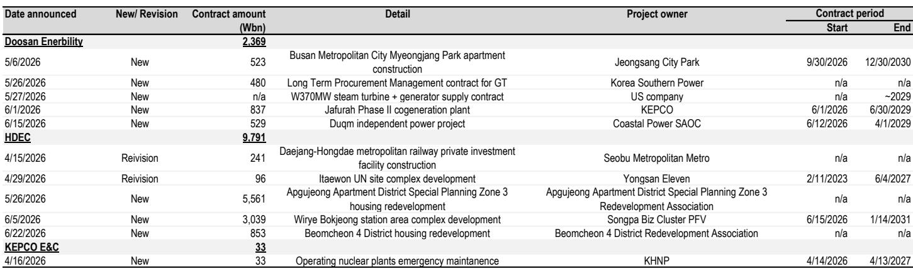
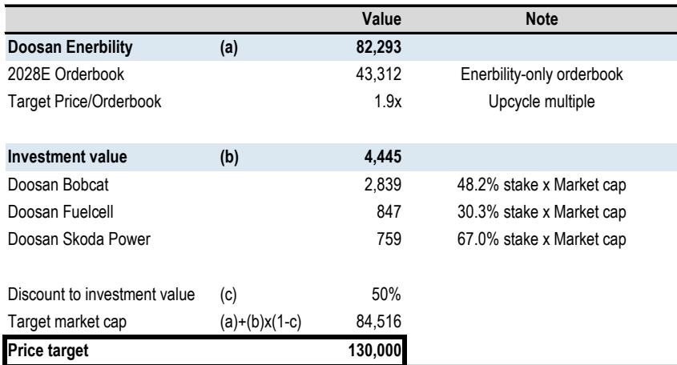
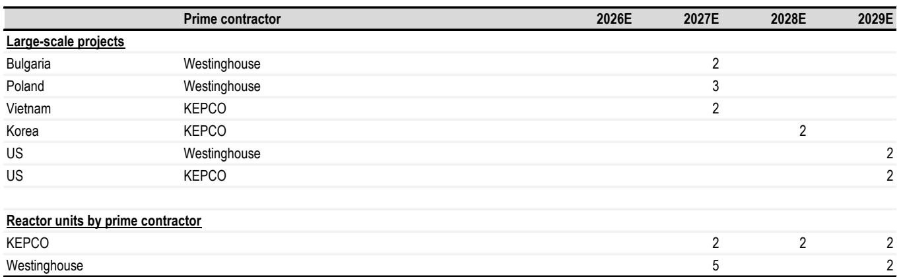

# JPM：韩国核电EPC的真正考验不是订单，而是时间

核电板块的读者正在经历一个罕见的“等待期”。JPM最新发布的韩国核电EPC行业报告给出了一个清晰的信号：2026年上半年，核电新订单几乎为零，但市场对此已有预期。真正值得关注的不是订单何时落地，而是地缘政治节奏如何重塑整个核电产业链的回报时间表。

这份报告覆盖了三家韩国核电EPC核心企业——斗山能源、韩国电力技术、现代工程建设。JPM维持了对这三家公司的积极看法，但同步下调了2026至2028年的订单簿预估，降幅在3%至31%不等。这并非基本面出现变化，而是海外核电项目的时间线被推后了1到2年。

**1. 地缘政治正在改写核电订单的时间轴**

报告中最关键的调整在于对美国核电项目的假设。JPM将美国项目的订单时间从2028年推迟至2029年。原因并不在于技术或成本，而在于韩美两国间的决策节奏——韩国计划未来10年在美国基础设施领域研究2000亿美元，这笔资金如何分配、与核电项目如何衔接，目前仍不明朗。

保加利亚的科兹洛杜伊项目也因当地情况变化而被推迟至2027年。韩国国内核电项目则因厂址选址在2026年6月才最终确认，订单预计也要等到明年。

> **KC评论：** 核电EPC的研究逻辑在发生变化。过去市场关注的是“谁能拿到订单”，现在需要关注的是“订单什么时候能转化为收入”。时间线每推迟一年，对企业的现金流和估值都会产生复合影响。这份报告的价值在于，它量化了这种时间不确定性——而不是简单地说“看好”或“看空”。

**2. 非核电业务正在填补订单空白期**

报告的第二层洞察是：核电EPC企业并非在“空转”。二季度整体订单表现强劲，只是核电压舱石尚未启动。

斗山能源在二季度获得了约2.4万亿韩元的新订单，其中一笔来自美国的大型蒸汽轮机和发电机合同，再次印证了美国燃气联合循环发电需求的持续性。现代工程建设则拿下了约10万亿韩元的新订单，主要来自韩国国内的城市重建和开发项目。韩国电力技术只获得了一个330亿韩元的小型维护合同。

**3. 报告尚未完全回答的关键问题：SMR能否成为下一个催化剂**

报告对小型模块化反应堆（SMR）的订单预估相对保守。斗山能源在SMR领域的订单预期从2026年的7亿美元逐步爬升至2029年的21亿美元，现代工程建设则预计在2026至2027年从Holtec International获得每年20亿美元的订单。

但问题在于，SMR的商业化落地仍存在技术和监管层面的不确定性。报告没有完全展开的一个判断是：如果大型核电项目持续推迟，SMR是否会成为韩国EPC企业更现实的增长路径？这需要后续订单数据的验证。

**4. 读者应该重新校准的观察框架**

JPM给出的估值框架值得关注。以斗山能源为例，估值方法基于2028年订单簿的1.9倍倍数，加上子公司持股折价后得出。这种“订单簿倍数+资产净值折价”的估值方式，意味着企业价值高度依赖订单预期。

对于关注这个板块的决策者而言，有两个观察节点值得跟踪：一是捷克杜科瓦尼核电项目的建设部分订单（约3万亿韩元）是否能在三季度落地，这将检验韩国核电出口的执行力；二是韩美两国间关于2000亿美元基础设施研究的协商进展，这将决定美国核电项目的时间线能否提前。

> **KC评论：** 这份报告最值得细看的部分不是结论，而是表2和表3中的项目时间表和订单规模假设。这些假设是估值变动的核心驱动因素。如果读者只能看一个数据点，建议关注韩国电力作为主承包商在2027至2029年的订单节奏——它决定了三家EPC企业的收入能见度。

核电EPC的故事并没有变差，只是变慢了。对于能够接受1至2年时间不确定性的读者而言，当前的市场定价可能已经反映了最悲观的预期。但关键在于，时间本身也是一种成本。

For informational purposes only. Portions may be generated,translated,summarized,or edited with AI assistance based on source materials and may contain omissions or errors. Please verify independently. This is not investment,legal,tax,accounting,or other professional advice.

For informational purposes only. Portions may be generated,translated,summarized,or edited with AI assistance based on source materials and may contain omissions or errors. Please verify independently. This is not investment,legal,tax,accounting,or other professional advice.

