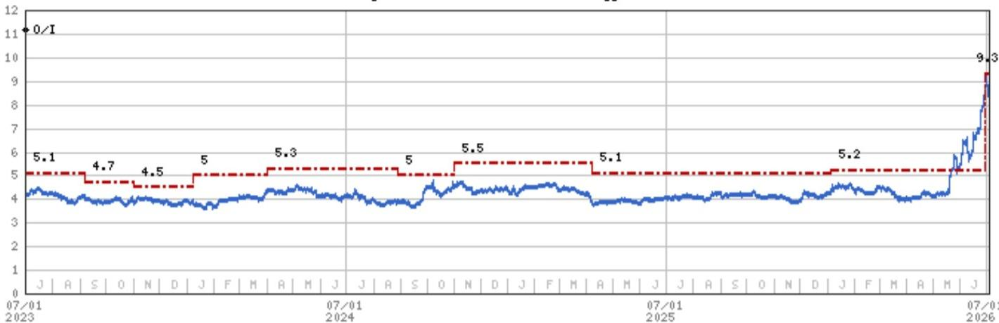

# BOE Technology 2Q26 初步净利润观察

## 业绩反应

对公司基本观点无影响

↑ 业绩优于市场预期
财务数据 vs 市场共识 ↑ 预期上调
未来12个月市场每股盈利方向

来源：公司数据，MS

## 2Q26 业绩详情：

- BOE 公布 1H26 初步净利润为人民币 50-55 亿元（同比增长 54% 至 69%），经常性净利润为人民币 30.8-33.1 亿元（同比增长 35% 至 45%），每股盈利为人民币 0.13-0.15 元（同比增长 50% 至 73%）。
- 据此推算，2Q26 净利润为人民币 32.93-37.93 亿元（环比增长 93% 至 102%/同比增长 122% 至 132%），中位数人民币 35.43 亿元，较 MS 预测的人民币 19.58 亿元（环比增长 15%/同比增长 20%）高出 81%，较市场共识的人民币 20.07 亿元（环比增长 18%/同比增长 23%）高出 77%。
- 同时，2Q26 经常性净利润为人民币 16.42-18.72 亿元（环比增长 14-30%/同比增长 76-101%），表明当季存在部分一次性收益。

## 我们的观点：

- 短期内，我们预计电视面板报价将从 3Q26 开始呈现下行趋势，因为 2H26 低于季节性的电视面板订单动能可能削弱面板厂商的议价能力。不过，我们认为主要厂商维持有纪律的供给产出将为报价提供一定支撑。
- 市场持续关注先进封装领域的玻璃机会，尤其是玻璃核心基板。BOE 希望完成整个玻璃核心基板的制造流程，包括带 TGV 的玻璃核心及增层结构。公司已与国内外 IC 设计公司进行验证接触。据我们了解，若进展顺利，公司可能在 2027 年投入约人民币 50 亿元建设月产能 1.5 万片基板（510*515mm）的产线，并计划于 2028 年实现量产，但最终收入贡献将取决于实际订单情况（详见我们的报告）。

Asia Summer School 2026

## BOE Technology (000725.SZ, 000725 CS)

## 大中华区科技硬件 | 中国

<table><tr><td>公司评级</td><td>增持</td></tr><tr><td>行业观点</td><td>中性</td></tr><tr><td>目标价</td><td>人民币 9.30 元</td></tr><tr><td>目标价上行/下行空间 (%)</td><td>22</td></tr><tr><td>收盘价 (2026年7月8日)</td><td>人民币 7.63 元</td></tr><tr><td>52周区间</td><td>人民币 9.50-3.79 元</td></tr><tr><td>摊薄后流通股数 (百万股)</td><td>37,414</td></tr><tr><td>当前市值 (百万元)</td><td>人民币 285,468</td></tr><tr><td>当前企业价值 (百万元)</td><td>人民币 415,815</td></tr><tr><td>日均交易额 (百万元)</td><td>人民币 4,722</td></tr></table>

<table><tr><td>财年截止日</td><td>12/25</td><td>12/26e</td><td>12/27e</td><td>12/28e</td></tr><tr><td>每股盈利 (人民币)**</td><td>0.16</td><td>0.20</td><td>0.27</td><td>0.35</td></tr><tr><td>每股盈利 (人民币)§</td><td>0.17</td><td>0.22</td><td>0.31</td><td>0.39</td></tr><tr><td>净收入 (人民币百万元)</td><td>204,590</td><td>209,550</td><td>219,376</td><td>232,150</td></tr><tr><td>EBITDA (人民币百万元)</td><td>62,354</td><td>50,045</td><td>53,090</td><td>57,382</td></tr><tr><td>ModelWare 净利润 (人民币百万元)</td><td>5,857</td><td>7,307</td><td>9,927</td><td>12,917</td></tr><tr><td>市盈率</td><td>26.9</td><td>39.1</td><td>28.8</td><td>22.1</td></tr><tr><td>市净率</td><td>1.2</td><td>2.0</td><td>1.9</td><td>1.8</td></tr><tr><td>RNOA (%)</td><td>7.8</td><td>7.9</td><td>7.9</td><td>7.8</td></tr><tr><td>ROE (%)</td><td>4.4</td><td>5.4</td><td>7.1</td><td>8.8</td></tr><tr><td>EV/EBITDA</td><td>4.6</td><td>8.8</td><td>9.0</td><td>8.8</td></tr><tr><td>股息率 (%)</td><td>1.2</td><td>0.7</td><td>0.9</td><td>1.2</td></tr><tr><td>自由现金流回报表现 (%)</td><td>2.7</td><td>(2.0)</td><td>(4.6)</td><td>(2.9)</td></tr></table>

除非另有说明，所有指标均基于 MS ModelWare 框架
\*\* = 基于共识方法论
§ = 共识数据由 Refinitiv Estimates 提供
e = MS 预测

MS 寻求与报告中涉及的公司开展业务。因此，读者应注意，该公司可能存在利益冲突，可能影响 MS 的客观性。读者应将 MS 视为其决策的单一因素之一。

## 分析师认证及其他重要披露

请参阅本报告末尾的披露部分。

+= 受雇于非美国关联公司的分析师未在 FINRA 注册，可能不是该成员的关联人士，且可能不受 FINRA 关于与主题公司沟通、公开露面以及持有研究分析师账户交易证券的限制。

## 估值方法与风险

## BOE Technology (000725.SZ)

基准情景采用市净率估值法，我们认为该方法能更好地反映 BOE 的内在价值，考虑到该行业相对周期性的特点，并与我们对大中华区其他面板制造商的估值方法一致。我们认为 2.5 倍 2026e 市净率的目标倍数合理，因为我们预计 2026-28 年 ROE 为 5-8%，而 BOE 在 2023-25 年的平均市净率为 1.1 倍，同期 ROE 为 2-4%。

## 上行风险

■ 行业平均售价优于预期

■ G10.5 代线良率提升

■ AMOLED 产能爬坡快于预期

■ 先进封装业务进展快于预期

## 下行风险

■ 行业平均售价低于预期

■ G10.5 代线良率下降

■ AMOLED 产能爬坡慢于预期

■ 先进封装业务进展慢于预期

## 披露部分

本报告中的信息和观点由 MS Asia Limited（对其内容负责）和/或 MS Asia (Singapore) Pte.（注册号 199206298Z）和/或 MS Asia (Singapore) Securities Pte Ltd（注册号 200008434H，受新加坡金融管理局监管，对其内容承担法律责任，如有任何相关问题应联系该机构）和/或 MS Taiwan Limited 和/或 MS & Co International plc, Seoul Branch 和/或 MS Australia Limited（ABN 67 003 734 576，持有澳大利亚金融服务牌照号 233742，对其内容负责）和/或 MS Wealth Management Australia Pty Ltd（ABN 19 009 145 555，持有澳大利亚金融服务牌照号 240813，对其内容负责）和/或 MS India Company Private Limited（公司识别号 CIN U22990MH1998PTC115305，受印度证券交易委员会 SEBI 监管，持有研究分析师牌照 SEBI 注册号 INH000001105；股票经纪商 SEBI 注册号 INZ000244438，商人银行家 SEBI 注册号 INM000011203，以及国家证券存管有限公司存管参与者 SEBI 注册号 IN-DP-NSDL-567-2021，注册办公地址为 Altimus, Level 39 & 40, Pandurang Budhkar Marg, Worli, Mumbai 400018, India；电话 +91-22-61181000；合规官详情：Tejarshi Hardas 先生，电话 +91-22-61181000 或电子邮件 tejarshi.hardas@morganstanley.com；申诉官详情：Tejarshi Hardas 先生，电话 +91-22-61181000 或电子邮件 msic-compliance@morganstanley.com）及其关联公司（统称"MS"）编制或传播。MS India Company Private Limited (MSICPL) 可能使用 AI 工具提供研究服务。本报告中的所有建议均由合格的研究分析师做出。

有关本报告涉及公司的重要披露、股价图表和股票评级历史，请访问 MS 披露网站 www.morganstanley.com/eqr/disclosures/webapp/generalresearch，或联系您的投资代表或 MS，地址：1585 Broadway, (Attention: Research Management), New York, NY, 10036 USA。

有关本研究报告中任何建议、评级或目标价相关的估值方法和风险，请联系客户支持团队：美国/加拿大 +1 800 303-2495；香港 +852 2848-5999；拉丁美洲 +1 718 754-5444（美国）；伦敦 +44 (0)20-7425-8169；新加坡 +65 6834-6860；悉尼 +61 (0)2-9770-1505；东京 +81 (0)3-6836-9000。或者，您也可以联系您的投资代表或 MS，地址：1585 Broadway, (Attention: Research Management), New York, NY 10036 USA。

## 分析师认证

以下分析师特此证明，他们对本报告中讨论的公司及其证券的观点准确表达，且他们未曾也不会因表达具体建议或观点而直接或间接获得补偿：Andy Meng, CFA; Derrick Yang。

## 全球研究冲突管理政策

MS 已根据我们的冲突管理政策发布，该政策可在 www.morganstanley.com/institutional/research/conflictpolicies 获取。葡萄牙语版本可在 www.morganstanley.com.br 找到。

## 关于主题公司的重要监管披露

截至 2026 年 6 月 30 日，MS 实益持有本报告中以下公司普通股权益证券 1% 或以上：AAC Technologies Holdings, Accton Technology Corporation, AirTAC International, AU Optronics, Auras Technology Co Ltd, Bizlink, BOE Technology, Catcher Technology, Chenbro, Chroma Ate Inc., Compal Electronics, Delta Electronics Inc., E Ink Holdings Inc., Eoptolink Technology Inc Ltd, Fositek Corp, Genius Electronic Optical Co. Ltd., Giga-Byte Technology Co. Ltd., Gold Circuit Electronics Ltd., Hiwin Technologies Corp., Innolux, LandMark Optoelectronics Corporation, Largan Precision, Lingyi Itech Guangdong Co, Lite-On Technology, Lotes Co. Ltd., Nan Ya PCB, Radiant Opto-Electronics Corporation, Sunny Optical, Suzhou TFC Optical Communication Co Ltd., TCL Corp., Unimicron, Visual Photonics Epitaxy Co Ltd, Wistron Corporation, Wiwynn Corp, Xiaomi Corp, Yageo Corp., Zhejiang Crystal-Optech Co Ltd, Zhen Ding, Zhongji Innolight Co Ltd, ZTE Corporation。

在过去 12 个月内，MS 管理或共同管理了 Unimicron, Wistron Corporation, Wiwynn Corp, Zhen Ding 的公开（或 144A）证券发行。

在过去 12 个月内，MS 已从 Lenovo, Wistron Corporation, Wiwynn Corp, Xiaomi Corp, Yageo Corp., Zhen Ding 获得投资银行服务报酬。在未来 3 个月内，MS 预计将或打算寻求从以下公司获得投资银行服务报酬：AAC Technologies Holdings, Accton Technology Corporation, Acer Inc., Advantech, AirTAC International, Asia Vital Components Co. Ltd., Asustek Computer Inc., AU Optronics, Bizlink, Catcher Technology, Chenbro, Compal Electronics, Delta Electronics Inc., E Ink Holdings Inc., Ennostar Inc, Eoptolink Technology Inc Ltd, FIT Hon Teng Ltd, Giga-Byte Technology Co. Ltd., GoerTek Inc, Gold Circuit Electronics Ltd., Hon Hai Precision, Innolux, Lenovo, Lens Technology, Lingyi Itech Guangdong Co, Lite-On Technology, Luxshare Precision Industry Co., Ltd., Pegatron Corporation, Q Technology (Group) Company Ltd, Quanta Computer Inc., Shanghai Conant Optical Co Ltd, Shenzhen Transsion Holdings Co Ltd, Suzhou TFC Optical Communication Co Ltd., TCL Corp., Unimicron, Wistron Corporation, Wiwynn Corp, Xiaomi Corp, Yageo Corp., Yangtze Optical Fibre and Cable JSC Ltd, Zhen Ding, Zhongji Innolight Co Ltd。

在过去 12 个月内，MS 已从以下公司获得投资银行服务以外的产品和服务报酬：AAC Technologies Holdings, Accton Technology Corporation, Acer Inc., Asustek Computer Inc., AU Optronics, BYD Electronics, Compal Electronics, E Ink Holdings Inc., Eoptolink Technology Inc Ltd, Giga-Byte Technology Co. Ltd., GoerTek Inc, Hon Hai Precision, Innolux, Lenovo, Lingyi Itech Guangdong Co, Quanta Computer Inc., Xiaomi Corp, Yageo Corp.。

在过去 12 个月内，MS 已向或正在向以下公司提供投资银行服务，或与其存在投资银行客户关系：AAC Technologies Holdings, Accton Technology Corporation, Acer Inc., Advantech, AirTAC International, Asia Vital Components Co. Ltd., Asustek Computer Inc., AU Optronics, Bizlink, Catcher Technology, Chenbro, Compal Electronics, Delta Electronics Inc., E Ink Holdings Inc., Ennostar Inc, Eoptolink Technology Inc Ltd, FIT Hon Teng Ltd, Giga-Byte Technology Co. Ltd., GoerTek Inc, Gold Circuit Electronics Ltd., Hon Hai Precision, Innolux, Lenovo, Lens Technology, Lingyi Itech Guangdong Co, Lite-On Technology, Luxshare Precision Industry Co., Ltd., Pegatron Corporation, Q Technology (Group) Company Ltd, Quanta Computer Inc., Shanghai Conant Optical Co Ltd, Shenzhen Transsion Holdings Co Ltd, Suzhou TFC Optical Communication Co Ltd., TCL Corp., Unimicron, Wistron Corporation, Wiwynn Corp, Xiaomi Corp, Yageo Corp., Yangtze Optical Fibre and Cable JSC Ltd, Zhen Ding, Zhongji Innolight Co Ltd。

在过去 12 个月内，MS 已向或正在向以下公司提供非投资银行、证券相关服务，和/或过去已签订协议提供服务或与其存在客户关系：AAC Technologies Holdings, Accton Technology Corporation, Acer Inc., Asustek Computer Inc., AU Optronics, BYD Electronics, Compal Electronics, E Ink Holdings Inc., Eoptolink Technology Inc Ltd, Giga-Byte Technology Co. Ltd., GoerTek Inc, Hon Hai Precision, Innolux, Lenovo, Lingyi Itech Guangdong Co, Quanta Computer Inc., Xiaomi Corp, Yageo Corp., Zhen Ding。

主要负责编制 MS 的股票研究分析师或策略师的薪酬基于多种因素，包括研究质量、读者客户反馈、选股能力、竞争因素、公司收入和整体投资银行收入。股票研究分析师或策略师的薪酬不与 MS 进行的投资银行或资本市场交易或特定交易台的盈利能力或收入挂钩。

MS 及其关联公司与 MS 涵盖的公司/工具开展业务，包括做市、提供流动性、基金管理、商业银行、信贷扩展、投资服务和投资银行。MS 以主承销商身份向客户买卖 MS 涵盖的公司的证券/工具。MS 可能持有本报告中讨论的公司债务或工具的头寸。MS 作为主承销商交易或可能交易作为债务研究报告主题的债务证券（或相关衍生品）。上述某些披露也是为了遵守非美国司法管辖区的适用法规。

## 股票评级

MS 使用相对评级体系，包括增持、中性、未评级或减持（见下文定义）。MS 不对我们覆盖的股票分配买入、持有或报告评级。增持、中性、未评级和减持不等同于买入、持有和卖出。读者应仔细阅读 MS 中使用的所有评级的定义。此外，由于 MS 包含分析师观点的更完整信息，读者应仔细阅读完整的 MS，而非仅从评级推断内容。在任何情况下，评级（或研究）不应被用作或依赖为研究交流。读者买卖股票的决定应取决于个人情况（如读者现有持仓）和其他考虑因素。

## 全球股票评级分布

## （截至 2026 年 6 月 30 日）

下文描述的股票评级适用于 MS 的基础股票研究，不适用于公司生产的债务研究。

仅为披露目的（根据 FINRA 要求），我们在增持、中性、未评级和减持评级旁边包含买入、持有和卖出的类别标题。MS 不对我们覆盖的股票分配买入、持有或报告评级。增持、中性、未评级和减持不等同于买入、持有和卖出，而是代表推荐的相对权重（见下文定义）。为满足监管要求，我们将增持（我们最积极的股票评级）对应买入建议；将中性和未评级对应持有，减持对应卖出建议。

<table><tr><td></td><td colspan="2">覆盖范围</td><td colspan="3">投资银行客户 (IBC)</td><td colspan="2">其他重要投资服务客户 (MISC)</td></tr><tr><td>股票评级类别</td><td>数量</td><td>占比</td><td>数量</td><td>占 IBC 比例</td><td>占评级类别比例</td><td>数量</td><td>占其他 MISC 比例</td></tr><tr><td>增持/买入</td><td>1544</td><td>42%</td><td>453</td><td>49%</td><td>29%</td><td>757</td><td>44%</td></tr><tr><td>中性/持有</td><td>1577</td><td>43%</td><td>390</td><td>42%</td><td>25%</td><td>769</td><td>44%</td></tr><tr><td>未评级/持有</td><td>3</td><td>0%</td><td>1</td><td>0%</td><td>33%</td><td>1</td><td>0%</td></tr><tr><td>减持/卖出</td><td>544</td><td>15%</td><td>89</td><td>10%</td><td>16%</td><td>204</td><td>12%</td></tr><tr><td>总计</td><td>3,668</td><td></td><td>933</td><td></td><td></td><td>1731</td><td></td></tr></table>

数据包括当前已分配评级的普通股和 ADR。投资银行客户是过去 12 个月内 MS 从中获得投资银行报酬的公司。由于四舍五入，"占比"列中的百分比可能不完全等于 100%。

## 分析师股票评级

增持 (O)：预计该股票在风险调整基础上，未来 12-18 个月的总回报将超过分析师行业（或行业团队）覆盖范围的平均总回报。

中性 (E)：预计该股票在风险调整基础上，未来 12-18 个月的总回报将与分析师行业（或行业团队）覆盖范围的平均总回报一致。

未评级 (NR)：目前分析师对该股票相对于分析师行业（或行业团队）覆盖范围平均总回报的风险调整后总回报没有足够信心。

减持 (U)：预计该股票在风险调整基础上，未来 12-18 个月的总回报将低于分析师行业（或行业团队）覆盖范围的平均总回报。

除非另有说明，MS 中包含的目标价时间范围为 12 至 18 个月。

## 分析师行业观点

有吸引力 (A)：分析师预计其行业覆盖范围在未来 12-18 个月的表现相对于相关广泛市场基准具有吸引力，如下所示。

中性 (I)：分析师预计其行业覆盖范围在未来 12-18 个月的表现将与相关广泛市场基准一致，如下所示。

谨慎 (C)：分析师认为其行业覆盖范围在未来 12-18 个月的表现相对于相关广泛市场基准需谨慎，如下所示。

各区域基准如下：北美 - S&P 500；拉丁美洲 - 相关 MSCI 国家指数或 MSCI 拉丁美洲指数；欧洲 - MSCI 欧洲；日本 - TOPIX；亚洲 - 相关 MSCI 国家指数或 MSCI 次区域指数或 MSCI AC 亚太（除日本）指数。

## 股价、目标价和评级历史（见评级定义）

BOE Technology (000725.SZ) - 截至 2026年7月4日 GMT 以人民币计价 行业：大中华区科技硬件

股票评级历史：2021年7月1日 : O/I

目标价历史：2021年6月18日 : 7.7; 2021年8月19日 : 7.2; 2021年8月31日 : 7.7; 2021年10月20日 : 6; 2021年11月5日 : 6.3; 2022年3月17日 : 5.5; 2022年4月29日 : 5.3; 2022年8月31日 : 4.8; 2022年10月4日 : 4.5; 2023年4月5日 : 5.1; 2023年9月6日 : 4.7; 2023年11月2日 : 4.5; 2024年1月8日 : 5; 2024年4月2日 : 5.3; 2024年8月29日 : 5; 2024年11月1日 : 5.5; 2025年4月7日 : 5.1; 2026年1月5日 : 5.2; 2026年6月30日 : 9.3

来源：MS 日期格式：MM/DD/YY 目标价 未分配目标价 (NA)

股价（当前分析师未覆盖）—— 股价（当前分析师覆盖）

股票和行业评级（缩写如下）显示为 ♦ 股票评级/行业观点

股票评级：增持 (O) 中性 (E) 减持 (U) 未评级 (NR) 无评级 (NA)

行业观点：有吸引力 (A) 中性 (I) 谨慎 (C) 无评级 (NR)

自 2014 年 1 月 13 日起，MS 亚太区覆盖的股票将相对于分析师行业（或行业团队）覆盖范围进行评级。

自 2014 年 1 月 13 日起，MS 亚太区的行业观点基准如下：相关 MSCI 国家指数或 MSCI 次区域指数或 MSCI AC 亚太（除日本）指数。

## 针对 MS Smith Barney LLC 客户的重要披露

关于任何可能合理预期影响 MS Smith Barney LLC 选择第三方研究提供商或第三方研究报告主题公司的重要利益冲突的重要披露，可在 MS Wealth Management 披露网站 www.morganstanley.com/online/researchdisclosures 获取。有关 MS 的具体披露，请参阅 https://www.morganstanley.com/eqr/disclosures/webapp/generalresearch。

每份 MS 报告均由代表 MS Smith Barney LLC 的人员审查和批准。此审查和批准由代表 MS 审查研究报告的同一人员进行。这可能产生利益冲突。

## 其他重要披露

截至 2026 年 7 月 6 日，MS 实益持有本报告中以下公司已发行总股本超过 0.5% 的净多头头寸：Lingyi Itech Guangdong Co。

MS 政策是根据研究分析师和研究管理层认为适当的时机，基于发行人、行业或市场可能对研究观点或意见产生重大影响的发展来更新研究报告。此外，某些研究出版物旨在定期更新（每周/每月/每季度/每年），并将按该频率定期更新，除非研究分析师和研究管理层根据当前情况确定不同的出版计划更为合适。

MS 不担任市政顾问，本报告中的意见或观点不构成也不应被视为《多德-弗兰克华尔街改革和消费者保护法》第 975 条含义内的建议。

MS 生产一种称为"战术观点"的股票研究产品。关于特定股票的"战术观点"中包含的观点可能与同一股票的研究中的建议或观点相反。这可能是由于不同的时间范围、方法论、市场事件或其他因素造成的。如需获取特定股票的所有研究，请联系您的销售代表或访问 Matrix：http://www.morganstanley.com/matrix。

MS 通过我们专有的研究门户 Matrix 提供给我们的客户，并由 MS 以电子方式分发给客户。某些（但非全部）MS 产品也通过第三方供应商提供给客户，或通过替代电子方式作为便利重新分发给客户。如需访问所有可用的 MS，请联系您的销售代表或访问 Matrix：http://www.morganstanley.com/matrix。

任何访问和/或使用 MS 均受 MS 使用条款 (http://www.morganstanley.com/terms.html) 约束。通过访问和/或使用 MS，您表示已阅读并同意受我们的使用条款约束。此外，您同意 MS 根据我们的隐私政策和全球 Cookie 政策 (http://www.morganstanley.com/privacy_pledge.html) 处理您的个人数据并使用 Cookie，包括用于设置您的偏好和收集读者数据，以便我们为您提供更好、更个性化的服务和产品。要了解有关 MS 如何处理个人数据、我们如何使用 Cookie 以及如何拒绝 Cookie 的更多信息，请参阅我们的隐私政策和全球 Cookie 政策 (http://www.morganstanley.com/privacy_pledge.html)。请使用提供的链接查看 MS India Company Private Limited 的条款和条件及最重要条款和条件 (https://www.morganstanley.com/assets/pdfs/about-us-global-offices/india/Terms_and_conditions.pdf)，以及以下链接查看审计报告 (https://ny.matrix.ms.com/eqr/research/webapp/researchdocs/MSICPL_Morgan_Stanley_Research_Audit_Report.pdf)。

如果您不同意我们的使用条款和/或不愿同意 MS 处理您的个人数据或使用 Cookie，请勿访问我们的研究。MS 不提供个性化的研究交流。MS 的编制未考虑接收者的个人情况和目标。MS 建议读者独立评估特定投资和策略，并鼓励读者寻求财务顾问的建议。投资或策略的适当性取决于读者的个人情况和目标。MS 中讨论的证券、工具或策略可能不适合所有读者，某些读者可能没有资格购买或参与部分或全部内容。MS 不构成购买或出售任何证券/工具或参与任何特定交易策略的要约或要约邀请。您的研究价值和收入可能因利率、汇率、违约率、提前还款率、证券/工具价格、市场指数、公司的运营或财务状况或其他因素的变化而变动。期权或其他证券/工具交易的权利可能存在时间限制。过往表现不一定是未来表现的指引。未来表现的估计基于可能无法实现的假设。如果提供且除非另有说明，封面上的收盘价是主题公司证券/工具的主要交易所价格。

主要负责编制 MS 的固定收益研究分析师、策略师或经济学家的薪酬基于多种因素，包括研究质量、准确性和价值、公司盈利能力或收入（包括固定收益交易和资本市场盈利能力或收入）、客户反馈和竞争因素。固定收益研究分析师、策略师或经济学家的薪酬不与 MS 进行的投资银行或资本市场交易或特定交易台的盈利能力或收入挂钩。

MS 中"关于主题公司的重要监管披露"部分列出了 MS 持有公司普通股权益证券 1% 或以上的所有提及公司。对于 MS 中提及的所有其他公司，MS 可能持有少于 1% 的证券/工具或衍生品投资，并可能以与本报告讨论不同的方式进行交易。未参与 MS 编制的 MS 员工可能持有提及公司的证券/工具或衍生品投资，并可能以与本报告讨论不同的方式进行交易。衍生品可能由 MS 或关联人士发行。

除有关 MS 的信息外，MS 基于公开信息。MS 尽力使用可靠、全面的信息，但我们不保证其准确或完整。我们没有义务在 MS 中的意见或信息发生变化时通知您，除非我们打算停止对主题公司的股票研究覆盖。MS 中提出的事实和观点未经 MS 其他业务领域（包括投资银行人员）的专业人士审查，可能不反映他们已知的信息。

MS 人员可能参与公司活动，如实地考察，且通常被禁止接受公司支付相关费用，除非经研究管理授权成员预先批准。

MS 可能做出与本报告中的建议或观点不一致的投资决策。

致台湾读者或交易台湾证券/工具的读者：关于在台湾交易的证券/工具的信息由 MS Taiwan Limited ("MSTL") 分发。此类信息仅供参考。读者应独立评估投资风险，并对其投资决策全权负责。未经 MS 明确书面同意，MS 不得向公共媒体分发、引用或由公共媒体使用。访问和/或接收 MS 的《台湾证券交易所推荐规定》第 7-1 条范围内的非客户读者不得将 MS 提供给任何第三方（包括但不限于关联方、关联公司和任何其他第三方）或从事任何可能产生或看似产生利益冲突的与 MS 相关的活动。关于不在台湾交易的证券/工具的信息仅供参考，不构成推荐或要约邀请以交易此类证券/工具。MSTL 不得为客户执行这些证券/工具的交易。

MS 中的某些信息由 MS Asia Limited 上海代表处的员工为 MS Asia Limited 使用而获取。MS 未根据中国法律注册，本报告相关研究在中国境外进行。MS 不构成在中国出售任何证券的要约或要约邀请。中国读者应具备投资此类证券的相关资格，并应自行负责从相关政府机构获得所有相关批准、许可、验证和/或注册。本报告或其任何部分均不构成或被视为提供中国法律定义的证券投资咨询或顾问服务。此类信息仅供参考。

MS 在巴西由 MS C.T.V.M. S.A. 分发，地址：Av. Brigadeiro Faria Lima, 3600, 6th floor, São Paulo - SP, Brazil；受 Comissão de Valores Mobiliários 监管；在墨西哥由 MS México, Casa de Bolsa, S.A. de C.V 分发，受 Comision Nacional Bancaria y de Valores 监管，地址：Paseo de los Tamarindos 90, Torre 1, Col. Bosques de las Lomas Floor 29, 05120 Mexico City；在日本由 MS MUFG Securities Co., Ltd. 分发，对于商品相关研究报告，由 MS Capital Group Japan Co., Ltd 分发；在香港由 MS Asia Limited（对其内容负责）和 MS Bank Asia Limited 分发；在新加坡由 MS Asia (Singapore) Pte.（注册号 199206298Z）和/或 MS Asia (Singapore) Securities Pte Ltd（注册号 200008434H，受新加坡金融管理局监管，对其内容承担法律责任，如有任何相关问题应联系该机构）和 MS Bank Asia Limited, Singapore Branch（注册号 T14FC0118）分发；在澳大利亚向《澳大利亚公司法》定义的"批发客户"由 MS Australia Limited ABN 67 003 734 576（持有澳大利亚金融服务牌照号 233742，对其内容负责）分发；在澳大利亚向"批发客户"和"零售客户"由 MS Wealth Management Australia Pty Ltd（ABN 19 009 145 555，持有澳大利亚金融服务牌照号 240813，对其内容负责）分发；在韩国由 MS & Co International plc, Seoul Branch 分发；在印度由 MS India Company Private Limited（公司识别号 CIN U22990MH1998PTC115305，受印度证券交易委员会 SEBI 监管，持有研究分析师牌照 SEBI 注册号 INH000001105；股票经纪商 SEBI 注册号 INZ000244438，商人银行家 SEBI 注册号 INM000011203，以及国家证券存管有限公司存管参与者 SEBI 注册号 IN-DP-NSDL-567-2021，注册办公地址为 Altimus, Level 39 & 40, Pandurang Budhkar Marg, Worli, Mumbai 400018, India；电话 +91-22-61181000；合规官详情：Tejarshi Hardas 先生，电话 +91-22-61181000 或电子邮件 tejarshi.hardas@morganstanley.com；申诉官详情：Tejarshi Hardas 先生，电话 +91-22-61181000 或电子邮件 msic-compliance@morganstanley.com）分发。MS India Company Private Limited (MSICPL) 可能使用 AI 工具提供研究服务。本报告中的所有建议均由合格的研究分析师做出；在加拿大由 MS Canada Limited 分发；在德国和欧洲经济区（如需要）由 MS Europe S.E. 分发，受德国联邦金融监管局 (BaFin) 授权和监管，参考号 149169；在美国由 MS & Co. LLC 分发，对其内容负责。MS & Co. International plc 由审慎监管局授权，受金融行为监管局和审慎监管局监管，在英国分发其自身准备的研究以及其任何关联公司准备的研究，仅面向 (i) 属于《2000 年金融服务和市场法（金融促进）令 2005》（修订版，"该令"）第 19(5) 条范围内的投资专业人士；(ii) 属于该令第 49(2)(a) 至 (d) 条范围内的高净值实体；或 (iii) 可以合法地以其他方式传达或促使其参与投资活动（根据修订后的《2000 年金融服务和市场法》第 21 条的含义）的人员。RMB MS Proprietary Limited 是 JSE Limited 和 A2X (Pty) Ltd 的成员。RMB MS Proprietary Limited 是由 MS International Holdings Inc. 和 RMB Investment Advisory (Proprietary) Limited（由 FirstRand Limited 全资拥有）平等拥有的合资企业。MS 中的信息由 MS Saudi Arabia 分发，受沙特阿拉伯王国资本市场管理局监管，仅面向专业读者。

MS Hong Kong Securities Limited 是以下在香港联合交易所有限公司上市的证券的流动性提供者/做市商：AAC Technologies Holdings, BYD Electronics, FIT Hon Teng Ltd, Hon Hai Precision, Lenovo, Lens Technology, Luxshare Precision Industry Co., Ltd., Sunny Optical, Xiaomi Corp, Yangtze Optical Fibre and Cable JSC Ltd, ZTE Corporation。最新列表可在香港交易所网站 http://www.hkex.com.hk 找到。

MS 中的信息由 MS & Co. International plc (DIFC Branch)（受迪拜金融服务管理局 DFSA 监管）或 MS & Co. International plc (ADGM Branch)（受阿布扎比金融服务监管局 FSRA 监管）传达，仅面向 DFSA 或 FSRA 定义的专业客户。本研究所涉及的金融产品或金融服务将仅提供给我们确信符合专业客户监管标准的客户。MS 不同研究评级或建议的分布（按覆盖的每个行业投资的百分比）可向您的销售代表索取。

MS 中的信息由 MS & Co. International plc (QFC Branch)（受卡塔尔金融中心监管局 QFCRA 监管）传达，仅面向商业客户和市场对手方，不面向 QFCRA 定义的零售客户。

根据土耳其资本市场委员会的要求，此处提供的投资信息、评论和建议不属于投资咨询服务的范围。投资咨询服务仅由授权公司根据个人的风险和收入偏好提供。此处提供的评论和建议具有一般性质。这些意见可能不适合您的财务状况、风险和回报偏好。因此，仅依赖此处提供的信息做出投资决策可能不会产生符合您预期的结果。

MS 中包含的商标和服务标志是其各自所有者的财产。第三方数据提供商不对其提供的数据的准确性、完整性或及时性做出任何保证或陈述，并且不对与此类数据相关的任何损害承担责任。全球行业分类标准 (GICS) 由 MSCI 和 S&P 开发并为其专有财产。

MS 或其任何部分未经 MS 书面同意
