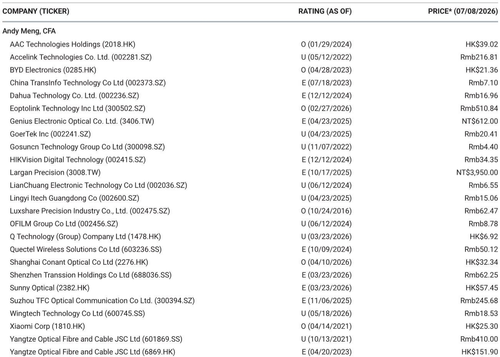
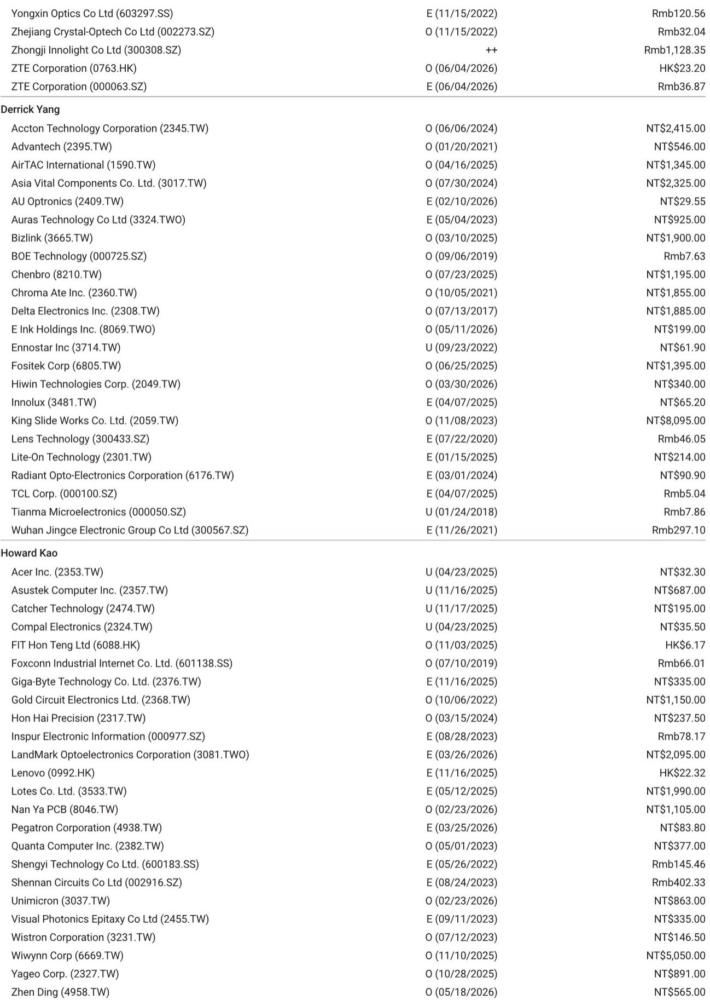

# BOE的业绩超预期是表象：真正的故事是从周期性面板向结构性玻璃基板的战略转型

京东方科技集团发布的2026年第二季度初步业绩，大幅超出分析师预测和市场一致预期。净利润中值为35.43亿元人民币，超出某机构预测81%，超出市场一致预期77%。表面上看，这似乎是全球最大LCD面板制造商迎来了一轮典型的周期性上升。但这种解读并不完整，甚至可能具有误导性。

业绩超预期是事实，但这并非故事的全部。真正的故事在于，京东方正在悄然为其传统显示业务搭建一座桥梁，通向先进半导体封装领域的一个结构性增长机会——具体而言，是玻璃核心基板。时机选择至关重要。该公司正试图在核心电视面板价格周期于2026年第三季度即将转向下行之际，完成这一转型。只关注季度业绩惊喜的观察者，将错过更具战略意义的问题：京东方能否成功从一家周期性显示制造商，转型为人工智能赋能基板供应链中的参与者？

本文将在具体背景下分析此次业绩超预期，解释面板周期为何即将转变，剖析玻璃基板机会及其战略逻辑，并指出决定这一转型能否成功的关键未知因素。目标并非总结一份研究报告，而是构建一个用于思考京东方发展轨迹的分析框架。

## 第二季度业绩超预期反映一次性收益，而非面板业务的结构性改善

京东方2026年上半年初步业绩的总体数字令人印象深刻。上半年净利润达到50亿至55亿元人民币，同比增长54%至69%。由此推算的第二季度净利润为32.93亿至37.93亿元人民币，环比增长93%至102%，同比增长122%至132%。

这些数字需要更仔细地审视。第二季度经常性净利润为16.42亿至18.72亿元人民币，这意味着环比增长仅为14%至30%。该季度总净利润与经常性净利润之间的差额约为17亿至19亿元人民币。这一差额代表一次性利润，可能包括资产处置收益、政府补贴或其他非经营性项目。经常性业务虽然仍显示出稳健增长，但其改善幅度远不如总体数字所暗示的那样显著。

战略含义很明确。核心显示业务正在改善，但业绩超预期的幅度夸大了潜在的增长势头。如果以此季度的表现来推断未来，当一次性项目不再重复出现时，很可能会感到失望。真正的问题不在于京东方能否再交出一份类似本季度的成绩单，而在于当面板周期转向时，经常性业务能否维持其增长轨迹。

## 电视面板价格将在2026年下半年下行，京东方的定价能力正在减弱

京东方核心业务的近期前景正在发生变化。电视面板价格预计将从2026年第三季度开始呈现下行趋势。这一预测基于下半年电视面板订单动能低于季节性水平，这将削弱面板制造商相对于客户的议价能力。

其机制较为直接。面板定价由供需平衡驱动，而这一平衡受到电视品牌采购模式的影响。当品牌积极下单时，面板制造商可以提高价格。当订单减弱时，议价能力发生转移。2026年下半年正成为一个需求低于季节性的时期，这意味着典型的假日季备货并未以预期强度出现。

然而，价格存在一个底部。主要面板制造商已从以往的下行周期中吸取教训，并保持有纪律的供应产出。他们不太可能采取那种导致2022年和2023年价格明显回落的激进产能利用率。这种纪律提供了下行支撑，但并不能阻止价格逐步下滑。

对京东方而言，其含义是直接的。该公司的显示业务仍占收入和利润的绝大部分，正面临一段利润率压缩的时期。第二季度的业绩超预期是由有利的定价环境推动的，而这一环境正在结束。第三和第四季度将考验京东方的成本结构和产品组合能否抵消面板价格下降带来的不利因素。

## 玻璃核心基板代表一个结构性增长机会，可能重塑京东方业务模式

在显示周期转向下行的同时，京东方正在推进一项可能从根本上改变其增长格局的战略举措。该公司正在投资用于先进半导体封装的玻璃核心基板，具体目标是包含带玻璃通孔和增层的玻璃核心基板市场。

这一举措背后的逻辑很有说服力。随着半导体封装变得更加复杂，需要更细的线宽和更好的热管理，传统有机基板正接近其性能极限。玻璃在尺寸稳定性、较低的热膨胀系数以及高频下的电性能方面具有优势。这些特性使玻璃核心基板对高性能计算应用（包括人工智能加速器和先进服务器芯片）具有吸引力。

京东方的雄心并不局限于生产玻璃核心本身。该公司希望完成整个玻璃核心基板的制造过程，包括带玻璃通孔的玻璃核心以及增层。这种垂直整合的方法将使京东方区别于仅专注于价值链某一环节的竞争对手。

该公司已开始与国内外集成电路设计商进行验证和认证接触。这是关键的一步。基板供应商必须先获得芯片设计商和代工厂的认证，才能进入供应链。验证过程漫长且严格，但这也为竞争对手设置了高进入壁垒。

投资规模相当可观。京东方可能花费约50亿元人民币，建设每月15000片基板（尺寸为510毫米×515毫米）的产能，目标时间线为2027年安装产能，2028年实现量产。对于一家同时管理显示业务资本支出的公司来说，这是一项重大的资本承诺。

## 玻璃基板机会真实存在，但通往收入的道路漫长且充满不确定性

京东方玻璃基板举措的战略逻辑是清晰的，但执行风险相当大。几个关键的不确定性将决定这项投资能否产生有吸引力的回报。

首先，量产时间线很长。假设一切顺利，京东方目标在2027年安装产能，2028年实现量产。在半导体制造中，事情很少能一帆风顺。工艺开发、良率提升和客户认证所需的时间往往比最初计划要长。应预期会出现延迟。

其次，收入贡献将完全取决于实际订单。报告明确指出“最终收入贡献将取决于实际订单”。这不是一个无关紧要的附带条件。京东方正在进入一个市场，现有基板供应商与芯片设计商和代工厂有着长期合作关系。要打入这些关系，不仅需要技术能力，还需要信任、可靠性和交付记录。

第三，竞争格局正在迅速演变。多家公司正在投资玻璃核心基板技术，包括成熟的基板制造商和新进入者。在京东方达到量产之前，市场可能会变得拥挤，从而可能压缩利润率。

第四，技术本身仍在成熟过程中。玻璃核心基板具有理论上的优势，但以高良率进行规模化生产已被证明具有挑战性。玻璃通孔成型、铜填充以及玻璃上的增层层压，都需要仍在开发中的工艺能力。

最重要的未决问题是，京东方的显示制造专长能否转化为玻璃基板领域的竞争优势。该公司在玻璃加工、薄膜沉积和大面积制造方面拥有深厚经验。这些能力可能为基板生产提供基础。但半导体封装所需的精度和可靠性标准，甚至超过了显示制造的严苛要求。

## 评估京东方的决策框架：决定结果的三个里程碑

对于试图评估京东方发展轨迹的观察者和策略师而言，关键在于将周期性显示业务与结构性基板机会区分开来。这是两个不同的研究案例，具有不同的风险特征和不同的时间跨度。

第一个值得关注的里程碑是2026年下半年的面板价格走势。如果面板价格下降幅度超出预期，京东方的显示业务收益将受到压缩，公司从经营现金流中为其基板投资提供资金的能力将受到限制。反之，如果价格保持得比预期更好，京东方将拥有更大的财务灵活性。

第二个里程碑是玻璃基板业务的客户认证进展。报告指出，京东方一直在与集成电路设计商进行验证接触。这些接触的数量和质量将是衡量成功的最重要先行指标。如果京东方在未来12至18个月内获得主要芯片设计商或代工厂的认证，成功的可能性将显著增加。

第三个里程碑是资本配置决策。京东方计划投资50亿元人民币，对于一家市值约2850亿元人民币的公司来说，这一数额可观但并非不可承受。然而，如果公司需要增加投资以达到具有竞争力的规模，或者显示周期疲弱到现金流不足的程度，基板举措可能会给资产负债表带来压力。

因此，观察者的决策框架是一个条件性的框架。如果京东方在客户认证方面取得进展，同时保持稳定的显示业务收益，那么基板机会就代表着一个有价值的未来增长选择权。如果显示周期恶化且客户认证停滞，基板投资将成为回报的拖累。

## 完整报告包含支持本分析的原始数据和图表

此处呈现的分析基于一份详细的研究报告，该报告包含京东方2026年上半年初步业绩、收益比较、估值方法和风险评估。原始报告包含支持本分析的数据和图表。

希望直接查看基础数字和图表的读者，完整报告提供了完整的数据集。它包括季度收益细分、报告净利润与经常性净利润的比较、面板价格展望以及京东方玻璃基板投资计划的细节。理解这些细节对于形成关于公司发展轨迹的独立判断至关重要。

加入社区阅读完整报告并查看原始图表。

---

*仅供参考。部分内容可能基于源材料通过人工智能辅助生成、翻译、总结或编辑，可能存在遗漏或错误。请独立核实。本文不构成专业建议。*

仅供参考。部分内容可能基于源材料通过人工智能辅助生成、翻译、总结或编辑，可能存在遗漏或错误。请独立核实。本文不构成专业建议。

