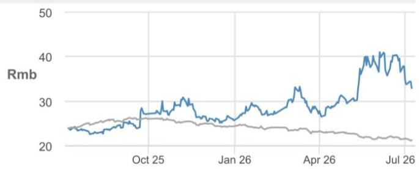
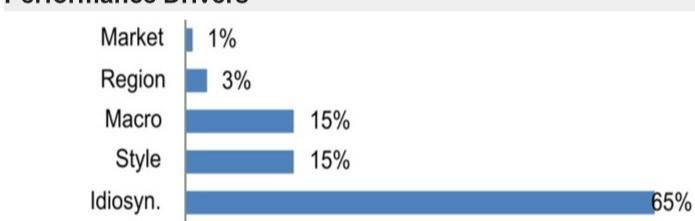

## Qingdao TGOOD Electric

## Key takeaways from the management call; raising target price on strong outlook for DC and overseas power orders

Qingdao TGOOD Electric has shown relative strength in the market year-to-date, as observers increasingly recognize its rising overseas exposure in prefabricated substations and the growth potential of its data-center offering. The recent management call reinforces a positive view: China data-center orders year-to-date have already exceeded the FY25 level and management has guided to a doubling of China DC orders this year; Middle East prefabricated substation orders could more than double this year with management guiding to approximately 50% market share, alongside rising orders from Europe and Australia; and the collaboration with Eaton (ETN US, NR) could help TGOOD expand further overseas, while its newly developed high-voltage AC-to-low-voltage DC solutions have attracted inquiries from data-center customers across regions, including the US.

- Year-to-date data center orders already above FY25: The company has secured RMB 400–500mn of new data center orders in China year-to-date, exceeding FY25's level. It supplied prefabricated substations to two 100MW Tencent data centers. Management guides to over RMB 800mn of data center orders this year, with approximately 50% market share in HV prefabricated substations for data centers, supported by demand as large sites (≥50MW) increasingly require 110kV (or above) substations. TGOOD also announced a strategic cooperation with Eaton (ETN US) to jointly develop prefabricated data-center power solutions; management sees synergies given TGOOD's strength in 110kV+ products and Eaton's international footprint, which could help TGOOD expand overseas.

- Middle East orders may double this year: Management expects Saudi Energy to tender new prefabricated substation orders in 3Q, with a total tender value of RMB 4–6bn. Assuming approximately 50% share, estimates suggest TGOOD's contract value would be over 2x FY25 (vs. approximately RMB 1bn). Management expects more meaningful revenue recognition in FY27. Beyond the Middle East, the company targets to double new orders from other markets year-over-year, citing progress in Europe, Australia, the Middle East, and Central Asia.

- Bundled solutions for data centers: system-level differentiation: TGOOD aims to offer a one-stop solution converting high-voltage AC to low-voltage DC (110/220kV to 800V), consolidating multiple conversion stages into a modular package. The Eaton collaboration combines Eaton's SST and MVDC capabilities with TGOOD's high-voltage prefabricated cabin systems. Management expects intense SST competition in China, with multiple players pursuing the technology. TGOOD differentiates via a system-level approach—combining prefabricated-cabin substations and power electronics (including SST), and integrating high-voltage distribution, MV switching, and LV power supply into a single prefabricated cabin.

- Earnings and target price changes: Estimates for 27-28E earnings are adjusted upward by 3-4% to reflect stronger-than-expected order wins. The target price is rolled forward from Dec 26 to Jun 27 and raised from RMB 35 to RMB 40.

## Overweight

300001.SZ, 300001 CH  
Price (08 Jul 26): RMB 32.93

▲Price Target (Jun-27): RMB 40.00  
Prior (Dec-26): RMB 35.00

## Power Equipment and Utilities

Stephen Tsui, CFA AC (852) 2800-8592 stephen.tsui@JPM.com JPM Securities (Asia Pacific) Limited/ JPM Broking (Hong Kong) Limited

## Rebecca Wen AC

(852) 2800-8505  
rebecca.y.wen@JPM.com  
JPM Securities (Asia Pacific) Limited/ JPM Broking (Hong Kong) Limited

## Vento Suen

(852) 2800-8546
vento.suen@JPM.com
JPM Securities (Asia Pacific) Limited/ JPM Broking (Hong Kong) Limited

## Alan Hon

(852) 2800-8573
alan.hon@JPM.com
JPM Securities (Asia Pacific) Limited/ JPM Broking (Hong Kong) Limited

## Nick Lai

(65) 6801-3176
nick.yc.lai@JPM.com
JPM Securities Singapore Private Limited/
JPM Securities (Asia Pacific) Limited/ JPM Broking (Hong Kong) Limited

## Style Exposure

<table><tr><td rowspan="2">Quant Factors</td><td rowspan="2">Current %Rank</td><td colspan="4">Hist %Rank (1=Top)</td></tr><tr><td>6M</td><td>1Y</td><td>3Y</td><td>5Y</td></tr><tr><td>Value</td><td>69</td><td>75</td><td>78</td><td>84</td><td>86</td></tr><tr><td>Growth</td><td>19</td><td>31</td><td>17</td><td>59</td><td>77</td></tr><tr><td>Momentum</td><td>35</td><td>46</td><td>13</td><td>73</td><td>80</td></tr><tr><td>Quality</td><td>25</td><td>57</td><td>67</td><td>86</td><td>84</td></tr><tr><td>Low Vol</td><td>48</td><td>51</td><td>49</td><td>47</td><td>80</td></tr></table>

Sources for: Style Exposure – JPM Global Markets Strategy; all other tables are company data and JPM estimates.

See page 5 for analyst certification and important disclosures, including non-US analyst disclosures.

Price Performance  

— 300001.SZ Price (Rmb) — SHEN.B (rebased)

<table><tr><td></td><td>YTD</td><td>1m</td><td>3m</td><td>12m</td></tr><tr><td>Abs</td><td>28.2%</td><td>-19.5%</td><td>15.4%</td><td>37.6%</td></tr><tr><td>Rel</td><td>41.0%</td><td>-17.8%</td><td>23.5%</td><td>48.9%</td></tr></table>

<table><tr><td colspan="2">Company Data</td></tr><tr><td>Shares O/S (mn)</td><td>1,056</td></tr><tr><td>52-week range (Rmb)</td><td>45.00-22.50</td></tr><tr><td>Market cap ($ mn)</td><td>5,115</td></tr><tr><td>Exchange rate</td><td>6.80</td></tr><tr><td>Free float (%)</td><td>64.7%</td></tr><tr><td>3M ADV (mn)</td><td>37.74</td></tr><tr><td>3M ADV ($ mn)</td><td>198.9</td></tr><tr><td>Volatility (90 Day)</td><td>58</td></tr><tr><td>Index</td><td>SZBSHR</td></tr><tr><td>BBG ANR (Buy | Hold | Sell)</td><td>15|0|0</td></tr></table>

Key Metrics (FYE Dec)

<table><tr><td>Rmb in millions</td><td>FY25A</td><td>FY26E</td><td>FY27E</td><td>FY28E</td></tr><tr><td colspan="5">Financial Estimates</td></tr><tr><td>Revenue</td><td>15,786</td><td>17,134</td><td>18,848</td><td>20,740</td></tr><tr><td>Adj. EBITDA</td><td>2,205</td><td>2,611</td><td>3,027</td><td>3,485</td></tr><tr><td>Adj. EBIT</td><td>1,727</td><td>2,134</td><td>2,546</td><td>2,999</td></tr><tr><td>Adj. net income</td><td>1,243</td><td>1,547</td><td>1,888</td><td>2,268</td></tr><tr><td>Adj. EPS</td><td>1.18</td><td>1.47</td><td>1.79</td><td>2.15</td></tr><tr><td>BBG EPS</td><td>1.12</td><td>1.45</td><td>1.81</td><td>2.09</td></tr><tr><td>Cashflow from operations</td><td>2,335</td><td>2,189</td><td>2,524</td><td>2,931</td></tr><tr><td>FCFF</td><td>1,873</td><td>1,946</td><td>2,251</td><td>2,641</td></tr><tr><td colspan="5">Margins and Growth</td></tr><tr><td>Revenue Growth Y/Y (%)</td><td>2.7%</td><td>8.5%</td><td>10.0%</td><td>10.0%</td></tr><tr><td>Gross margin</td><td>27.4%</td><td>27.8%</td><td>28.2%</td><td>28.4%</td></tr><tr><td>EBITDA margin</td><td>14.0%</td><td>15.2%</td><td>16.1%</td><td>16.8%</td></tr><tr><td>EBIT margin</td><td>10.9%</td><td>12.5%</td><td>13.5%</td><td>14.5%</td></tr><tr><td>Adj. EPS growth</td><td>35.6%</td><td>24.5%</td><td>22.0%</td><td>20.1%</td></tr><tr><td colspan="5">Ratios</td></tr><tr><td>Adj. tax rate</td><td>15.2%</td><td>15.0%</td><td>15.0%</td><td>15.0%</td></tr><tr><td>Interest cover</td><td>11.5</td><td>13.6</td><td>16.2</td><td>19.2</td></tr><tr><td>Net debt/Equity</td><td>0.1</td><td>NM</td><td>NM</td><td>NM</td></tr><tr><td>Net debt/EBITDA</td><td>0.4</td><td>NM</td><td>NM</td><td>NM</td></tr><tr><td>ROCE</td><td>11.9%</td><td>13.3%</td><td>14.3%</td><td>15.1%</td></tr><tr><td>ROE</td><td>15.5%</td><td>16.8%</td><td>17.8%</td><td>18.4%</td></tr><tr><td colspan="5">Valuation</td></tr><tr><td>FCFF yield</td><td>5.4%</td><td>5.6%</td><td>6.5%</td><td>7.6%</td></tr><tr><td>Dividend yield</td><td>0.6%</td><td>0.7%</td><td>0.9%</td><td>1.1%</td></tr><tr><td>EV/Revenue</td><td>2.3</td><td>2.1</td><td>1.8</td><td>1.5</td></tr><tr><td>EV/EBITDA</td><td>16.6</td><td>13.5</td><td>11.2</td><td>9.2</td></tr><tr><td>Adj. P/E</td><td>28.0</td><td>22.5</td><td>18.4</td><td>15.3</td></tr></table>

## Summary Investment Thesis and Valuation

## Investment Thesis

TGOOD is a leading global manufacturer of prefabricated substations and operator of China's largest EV charging network (approximately 20%+ market share). The assessment is positive on the name as multiple growth drivers are observed: (1) expanding overseas exposure and domestic tailwinds from grid investment for electrical equipment; (2) the EV charging business has pivoted to an asset-light model with sustained attributable profit growth; and (3) data center contracts and the development of HVPAC/SST technology offer growth optionality yet to be priced in.

## Valuation

The Jun-27 target price of RMB 40/sh is based on a sum-of-the-parts methodology. A 20x FY27-28E P/E is applied to the electrical equipment segment by referencing TGOOD's peers and a 20x P/E to the EV charging segment given an improving earnings outlook.

Performance Drivers  

<table><tr><td>Factors</td><td>6M Corr</td><td>1Y Corr</td></tr><tr><td>Market: MSCI Asia Pac ex JP</td><td>0.17</td><td>0.12</td></tr><tr><td>Region: China</td><td>-0.20</td><td>-0.13</td></tr><tr><td colspan="3">Macro:</td></tr><tr><td>Markit EM Composite PMI SA</td><td>0.30</td><td>0.26</td></tr><tr><td>JPM EM Currency(EMCI) Fixing</td><td>-0.27</td><td>-0.23</td></tr><tr><td>Citi Economic Surprise - EM</td><td>-0.40</td><td>-0.19</td></tr><tr><td colspan="3">Quant Styles:</td></tr><tr><td>Momentum</td><td>0.47</td><td>0.33</td></tr><tr><td>Growth</td><td>0.47</td><td>0.33</td></tr><tr><td>DivYld</td><td>-0.43</td><td>-0.31</td></tr></table>

# Investment Thesis, Valuation and Risks

Qingdao TGOOD Electric (Overweight; Price Target: RMB 40.00)

## Investment Thesis

TGOOD is a leading global manufacturer of prefabricated substations and operator of China's largest EV charging network (approximately 20%+ market share). The assessment is positive on the name as multiple growth drivers are observed: (1) expanding overseas exposure and domestic tailwinds from grid investment for electrical equipment; (2) the EV charging business has pivoted to an asset-light model with sustained attributable profit growth; and (3) data center contracts and the development of HVPAC/SST technology offer growth optionality yet to be priced in.

## Valuation

The Jun-27 target price of RMB 40/sh is based on a sum-of-the-parts methodology. A 20x FY27-28E P/E is applied to the electrical equipment segment by referencing TGOOD's peers and a 20x P/E to the EV charging segment given an improving earnings outlook.

<table><tr><td colspan="2"></td><td>2027-28E</td></tr><tr><td>Earnings of electrical equipment</td><td>Rmb mn</td><td>1,632</td></tr><tr><td>P/E multiple</td><td>x</td><td>20 x</td></tr><tr><td>Valuation-electrical equipment</td><td>Rmb mn</td><td>32,632</td></tr><tr><td>Earnings of EV charging</td><td>Rmb mn</td><td>447</td></tr><tr><td>P/E multiple</td><td>x</td><td>20 x</td></tr><tr><td>Valuation- EV charging</td><td>Rmb mn</td><td>8,935</td></tr><tr><td>Total valuation</td><td>Rmb mn</td><td>41,567</td></tr><tr><td>No of shares</td><td>mn sh</td><td>1,056</td></tr><tr><td>JPM PT</td><td>Rmb/sh</td><td>40</td></tr></table>

Source: JPM estimates.

## Risks to Rating and Price Target

Downside risks include lower-than-expected utilization of EV charging piles and demand for electrical equipment, slower-than-expected overseas expansion, and slower-than-expected growth in data center-related business.

Qingdao TGOOD Electric: Summary of Financials

<table><tr><td>Income Statement</td><td>FY24A</td><td>FY25A</td><td>FY26E</td><td>FY27E</td><td>FY28E</td></tr><tr><td>Revenue</td><td>15,374</td><td>15,786</td><td>17,134</td><td>18,848</td><td>20,740</td></tr><tr><td>COGS</td><td>(11,389)</td><td>(11,467)</td><td>(12,367)</td><td>(13,540)</td><td>(14,845)</td></tr><tr><td>Gross profit</td><td>3,985</td><td>4,320</td><td>4,767</td><td>5,307</td><td>5,895</td></tr><tr><td>SG&A</td><td>(1,337)</td><td>(1,452)</td><td>(1,488)</td><td>(1,566)</td><td>(1,644)</td></tr><tr><td>Adj. EBITDA</td><td>1,985</td><td>2,205</td><td>2,611</td><td>3,027</td><td>3,485</td></tr><tr><td>D&A</td><td>(502)</td><td>(477)</td><td>(477)</td><td>(481)</td><td>(486)</td></tr><tr><td>Adj. EBIT</td><td>1,483</td><td>1,727</td><td>2,134</td><td>2,546</td><td>2,999</td></tr><tr><td>Net Interest</td><td>(202)</td><td>(192)</td><td>(192)</td><td>(187)</td><td>(181)</td></tr><tr><td>Adj. PBT</td><td>1,026</td><td>1,550</td><td>1,941</td><td>2,372</td><td>2,845</td></tr><tr><td>Tax</td><td>(87)</td><td>(236)</td><td>(291)</td><td>(356)</td><td>(427)</td></tr><tr><td>Minority Interest</td><td>(23)</td><td>(71)</td><td>(103)</td><td>(128)</td><td>(150)</td></tr><tr><td>Adj. Net Income</td><td>917</td><td>1,243</td><td>1,547</td><td>1,888</td><td>2,268</td></tr><tr><td>Reported EPS</td><td>0.87</td><td>1.18</td><td>1.47</td><td>1.79</td><td>2.15</td></tr><tr><td>Adj. EPS</td><td>0.87</td><td>1.18</td><td>1.47</td><td>1.79</td><td>2.15</td></tr><tr><td>DPS</td><td>0.15</td><td>0.20</td><td>0.24</td><td>0.30</td><td>0.36</td></tr><tr><td>Payout ratio</td><td>17.3%</td><td>17.0%</td><td>16.7%</td><td>16.7%</td><td>16.7%</td></tr><tr><td>Shares outstanding</td><td>1,056</td><td>1,056</td><td>1,056</td><td>1,056</td><td>1,056</td></tr><tr><td>Balance Sheet</td><td>FY24A</td><td>FY25A</td><td>FY26E</td><td>FY27E</td><td>FY28E</td></tr><tr><td>Cash and cash equivalents</td><td>2,742</td><td>3,502</td><td>4,932</td><td>6,590</td><td>8,521</td></tr><tr><td>Accounts receivable</td><td>9,706</td><td>9,486</td><td>10,204</td><td>11,124</td><td>12,131</td></tr><tr><td>Inventories</td><td>1,206</td><td>956</td><td>1,031</td><td>1,129</td><td>1,237</td></tr><tr><td>Other current assets</td><td>2,586</td><td>3,221</td><td>3,261</td><td>3,310</td><td>3,365</td></tr><tr><td>Current assets</td><td>16,241</td><td>17,165</td><td>19,427</td><td>22,154</td><td>25,255</td></tr><tr><td>PP&E</td><td>3,690</td><td>3,691</td><td>3,704</td><td>3,728</td><td>3,751</td></tr><tr><td>LT investments</td><td>1,766</td><td>1,938</td><td>1,938</td><td>1,938</td><td>1,938</td></tr><tr><td>Other non current assets</td><td>3,317</td><td>2,946</td><td>2,862</td><td>2,789</td><td>2,724</td></tr><tr><td>Total assets</td><td>25,013</td><td>25,741</td><td>27,932</td><td>30,609</td><td>33,668</td></tr><tr><td>Short term borrowings</td><td>3,340</td><td>3,798</td><td>3,881</td><td>3,940</td><td>3,943</td></tr><tr><td>Payables</td><td>6,214</td><td>6,191</td><td>6,729</td><td>7,424</td><td>8,202</td></tr><tr><td>Other short term liabilities</td><td>4,474</td><td>4,396</td><td>4,560</td><td>4,773</td><td>5,010</td></tr><tr><td>Current liabilities</td><td>14,028</td><td>14,385</td><td>15,170</td><td>16,137</td><td>17,156</td></tr><tr><td>Long-term debt</td><td>944</td><td>589</td><td>602</td><td>611</td><td>611</td></tr><tr><td>Other long term liabilities</td><td>1,579</td><td>1,250</td><td>1,250</td><td>1,250</td><td>1,250</td></tr><tr><td>Total liabilities</td><td>16,551</td><td>16,223</td><td>17,022</td><td>17,998</td><td>19,017</td></tr><tr><td>Shareholders' equity</td><td>7,475</td><td>8,546</td><td>9,835</td><td>11,409</td><td>13,299</td></tr><tr><td>Minority interests</td><td>988</td><td>972</td><td>1,074</td><td>1,202</td><td>1,352</td></tr><tr><td>Total liabilities & equity</td><td>25,013</td><td>25,741</td><td>27,932</td><td>30,609</td><td>33,668</td></tr><tr><td>BVPS</td><td>7.08</td><td>8.10</td><td>9.32</td><td>10.81</td><td>12.60</td></tr><tr><td>y/y Growth</td><td>10.9%</td><td>14.4%</td><td>15.1%</td><td>16.0%</td><td>16.6%</td></tr><tr><td>Net debt/(cash)</td><td>1,543</td><td>885</td><td>(449)</td><td>(2,039)</td><td>(3,967)</td></tr></table>

Source: Company reports and JPM estimates. Note: Rmb in millions (except per-share data). Fiscal year ends Dec. o/w - out of which

<table><tr><td>Cash Flow Statement</td><td>FY24A</td><td>FY25A</td><td>FY26E</td><td>FY27E</td><td>FY28E</td></tr><tr><td>Cash flow from operating activities</td><td>1,315</td><td>2,335</td><td>2,189</td><td>2,524</td><td>2,931</td></tr><tr><td>o/w Depreciation & amortization</td><td>526</td><td>491</td><td>477</td><td>481</td><td>486</td></tr><tr><td>o/w Changes in working capital</td><td>(1,082)</td><td>(205)</td><td>(130)</td><td>(160)</td><td>(154)</td></tr><tr><td>Cash flow from investing activities</td><td>(789)</td><td>(943)</td><td>(406)</td><td>(432)</td><td>(444)</td></tr><tr><td>o/w Capital expenditure</td><td>(862)</td><td>(697)</td><td>(406)</td><td>(432)</td><td>(444)</td></tr><tr><td>as % of sales</td><td>5.6%</td><td>4.4%</td><td>2.4%</td><td>2.3%</td><td>2.1%</td></tr><tr><td>Cash flow from financing activities</td><td>(503)</td><td>(614)</td><td>(353)</td><td>(434)</td><td>(556)</td></tr><tr><td>o/w Dividends paid</td><td>(236)</td><td>(283)</td><td>(258)</td><td>(315)</td><td>(378)</td></tr><tr><td>o/w Shares issued/(repurchased)</td><td>90</td><td>18</td><td>0</td><td>0</td><td>0</td></tr><tr><td>o/w Net debt issued/(repaid)</td><td>1,038</td><td>1,285</td><td>96</td><td>68</td><td>4</td></tr><tr><td>Net change in cash</td><td>23</td><td>775</td><td>1,430</td><td>1,659</td><td>1,931</td></tr><tr><td>Adj. Free cash flow to firm</td><td>824</td><td>1,873</td><td>1,946</td><td>2,251</td><td>2,641</td></tr><tr><td>y/y Growth</td><td>46.1%</td><td>127.4%</td><td>3.9%</td><td>15.7%</td><td>17.3%</td></tr></table>

<table><tr><td>Ratio Analysis</td><td>FY24A</td><td>FY25A</td><td>FY26E</td><td>FY27E</td><td>FY28E</td></tr><tr><td>Gross margin</td><td>25.9%</td><td>27.4%</td><td>27.8%</td><td>28.2%</td><td>28.4%</td></tr><tr><td>EBITDA margin</td><td>12.9%</td><td>14.0%</td><td>15.2%</td><td>16.1%</td><td>16.8%</td></tr><tr><td>EBIT margin</td><td>9.6%</td><td>10.9%</td><td>12.5%</td><td>13.5%</td><td>14.5%</td></tr><tr><td>Net profit margin</td><td>6.0%</td><td>7.9%</td><td>9.0%</td><td>10.0%</td><td>10.9%</td></tr><tr><td>ROE</td><td>12.9%</td><td>15.5%</td><td>16.8%</td><td>17.8%</td><td>18.4%</td></tr><tr><td>ROA</td><td>3.7%</td><td>4.9%</td><td>5.8%</td><td>6.5%</td><td>7.1%</td></tr><tr><td>ROCE</td><td>11.9%</td><td>11.9%</td><td>13.3%</td><td>14.3%</td><td>15.1%</td></tr><tr><td>SG&A/Sales</td><td>8.7%</td><td>9.2%</td><td>8.7%</td><td>8.3%</td><td>7.9%</td></tr><tr><td>Net debt/Equity</td><td>0.2</td><td>0.1</td><td>NM</td><td>NM</td><td>NM</td></tr><tr><td>Net debt/EBITDA</td><td>0.8</td><td>0.4</td><td>NM</td><td>NM</td><td>NM</td></tr><tr><td>Sales/Assets (x)</td><td>0.6</td><td>0.6</td><td>0.6</td><td>0.6</td><td>0.6</td></tr><tr><td>Assets/Equity (x)</td><td>3.5</td><td>3.2</td><td>2.9</td><td>2.8</td><td>2.6</td></tr><tr><td>Interest cover (x)</td><td>9.8</td><td>11.5</td><td>13.6</td><td>16.2</td><td>19.2</td></tr><tr><td>Operating leverage</td><td>152.4%</td><td>615.4%</td><td>275.8%</td><td>193.0%</td><td>177.3%</td></tr><tr><td>Tax rate</td><td>8.5%</td><td>15.2%</td><td>15.0%</td><td>15.0%</td><td>15.0%</td></tr><tr><td>Revenue y/y Growth</td><td>21.1%</td><td>2.7%</td><td>8.5%</td><td>10.0%</td><td>10.0%</td></tr><tr><td>EBITDA y/y Growth</td><td>22.9%</td><td>11.1%</td><td>18.5%</td><td>15.9%</td><td>15.2%</td></tr><tr><td>EPS y/y Growth</td><td>85.3%</td><td>35.6%</td><td>24.5%</td><td>22.0%</td><td>20.1%</td></tr><tr><td>Valuation</td><td>FY24A</td><td>FY25A</td><td>FY26E</td><td>FY27E</td><td>FY28E</td></tr><tr><td>P/E (x)</td><td>37.9</td><td>28.0</td><td>22.5</td><td>18.4</td><td>15.3</td></tr><tr><td>P/BV (x)</td><td>4.7</td><td>4.1</td><td>3.5</td><td>3.0</td><td>2.6</td></tr><tr><td>EV/EBITDA (x)</td><td>18.8</td><td>16.6</td><td>13.5</td><td>11.2</td><td>9.2</td></tr><tr><td>Dividend Yield</td><td>0.5%</td><td>0.6%</td><td>0.7%</td><td>0.9%</td><td>1.1%</td></tr></table>

Analyst Certification: The Research Analyst(s) denoted by an "AC" on the cover of this report certifies (or, where multiple Research Analysts are primarily responsible for this report, the Research Analyst denoted by an "AC" on the cover or within the document individually certifies, with respect to each security or issuer that the Research
