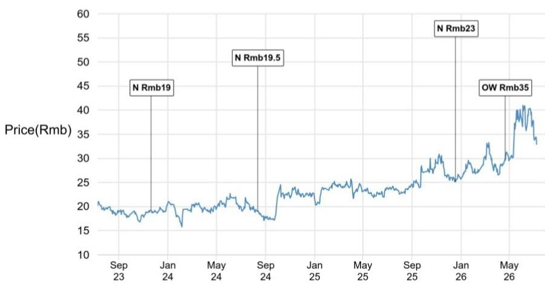
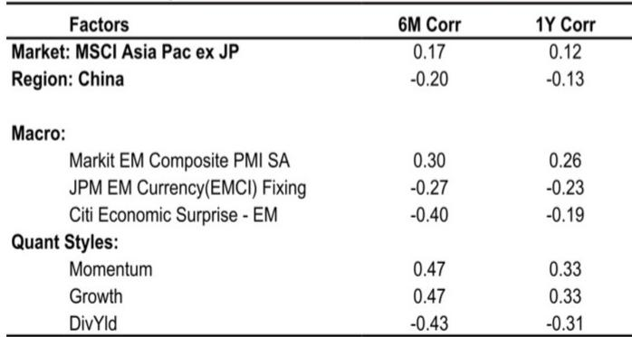
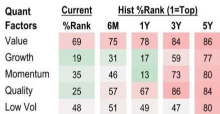

# JPM：数据中心电力需求增长，特锐德订单表现值得关注

这份来自JPM的最新研究，核心判断非常直接：特锐德（TGOOD）今年的增长故事，正在从“预期”转向“订单兑现”。报告最值得注意的信号，不是估值调整，而是其数据中心预装式变电站订单的显著增长——年初至今已超过2025年全年水平。

为什么这个信号现在重要？因为市场对特锐德的关注，此前更多集中在中东预装式变电站和国内充电网络。但数据中心电力基础设施，正在成为一条值得关注的增长曲线。JPM通过管理层交流确认，特锐德今年国内数据中心订单有望表现良好，同时中东订单可能增长超过一倍。这两条线叠加，意味着其电力设备业务正进入一个收入确认加速的周期。

## 1. 数据中心订单的“量变”可能已到临界点

特锐德今年已获得4-5亿元国内数据中心新订单，超过2025年全年。管理层指引全年数据中心订单超过8亿元，在110kV及以上高压预装式变电站领域占据约50%的市场份额。

背后的驱动力值得关注：大型数据中心（50MW以上）越来越多地需要110kV及以上等级的变电站。这不是简单的容量增加，而是电力基础设施架构的升级。特锐德与伊顿（Eaton）的战略合作，进一步放大了这一优势——伊顿的固态变压器（SST）和中压直流（MVDC）能力，与特锐德的高压预装式舱体系统结合，形成了一站式高电压交流转低压直流（110/220kV转800V）的模块化方案。

> **KC评论：** 这里的关键不是订单金额本身，而是“预装式变电站+高压转低压直流”的系统级能力。市场上能做110kV预装式变电站的公司不少，但能同时提供从高压到低压的打包方案，并把多个转换环节集成到一个模块化舱体里的，并不多见。这构成了差异化壁垒。

## 2. 中东订单的“增长潜力”逻辑：份额与节奏

中东是特锐德另一个核心增长极。管理层预计沙特能源公司将在三季度招标新的预装式变电站，总招标金额40-60亿元。假设特锐德维持约50%的份额，其合同价值将是2025年（约10亿元）的两倍以上。

报告特别指出，收入确认的高峰可能在2027年。这意味着市场对特锐德2026年的财务预测，可能尚未充分计入中东订单的贡献。同时，公司还计划在其他市场（欧洲、澳大利亚、中亚）实现新订单同比增长。

> **KC评论：** 中东订单的节奏是理解这份报告的关键。2025年的订单确认高峰在2027年，这意味着2026年的收入增长更多依赖国内数据中心和充电业务。市场需要区分“订单增长”和“收入确认”的时间差。

## 3. 报告尚未完全回答的关键问题：竞争格局与估值锚

报告虽持积极看法，但两个问题值得进一步推敲。

第一，固态变压器（SST）的竞争格局。管理层明确表示，中国SST市场将面临激烈竞争，多家企业正在追赶这项技术。特锐德的差异化在于系统级整合能力，但技术路线和客户验证的进展，报告并未给出详细拆分。

第二，估值锚的合理性。当前特锐德约20倍远期市盈率，报告认为具有吸引力。但参考其历史估值区间和可比公司，20倍是否已经反映了大部分增长预期？这里仍需验证。主要基于盈利预测上调3-4%，但估值倍数本身并未扩张。

## 4. 对读者的观察框架：三个跟踪指标

如果希望持续跟踪特锐德的逻辑是否成立，可以关注三个指标：

- 国内数据中心订单的季度确认节奏。年初至今已超2025年全年，但下半年能否保持同等速度，是检验需求持续性的参考。
- 中东招标的落地时间与份额。三季度沙特能源公司的招标结果，将直接验证50%市场份额假设的可靠性。
- 伊顿合作的客户拓展进度。报告提到，特锐德与伊顿联合开发的新方案已吸引包括美国在内的多地数据中心客户咨询。这是未来海外订单能否超预期的关键变量。

这份JPM报告的核心价值，在于把特锐德的增长故事从“概念”拉到了“订单”层面。数据中心和中东两条线的订单数据，让市场有了可验证的跟踪框架。但最终能否转化为持续的盈利增长，仍取决于执行和竞争。

For informational purposes only. Portions may be generated,translated,summarized,or edited with AI assistance based on source materials and may contain omissions or errors. Please verify independently. This is not investment,legal,tax,accounting,or other professional advice.

For informational purposes only. Portions may be generated,translated,summarized,or edited with AI assistance based on source materials and may contain omissions or errors. Please verify independently. This is not investment,legal,tax,accounting,or other professional advice.

