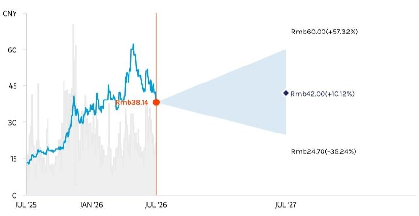

# 盛新锂能集团股份有限公司 | 亚太地区

# 2026年上半年初步业绩强劲；上调目标价

<table><tr><td colspan="3">变化情况</td></tr><tr><td>盛新锂能集团股份有限公司 (002240.SZ)</td><td>此前</td><td>当前</td></tr><tr><td>目标价</td><td>人民币34.60元</td><td>人民币42.00元</td></tr></table>

2026年上半年受益于锂价高位及其中游产能向产量增长转化。估值处于合理区间。维持中性评级。

2026年上半年初步业绩强劲：盛新锂能预计2026年上半年净利润为人民币10亿至12亿元，而2025年上半年为亏损人民币8.41亿元。2026年第二季度净利润隐含为人民币5.36亿至7.36亿元，而2026年第一季度为人民币4.64亿元。经常性净利润表现更佳：2026年上半年为人民币13亿至15亿元，2026年第二季度隐含为人民币6.78亿至8.78亿元，而2026年第一季度为人民币6.22亿元。我们认为主要的经常性项目是2026年第一季度实现的锂套期保值亏损。管理层将强劲的业绩预告归因于同比锂价大幅上涨以及印尼工厂出货量的显著增长。

我们将目标价上调至人民币42.00元并维持中性评级：我们参考大宗商品团队的最新价格预测，上调了对盛新锂能的平均售价预测，并根据2026年第一季度的实际数据调整了销售及管理费用和财务费用预测。我们的每股收益预测在2026年上调54%，2027年上调49%。我们还将基于现金流折现模型的目标价上调至人民币42.00元，对应2026年预期市盈率19.5倍。我们维持对该股的中性评级，考虑到其定向增发（将于2026年完成）带来的近期摊薄效应以及木绒锂矿（2028年起）带来的长期上游产量增长，当前估值处于合理水平。

<table><tr><td colspan="2">MS亚洲有限公司+</td></tr><tr><td colspan="2">Chris Jiang</td></tr><tr><td colspan="2">股票研究分析师</td></tr><tr><td>Chris.Jiang@morganstanley.com</td><td>+852 3963-1593</td></tr><tr><td colspan="2">Rachel L Zhang</td></tr><tr><td colspan="2">股票研究分析师</td></tr><tr><td>Rachel.Zhang@morganstanley.com</td><td>+852 2239-1520</td></tr><tr><td colspan="2">Hannah Yang, CFA</td></tr><tr><td colspan="2">股票研究分析师</td></tr><tr><td>Hannah.Yang1@morganstanley.com</td><td>+852 2239-7079</td></tr><tr><td colspan="2">Cynthia Tang</td></tr><tr><td colspan="2">研究助理</td></tr><tr><td>Cynthia.Tang@morganstanley.com</td><td>+852 3963-4360</td></tr></table>

## 亚洲暑期学校2026

## 盛新锂能集团股份有限公司 (002240.SZ, 002240 CH)

中国材料行业 | 中国

<table><tr><td>股票评级</td><td>中性</td></tr><tr><td>行业观点</td><td>具有吸引力</td></tr><tr><td>目标价</td><td>人民币42.00元</td></tr><tr><td>目标价上行/下行空间(%)</td><td>10</td></tr><tr><td>股价，收盘价 (2026年7月8日)</td><td>人民币38.14元</td></tr><tr><td>52周价格区间</td><td>人民币63.13-12.57元</td></tr><tr><td>摊薄后流通股数 (百万股)</td><td>889</td></tr><tr><td>总市值 (百万元)</td><td>人民币33,892.1</td></tr><tr><td>企业价值 (百万元)</td><td>人民币38,066.0</td></tr><tr><td>日均交易额 (百万元)</td><td>人民币1,971</td></tr></table>

<table><tr><td>财政年度截止日</td><td>12/25</td><td>12/26e</td><td>12/27e</td><td>12/28e</td></tr><tr><td>每股收益 (人民币)**</td><td>(0.97)</td><td>2.15</td><td>2.02</td><td>2.25</td></tr><tr><td>此前每股收益 (人民币)**</td><td>(0.85)</td><td>1.40</td><td>1.36</td><td>2.25</td></tr><tr><td>营业收入 (百万元人民币)</td><td>5,064.3</td><td>14,298.6</td><td>13,651.7</td><td>13,211.4</td></tr><tr><td>EBITDA (百万元人民币)</td><td>900</td><td>3,792</td><td>3,825</td><td>4,065</td></tr><tr><td>ModelWare净利润 (百万元人民币)</td><td>(888)</td><td>2,173</td><td>2,228</td><td>2,484</td></tr><tr><td>市盈率</td><td>不适用</td><td>17.7</td><td>18.9</td><td>16.9</td></tr><tr><td>市净率</td><td>3.1</td><td>3.0</td><td>2.4</td><td>2.1</td></tr><tr><td>净资产回报表现 (%)</td><td>(7.4)</td><td>21.2</td><td>14.3</td><td>14.1</td></tr><tr><td>企业价值/EBITDA</td><td>39.6</td><td>8.9</td><td>8.4</td><td>7.4</td></tr></table>

除非另有说明，所有指标均基于MS ModelWare框架  
\*\* = 基于一致预期方法  
e = MS预测

MS与所覆盖的公司有业务往来并寻求开展业务。因此，读者应注意，该公司可能存在影响MS客观性的利益冲突。读者应将MS视为其决策的单一因素。

## 关于分析师认证及其他重要披露，请参阅本报告末尾的披露部分。

+= 非美国关联公司雇用的分析师未在FINRA注册，可能不是该成员的关联人士，且可能不受FINRA关于与主题公司沟通、公开露面以及交易研究分析师账户持有的证券的限制。

## 财务摘要

图表1：模型更新

<table><tr><td rowspan="2">盛新锂能集团股份有限公司 002240.SZ</td><td colspan="3">FY26e</td><td colspan="3">FY27e</td><td colspan="3">FY28e</td></tr><tr><td>新</td><td>旧</td><td>变动</td><td>新</td><td>旧</td><td>变动</td><td>新</td><td>旧</td><td>变动</td></tr><tr><td>运营数据 (吨；人民币/吨)</td><td></td><td></td><td></td><td></td><td></td><td></td><td></td><td></td><td></td></tr><tr><td>销量 - 锂化工产品</td><td>110,200</td><td>110,200</td><td>0%</td><td>120,200</td><td>120,200</td><td>0%</td><td>130,200</td><td>130,200</td><td>0%</td></tr><tr><td>实现均价 - 锂化工产品</td><td>129,752</td><td>96,378</td><td>35%</td><td>113,575</td><td>93,347</td><td>22%</td><td>101,470</td><td>95,344</td><td>6%</td></tr><tr><td>单位毛利 - 锂化工产品</td><td>35,698</td><td>24,528</td><td>46%</td><td>32,406</td><td>22,553</td><td>44%</td><td>31,110</td><td>30,423</td><td>2%</td></tr><tr><td>关键损益项目 (百万元人民币；人民币/股)</td><td></td><td></td><td></td><td></td><td></td><td></td><td></td><td></td><td></td></tr><tr><td>营业收入</td><td>14,299</td><td>10,626</td><td>35%</td><td>13,652</td><td>11,225</td><td>22%</td><td>13,211</td><td>12,418</td><td>6%</td></tr><tr><td>毛利润</td><td>3,777</td><td>2,567</td><td>47%</td><td>3,745</td><td>2,568</td><td>46%</td><td>3,905</td><td>3,806</td><td>3%</td></tr><tr><td>毛利率 - %</td><td>26.4%</td><td>24.2%</td><td>2.3ppt</td><td>27.4%</td><td>22.9%</td><td>4.6ppt</td><td>29.6%</td><td>30.6%</td><td>-1.1ppt</td></tr><tr><td>EBITDA</td><td>4,015</td><td>2,764</td><td>45%</td><td>4,049</td><td>2,837</td><td>43%</td><td>4,290</td><td>4,120</td><td>4%</td></tr><tr><td>EBITDA利润率 - %</td><td>28.1%</td><td>26.0%</td><td>2.1ppt</td><td>29.7%</td><td>25.3%</td><td>4.4ppt</td><td>32.5%</td><td>33.2%</td><td>-0.7ppt</td></tr><tr><td>EBIT</td><td>3,122</td><td>2,096</td><td>49%</td><td>3,120</td><td>2,071</td><td>51%</td><td>3,300</td><td>3,255</td><td>1%</td></tr><tr><td>EBIT利润率 - %</td><td>21.8%</td><td>19.7%</td><td>2.1ppt</td><td>22.9%</td><td>18.4%</td><td>4.4ppt</td><td>25.0%</td><td>26.2%</td><td>-1.2ppt</td></tr><tr><td>税前利润</td><td>2,696</td><td>1,717</td><td>57%</td><td>2,898</td><td>1,887</td><td>54%</td><td>3,215</td><td>3,071</td><td>5%</td></tr><tr><td>税前利润率 - %</td><td>18.9%</td><td>16.2%</td><td>2.7ppt</td><td>21.2%</td><td>16.8%</td><td>4.4ppt</td><td>24.3%</td><td>24.7%</td><td>-0.4ppt</td></tr><tr><td>净利润</td><td>2,173</td><td>1,412</td><td>54%</td><td>2,228</td><td>1,500</td><td>49%</td><td>2,484</td><td>2,484</td><td>0%</td></tr><tr><td>净利润率 - %</td><td>15.2%</td><td>13.3%</td><td>1.9ppt</td><td>16.3%</td><td>13.4%</td><td>3.0ppt</td><td>18.8%</td><td>20.0%</td><td>-1.2ppt</td></tr><tr><td>净资产回报表现</td><td>17%</td><td>10%</td><td>6.4ppt</td><td>13%</td><td>9%</td><td>4.4ppt</td><td>13%</td><td>13%</td><td>-0.2ppt</td></tr><tr><td>每股收益</td><td>2.15</td><td>1.40</td><td>54%</td><td>2.02</td><td>1.36</td><td>49%</td><td>2.25</td><td>2.25</td><td>0%</td></tr></table>

来源：公司数据，MS预测。

图表2：DCF估值

<table><tr><td>(百万元人民币)</td><td>2024E</td><td>2025E</td><td>2026E</td><td>2027E</td><td>2028E</td><td>2029E</td><td>2030E</td><td>2031E</td><td>2032E</td><td>2033E</td></tr><tr><td>EBITDA</td><td>232</td><td>1,151</td><td>4,015</td><td>4,049</td><td>4,290</td><td>5,577</td><td>5,303</td><td>6,237</td><td>7,233</td><td>7,471</td></tr><tr><td>(-) 税项</td><td>(40)</td><td>(40)</td><td>(377)</td><td>(435)</td><td>(482)</td><td>(687)</td><td>(646)</td><td>(786)</td><td>(938)</td><td>(979)</td></tr><tr><td>(+) 营运资金变动</td><td>979</td><td>(8)</td><td>(408)</td><td>105</td><td>83</td><td>101</td><td>12</td><td>37</td><td>(128)</td><td>(34)</td></tr><tr><td>(-) 资本支出</td><td>(2,278)</td><td>(930)</td><td>(1,430)</td><td>(1,365)</td><td>(1,321)</td><td>(1,306)</td><td>(1,028)</td><td>(1,036)</td><td>(1,128)</td><td>(862)</td></tr><tr><td>自由现金流</td><td>(1,108)</td><td>173</td><td>1,800</td><td>2,354</td><td>2,569</td><td>3,685</td><td>3,641</td><td>4,452</td><td>5,039</td><td>5,595</td></tr><tr><td>自由现金流现值</td><td></td><td></td><td>1,800</td><td>2,116</td><td>2,076</td><td>2,677</td><td>2,377</td><td>2,613</td><td>2,659</td><td>2,653</td></tr><tr><td>自由现金流现值之和</td><td>18,971</td><td></td><td colspan="2">股数 (百万股)</td><td>1,103</td><td></td><td></td><td></td><td></td><td></td></tr><tr><td>终值</td><td>29,276</td><td></td><td colspan="2">价格 (人民币)</td><td>42.00</td><td></td><td></td><td></td><td></td><td></td></tr><tr><td>企业价值</td><td>48,247</td><td></td><td></td><td></td><td></td><td></td><td></td><td></td><td></td><td></td></tr><tr><td>(-) 净债务</td><td>392</td><td></td><td></td><td></td><td></td><td></td><td></td><td></td><td></td><td></td></tr><tr><td>(-) 少数股东权益</td><td>1,504</td><td></td><td></td><td></td><td></td><td></td><td></td><td></td><td></td><td></td></tr><tr><td>股权价值</td><td>46,351</td><td></td><td></td><td></td><td></td><td></td><td></td><td></td><td></td><td></td></tr></table>

来源：公司数据，MS预测。

乐观情景：在每股收益预测上调后，我们将基于市盈率的乐观情景价值从人民币54.4元（2026年预期市盈率38.9倍）上调至人民币60元（2026年预期市盈率27.9倍）。

悲观情景：在每股收益预测上调后，我们将基于市盈率的悲观情景价值从人民币20.3元（2026年预期市盈率14.5倍）上调至人民币24.7元（2026年预期市盈率11.5倍）。

图表3：财务摘要

<table><tr><td>关键驱动因素 (吨 / 人民币/吨 / 百万元人民币)</td><td>2024</td><td>2025</td><td>2026E</td><td>2027E</td><td>2028E</td></tr><tr><td>产量 - 锂化工产品</td><td>67,617</td><td>77,477</td><td>110,200</td><td>120,200</td><td>130,200</td></tr><tr><td>销量 - 锂化工产品</td><td>66,345</td><td>72,816</td><td>110,200</td><td>120,200</td><td>130,200</td></tr><tr><td>实现均价 - 锂化工产品</td><td>68,983</td><td>69,550</td><td>129,752</td><td>113,575</td><td>101,470</td></tr><tr><td>单位销售成本 - 锂化工产品</td><td>67,024</td><td>56,786</td><td>94,054</td><td>81,168</td><td>70,361</td></tr><tr><td>单位毛利 - 锂化工产品</td><td>1,959</td><td>12,763</td><td>35,698</td><td>32,406</td><td>31,110</td></tr><tr><td>毛利润 - 锂化工产品</td><td>130</td><td>929</td><td>3,934</td><td>3,895</td><td>4,050</td></tr></table>

<table><tr><td>利润表 (百万元人民币)</td><td>2024</td><td>2025</td><td>2026E</td><td>2027E</td><td>2028E</td></tr><tr><td>营业收入</td><td>4,581</td><td>5,064</td><td>14,299</td><td>13,652</td><td>13,211</td></tr><tr><td>毛利润</td><td>62</td><td>833</td><td>3,777</td><td>3,745</td><td>3,905</td></tr><tr><td>销售及管理费用</td><td>407</td><td>483</td><td>623</td><td>595</td><td>576</td></tr><tr><td>EBITDA</td><td>232</td><td>1,151</td><td>4,015</td><td>4,049</td><td>4,290</td></tr><tr><td>EBIT</td><td>-352</td><td>339</td><td>3,122</td><td>3,120</td><td>3,300</td></tr><tr><td>税前利润</td><td>-594</td><td>-927</td><td>2,696</td><td>2,898</td><td>3,215</td></tr><tr><td>净利润</td><td>-634</td><td>-967</td><td>2,319</td><td>2,463</td><td>2,733</td></tr><tr><td>归属于股东的净利润</td><td>-622</td><td>-888</td><td>2,173</td><td>2,228</td><td>2,484</td></tr></table>

<table><tr><td>资产负债表 (百万元人民币)</td><td>2024</td><td>2025</td><td>2026E</td><td>2027E</td><td>2028E</td></tr><tr><td>现金及现金等价物</td><td>1,796</td><td>2,880</td><td>7,554</td><td>10,168</td><td>12,329</td></tr><tr><td>应收票据及账款</td><td>314</td><td>749</td><td>1,466</td><td>1,399</td><td>1,354</td></tr><tr><td>存货</td><td>2,162</td><td>2,032</td><td>3,692</td><td>3,475</td><td>3,263</td></tr><tr><td>总资产</td><td>21,752</td><td>22,476</td><td>30,063</td><td>32,830</td><td>35,066</td></tr><tr><td>应付票据及账款</td><td>1,458</td><td>1,259</td><td>3,227</td><td>3,049</td><td>2,874</td></tr><tr><td>借款</td><td>6,928</td><td>7,846</td><td>7,946</td><td>8,646</td><td>8,546</td></tr><tr><td>总负债</td><td>9,421</td><td>10,869</td><td>12,937</td><td>13,458</td><td>13,184</td></tr><tr><td>股东权益</td><td>12,026</td><td>10,250</td><td>15,623</td><td>17,634</td><td>19,895</td></tr><tr><td>少数股东权益</td><td>304</td><td>1,358</td><td>1,504</td><td>1,738</td><td>1,987</td></tr><tr><td>负债及权益合计</td><td>21,752</td><td>22,476</td><td>30,063</td><td>32,830</td><td>35,066</td></tr></table>

<table><tr><td>每股数据 (人民币/股)</td><td>2024</td><td>2025</td><td>2026E</td><td>2027E</td><td>2028E</td></tr><tr><td>一致预期每股收益</td><td>-0.68</td><td>-0.97</td><td>2.15</td><td>2.02</td><td>2.25</td></tr><tr><td>市场一致预期每股收益</td><td></td><td>-0.97</td><td>2.05</td><td>1.95</td><td>1.95</td></tr><tr><td>与市场一致预期差异 (%)</td><td></td><td>0%</td><td>5%</td><td>3%</td><td>15%</td></tr><tr><td>每股股息</td><td>0.00</td><td>0.00</td><td>0.22</td><td>0.20</td><td>0.23</td></tr><tr><td>每股净资产</td><td>13.10</td><td>11.20</td><td>15.48</td><td>15.99</td><td>18.04</td></tr></table>

<table><tr><td>盈利能力比率 (%)</td><td>2024</td><td>2025</td><td>2026E</td><td>2027E</td><td>2028E</td></tr><tr><td>净资产回报表现 (平均)</td><td>-5.0%</td><td>-8.0%</td><td>16.8%</td><td>13.4%</td><td>13.2%</td></tr><tr><td>EBITDA利润率</td><td>5.1%</td><td>22.7%</td><td>28.1%</td><td>29.7%</td><td>32.5%</td></tr><tr><td>EBIT利润率</td><td>-7.7%</td><td>6.7%</td><td>21.8%</td><td>22.9%</td><td>25.0%</td></tr><tr><td>税前利润率</td><td>-13.0%</td><td>-18.3%</td><td>18.9%</td><td>21.2%</td><td>24.3%</td></tr><tr><td>净利润率</td><td>-13.8%</td><td>-19.1%</td><td>16.2%</td><td>18.0%</td><td>20.7%</td></tr><tr><td>净债务 / 权益 %</td><td>41.6%</td><td>42.8%</td><td>2.3%</td><td>-7.9%</td><td>-17.3%</td></tr><tr><td>利息覆盖倍数 (EBITDA) (倍)</td><td>1</td><td>5</td><td>16</td><td>16</td><td>15</td></tr><tr><td>营运资金占销售额 %</td><td>22.2%</td><td>30.1%</td><td>13.5%</td><td>13.4%</td><td>13.2%</td></tr><tr><td>应收账款周转天数</td><td>37</td><td>37</td><td>37</td><td>37</td><td>37</td></tr><tr><td>存货周转天数</td><td>208</td><td>185</td><td>130</td><td>130</td><td>130</td></tr><tr><td>应付账款周转天数</td><td>92</td><td>107</td><td>107</td><td>107</td><td>107</td></tr><tr><td>现金转换周期</td><td>153</td><td>115</td><td>60</td><td>60</td><td>60</td></tr></table>

<table><tr><td>现金流量表 (百万元人民币)</td><td>2024</td><td>2025</td><td>2026E</td><td>2027E</td><td>2028E</td></tr><tr><td>折旧与摊销</td><td>583</td><td>812</td><td>893</td><td>929</td><td>990</td></tr><tr><td>营运资金变动</td><td>979</td><td>-8</td><td>-408</td><td>105</td><td>83</td></tr><tr><td>经营活动现金净流入</td><td>1,317</td><td>950</td><td>3,291</td><td>3,780</td><td>3,952</td></tr><tr><td>资本支出</td><td>2,278</td><td>930</td><td>1,430</td><td>1,365</td><td>1,321</td></tr><tr><td>投资活动现金净流量</td><td>-2,825</td><td>-1,912</td><td>-1,430</td><td>-1,365</td><td>-1,321</td></tr><tr><td>新增借款</td><td>7,487</td><td>9,695</td><td>1,000</td><td>1,600</td><td>800</td></tr><tr><td>筹资活动现金净流量</td><td>308</td><td>1,588</td><td>2,813</td><td>199</td><td>-470</td></tr><tr><td>汇率变动影响</td><td>-47</td><td>-6</td><td>0</td><td>0</td><td>0</td></tr><tr><td>现金变动</td><td>-1,247</td><td>620</td><td>4,674</td><td>2,614</td><td>2,161</td></tr></table>

来源：公司数据，MS预测。

<table><tr><td>估值倍数 (倍)</td><td>2024</td><td>2025</td><td>2026E</td><td>2027E</td><td>2028E</td></tr><tr><td>市盈率</td><td>-56.3</td><td>-39.3</td><td>17.7</td><td>18.9</td><td>16.9</td></tr><tr><td>市净率</td><td>2.9</td><td>3.4</td><td>2.5</td><td>2.4</td><td>2.1</td></tr><tr><td>企业价值/销售额</td><td>8.8</td><td>8.1</td><td>2.8</td><td>3.1</td><td>3.0</td></tr><tr><td>企业价值/EBITDA</td><td>174.8</td><td>35.8</td><td>10.1</td><td>10.4</td><td>9.4</td></tr><tr><td>自由现金流回报表现 %</td><td>-2.7%</td><td>0.1%</td><td>4.8%</td><td>5.7%</td><td>6.3%</td></tr><tr><td>股息回报表现 %</td><td>0.0%</td><td>0.0%</td><td>0.6%</td><td>0.5%</td><td>0.6%</td></tr></table>

<table><tr><td>企业价值/EBITDA分析</td><td>2024</td><td>2025</td><td>2026E</td><td>2027E</td><td>2028E</td></tr><tr><td>最新收盘价 (人民币/股)</td><td>38.14</td><td>38.14</td><td>38.14</td><td>38.14</td><td>38.14</td></tr><tr><td>流通股数 (百万股)</td><td>918</td><td>915</td><td>1,009</td><td>1,103</td><td>1,103</td></tr><tr><td>总市值</td><td>35,023</td><td>34,909</td><td>38,486</td><td>42,063</td><td>42,063</td></tr><tr><td>净债务</td><td>5,132</td><td>4,966</td><td>392</td><td>-1,522</td><td>-3,783</td></tr><tr><td>少数股东权益</td><td>304</td><td>1,358</td><td>1,504</td><td>1,738</td><td>1,987</td></tr><tr><td>企业价值</td><td>40,460</td><td>41,233</td><td>40,382</td><td>42,280</td><td>40,267</td></tr><tr><td>EBITDA (百万元人民币)</td><td>232</td><td>1,151</td><td>4,015</td><td>4,049</td><td>4,290</td></tr><tr><td>企业价值/EBITDA</td><td>174.8</td><td>35.8</td><td>10.1</td><td>10.4</td><td>9.4</td></tr><tr><td>自由现金流 (百万元人民币)</td><td>-961</td><td>20</td><td>1,861</td><td>2,415</td><td>2,631</td></tr></table>

## 风险回报 – 盛新锂能集团股份有限公司 (002240.SZ)

长期上游产量增长但估值合理

## 目标价 人民币42.00元

DCF模型：加权平均资本成本为11.2%，2026-2033年预测期后的自由现金流终值增长率为2.0%。

## 风险回报图表

  
关键：—
