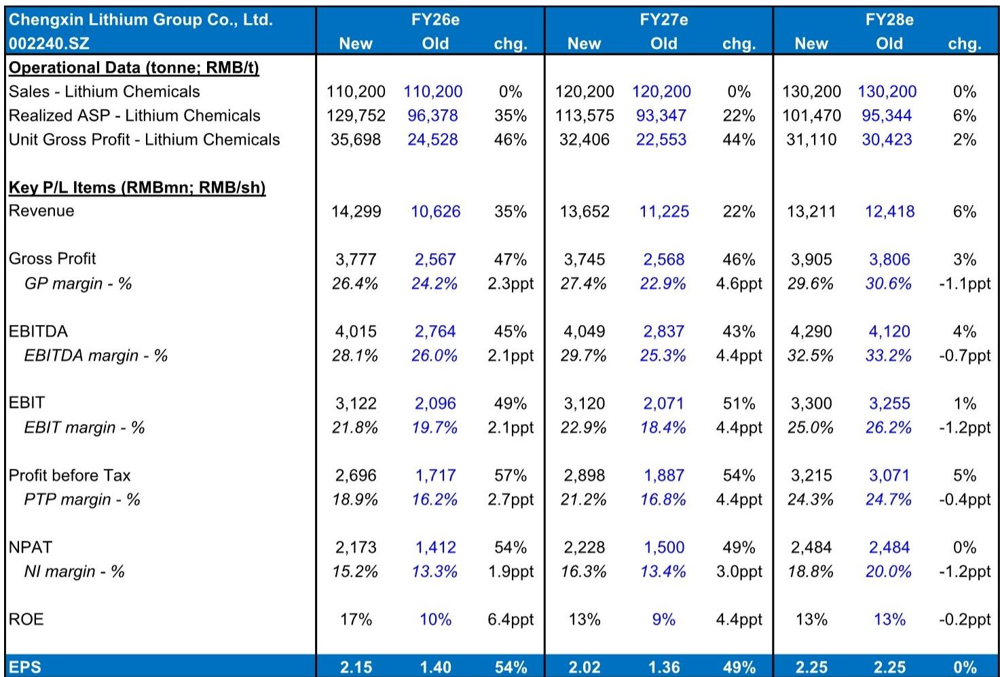
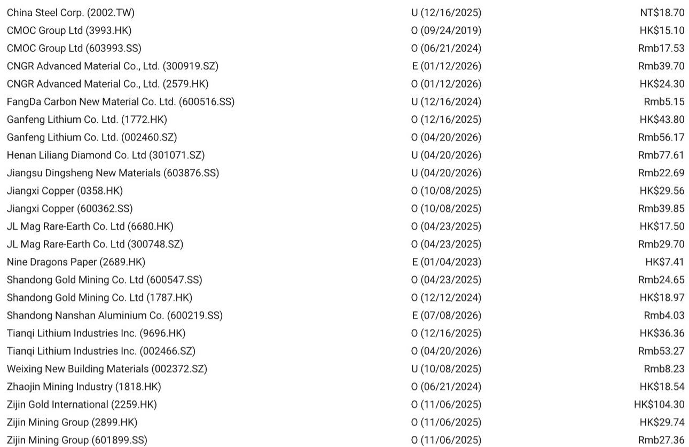
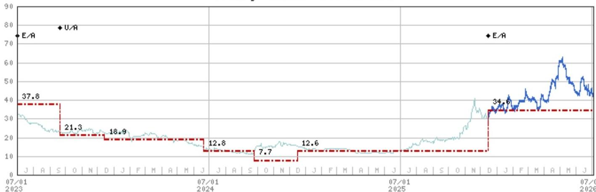

# MS：盛新锂能上半年表现改善，但2028年才是真正观察点

这份MS最新报告的核心判断是：盛新锂能上半年净利润预计达到10-12亿元，相比去年同期亏损8.41亿元，业绩出现根本性改善。但驱动这一变化的核心因素——锂价高位运行和印尼工厂出货量大幅增长——是否可持续，才是市场真正需要关注的问题。

报告更新了公司观点，其中隐含着对这家锂业公司中期结构性挑战的判断。

## 1. 上半年盈利改善来自两个外部因素

盛新锂能1H26的业绩预告远超市场预期。根据报告，1H26净利润预计在10-12亿元之间，而2Q26单季度净利润更是环比增长15%-58%。如果只看经常性项目，表现更为明显：1H26经常性净利润达到13-15亿元。

报告明确指出，驱动这一表现的核心因素是锂价大幅上涨和印尼工厂出货量显著增长。前者取决于全球锂供需格局，后者则是一次性产能释放。两个因素都不完全由公司自身控制。

> **KC评论：** 锂价高位运行和印尼产能爬坡是这轮盈利改善的两大引擎，但锂价本身具有强周期性，印尼工厂的产能释放也面临从“出货”到“稳定盈利”的转化过程。报告上调盈利预测的核心假设是锂价维持高位，这一假设本身就值得持续关注。

## 公司情况更新，估值已反映短期利好

MS将2026年和2027年每股盈利预测分别上调54%和49%，对应2026年预期市盈率19.5倍。这一估值水平在报告看来“看起来合理”。

报告中提到两个关键的估值不确定性点：一是2026年将完成的定向增发带来的短期摊薄效应；二是上游矿山（木绒锂矿）要到2028年才能贡献增量。这意味着，未来两年公司将处于“中游加工产能释放、但上游资源尚未自给”的过渡期。

> **KC评论：** 19.5倍2026年预期市盈率，在锂行业周期中并不便宜。不同情景下的估值区间本身就反映了锂价波动和产能释放节奏的巨大不确定性。

## 3. 报告尚未完全回答的问题：锂价假设的可持续性

报告的核心假设调整来自“参考MS大宗商品团队最新价格预测”上调了锂化学品销售均价。2026年预期均价从96,378元/吨上调至129,752元/吨，涨幅高达35%。2027年预期均价也从93,347元/吨上调至113,575元/吨。

但问题在于：锂价能否维持这一水平？报告没有展开讨论其大宗商品团队的锂价预测逻辑。对于一家核心盈利完全依赖锂价的公司而言，这一假设的脆弱性可能是最大的不确定性来源。

此外，印尼工厂的产能爬坡节奏、单位成本控制能力，以及2028年木绒锂矿投产后的成本结构变化，报告中虽有提及但未做详细拆解。

## 4. 观察这家公司的核心框架：三个时间维度

对于关注盛新锂能的研究者，报告提供了一个清晰的观察框架，可以拆解为三个时间维度：

短期（2026年）：关注锂价走势和印尼工厂的实际出货量与单位毛利。报告预计2026年锂化学品单位毛利为35,698元/吨，较2025年的12,763元/吨大幅提升。这一数字能否实现，是验证盈利预测的关键。

中期（2027年）：关注定向增发完成后的股本摊薄效应，以及印尼工厂产能进一步释放后的成本曲线位置。市场需要判断，公司能否在锂价回落时仍维持正的单位毛利。

长期（2028年以后）：木绒锂矿的投产进度和自给率提升，是公司从“加工型企业”向“资源+加工一体化企业”转型的关键一步。届时公司的成本结构和盈利能力将发生实质性改变。

这份报告最有价值的部分，是清晰地勾勒出这家公司未来三年面临的结构性变化。对于决策者而言，理解这三个时间维度的不同不确定性特征，远比关注短期报价波动更有意义。

For informational purposes only. Portions may be generated,translated,summarized,or edited with AI assistance based on source materials and may contain omissions or errors. Please verify independently. This is not investment,legal,tax,accounting,or other professional advice.

For informational purposes only. Portions may be generated,translated,summarized,or edited with AI assistance based on source materials and may contain omissions or errors. Please verify independently. This is not investment,legal,tax,accounting,or other professional advice.

