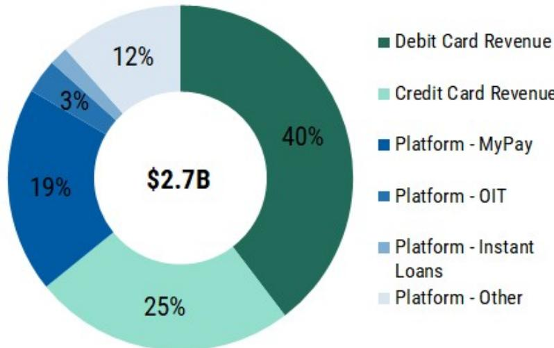
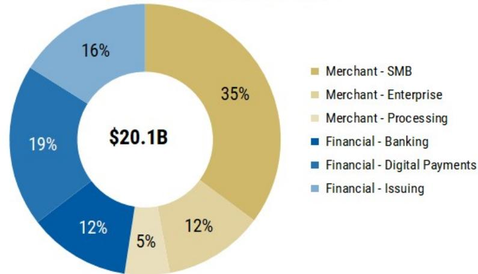
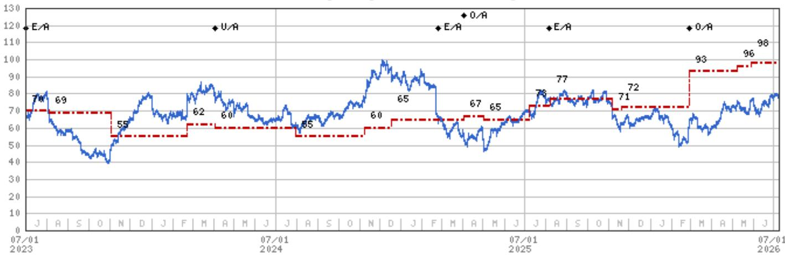

# 银行联合运营的借记网络或重塑支付生态，但关键战略问题在于谁受影响最大

支付领域长期以来的主流观点认为，杜宾修正案对借记卡交换费的上限是对银行盈利能力的永久性限制。一份新的研究报告提出了一种结构性应对方案：美国大型银行正在探索收购Fiserv旗下的STAR和Accel借记网络。如果这一方案得以实施，银行将能够通过运营自有网络，绕过21美分加0.05%的监管上限，类似于Capital One收购Discover的策略。这不仅仅是一个并购故事，更可能重新构建支撑消费者银行服务、金融科技价值主张以及全球卡组织竞争壁垒的经济基础。

这一逻辑本身清晰，但其影响却十分深远。由多家银行联合收购一个借记网络，将形成一个闭环结构，重新获取目前流向Visa和Mastercard的交换费收益。报告估算，Fiserv的借记网络在约10亿美元收入的基础上，可产生约5亿美元的EBITDA，利润率约为50%。按照当前支付领域6-8倍的估值倍数，这些网络的价值可能在30-40亿美元之间。一个能够获取交换费协同效应的战略买家，可能愿意支付20%或更高的溢价。这笔交易所得可用于Fiserv的去杠杆或股票回购，规模可达其市值的25%。

然而，更具深远意义的分析并非关于Fiserv的估值，而是大型银行成功构建替代路由基础设施后可能发生的情况。报告的逻辑延伸至三个不同的战略领域：Visa和Mastercard网络效应的韧性、依赖杜宾修正案豁免的金融科技模式的脆弱性，以及Fiserv自身领导层动荡所蕴含的执行风险。每一个领域都需要仔细剖析。

## 对网络经济模式的挑战在逻辑上成立，但复制门槛依然很高

报告正确地指出，银行联合运营借记网络的主要逻辑与Capital One收购Discover类似：能够在借记交易中收取更高的交换费。Capital One最初估计，这将每年带来略超10亿美元的运营协同效应。但这一比较在一个关键点上并不完整。Discover本身就是一个功能完善的信用卡和借记网络，拥有全球受理能力、争议处理基础设施、欺诈防范工具和发卡处理能力。而STAR和Accel仅是借记网络，受理范围有限，且不具备信用卡网络能力。报告指出，Fiserv管理层历来对将这些网络改造为信用卡网络持否定态度，并且由于信用卡费率不受监管，拥有信用卡网络也不会带来额外的交换费提升。

这造成了一个根本性的不对称。银行联合运营的借记网络可以获取更高的借记交换费，但在信用卡交易上仍需依赖Visa或Mastercard。经济收益在账本的一侧得到改善，而另一侧则保持不变。更重要的是，报告估计，失去一个大型借记发卡机构对Visa或Mastercard而言，仅意味着0.5-1%的收入逆风。这是一个可控的影响，而非生存威胁。Visa和Mastercard所建立的网络规模、安全基础设施、商户路由优化能力以及全球受理广度，其复制成本高昂且复杂。报告暗示，所需的投资正是此类收购此前未被推进的原因，尽管现在的估值更具吸引力。

战略问题在于，借记交换费的经济收益是否足以支撑建设一套平行的基础设施。对于单一银行而言，历史答案是否定的。JPM于2013年推出的ChaseNet是一个专有的闭环商户处理网络，但其交易路由仍然依赖VisaNet。报告并未明确，一个银行联合体能否克服此前阻碍个体行动的协调成本和投资要求。这是一个重要的分析缺口。寻求完整报告的读者将能找到详细的收入敏感性分析，该分析量化了联合体策略在经济上变得合理的临界点。

## Fiserv的领导层动荡增加了任何交易的时机和可信度不确定性

报告的第二个重要见解是，Fiserv的领导层动荡使得一个清晰的价值释放型出售故事变得复杂。Fiserv总裁Dhivya Suryadevara于7月7日辞职，Andrew Gelb和Srini Krish被任命为金融解决方案业务的临时负责人。这紧随CEO Mike Lyons辞职以及Takis Georgakopoulos被任命为CEO之后。报告将此视为一个增量负面因素，理由是读者对金融解决方案业务的发展轨迹存在不确定性，尤其是考虑到Suryadevara在读者日上的突出角色以及她参与制定转型战略的情况。

时机至关重要。金融解决方案业务正面临银行客户流失、技术转换挑战和服务质量担忧。在CEO交接后不久，负责转型的高管离职，引发了对战略连续性和执行可信度的质疑。对于任何潜在的借记网络收购方而言，这增加了尽职调查的复杂性。这些网络被出售是因为它们非核心，还是因为管理层缺乏执行其潜力的能力？报告没有回答这个问题，但它正确地指出，领导层更迭为已经复杂的交易动态增添了不确定性。

报告对Fiserv的估值框架假设2027年调整后每股收益的市盈率为7倍，考虑到适度的执行风险，在增长调整后的基础上相对于支付同行略有折价。这一折价恰恰反映了领导层动荡所放大的不确定性。如果借记网络出售得以进行，所得款项可用于去杠杆或股票回购，但报告并未模拟剩余Fiserv业务在出售后是否会以更高的倍数交易。这是一个值得探索的二级影响：如果移除借记网络，分拆加总逻辑是否会改善，还是剩余业务将因其核心处理运营而面临更严格的审视？

## 最具颠覆性的影响在于依赖杜宾修正案豁免的金融科技公司

报告最具启发性的见解并非关于Fiserv或卡组织，而是关于对Chime和Block旗下Cash App等金融科技公司的竞争威胁。其逻辑既精妙又危险。大型银行如果能够通过自有网络结构重新获取更高的借记交换费收益，就可以将这些收益重新投入到借记奖励、免费支票账户、提前发薪、透支减免、ATM服务或低费率消费者银行产品中。这将直接冲击Chime和Cash App服务于重度借记用户、低收入和月光族消费者的价值主张。

报告估计，借记交换费相关收入占Chime总收入的40%，占Block总收入的15%。如果大型银行能够匹配或压低金融科技公司凭借杜宾修正案豁免所建立的价格优势，金融科技商业模式将面临结构性压缩。报告中对Chime的估值方法使用了5倍的企业价值/交易利润倍数，在增长调整后的基础上相对于同行有适度溢价，这反映了更高质量的客户关系和更低的周期性收入风险。但这一溢价假设当前的监管和竞争格局保持不变。一个银行联合运营的借记网络将改变这一格局。

报告并未模拟如果银行联合体成功推出自有网络策略，对Chime或Block的具体收入影响。它没有估算银行将增量交换费收益快速部署到面向消费者产品的速度。它也没有评估金融科技公司是否可以通过建立自己的网络基础设施或深化与Visa和Mastercard的现有合作关系来应对。这些正是使完整报告成为值得读文献的开放性问题。战略利害关系足够重大，以至于金融科技、支付和银行领域的读者都应了解可能的结果范围。

## 报告留下了定义投资辩论的未解问题

尽管分析严谨，报告仍留下了几个关键问题未予解答。首先，银行联合体实际执行这一策略的概率有多大？报告指出，数家银行已表示不太可能进行收购。竞争银行之间的协调挑战、联合收购的监管审查以及运营共享网络的复杂性都相当巨大。报告并未为这一交易分配概率或情景权重。

其次，Visa和Mastercard将如何应对？报告估计失去一个大型发卡机构将带来0.5-1%的收入逆风，但并未模拟这些网络是否会调整定价、投资新功能或进行自己的收购以抵消影响。报告对Visa和Mastercard的目标倍数分别为27倍和30倍，高于当前交易水平。这些倍数隐含地假设当前竞争结构保持不变。

第三，监管将如何反应？杜宾修正案旨在降低借记卡交换费。一个通过结构性方案重新获取这些费用的银行自有网络，很可能会引起监管关注。报告未分析立法或监管反应的概率，也未模拟潜在规则变化的影响。

第四，没有借记网络的Fiserv价值几何？报告估计这些网络价值30-40亿美元，但未对剩余Fiserv业务提供详细的分拆加总分析。金融解决方案业务的领导层不确定性表明，剩余业务可能面临抵消任何出售收益的逆风。

这些并非报告的弱点。它们是区分表面理解与真正战略洞察的分析前沿。报告提供了框架；完整文件包含了详细的情景分析、收入敏感性表格和竞争动态，使读者能够形成自己的判断。

## 为读者导航支付格局的决策框架

对于试图为这一潜在变化布局的读者，报告建议围绕三个轴心构建一个结构化的决策框架。

第一个轴心是银行联合体交易的概率。读者应关注监管环境、银行的参与程度以及Fiserv管理层出售非核心资产的意愿。报告的领导层更迭分析表明，Fiserv可能更愿意剥离非核心资产，但银行协调问题仍是主要障碍。

第二个轴心是Visa和Mastercard的竞争反应。如果交易发生，这些网络拥有多种手段：他们可以投资于借记专用功能、为大型发卡机构调整定价，或进行自己的战略收购。报告的估值分析表明，这些网络能够吸收影响，但安全边际取决于发卡机构流失的规模。

第三个轴心是金融科技公司对杜宾修正案经济模式的敞口。Chime和Block的读者应评估依赖借记交换费收入的比例、客户关系的粘性，以及他们转向信用卡产品或其他收入来源的能力。报告的收入构成估算提供了一个起点，但竞争动态需要持续监测。

这个框架并非预测。它是一个在事件展开时组织信息的工具。报告提供了分析基础；完整文件包含了精确应用该框架所需的数据和情景分析。

## 加入社区阅读完整报告并查看原始图表

以上分析捕捉了报告中所蕴含的战略逻辑和未解问题。但完整文件包含了详细的财务模型、收入敏感性分析、竞争定位图表和估值情景，使读者能够形成自己的结论。关于借记交换费经济模式、Fiserv收入构成和Chime收入构成的原始图表，对于理解潜在变化的规模至关重要。加入社区阅读完整报告并查看原始图表。

*仅供参考。部分内容可能基于源材料通过AI辅助生成、翻译、总结或编辑，可能存在遗漏或错误。请独立核实。这不构成投资、法律、税务、会计或其他专业建议。*

仅供参考。部分内容可能基于源材料通过AI辅助生成、翻译、总结或编辑，可能存在遗漏或错误。请独立核实。这不构成投资、法律、税务、会计或其他专业建议。

