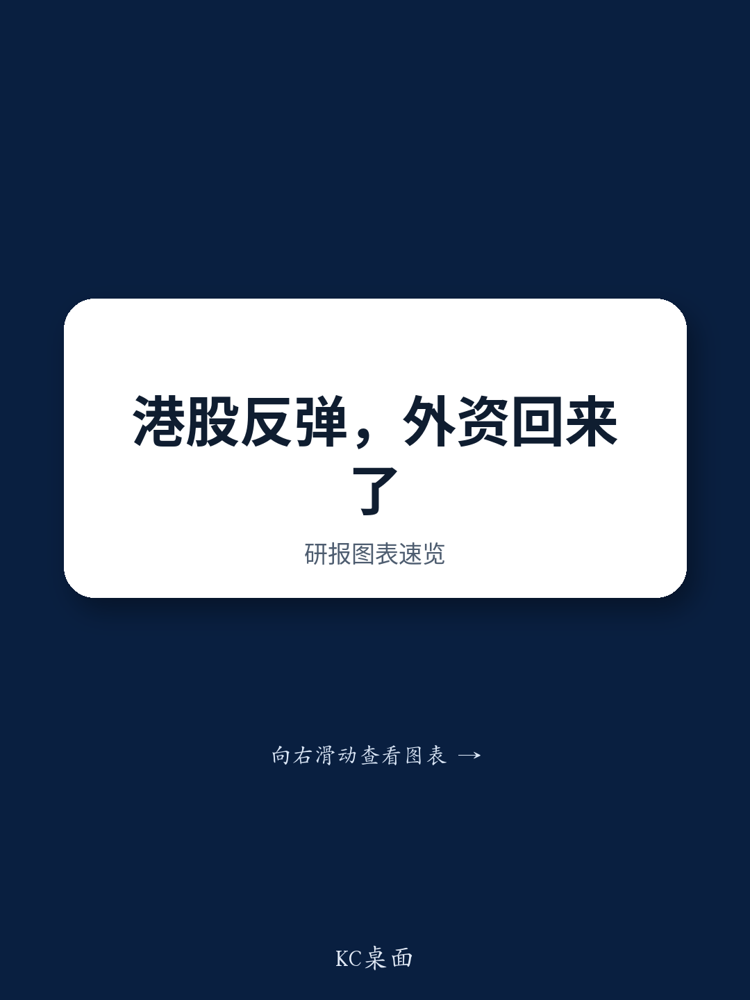

# 近期中国市场的表现是技术性修复，而非基本面资金流入——但战略布局窗口正在打开

数周以来，中国股票首次跑赢区域同类市场。恒生指数收复失地，而韩国、台湾和日本市场则经历了明显调整。对普通观察者而言，这看起来像是一个转折点——全球资本在长期忽视后终于重新回流中国的信号。但这种解读可能是一个危险的误解。

这种相对强势是真实的，但其驱动因素并非大多数人所假设的那样。近期香港和中国内地上市公司的强势表现，并非由一波新的外资买入所驱动。相反，它反映了一种特定交易结构的机械性解除，这种结构数月来一直对中国股票构成压力。全球读者一直将香港和中国股票用作“融资空头”——卖出它们以筹集资金，配置到日本、台湾和韩国等信心更高的市场。随着这些市场调整，来自这种融资空头活动的压力自然缓解。与此同时，来自中国内地的南向资金继续提供稳定（尽管并非壮观）的流动性来源。

这一区别对组合策略至关重要。如果你将近期走势解读为持续外资流入周期的开始，你可能会追逐一场缺乏持续性的反弹。如果你将其理解为全球谨慎定位环境中的技术性缓解反弹，你可以利用当前窗口，在真正催化剂出现之前，布局高质量标的。问题不在于中国市场是否可参与——而在于你是否准备好应对将决定下一阶段复苏的具体事件序列。

## 近期强势表现由融资空头解除驱动，而非外资需求激增

当前市场最重要的分析区别在于“发生了什么”与“为何发生”。中国股票表现优于其他市场，这是一个事实。但这一表现背后的机制，讲述了一个与价格走势本身所暗示的截然不同的故事。

过去几个月，许多全球基金管理人结构性超配日本、台湾和韩国等市场——这些市场盈利动能强劲、与人工智能相关，且国内政策环境有利。为了给这些超配头寸提供资金，管理人一直将中国股票作为流动性来源。这并非新现象。香港和中国股票历来充当亚洲（除中国外）配置的“融资空头”，因为它们规模大、流动性好，且减少敞口相对容易，不会引发过大的市场影响。

当受青睐的市场近期开始调整时，这一交易的逻辑发生了逆转。管理人不再需要维持在中国的融资空头，因为他们正在减少其他市场的超配头寸。这些融资空头的机械性解除为中国股票提供了显著支撑，而与中国本身基本面信念的任何变化无关。

这解释了为何这种强势表现发生的同时，并未伴随表明真正外资买入的信号——没有北向资金激增，没有读者会议或交易活动的有意义增加，没有全球配置者叙事基调的转变。市场在移动，是因为一个重负被卸下，而非因为新资金正在部署。

## 南向资金提供结构性底部，但并非持续反弹的催化剂

近期支撑的第二大支柱是持续的南向资金——中国内地读者通过股票互联互通计划购买香港上市股票。这些资金流在2026年一直是市场的一个持续特征，提供了可靠的需求来源，帮助吸收了外国读者的卖出压力。

南向资金的重要性不应被低估，但也不应被误解。内地读者购买香港股票，并非因为他们对全球前景变得更加乐观，或因为他们看到了令人信服的估值套利。他们购买是因为国内流动性条件依然宽松，因为人民币汇率前景使得离岸资产具有吸引力，以及因为中国家庭储蓄池继续寻求比国内固定收益和房地产更高收益的替代品。

这为香港市场创造了一个结构性底部。当外国卖出加剧时，南向资金可以抵消部分压力。当外国卖出缓解时（如近期），南向资金可以放大复苏。但这些资金流本身不太可能成为持续反弹的引擎。它们是稳定力量，而非驱动力量。

对读者的启示很明确：南向资金使下行空间不那么严重，但它们并未创造有意义重新评级所需的上行催化剂。为此，市场需要更基本的东西——而那个东西正在开始成形。

## 三个催化剂正在汇聚，指向7月下旬开始的更可持续复苏

报告识别出三个具体催化剂，正在7月下旬至8月的时间框架内汇聚，迄今的证据表明它们正按预期推进。

首先，主要电商平台的第二季度盈利预计将确认价格战对利润率的损害已见顶。曾拖累中国互联网行业盈利能力的激进折扣和补贴竞争似乎正在缓和。如果得到确认，这将标志着香港市场权重最大的板块之一的一个重要拐点。

其次，人工智能商业化的进展正在加速。腾讯混元3模型内免费AI助手的近期推出，是中国科技公司如何从基础设施和模型构建阶段，转向实际创收应用的一个具体例子。这并非关于人工智能炒作——而是关于人工智能能力的逐步但真实的货币化，这些能力一直被关注美国人工智能叙事的全球读者所低估。

第三，一直对市场构成持续压力的沉重IPO解禁压力，预计将在7月底前基本消化。近期大型上市锁定期到期相关的波动，造成了人为的卖出压力，掩盖了基本面的潜在改善。随着这种压力消退，市场应能更多地基于自身价值进行交易。

这三个催化剂并非投机性的。它们是可观察、可衡量且有时间限制的。问题在于它们是否足以克服继续制约全球风险偏好的更广泛宏观逆风。

## 报告未解答国内与全球条件能否同时对齐

尽管分析严谨，报告仍留下一个关键问题未解答：国内催化剂和全球宏观环境能否同时对齐？这个问题的答案将决定7月下旬/8月的窗口是产生有意义的反弹，还是仅仅是一次战术性反弹。

在国内方面，关键变量是盈利修正动能和人工智能商业化。中国的盈利修正数月来一直面临压力，因为经济复苏不均衡，公司指引谨慎。盈利修正动能的触底将是一个强有力的信号，表明最糟糕的下调周期已经过去。但底部只有在事后才能识别，迄今的数据只是暗示性的，而非结论性的。

在全球方面，条件甚至更加不确定。可持续的中国市场反弹需要全球利率和债券回报表现稳定，这反过来需要美联储提供更清晰的政策路径。它需要确认美国主要科技公司将按计划扩大资本支出——这是惠及中国半导体和硬件公司的人工智能供应链的关键驱动因素。它还需要高杠杆市场板块的去杠杆压力在夏季保持可控。

这些并非微不足道的条件。报告诚实地承认了不确定性，这种诚实是有价值的。但这也意味着读者不能简单地假设催化剂会按预期触发。战略方法是做好准备应对它们确实触发的情景，同时保持纪律，在它们未触发时进行调整。

## 决策框架：现在布局高质量标的，但为多种结果调整头寸规模

报告的建议——即在中国有显著超配头寸的读者应利用当前机会布局具有强劲基本面的高质量标的——是合理的，但需要更详细的决策框架才能具有可操作性。

该框架的第一个维度是质量。并非所有中国股票都会从上述催化剂中同等受益。重点应放在具有经过验证的商业模式、强劲资产负债表和可见盈利轨迹的公司上。这些是当外国读者最终回归时会吸引买入的标的，也是如果复苏延迟时表现最好的标的。

第二个维度是时机。报告认为近期下行风险正在减弱，鉴于融资空头解除带来的技术性缓解以及IPO解禁压力的即将消化，这是一个合理的评估。但风险减弱并不等于没有风险。读者应逐步建立头寸，利用任何回调作为入场点，而不是追逐近期的强势。

第三个维度是情景规划。读者应提前定义什么情况会促使他们加速布局——例如，盈利修正触底的确认，或美联储关于降息的明确信号——以及什么情况会促使他们暂停或减少敞口——例如，全球风险偏好的急剧恶化或来自北京的新监管阻力。

这个框架将报告的分析从有趣的阅读转变为实用的工具。它承认机会而不忽视风险，并提供了一种结构化的方法来导航一个正在改善但尚未完全走出困境的市场。

## 加入社区阅读完整报告并查看原始图表

上述分析基于一份详细的研究报告，其中包括关于融资空头头寸、南向资金趋势、盈利修正动能以及IPO解禁事件具体时机的专有数据。这些图表和数据点对于希望校准自己观点并围绕所描述情景建立信心的读者至关重要。

加入社区阅读完整报告并查看原始图表。完整文件包括分析师对催化剂时机的详细分解、融资空头动态的历史背景，以及符合布局标准的具体高质量标的。它还包括理解分析背景和局限性所必需的完整披露部分和评级定义。

*仅供参考。部分内容可能基于源材料通过人工智能辅助生成、翻译、总结或编辑，可能存在遗漏或错误。请独立核实。这不构成投资、法律、税务、会计或其他专业建议。*

仅供参考。部分内容可能基于源材料通过人工智能辅助生成、翻译、总结或编辑，可能存在遗漏或错误。请独立核实。这不构成投资、法律、税务、会计或其他专业建议。

