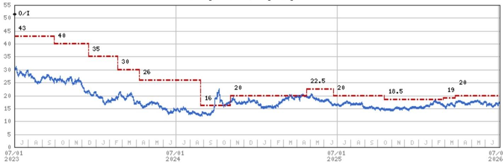
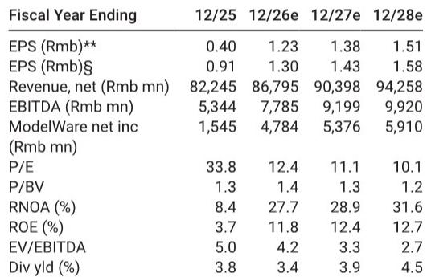
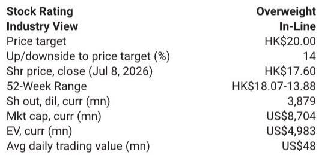

# MS：蒙牛鲜奶增速25%-30%，利润率爬坡需3-5年

这份MS在7月初发布的蒙牛读者交流纪要，传递了一个比表面数字更重要的信号：公司2026年前五个月收入增速接近高单位数，上半年液态奶中的UHT（超高温灭菌奶）已恢复正增长，鲜奶和奶粉分别预期实现25%-30%和超过30%的增长。在乳制品行业经历了近两年的原奶供需调整、渠道优化之后，这些数字看起来像是在宣告行业逐步企稳。

但真正值得关注的不是增速本身，而是增速背后的竞争环境变化。报告反复提到一个关键词：原奶价格环比稳定。这意味着行业最需要调整的阶段可能已经过去，但企业能否把稳定的成本环境转化为可持续的盈利修复，仍然取决于竞争格局的重塑。

**KC评论：** 这份报告的核心价值不在于它给出了什么增速预测，而在于它提供了一个观察窗口——当原奶价格不再明显波动，行业竞争从“谁更能扛亏损”转向“谁更能经营品牌和渠道”时，龙头公司的优势才开始真正显现。

## 1. UHT牛奶恢复增长，但驱动力是量不是价

UHT牛奶是蒙牛的基本盘，也是过去两年行业竞争较为激烈的领域。报告显示，UHT在二季度仍保持正增长，虽然增速比一季度有所节奏变化，但增长主要由销量驱动，而非提价。同比来看，定价仍然偏弱，部分原因是2025年上半年基数较高，而2025年下半年促销力度更大。

一个值得注意的结构性信号是：高端产品“特仑苏”的表现优于基础UHT。这意味着在消费环境尚未显著改善的情况下，消费者仍在向高端迁移，而不是全面降级。对于蒙牛而言，产品结构改善带来的利润弹性，可能比单纯的销量增长更重要。

但报告也暗示了一个未完全解决的问题：UHT的定价能力何时能恢复。如果原奶价格稳定后，行业竞争仍然以促销为主要手段，那么收入增长就很难直接转化为利润增长。

## 2. 鲜奶和奶粉是增长引擎，但利润贡献仍需时间

鲜奶业务是这份报告中最亮眼的部分。蒙牛预期上半年鲜奶收入增速达到25%-30%，全年目标为双位数增长。这背后是低温鲜奶渗透率持续提升的趋势，以及蒙牛在冷链和渠道上的布局。

但报告坦率地指出：鲜奶目前的经营利润率仍然很低。管理层预计需要3-5年时间，当规模效应显现后，利润率才能向集团整体水平靠拢。这意味着鲜奶在未来几年更多是“占位”而非“贡献利润”的角色。

奶粉业务同样增速可观，上半年预期超过30%的增长。贝拉米在跨境和东南亚市场的表现是主要推动力，成人奶粉增速快于婴幼儿奶粉。报告特别提到，品质和功能性需求是未来的重点方向。这符合行业共识：奶粉的增长故事已经从人口红利转向产品升级和功能化。

**KC评论：** 鲜奶和奶粉的高增速值得关注，但读者需要区分“增速”和“利润贡献”。鲜奶的利润率爬坡可能需要3-5年，而奶粉的高增长能否持续，取决于贝拉米在东南亚市场的竞争力和成人奶粉的品类渗透速度。这两块业务的估值逻辑完全不同。

## 3. 原奶价格稳定是行业格局改善的前提，但不是终点

报告反复强调原奶价格环比稳定。这直接关系到行业竞争烈度。过去两年，原奶供过于求导致价格持续节奏变化，下游企业为了消化库存和争夺份额，不得不进行大规模促销。当原奶价格稳定后，企业的成本端不确定性减轻，价格战的动力也随之减弱。

但稳定不等于改善。报告指出，蒙牛维持2026年全年收入中个位数增长、液态奶低个位数增长的目标，经营利润率同比持平。这意味着管理层对利润的修复持谨慎态度。原奶价格稳定只是为竞争秩序改善创造了条件，真正决定利润率的，是企业能否在稳定的成本环境下减少促销、提升产品结构。

这里存在一个尚未完全回答的问题：如果原奶价格再次波动，行业会回到价格竞争的老路吗？报告没有给出明确答案，但提到了税收政策的不确定性——如果鲜奶从“初级农产品”被重新定义为“深加工农产品”，增值税和所得税都可能上升。虽然报告认为这对蒙牛的影响小于区域性企业，但政策不确定性本身就是一个需要持续跟踪的变量。

## 4. 报告没有完全回答的三个问题

第一，分红提升的空间有多大？报告提到蒙牛预计在现金流改善和资本开支下降的背景下，稳步提升分红金额。这是一个明确的积极信号，但报告没有给出具体的时间表或目标比例。对于关注股东回报的读者来说，这可能是需要从后续财报中寻找的关键数据。

第二，现代牧业的影响何时结束？报告在不确定性部分提到了现代牧业，指出如果行业环境不利，其扭亏速度可能慢于预期。蒙牛持有现代牧业多数股权，后者的盈利状况直接影响蒙牛的合并利润。这是报告提及但未充分展开的一个潜在影响项。

第三，竞争格局能否从“价格竞争”转向“品牌竞争”？这是行业最核心的问题。原奶价格稳定只是消除了一个谨慎变量，但消费需求的恢复、渠道结构的优化、品牌溢价的建立，都需要更长时间来验证。报告提供了积极的短期信号，但长期趋势的判断仍然需要更多数据支撑。

**KC评论：** 这份报告最大的价值在于它展示了行业从“调整期”向“恢复期”过渡的细节。对于关注乳制品行业的读者，接下来的观察重点应该是：UHT的定价能力何时恢复、鲜奶的利润率爬坡路径是否清晰、以及蒙牛能否在行业整合中持续扩大份额。这些问题的答案，比任何单季度的增速都更重要。

---

For informational purposes only. Portions may be generated,translated,summarized,or edited with AI assistance based on source materials and may contain omissions or errors. Please verify independently. This is not investment,legal,tax,accounting,or other professional advice.

For informational purposes only. Portions may be generated,translated,summarized,or edited with AI assistance based on source materials and may contain omissions or errors. Please verify independently. This is not investment,legal,tax,accounting,or other professional advice.

