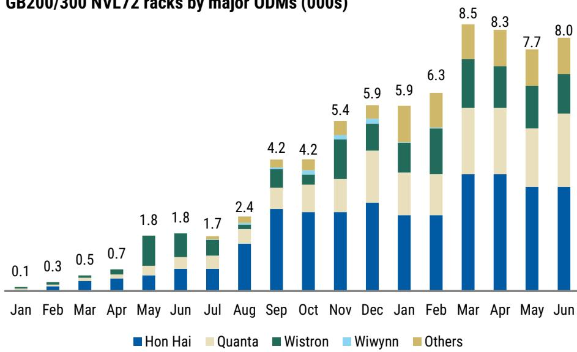
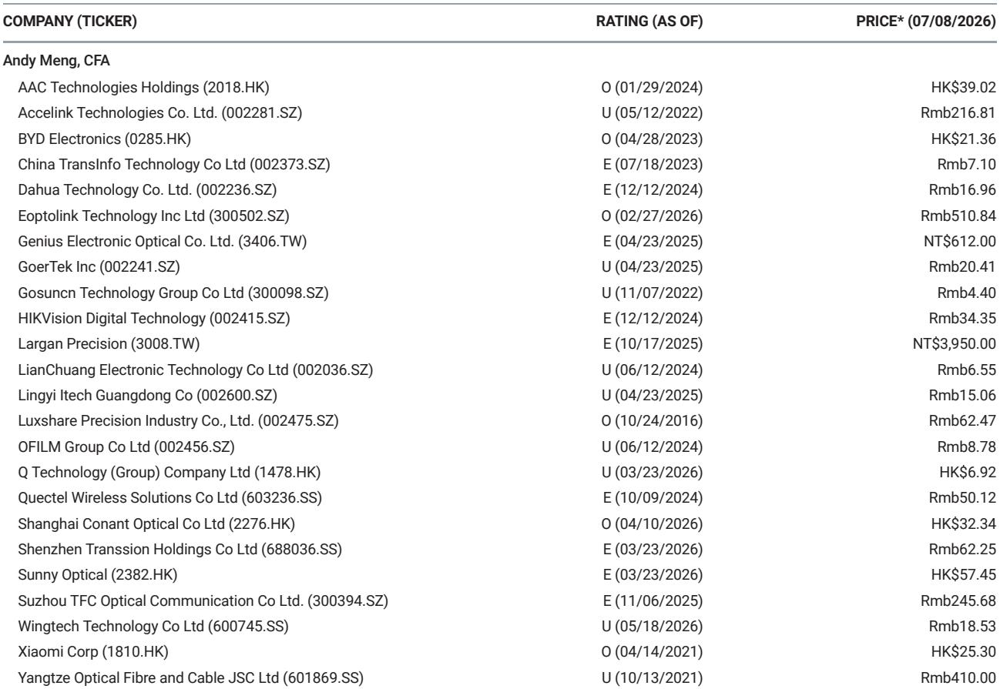

# AI基础设施构建进入关键阶段：机架级生产数据揭示行业格局变化

围绕人工智能基础设施的讨论已从理论潜力转向实际生产数据。在本轮周期中，来自台湾三大主要原始设计制造商的月度机架级产出数据首次提供了透明、可验证的窗口，用以观察AI部署的实际进展。2026年6月的数据揭示了一个既令人安心又引人深思的图景：建设正在加速，但加速的分布方式显示出将在未来十二个月内持续累积的战略优势。

行业范围内，GB200和GB300 NVL72等效机架产出在2026年6月达到约8000台，环比增长5%。这不仅仅是一个数据点；它表明供应链已克服2025年初困扰生产的初期问题。当前的月度运行率意味着年化速度将推动2026日历年度出货量达到7万至8万台，较2025年约2.9万台的出货量增长一倍以上。这些数据对于需要了解市场走向的研究者、策略制定者和技术采购方而言至关重要。

然而，在整体增长之下隐藏着更为复杂的现实。三大ODM并未同步前进。鸿海以约3300台的6月出货量保持其销量领先地位，环比持平。广达出现显著加速，出货量从5月的1800至1900台增至2300至2400台。而纬创的计算托盘出货量环比下降5%至10%，约为1200至1300机架等效。这些差异并非随机波动，它们反映了深思熟虑的战略选择、产能分配决策以及客户集中度风险，这些因素将定义AI硬件周期的下一阶段。

对于决策者而言，关键洞察在于：2026年下半年将区分出那些已建立可持续竞争护城河的ODM与那些仅仅顺势而为的企业。6月的生产数据预示了哪些公司有望在市场成熟过程中获取不成比例的价值。

## 鸿海的销量领先地位掩盖了将在2026年下半年显现的战略弱点

鸿海在6月出货约3300台GB200和GB300机架，保持了其在2026年上半年一直持有的销量领先地位。该公司第二季度总计约10300台，环比增长21%，略高于分析师预期的10000台。表面上看，这似乎是一个规模化持续执行的故事。

问题在于环比持平的趋势。尽管鸿海管理层表示AI相关机架出货量将在第三季度保持增长，但6月数据表明该公司可能正接近短期产能上限。环比增速已较年初放缓，第二季度总量虽然可观，但仅略高于预期。这种模式与一家已优化现有生产线但尚未启用新产能的制造商相符。

鸿海的战略风险不在于相对销量，而在于利润率趋势。在快速增长的市场中保持销量领先，只有转化为定价能力和持续盈利能力才有价值。鸿海多元化的收入基础（包括iPhone组装和其他消费电子产品）提供了稳定性，但也造成了资源分配的复杂性。当该公司消费业务在6月出现拉货放缓时，问题在于管理层将优先考虑AI产能扩张还是保护其更广泛的收入组合。这个问题的答案将决定鸿海能否维持其市场份额，还是将阵地让给更专注的竞争对手。

## 广达6月加速预示下半年拐点，可能重塑市场份额格局

广达6月的表现是月度报告中最值得关注的数据点。该公司出货2300至2400台机架，较5月的1800至1900台显著加速。这使得其第二季度总量达到约6200至6300台，环比增长32%。虽然略低于分析师预期的6700台，但趋势方向比相对差距更为重要。

实际第二季度出货量与预期之间的差距最好被解读为时间问题而非需求问题。分析师报告明确指出，机架出货量的下调“很可能只是推迟到下半年”，全年约18700台的假设保持不变。这意味着广达正带着一个需要在未来几个月内清理的生产积压订单进入2026年下半年。

战略含义显而易见：广达正在最恰当的时机积累动能。该公司6月营收达3852亿新台币，环比增长24%，同比增长103%，这不仅反映了更高的机架出货量，也体现了其笔记本业务的强劲表现。这种双重收入来源提供了缓冲，使广达能够在不危及核心业务的情况下积极投资AI产能。该公司似乎正在执行一项在下半年加速生产的战略，而历史上这正是超大规模客户为下一年部署计划下达最大订单的时期。

对于观察者而言，悬而未决的问题是广达能否在第三和第四季度维持这一加速势头，而不会遇到可能限制鸿海的相同产能约束。答案取决于该公司确保组件供应的能力，特别是高带宽内存和先进封装，这些是AI供应链中的约束性环节。

## 纬创6月下滑暴露了双层供应链中专业化的隐藏风险

纬创6月的表现是三大ODM中最令人担忧的。该公司出货约1200至1300机架等效，环比下降5%至10%。这一下滑发生在其他业务板块表现强劲的背景下，包括其子公司纬颖环比增长33%，以及显示器、台式机和笔记本的稳健增长。

纬创计算托盘出货量的下降尤其值得注意，因为分析师报告将纬创的计算托盘产出计为机架等效，这意味着这些是L10托盘而非完全组装的L11机架。这一方法论选择意味着纬创报告的数字可能高估了最终客户的实际交付量，因为它们未考虑机架组装和测试时间。因此，按实际机架交付量衡量，6月的下滑可能更为明显。

这并不一定是关于纬创竞争地位的负面信号。该公司全年约14100台的预测保持不变，第二季度的缺口被归因于出货推迟到下半年。然而，这种模式提出了一个战略问题：纬创是在短期内故意让出市场份额以专注于更高价值的机会，还是面临真正的生产挑战？

答案对供应链具有重要影响。纬创历来被视为高端参与者，专注于利润率更高、更复杂的项目。如果6月的下滑反映了优先考虑质量和利润率而非销量的战略决策，那么该公司可能会在这一时期之后获得更强的盈利能力。然而，如果下滑反映了产能约束或客户集中度问题，那么纬创在急于追赶下半年时可能面临利润率压力。

## 报告方法论造成盲点，决策者在依据数据行动前必须理解

分析师报告包含一个关键说明，值得比通常得到更多关注：由于分析将纬创的计算托盘机架等效纳入统计，而未考虑L11集成的机架组装和测试时间，实际向最终客户的机架交付量可能低于报告数字。

这一方法论选择造成了行业总产出的系统性高估。高估的程度尚不明确，但可能具有实质性影响。机架组装和测试在生产过程中并非微不足道的步骤，它们需要专门的设施、熟练的劳动力和严格的质量保证流程。如果纬创的计算托盘在L10阶段被统计，但直到较晚日期才作为完整的L11机架交付，那么月度出货数字实际上是将半成品重复计算为成品。

对决策者的影响很直接：标题出货数字应被视为方向性指标，而非最终客户交付量的精确衡量。AI基础设施部署的实际速度可能比报告数字低10%至20%，具体取决于三大ODM中L10和L11出货的混合比例。

这一盲点对于试图预测超大规模资本支出或组件需求的人来说尤为重要。如果报告出货数字高估了实际交付量，那么对网络设备、电力基础设施和冷却系统的下游需求也可能被高估。风险在于，观察者和策略制定者从夸大的出货数字中推断，并对AI采用速度做出过于乐观的假设。

## 2026年下半年评估ODM敞口的决策框架

6月生产数据为结构化决策框架提供了原材料。决策者应根据报告揭示但未完全解决的三个标准来评估ODM敞口。

首先，评估产能灵活性。2026年下半年的关键区分因素将不是当前市场份额，而是快速扩大生产的能力。广达6月的加速表明其拥有鸿海可能缺乏的灵活性。应关注产能扩张公告和组件采购承诺，作为哪些ODM能够捕捉增量需求的领先指标。

其次，评估客户集中度风险。报告未披露哪些超大规模客户从哪家ODM采购，但这是预测收入稳定性的最重要变量。严重依赖单一客户的ODM面临重大风险，如果该客户转移订单或推迟部署。广达和纬创在6月表现上的差异可能反映了不同的客户组合，而非不同的运营能力。

第三，分析利润率趋势。销量增长只有在伴随可持续利润率的情况下才有价值。报告的收入数据表明广达和纬创都在产生强劲的营收增长，但AI机架生产的成本结构并不透明。应关注毛利率趋势和营运资本效率，作为销量增长是否转化为股东价值的指标。

该框架得出了一个清晰的偏好顺序：广达似乎为下半年做好了最佳准备，其次是鸿海，而纬创面临最大的不确定性。这一顺序与分析师对纬创优于鸿海、鸿海优于广达的偏好形成对比，表明市场定价可能为更细致的评估创造了更具吸引力的风险回报特征。

## 2026年下半年将检验AI硬件周期是否具有结构性持久力，或仅仅是库存建设的超级周期

6月生产数据证实AI硬件建设是真实且加速的。2026日历年度机架出货量有望较2025年水平增长一倍以上，月度运行率仍在上升。这些并非一个正在见顶或面临需求饱和的市场的数据。

然而，报告也提出了它无法回答的问题。超大规模客户是将这些机架部署到生产环境中，还是在预期需求之前建立库存？这一区别对于预测2027年出货量至关重要。如果当前建设是由实际工作负载增长驱动的，那么需求周期还有多年的发展空间。如果是由竞争定位和害怕错过驱动的，那么一旦初始部署浪潮完成，调整将不可避免。

报告关于第二季度出货量略低于预期、缺口推迟到下半年的数据，与两种说法都一致。它可能反映了仅仅是时间转移的真实需求，也可能反映了一个在边际上开始出现饱和迹象的市场。答案只有在第三季度数据发布并与管理团队提供的乐观指引进行比较时才会变得清晰。

目前，谨慎的假设是周期还有更多发展空间，但随着基数效应变得更加具有挑战性，增长速度将放缓。2026年100%的同比增长在2027年将难以复制，即使相对出货量继续增加。赢家将是那些利用当前快速增长期建立竞争护城河的ODM，这些护城河将在增长不可避免地正常化时保护它们。

*仅供参考。部分内容可能基于源材料通过AI辅助生成、翻译、总结或编辑，可能存在遗漏或错误。请独立核实。本文不构成专业建议。*
