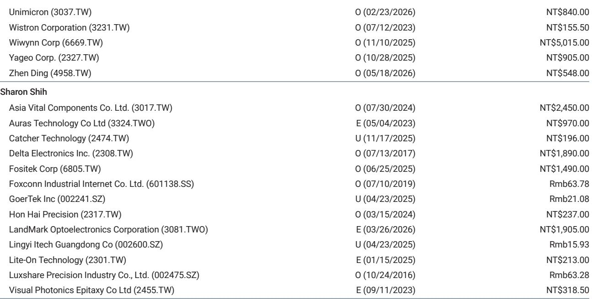
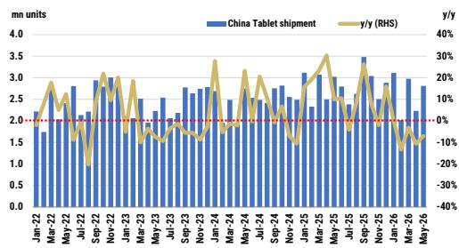
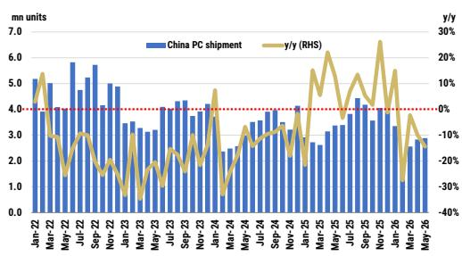

# MS：不是总量拐点，而是品牌替代，中国PC平板市场5月数据解读

中国PC与平板出货量在2026年5月继续调整，但这不是一个简单的“全线走弱”故事。MS最新发布的IDC数据跟踪显示，市场正在出现一条清晰的分界线：那些能抓住高端替代窗口的厂商，正在逆势收割份额。

5月中国PC出货量同比下滑14%至289万台，平板出货量同比下滑7%至281万台。整体量在调整，但结构变化比总量更值得关注。

**1. 苹果在PC市场的弹性较高增长说明“替代窗口”已经打开**

苹果PC出货量在5月同比增长45%，年初至今累计增长48%，是相对少见实现两位数正增长的主要品牌。同期华为PC下滑39%，惠普下滑19%，戴尔下滑39%。

这不是简单的“苹果产品力强”可以解释的。更关键的是，在整体市场需求偏弱的环境下，企业级和高端消费群体正在加速向特定品牌集中。苹果的增长并非来自市场扩容，而是从其他品牌手中抢走了份额。

> **KC评论：** 苹果的45%同比增长背后，是华为和戴尔丢失的份额。这提醒我们，当总量调整时，品牌间的替代效应会被放大。完整报告中的月度环比数据值得细看——苹果PC环比下降9%，说明增长节奏可能有波动，但同比趋势已经确立。

**2. 平板市场同样在重演“赢家通吃”逻辑**

平板市场整体下滑7%，但头部品牌的命运截然不同。华为平板同比增长7%，联想平板同比增长42%。苹果iPad同比下滑13%，小米平板同比下滑46%。

联想的平板表现是这组数据里最容易被忽视的信号。联想PC仅下滑6%，平板却增长42%，说明它在教育、商用细分市场找到了增量。相比之下，小米平板的下滑幅度最大，表明价格敏感型市场在调整时承受的不确定性也更重。

**3. 报告没有完全回答的关键问题：这轮分化是周期性的，还是结构性的？**

MS的数据覆盖到2026年5月，给出的是一张月度快照。但有两个问题值得追问。

第一，苹果的增长是否可持续。苹果PC的45%同比增速建立在2025年同期相对较低的基数上，而且环比已是下降。如果后续月份环比继续走弱，那么“替代窗口”可能只是短期库存回补的结果。

第二，联想的平板增长是否来自一次性订单。联想平板环比暴增70%，同比42%的增长幅度远超行业平均。这种增速能否维持，取决于它是拿到了大客户订单，还是渠道补库的脉冲。

这两个问题，报告没有展开，但恰恰是判断下半年行业走向的关键。

**4. 对产业决策者的观察框架：盯住三个指标**

如果你在看供应链或渠道布局，这份数据提供了三个追踪维度。

第一个维度是品牌集中度。PC市场前五大品牌中，只有联想和苹果在增长，其余都在调整。这意味着代工厂和零部件供应商需要重新评估客户结构不确定性。

第二个维度是产品均价走势。苹果和联想的高端机型占比提升，会拉高行业平均售价，但也意味着中低端市场正在加速出清。供应链中那些依赖量而非价的环节，不确定性会持续。

第三个维度是月度环比信号。5月PC环比增长2%，平板环比增长26%。平板环比反弹明显，但同比仍为负。如果6月环比继续为正，可能意味着库存消化接近尾声。

> **KC评论：** MS这份报告的价值不在于预测总量拐点，而在于用月度数据揭示了品牌层面的“非对称竞争”。完整报告中的两张图表——PC和平板的分品牌出货量趋势——值得反复对照，尤其是苹果和联想各自的增长路径差异。

数据不会替你做决策，但它能告诉你，在总量调整的年份里，谁在悄悄吃掉别人的午餐。

For informational purposes only. Portions may be generated,translated,summarized,or edited with AI assistance based on source materials and may contain omissions or errors. Please verify independently. This is not investment,legal,tax,accounting,or other professional advice.

For informational purposes only. Portions may be generated,translated,summarized,or edited with AI assistance based on source materials and may contain omissions or errors. Please verify independently. This is not investment,legal,tax,accounting,or other professional advice.

