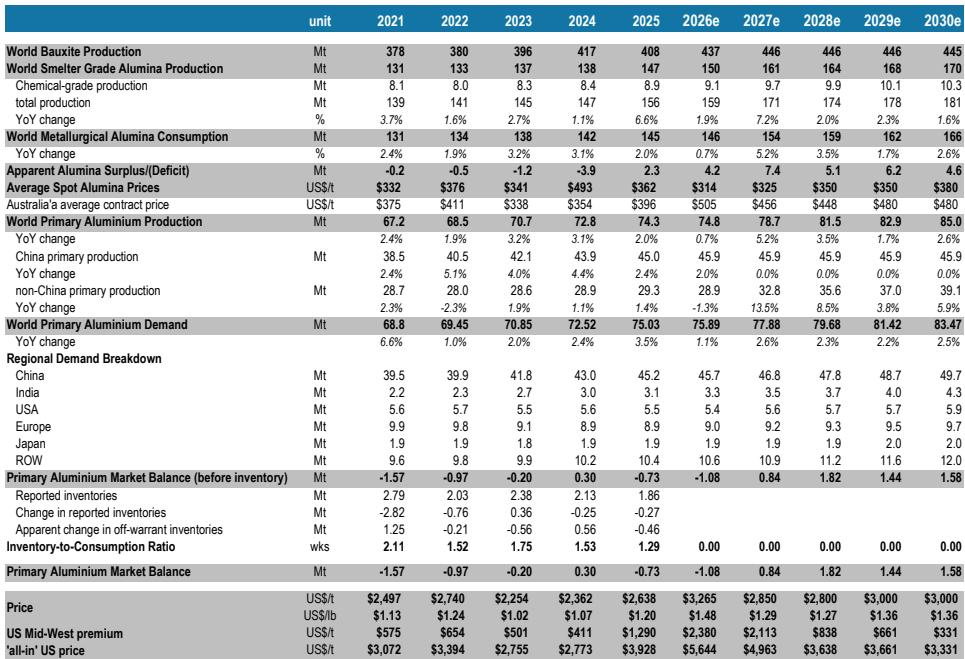
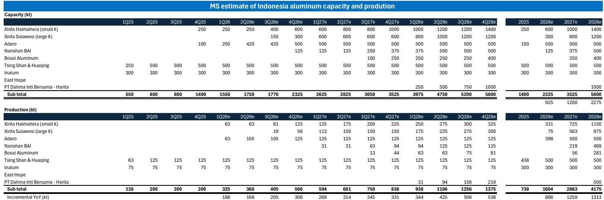
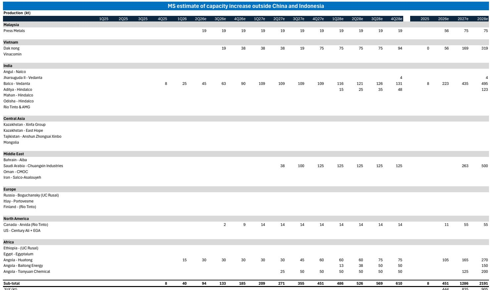

# 铝循环周期已转变：2027年供应过剩如何要求投资组合策略调整

过去十八个月推动铝相关公司估值上涨的逻辑正在发生变化。市场并非从暂时的供应冲击逐步走向正常化，而是从结构性短缺转向明显且加速的供应过剩，且这一转变的速度被多数观察者低估。中东地区的冲突曾使全球铝产能年化减少约350万吨，这一催化剂曾推高价格并扩大相关公司估值倍数。但冲击的逆转，加上新一波绿地供应的投产速度快于预期，正在重塑基本面格局。关键洞察不在于冲击是暂时的，而在于恢复速度比冲击本身更快，且供应响应正被两年前尚未进入视野的地区的产能增加所放大。

这一转变对投资组合构建具有直接且实质性的影响。铝市场目前预计将从2026年约110万吨的温和短缺，转为2027年超过80万吨的过剩。到2028年，随着在建项目逐步达产，过剩量可能扩大至180万吨。价格走势逻辑上跟随供需平衡的恶化。预计铝价在2026年下半年平均为每吨3150美元，随后在2027年降至每吨2850美元，区域溢价也将回落。盈利影响集中在2027年和2028年，而恰恰此时许多读者仍在为持续紧张的市场布局。

策略上的含义是明确的。铝相关公司股价的任何短期回升，无论是由宏观环境缓解、空头回补还是季节性需求驱动，都应被视为减少敞口而非增加风险的机会。对初级铝生产商进行积极布局的窗口已经关闭。问题不在于周期是否转变，而在于如何管理这一过渡，以及如何在供应过剩发展过程中寻找相对价值。

## 供应逆转速度超出市场预期，布局窗口正在收窄

铝市场展望中最重要的变量并非需求，而是供应响应的速度和规模——无论是冲击的哪一侧。中东冲突曾使全球产能大幅减少，但重启目前预计将在2027年上半年末基本完成。这比最初估计的要快，而市场尚未完全消化其影响。当因地缘政治原因关闭的产能恢复生产时，它不会缓慢回流，而是以大批量形式回归——那些在短时间内停产的冶炼厂，在运营和物流条件允许的情况下会尽快复产。

与此同时，冲击期间的高盈利能力激励了世界其他地区一波新的供应增加，其进展速度快于此前预测。最显著的贡献者是印度尼西亚，运营商正在将电力从亏损的镍生产重新分配给铝。这不是边际变化。印尼产量预计在2026年达到86.6万吨，2027年达到120万吨，2028年达到130万吨。这些数量足以改变全球平衡。除印尼外，世界其他地区在2026年增加44万吨，2027年增加83.5万吨，2028年增加90.5万吨，其中沙特阿拉伯、印度和安哥拉的关键项目在2027年贡献显著。

综合效应是，仅2027年全球新增供应总量约210万吨，这还不包括中东地区的重启。这不是逐步增加，而是可用吨位的阶跃式变化，足以压倒任何合理的需求增长假设。支撑高价格和宽利润的短缺正在以超出共识预期的速度收窄，随之而来的供应过剩将比当前估值所暗示的更深、更持久。

## 盈利影响集中在后期，但市场已开始定价这一转变

全球铝相关公司股价已从近期高点显著回调。中国铝业公司股价较1月高点下跌约50%。美国铝业和世纪铝业下跌约40%。挪威海德鲁下跌约28%。印度铝业下跌约20%。这些回调反映了市场认识到中东冲击正在缓解，但并未完全捕捉2027年供应过剩的影响。

一项“价格中已反映什么”的分析表明，中国铝业公司已贴现的铝价比当前现货水平低8%至19%。这意味着部分下行风险已嵌入这些公司的估值中，其相对下行空间可能比尚未如此积极调整的全球同行更为有限。然而，关键区别在于2026年和2027年。市场在2026年仍处于短缺状态，现货价格和溢价在短期内应保持支撑。更大的盈利影响集中在2027年和2028年，届时较低的铝价假设、区域溢价回落以及更宽松的供需平衡将削弱铝相关公司的盈利动能。

最大的盈利压力将落在高经营杠杆的生产商以及直接暴露于LME铝价和区域溢价的公司身上。这些公司的盈利对供应过剩所暗示的价格下跌最为敏感。对于在冲击期间持有这些公司的读者而言，策略性问题是：2026年的剩余上行空间是否足以补偿2027年的下行风险。基于供需平衡轨迹，答案是否定的。风险回报已经转变，适当的应对措施是利用任何短期强势减少敞口。

## 2027-2029年电力合同到期风险：市场尚未充分定价的运营风险

除了供需平衡之外，全球主要冶炼厂的电力合同结构正在出现一个独立且未被充分认识的风险。电力成本是铝生产的最大单一投入，通常占总现金成本的30%至40%。因此，电力合同的安全性和定价是冶炼厂盈利能力和生存能力的关键决定因素。在整个行业中，大量电力合同续约集中在2027年至2029年窗口期，形成了市场尚未充分定价的运营风险悬崖。

对于美国铝业而言，风险最大的冶炼厂是西班牙的San Ciprian，其电力互换合同于2027年12月到期。该公司正在开发长期可再生能源购电协议，但这些协议取决于尚未最终确定的许可和风电场建设。鉴于San Ciprian此前因高能源成本而遭受重大亏损的历史，若未能获得具有竞争力的2027年后电力覆盖，可能会压缩利润、削弱重启经济性，或增加减产风险。挪威的Lista工厂电力覆盖至2027年，但尚未披露2027年后的覆盖情况，意味着从2028年起可能从合同电力转向更高的现货市场敞口。挪威的Mosjoen工厂电力覆盖至2028年，但随后从2029年至2035年覆盖率降至65%。魁北克的Becancour和Deschambault冶炼厂合同于2029年底到期，时间较晚但影响重大，因为魁北克占美国铝业冶炼产能的很大一部分。

对于挪威海德鲁而言，其挪威冶炼厂的一系列购电协议在2027年至2031年间到期。尽管该公司一直在积极获取替代合同，但累积敞口仍然显著。NO3区域——海德鲁在挪威的大部分产能所在地——合同在2027、2028、2029、2030和2031年陆续到期。每次续约都带来电价上涨的风险，这将在铝价已因供应过剩而下跌的环境中压缩利润。

策略上的含义是，供应过剩带来的盈利压力与电力成本风险相互叠加。已经面临铝价下跌的冶炼厂，在合同重置时还将面临更高的投入成本。这造成了简单的供需模型未能完全捕捉的利润挤压。读者需要评估的不仅是铝价走势，还有其投资组合中每个冶炼厂的电力成本走势。

## 报告提出的关键问题：尚未解答，值得进一步研究

虽然报告为铝市场转变提供了清晰且有说服力的框架，但也留下了几个重要问题。这些并非分析的弱点，而是结果确实不确定的领域，需要进一步研究以完善研究思路。

第一个未解问题是中国的产量控制角色。中国历史上曾使用产能置换和冬季减产来管理铝市场。如果政府针对即将出现的供应过剩出台更严格的产量控制，市场平衡可能会显著收紧。报告将此确定为一个关键上行风险，但未量化此类干预的概率或潜在规模。读者需要评估中国政策是否可能成为供应过剩的制衡力量，以及这是否会改变下行的时机或深度。

第二个未解问题是需求侧。报告聚焦于供应，但需求增长并非静止不变。如果全球增长超出预期，或者铜价持续高企推动替代转向铝，供应过剩可能比当前预测更快被吸收。报告承认这是一个上行风险，但未对需求敏感性进行建模。在不同需求假设下测试市场平衡的情景分析，将为可能的结果范围提供有价值的见解。

第三个未解问题是市场对即将到来的盈利下调的反应。报告下调了几家公司的评级并提供了修订后的盈利预测，但未充分探讨对行业轮动、指数权重或材料板块内相对价值的二阶影响。如果读者从铝转向其他材料子板块，这将带来单一商品分析未能捕捉的风险和机遇。

这些问题并非报告的缺陷，而是深入分析的邀请。报告提供了结构性框架，而未解问题则定义了希望领先于周期的读者的研究议程。

## 应对铝周期转变的决策框架

对于机构读者而言，报告转化为一个清晰的、包含三个不同阶段的决策框架。第一阶段是当前时期，持续到2026年底。在此阶段，市场仍处于短缺状态，现货价格有支撑，盈利依然强劲。适当的行动是利用任何短期强势减少对高杠杆初级生产商的敞口。这不是完全退出的建议，而是从积极多头头寸转向更具防御性或选择性敞口的建议。

第二阶段是2027年初至年中，届时供应过剩变得可见，价格开始下跌。在此阶段，盈利下调将显现，公司估值将重新定价至更低水平。适当的行动是避免增加风险，并保持减少后的敞口。风险最大的公司是那些具有高经营杠杆、直接LME敞口以及2027-2029年窗口期电力合同续约的公司。杠杆较低、业务模式多元化或具有显著下游整合的公司可能更具韧性。

第三阶段是2027年底至2028年，届时供应过剩完全确立，市场正在寻找新的平衡。在此阶段，可能开始重新建立头寸的机会，但只有当价格已充分调整以迫使产能关闭并恢复平衡时才会出现。报告未指定价格底部，但历史模式表明，价格需要持续低于边际生产成本一段时间，周期才会转向。那将是下一个上升周期的入场点。

对于希望保持对材料板块敞口但减少铝风险的读者，报告指出，更广泛的中国材料行业观点仍为“有吸引力”。这意味着其他子板块存在机会，例如铜和黄金，其基本面展望更为有利。决策框架并非退出材料板块，而是在材料板块内部轮动至风险回报最有利的领域。

## 加入社区阅读完整报告并查看原始图表

此处呈现的分析是一份详细研究报告的综合摘要，该报告包含全面的供需模型、价格预测、盈利修正和电力合同分析。完整报告包含支撑策略结论的支持数据、图表和附件。对于积极管理铝及更广泛材料板块敞口的读者，完整报告提供了做出知情决策所需的细节。原始图表详细展示了市场平衡轨迹、盈利敏感性分析和电力合同续约时间表。这些是任何认真读者在应对这一周期转变时必不可少的工具。加入社区阅读完整报告并查看原始图表。

*仅供参考。部分内容可能基于源材料通过AI辅助生成、翻译、摘要或编辑，可能存在遗漏或错误。请独立核实。这不构成投资、法律、税务、会计或其他专业建议。*

仅供参考。部分内容可能基于源材料通过AI辅助生成、翻译、摘要或编辑，可能存在遗漏或错误。请独立核实。这不构成投资、法律、税务、会计或其他专业建议。

