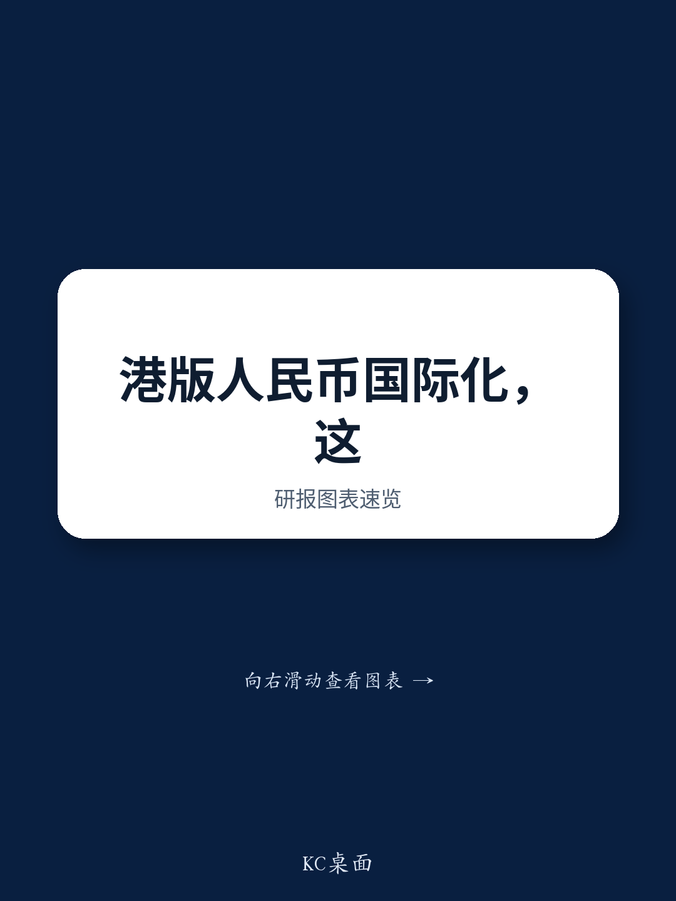

# MS：人民币跨境使用新框架，不是开闸放水，而是修好管道

人民币国际化正在经历一次关键转向。过去几年，政策重心更多放在堵住资本外流的漏洞上；而MS最新研报指出，一套更具建设性的框架正在成型——通过扩大香港离岸人民币市场的深度与广度，在可控渠道内推进人民币的跨境使用。

这份报告发布于中国央行行长潘功胜宣布一系列支持香港离岸人民币市场新措施之后。这些措施并非零散的政策礼包，而是一套有逻辑的系统工程：从债券研究、流动性支持、对冲工具到定价功能，每一个环节都在解决离岸人民币市场长期存在的“卡脖子”问题。

> **KC评论：** MS判断的核心是“不对称开放”——对非正式资本流出继续收紧，同时对香港这个离岸枢纽打开更多正规渠道。这不是全面放开，而是有选择、有节奏的管道建设。

## 1. 离岸人民币市场的三大瓶颈正在被逐一拆解

研报明确指出，此前离岸人民币市场的发展受制于三个结构性短板：流动性相对薄弱、基准回报表现曲线不够完善、以及对冲、回购和抵押品渠道不足。新措施恰好针对这三个痛点。

南向债券通规模从5000亿人民币提升至8000亿，并扩大合格研究范围，直接增加了内地资金通过正规渠道进入离岸债券市场的规模。同时，香港人民币资金池的规模从2000亿扩大到5000亿，期限延长至三年，为市场提供了更厚实的流动性垫。而5年期离岸人民币国债期货的推出，则补上了对冲工具这块拼图。

这些措施叠加在一起，意味着离岸市场不再只是人民币存款的“蓄水池”，而是正在变成一个可以定价、可以对冲、可以深度配置的市场。

## 2. 人民币定价角色的延伸：从债券到商品

报告还特别提到一个容易被忽视的方向：推动人民币在大宗商品领域的定价功能。具体包括建立跨境黄金清算和结算机制，以及推动以人民币计价的商品期货和现货产品。

这是人民币国际化从经常账户向资本账户延伸后的又一个自然步骤。如果离岸人民币能够在大宗商品贸易中承担定价和结算职能，其国际使用场景将不再局限于贸易支付和组合观察配置，而会深入到全球供应链的定价环节。

> **KC评论：** 黄金清算和商品期货的布局，表面看是资金产品创新，实质是让人民币在“计价”这个更高阶的国际货币职能上取得突破。这一步如果走通，人民币的国际使用将不再依赖外部环境变化，而是由实体贸易需求驱动。

## 3. 报告尚未完全回答的关键问题：这些管道能装多少水？

MS报告对政策意图和方向判断清晰，但有一个问题并未展开：这些扩大的管道，实际能吸引多少资金流入？

规模提升和流动性工具只是供给侧的准备。需求侧能否跟上，取决于全球机构读者对人民币资产的配置意愿，而这又取决于中美利差、汇率预期、以及中国宏观环境的基本面表现。报告没有给出资金流入的量化预测，这本身也说明，当前的措施更多是在“修管道”，而非“开闸放水”。

另一个悬而未决的问题是，这些措施是否会与内地资本账户开放的节奏产生冲突。如果离岸市场利率和汇率形成机制与在岸市场差异过大，套利行为可能重新抬头，届时政策又需要在开放与稳定之间做出权衡。

## 4. 观察框架：用三个维度判断管道建设的实际效果

对于关注人民币国际化的读者，MS这份报告提供了一个分析框架，可以用三个维度来跟踪后续进展

第一，流动性深度。香港人民币资金池的规模变化、以及离岸人民币债券发行量和二级市场交易量，是衡量“管道是否通畅”的直接指标。

第二，定价能力。5年期离岸人民币国债期货的成交量和持仓量，以及人民币计价商品期货的推出进度，决定了人民币在离岸市场能否形成独立的定价基准。

第三，资金流向。南向债券通规模使用率的变化，以及全球央行和主权产品持有人民币资产的规模，是判断需求端是否跟上的关键信号。

这三个维度相互独立，又共同支撑一个判断：人民币国际化正在从“防御性管理”转向“进攻性建设”。接下来的关键，不是看政策出了多少，而是看市场用了多少。

For informational purposes only. Portions may be generated,translated,summarized,or edited with AI assistance based on source materials and may contain omissions or errors. Please verify independently. This is not investment,legal,tax,accounting,or other professional advice.

For informational purposes only. Portions may be generated,translated,summarized,or edited with AI assistance based on source materials and may contain omissions or errors. Please verify independently. This is not investment,legal,tax,accounting,or other professional advice.

