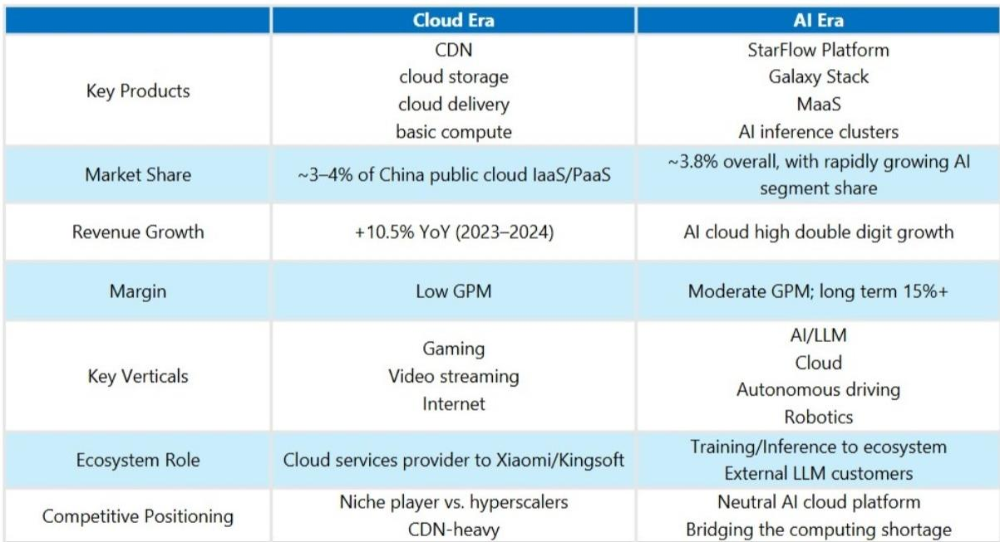
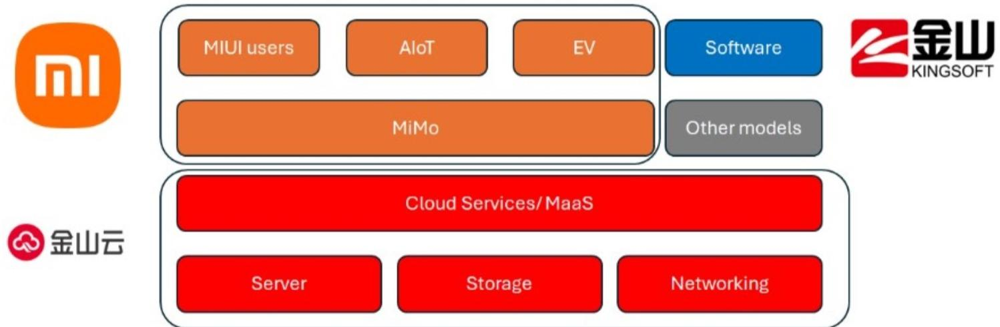
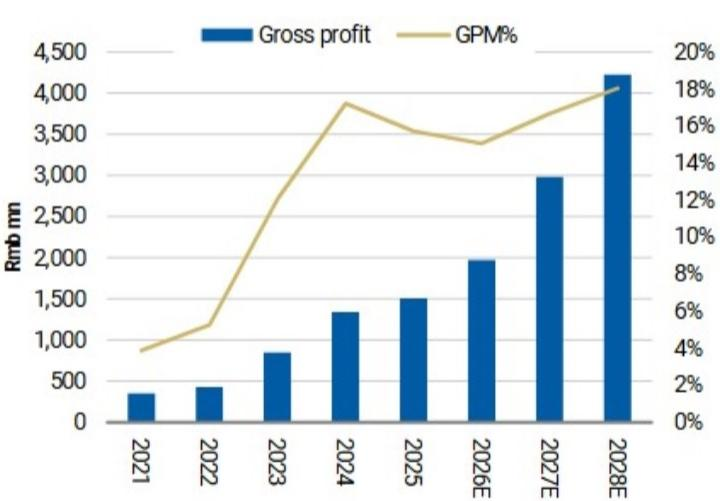

# Kingsoft Cloud Is Not Just Riding the AI Wave — It Is Building the Infrastructure for China’s Next Computing Cycle

The conventional narrative around Chinese cloud stocks has been a story of margin compression, commoditization, and hyperscaler dominance. For years, mid-tier players like Kingsoft Cloud were trapped in a low-margin business of content delivery networks and basic compute, fighting for scraps in a market where Alibaba, Tencent, and Huawei commanded the strategic high ground. That narrative is now outdated. A structural shift is underway, and it is not merely about adding AI to an existing cloud business. It is about the emergence of a fundamentally different economic model for cloud infrastructure, one where capital intensity, scarcity pricing, and ecosystem alignment create a new set of winners. Kingsoft Cloud, with its early and deliberate pivot to AI cloud, is positioned to be one of those winners. The question for observers is no longer whether this transition is real, but how to assess a company whose revenue composition, margin structure, and competitive moat are being rewritten in real time.

The timing matters. The second half of 2026 is witnessing a synchronized price hike across the global cloud industry, from AWS and Google Cloud to every major Chinese provider. This is not a cyclical blip. It is the market signaling that AI compute capacity has become the most strategically scarce resource in technology. When a mid-tier Chinese cloud provider can raise prices by 15 to 50 percent on AI-computing products and 30 to 50 percent on storage, and do so alongside industry leaders, it indicates that demand is outstripping supply at a systemic level. Kingsoft Cloud’s decision to reposition itself from a commodity cloud player into an AI-centric infrastructure provider was not just strategic foresight. It was a necessary survival move that has now become a significant advantage.

The thesis is straightforward but its implications are complex. Kingsoft Cloud is leveraging its deep, captive relationship with the Xiaomi and Kingsoft ecosystem to secure demand visibility that its standalone peers lack. It is then using that demand to justify the capital expenditure required to build AI inference and training clusters. The result is a business model that looks less like traditional public cloud and more like a specialized infrastructure financier with a guaranteed tenant. This is not a story about market share gains in a mature industry. It is about the creation of a new asset class within Chinese technology infrastructure.

## The Transition from Commodity Cloud to AI Infrastructure Has Fundamentally Changed Kingsoft Cloud’s Unit Economics

The most important shift in Kingsoft Cloud’s business is not the product names or the marketing language. It is the underlying economics of what it sells. In the traditional cloud era, Kingsoft Cloud operated with low gross margins, competing primarily on price for CDN and basic compute workloads against much larger players. The business was capital-light in the sense that it did not own massive data center fleets, but it was also margin-constrained because its services were interchangeable. The AI cloud business is the opposite. It is capital-intensive, requiring upfront investment in GPU clusters, but it generates significantly higher margins because of scarcity pricing and the specialized nature of AI workloads.

The report’s unit economics model makes this clear. A typical AI infrastructure investment requires a 100-unit capital outlay, with 80 percent debt financing at 3 percent interest. Over a five-year asset life, the model generates an 85 percent EBITDA margin and an 18 percent EBIT margin, with a pre-tax IRR of 9 percent. Extend the asset life to six years, and the IRR rises to 14 percent. If a customer prepays for one year of service, the IRR also reaches 14 percent, even with a shorter asset life. These are not the economics of a commodity cloud business. They are the economics of a specialized infrastructure asset with high barriers to entry and pricing power.

The critical insight here is that Kingsoft Cloud’s margin expansion is not dependent on gaining market share from Alibaba or Tencent. It is dependent on the utilization rate of its AI infrastructure and the duration of its customer contracts. The business model has shifted from selling services by the unit to financing and operating capacity that is pre-committed by ecosystem partners. This changes the risk profile entirely. The primary risk is no longer competitive pricing pressure. It is the availability of GPU supply and the cost of capital.

## Ecosystem Demand Provides a Structural Hedge Against the Volatility of the AI Market

One of the most underappreciated aspects of Kingsoft Cloud’s strategy is the role of the Xiaomi and Kingsoft ecosystem as an anchor tenant. In any infrastructure business, demand visibility is the single most important determinant of capital allocation efficiency. Kingsoft Cloud does not have to speculate on which AI startups will need compute capacity next quarter. It has a clear line of sight into the needs of Xiaomi’s AI model development, Kingsoft Office’s productivity AI features, and the broader ecosystem of companies that rely on this group for cloud services.

This is not merely a revenue diversification story. It is a structural advantage in how the business finances its growth. When a cloud provider can show potential lenders and partners that a significant portion of its capacity is pre-sold to creditworthy, related-party customers, it reduces the cost and risk of financing the upfront capital expenditure. The report’s unit economics model assumes 80 percent loan-to-cost, which is aggressive for a standalone company but reasonable for one with captive demand. The ecosystem effectively serves as a credit enhancement mechanism.

The strategic implication is that Kingsoft Cloud can afford to build capacity ahead of demand in a way that independent cloud providers cannot. In a market where GPU supply is constrained and lead times are long, this ability to pre-commit capital gives Kingsoft Cloud a timing advantage. It can secure hardware allocations, negotiate better pricing with suppliers, and be ready to serve customers when demand materializes. This is exactly the opposite of the traditional cloud playbook, where providers built capacity speculatively and then fought for customers. Kingsoft Cloud is building capacity to serve known demand and then monetizing the residual.

## The Industry-Wide Price Hikes Confirm That AI Compute Supply Is Structurally Constrained, Not Cyclically Tight

The table of price increases from January to June 2026 is one of the most telling data points in the report. It is not just that prices went up. It is that every major provider raised prices in a coordinated but independent manner, and the increases were substantial. AWS raised EC2 Machine Learning Capacity Block prices by 15 percent. Tencent raised token prices for models on its MaaS platform. Alibaba Cloud and Baidu both raised AI-computing-related offerings by 5 to 34 percent and 5 to 30 percent respectively. Kingsoft Cloud itself raised AI-computing prices by 15 to 50 percent and storage by 30 to 50 percent.

This is not a market where providers are trying to undercut each other for market share. It is a market where every participant recognizes that demand is outstripping supply and that pricing power has returned to the seller. The Silicon Data B200 and H100 rental indices, which track the cost of renting these GPUs, provide additional confirmation. When rental prices are rising across the board, it means that the constraint is not just on purchasing hardware but on accessing operational capacity. The bottleneck has shifted from procurement to deployment.

For Kingsoft Cloud, this pricing environment is transformative. The company can now earn returns on its AI infrastructure that justify the capital expenditure and the debt service costs. More importantly, the pricing power extends to its storage products, which were previously among the most commoditized in the industry. The 30 to 50 percent storage price increase suggests that even non-AI workloads are benefiting from the overall tightening of cloud capacity, as providers prioritize higher-margin AI workloads and raise prices on legacy services to manage demand.

## The Path to Margin Expansion Follows the Alibaba Playbook, But the Starting Point Is Different

The report compares Kingsoft Cloud’s gross margin trajectory to Alibaba Cloud’s historical margin expansion, and the analogy is instructive. Alibaba Cloud went from a low-margin, high-growth business to a profitable one by shifting its revenue mix away from CDN and toward higher-value services like database, security, and AI. Kingsoft Cloud is attempting the same transition, but with a critical difference. Alibaba Cloud had the scale and captive e-commerce demand to make the shift gradually. Kingsoft Cloud is making the shift abruptly, driven by the AI opportunity and supported by its ecosystem.

The risk in this comparison is that Alibaba Cloud’s margin expansion took years and required significant organizational change. Kingsoft Cloud is trying to compress that timeline. The reward, however, is that the AI cloud business has inherently higher margins than the traditional enterprise cloud services that Alibaba Cloud relied on during its transition. If Kingsoft Cloud can execute, it may achieve its target of 15 percent-plus long-term gross margins faster than the industry precedent suggests.

The open question is whether the margin expansion is sustainable. AI infrastructure margins are high today because supply is constrained. As more capacity comes online, and as GPU availability improves, pricing power may erode. Kingsoft Cloud’s ability to maintain margins will depend on whether it can move up the value chain from raw compute to higher-level services like Model-as-a-Service (MaaS) and platform tools. The report flags MaaS as a source of further upside, but it does not provide detailed evidence of Kingsoft Cloud’s competitive position in that layer. This is the most important uncertainty in the thesis.

## What the Report Does Not Fully Answer: How Kingsoft Cloud Will Compete in the MaaS Layer

The report’s argument is strongest when discussing Kingsoft Cloud’s infrastructure business. It provides clear unit economics, a plausible demand thesis, and evidence of pricing power. But the report is more tentative when it comes to the MaaS opportunity. It mentions that Tencent raised token prices for models on its MaaS platform, suggesting that this layer also has pricing power, but it does not detail Kingsoft Cloud’s own MaaS strategy, its model offerings, or its competitive positioning against the hyperscalers.

This is a critical gap because the long-term value in AI cloud is not in renting GPUs. It is in the software and services that sit on top of the infrastructure. If Kingsoft Cloud remains a pure infrastructure provider, it will eventually face the same commoditization pressures that plagued its traditional cloud business. The margins on GPU rental will compress as supply normalizes. The company needs to develop a differentiated MaaS offering that locks in customers and creates switching costs.

The report does not provide enough evidence to assess whether Kingsoft Cloud has the engineering talent, the model partnerships, or the developer ecosystem to build a competitive MaaS business. The ecosystem advantage with Xiaomi and Kingsoft helps, but those customers may also want access to models from other providers. Kingsoft Cloud’s MaaS strategy will need to be open and interoperable, not just a wrapper around its own infrastructure. Until there is more clarity on this front, the MaaS upside remains a call option rather than a core part of the case.

## A Decision Framework for Evaluating Kingsoft Cloud as an AI Infrastructure Investment

For those considering Kingsoft Cloud, the analytical challenge is that the company is in the middle of a business model transition, and traditional valuation metrics may be misleading. The report uses a 5.5x 2027 EV/EBITDA multiple, which is a discount to the US neocloud peer average of 13x. That discount reflects lower asset yields and supply chain uncertainty. But the appropriate multiple will change as the business mix shifts.

A more useful framework is to evaluate Kingsoft Cloud on three dimensions, each with its own set of questions.

First, assess the demand visibility from the ecosystem. How much of the planned AI capacity is pre-committed by Xiaomi and Kingsoft entities? What are the contract durations? Are there take-or-pay provisions? The more visibility the company has, the lower the risk of its capital expenditure and the higher the justified valuation multiple.

Second, evaluate the GPU supply risk. The report notes that supply-side restrictions are a downside risk. Kingsoft Cloud’s ability to secure GPU allocations depends on its relationships with suppliers and its willingness to pay premium prices. If supply remains constrained, the company may not be able to build capacity fast enough to capture demand. If supply opens up, pricing power may erode. The optimal scenario is a gradual easing of supply that allows Kingsoft Cloud to build capacity while maintaining pricing discipline.

Third, monitor the margin trajectory relative to the unit economics model. The model assumes 85 percent EBITDA margins and 18 percent EBIT margins on AI infrastructure. If Kingsoft Cloud’s reported margins fall significantly short of these assumptions, it would indicate either lower utilization, higher operating costs, or weaker pricing power than expected. Conversely, if margins exceed the model, it would suggest that the company is achieving better-than-expected asset yields or contract terms.

This framework shifts the focus from top-line growth to capital efficiency and contract quality. In the AI infrastructure business, revenue growth without margin expansion is a warning sign, not a validation.

## Join the Community to Read the Full Report and Review the Original Charts

The analysis above draws on a detailed initiation report that includes the unit economics model, the price hike timeline, and the margin comparison with Alibaba Cloud. The full report contains charts on Kingsoft Cloud’s revenue breakdown, the ecosystem relationship with Xiaomi, and the GPU rental index data that underpins the pricing power thesis. These are not publicly available in this level of detail. For those who want to make their own assessment of the transition from commodity cloud to AI infrastructure, the original charts and data are essential. Join the community to read the full report and review the original charts.

*For informational purposes only. Portions may be generated, translated, summarized, or edited with AI assistance based on source materials and may contain omissions or errors. Please verify independently. This is not professional advice.*

For informational purposes only. Portions may be generated, translated, summarized, or edited with AI assistance based on source materials and may contain omissions or errors. Please verify independently. This is not professional advice.

