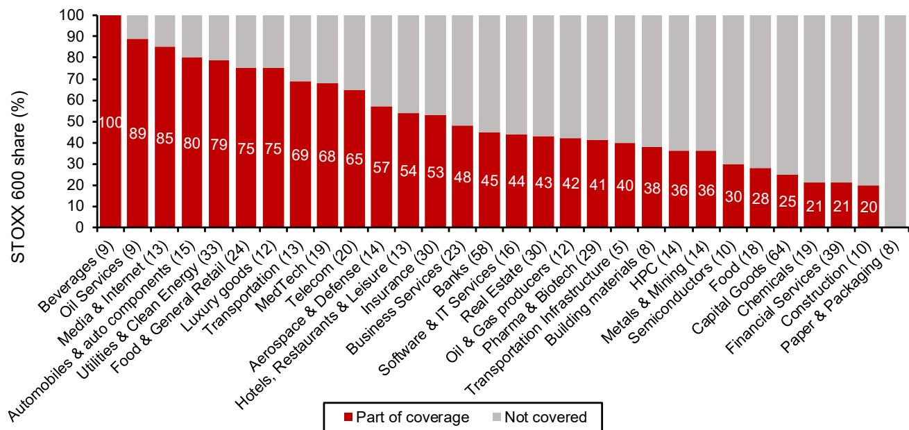
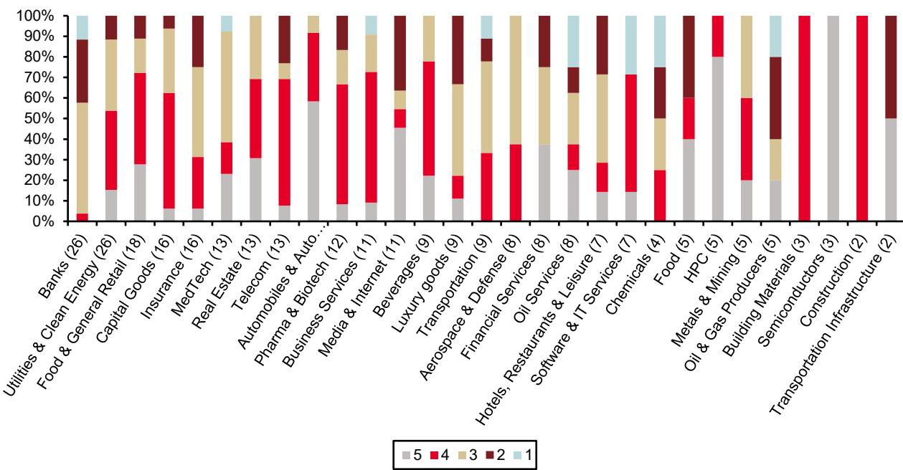
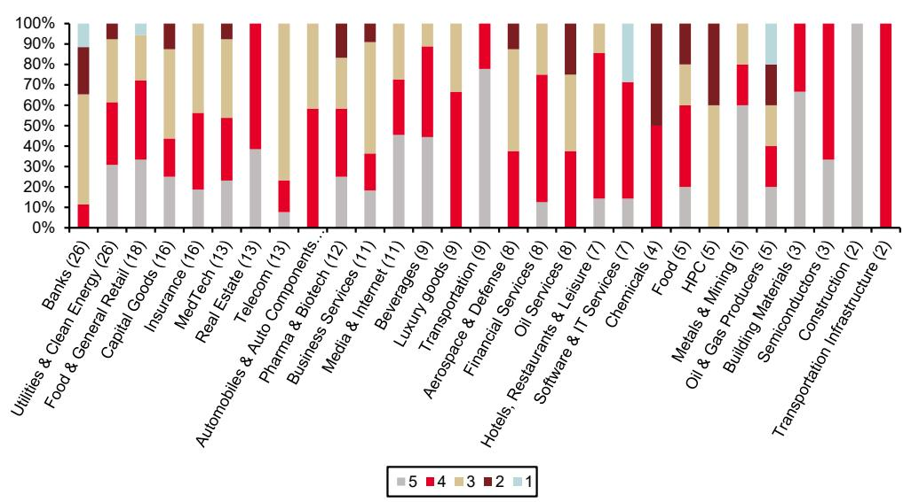

# Bernstein：STOXX600碳评分揭示，消费医疗领先，材料公用承压

碳已经从ESG披露指标变成了财务变量。2024年全球平均气温首次超过工业化前水平1.5摄氏度，达到约1.55摄氏度。按照当前排放速度，剩余碳预算仅够维持大约三年。Bernstein与SG联合发布的STOXX 600企业碳工具包更新报告指出，读者面临的核心问题不再是“这家公司排了多少碳”，而是“它的转型计划是否可信”。

报告构建了一套四维评分体系，覆盖碳强度、碳强度趋势、减排雄心与执行能力，对STOXX 600成分股进行了系统排名。其核心结论是：读者不需要在回报与脱碳之间做选择。那些既能降低碳暴露、又能维持财务表现的公司，正在成为资金重新配置过程中的受益者。

## 1. 监管碎片化不改变方向，只改变不确定性形式

全球碳定价机制并未统一，但方向已经明确。欧盟2026年将迎来一系列关键决策节点：EU ETS审查、CBAM碳边境调节机制落地、SFDR 2.0取代现行的Article 6/8/9分类体系。SFDR 2.0的核心变化在于，它将从“是否已经绿色”转向“是否在可信地变绿”，新增一个“转型”类别，允许高排放行业通过有资金支持的转型计划获得资本。

对于跨国企业而言，监管碎片化带来的不是豁免，而是基差不确定性。一家公司在某个地区没有碳成本，不代表它在另一个市场不会面临碳边境税或供应链碳披露要求。报告认为，忽视碳排放本身就是一种持仓决策——持有那些商业模式、资本开支与资产基础与低碳世界脱节的公司，意味着被动承担未来政策收紧时的调整成本。

> **KC评论：** 报告没有说所有行业都必须立刻零碳，而是指出“未管理的排放”正在变成一种隐性负债。SFDR 2.0的转型标签意味着，高排放但有好计划的公司，反而可能比低排放但无计划的公司更容易获得资金。

## 2. 评分体系揭示了一个反直觉的行业分布

报告将STOXX 600中每个行业得分最高的两家公司组成一个等权篮子，回测显示该篮子自2019年至2026年6月持续跑赢STOXX 200大盘指数。这意味着大型公司投入转型的努力，正在转化为成本优化和竞争优势。

行业层面的评分结果值得注意。消费必需品和医疗保健整体评分靠前，而材料和公用事业则面临更大挑战。但具体到公司层面，差异远大于行业均值。例如，在油气生产商中，英国石油的雄心评分仅为1分（满分5分），但执行评分高达5分；而埃尼的雄心评分为5分，执行评分仅为1分。这种“说得多做得少”与“做得多说得少”的对比，恰好是评分体系要捕捉的信号——读者需要同时看目标和执行，不能只看一面。

在汽车行业，梅赛德斯-奔驰的雄心与执行评分分别为4分和5分，而斯特兰蒂斯两项均为3分。在半导体领域，ASML两项均为5分，而BE半导体工业执行评分虽高但雄心只有4分。报告通过分析师交叉验证，将绿色资本开支、研发投入和董事会激励与脱碳目标的挂钩程度纳入执行评分，这使得评分不仅反映公开承诺，也反映实际资源分配。

## 3. 一个可复用的观察框架：同时看碳得分与股东回报

报告提供了一个实用的筛选框架：在STOXX 600中，同时筛选碳得分最高和未来12个月预期股东总回报（TSR）最高的公司。这种二维筛选帮助读者定位那些既有脱碳执行力、又有财务回报潜力的标的。

2025年全球能源转型研究达到创纪录的2.3万亿美元，同比增长8%，其中清洁能源供应研究连续第二年超过化石燃料。资金正在向转型受益者集中，而评分体系的作用是帮助读者区分哪些公司是真正的受益者，哪些只是价值陷阱。

报告没有回避Scope 3排放数据的薄弱环节——范围三排放的披露质量和可比性仍是整个体系中最弱的环节。但报告认为，即使存在数据缺口，基于现有信息的评分体系仍然比完全依赖历史排放数据更有决策价值。

> **KC评论：** 这套框架的核心价值不在于给出一个“买什么”的清单，而在于提供了一种结构化的追问方式：这家公司的资本开支是否与其脱碳目标一致？董事会考核指标中是否包含碳相关KPI？如果答案是否定的，那么再好的公开承诺也可能只是公关。

For informational purposes only. Portions may be generated,translated,summarized,or edited with AI assistance based on source materials and may contain omissions or errors. Please verify independently. This is not investment,legal,tax,accounting,or other professional advice.

For informational purposes only. Portions may be generated,translated,summarized,or edited with AI assistance based on source materials and may contain omissions or errors. Please verify independently. This is not investment,legal,tax,accounting,or other professional advice.

