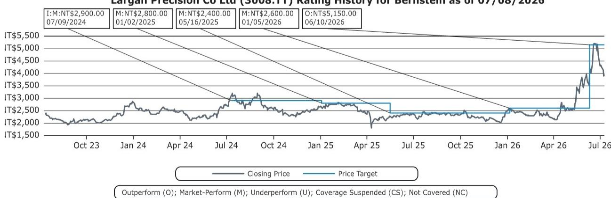
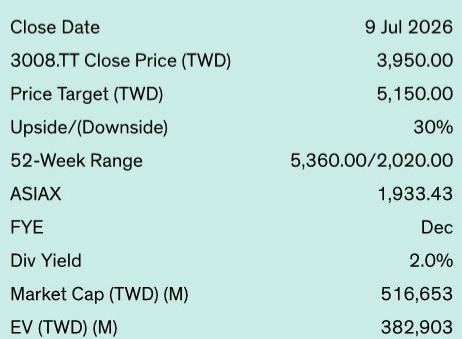
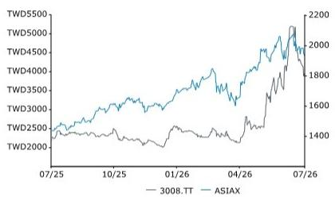

# Largan的共封装光学转型已非理论——营收拐点现已可见

大立光2026年第二季度财报电话会议中的一个数据点，比该季度的财务业绩本身更能改变市场叙事。营收为136.67亿新台币，同比增长17%，毛利率为49.4%——比市场共识低约40个基点。盈利略低于预期，约比预期低1%。但真正的故事在于管理层对共封装光学（CPO）业务的更新。公司确认，光纤阵列（FA）组件的自动化试验线最早可能在2027年中期开始产生可观的营收。这一时间表略早于此前预期，此前假设2027年仅贡献1%的销售额。更重要的是，这些FA组件的单件价值可能高于当前模型中假设的镜头价值。CPO的机会不再是一个遥远的期权；它正在成为一个近期的盈利驱动力。

时机很重要，因为它恰逢大立光核心智能手机镜头业务的转型期。iPhone 18的可变光圈（VA）镜头的大规模出货计划在第三季度，第二季度贡献极小。管理层描述这些镜头的颗粒控制要求“显著严格于”之前的潜望式镜头，使其成为近年来最具挑战性的高端镜头转型之一。公司同时在其传统业务中应对复杂的制造爬坡，同时为全新的光学组件类别建设生产基础设施。风险回报的计算已经改变。该公司的报价因行业层面的去杠杆化而回落，但CPO可见度的提高为财报后的重新定价创造了空间。

看好大立光的论点基于三个相互关联的发展：CPO光纤阵列机会的进展快于预期，且单件价值高于预期；公司在光栅耦合（GC）架构中的竞争定位在结构上独立于主要竞争方案；核心智能手机镜头升级周期仍然完好，尽管VA镜头爬坡带来近期的毛利率压力。这些因素相互强化，为到2027年的盈利加速创造了复合案例。

## CPO光纤阵列组件进展快于预期，单件价值超过当前模型假设

第二季度电话会议中最具影响力的更新是大立光CPO光纤阵列时间表的加速。管理层确认，自动化FA组件试验线最早可能在2027年中期开始产生可观的营收，这比此前预期2027年仅贡献1%的销售额要早。公司已收到正式的客户规格，并预计很快交付样品，试验生产线计划在2026年第三季度末。这不是一个模糊的研发愿景；这是一个有客户参与的具体制造时间表。

战略意义不仅限于时间。管理层表示，FA组件的单件价值可能高于当前财务模型中包含的镜头价值。对于一家营收主要来自智能手机相机镜头的公司来说，在新终端市场中引入更高价值的光学组件代表了一个重要的营收和利润率机会。目前的重点是FA组件，而不是完整的光纤阵列单元（FAU）模块，但扩展到FAU并不受与FAU供应商现有关系的限制。进入模块的决定将取决于终端客户需求，而不是供应链障碍。

大立光在这一领域的竞争优势是精密对准。管理层明确将这一点确定为公司核心优势，尽管指出产品设计与同行相似。公司还开发了专有的测试和制造设备，这支持了高效的良率管理和可扩展的产能扩张。这些不是微不足道的优势。在CPO中，对准公差以亚微米范围衡量，大规模实现并维持这些公差的能力是主要的进入壁垒。大立光在智能手机相机高精度光学制造方面数十年的经验直接转化为这一新领域。

## 光栅耦合架构保护大立光免受主要竞争威胁

CPO机会的一个关键但被低估的方面是光栅耦合（GC）和边缘耦合（EC）之间的架构选择。管理层表示，来自康宁的竞争压力似乎有限，因为康宁的玻璃桥接解决方案主要针对边缘耦合设计，而非大立光专注的光栅耦合。这不是一个细微的差别。两种方法具有根本不同的光路设计、对准要求和制造工艺。为GC优化的公司不会自动在EC中竞争，反之亦然。

管理层预计GC在未来三年内仍将是主要的CPO架构。如果这一预测成立，大立光的定位在战略上是有利的。公司并非与一个资本雄厚的现有企业在不同技术领域正面竞争。相反，它正在构建行业可能大规模采用的架构能力。风险在于GC的采用可能慢于预期，或者竞争架构可能获得份额。但基于客户规格和试验线时间表的当前轨迹支持GC主导的观点。

这一架构护城河由专有设备优势加强。大立光并非依赖现成的制造工具；它开发了自己的测试和生产设备。这使公司能够控制良率、周期时间和产能扩张，这是使用标准设备的合同制造商或光学组件供应商无法比拟的。在高精度、高批量的制造环境中，设备所有权是结构性优势，而非战术性优势。

## FAU镜头路线图更为复杂，但公司选择了正确的技术路径

除了FA组件，大立光还在开发FAU模块的镜头。正在考虑三种技术路径：模压玻璃镜头、硅镜头和超透镜。管理层专注于模压玻璃镜头，其间距误差低于硅镜头，精度更高，尽管成本较高且存在热性能权衡。公司对超透镜不太看好，理由是材料限制、粘合工艺和基于棱镜的光传输相关的效率损失，尽管其理论精度很高。

选择模压玻璃在战略上是合理的。在CPO应用中，光学精度至关重要，镜头故障的成本——信号损失、发热或系统返工——极高。硅镜头可能更便宜且更容易制造，但它们会引入降低耦合效率的间距误差。超透镜提供理论精度，但面临尚未大规模解决的实践实施挑战。模压玻璃处于务实的中间位置：成本较高，但可制造性已得到验证，精度优越。

管理层承认，在产品规格最终确定之前，比较模压玻璃和硅方法的竞争力仍为时过早。这是一个审慎的立场。CPO镜头的技术格局仍在演变，最佳解决方案可能因应用、波长和功率预算而异。但通过投资于技术要求最高的路径，大立光正在为市场最高价值部分定位。如果行业趋同于模压玻璃作为首选解决方案，大立光将在制造规模和良率学习方面拥有先发优势。

## 核心智能手机镜头升级周期仍然完好，但近期毛利率压力真实存在

CPO机会是附加性的，而非替代性的。大立光的核心业务仍然是智能手机相机镜头，iPhone 18的升级周期是关键的近期驱动力。VA镜头的大规模出货预计在第三季度，第二季度贡献极小。管理层指出，颗粒控制要求显著严格于之前的潜望式镜头，使其成为近年来最具挑战性的高端镜头转型之一。

毛利率影响已经可见。2026年第二季度毛利率为49.4%，环比持平，但低于去年同期的53.6%。压缩反映了新产品（包括VA镜头）爬坡的成本以及相关的良率学习曲线。管理层表示，第三季度的盈利能力将高度取决于这些新VA产品的良率爬坡。如果良率改善快于预期，利润率可能迅速恢复。如果爬坡较慢，利润率压力可能持续到第四季度。

然而，更广泛的智能手机镜头升级周期仍然完好。虽然一些安卓原始设备制造商因内存成本上升而推迟相机升级，但管理层表示其关键客户的规格升级仍在继续。进一步的潜望式增强、改进的变焦能力和更高分辨率的相机已在为明年的发布进行开发。这表明高端镜头升级周期并未被取消或显著延迟；它正在集中于领先的智能手机原始设备制造商。对于大立光来说，其营收的很大一部分来自最大客户，这种集中是顺风，而非逆风。

## 评估大立光风险回报特征的决策框架

对于以当前报价3,950新台币评估大立光的研究者来说，决策框架应围绕三个变量构建：CPO营收的时间和规模、智能手机镜头毛利率的轨迹，以及GC与EC架构的竞争动态。

第一个变量最重要且最不确定。如果CPO FA组件营收如管理层现在所指出的在2027年中期开始实现，并且单件价值确实高于当前模型假设，那么当前对2027年的盈利估计可能过低。2027年1%销售额贡献的基本情况现在看起来保守。上行情况是，到2028年CPO营收成为有意义的贡献者，随着公司从试验线转向批量生产，推动营收加速和利润率扩张。

第二个变量是智能手机镜头毛利率轨迹。VA镜头爬坡导致近期毛利率压缩，但这是周期性而非结构性的现象。如果良率在第三和第四季度改善，毛利率应恢复到50-52%范围。如果爬坡较慢，利润率可能保持在50%以下直至2027年初。关键监测点是2026年第三季度财报电话会议中的良率评论。积极的更新将消除该报价的主要近期压力。

第三个变量是GC与EC架构的争论。管理层预计GC在未来三年内仍将占主导地位，这是一个关键假设。如果行业转向EC，或者康宁的玻璃桥接解决方案在GC应用中获得牵引力，大立光的竞争地位可能受到侵蚀。公司的专有设备和精密对准能力在任何架构中都有价值，但具体产品定位需要调整。风险是可控的，但不可忽视。

综合来看，这三个变量创造了一个不对称的上行风险回报特征。下行风险是CPO营收延迟、智能手机利润率保持压缩，以及该报价相对于历史倍数折价交易。上行风险是CPO营收加速、利润率恢复，以及近期推动报价疲软的行业层面去杠杆化是一个战术性入场点，而非基本面信号。

## 智能手机与CPO光学制造的融合创造了复合优势

大立光当前定位中最被低估的方面是其传统智能手机镜头制造能力与新CPO雄心之间的融合。大立光在智能手机相机镜头生产数十年中开发的精密对准、专有设备和良率管理专业知识可直接转移到CPO光纤阵列和镜头制造。公司并非从零开始；它正在将现有能力集扩展到新应用。

这种融合创造了复合优势。随着大立光为iPhone 18爬坡VA镜头生产，它同时正在构建将支撑其CPO生产的制造流程、质量体系和良率数据。一个领域的学习滋养另一个领域。VA镜头的颗粒控制要求是行业中最严格的之一，掌握它们使公司为CPO所需的更严格公差做好准备。为智能手机镜头开发的专有测试设备可适用于CPO应用。为镜头制造建立的供应链关系可用于FA组件生产。

这不是一个多元化故事。这是一个能力扩展故事。大立光并非进入一个全新的业务；它正在将高精度光学制造的核心竞争力应用于一个新的、更高价值的市场。智能手机镜头业务提供营收基础、制造规模和良率学习曲线。CPO业务提供增长向量和利润率扩张机会。两者是互补的，而非竞争的。

2026年第二季度的证据支持这一解释。毛利率和每股盈利的轻微不及预期是短期噪音。CPO时间表的加速是结构性信号。关注前者的人将错过后者。CPO的机会正在变得真实，拐点现已可见。

*仅供参考。部分内容可能基于源材料通过AI辅助生成、翻译、总结或编辑，可能存在遗漏或错误。请独立核实。这不是研究、法律、税务、会计或其他专业建议。*

仅供参考。部分内容可能基于源材料通过AI辅助生成、翻译、总结或编辑，可能存在遗漏或错误。请独立核实。这不是研究、法律、税务、会计或其他专业建议。

