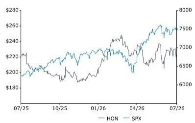

Rating

Market-Perform

Price Target

HON

243.00 USD (233.00 OLD)

Steve Song  
+1 917 344 8401  
steve.song@bernsteinsg.com

# Honeywell Technologies: Model update to account for Aerospace spin

Honeywell recently spun off its aerospace business (HONA). This was followed by updated guidance for the RemainCo. along with some mechanical changes (e.g., a reverse stock split).

To account for this new information, we have updated our financials and EPS estimates to reflect valuation of the remainco. ex-Aerospace, different share count, and the value of their stake in Quantinuum.

We use a 20x NTM + 1 P/E multiple to value Honeywell and an NTM + 1 EPS of \$10.19. Our EPS numbers have changed to account for new below the line items. The multiple remains unchanged from our previous model. This implies a base valuation of \$204 per share. We then add approximately \$39 per share to account for their stake in Quantinuum. This is based on a target price of \$94 (see Bernstein's initiation on QNT here) and a Honeywell ownership stake of approximately 50%. Adding them together, this gives us a 12-month target price of \$243.

We share our reflections of their investor day here and offer a broader thesis on the Honeywell RemainCo. here.

## Investment Implications

We rate Honeywell Market-Perform with a \$243 target price.

<table><tr><td>Close Date</td><td></td><td></td><td colspan="2">9 Jul 2026</td></tr><tr><td>HON Close Price (USD)</td><td></td><td></td><td colspan="2">223.42</td></tr><tr><td>Price Target (USD)</td><td></td><td></td><td colspan="2">243.00</td></tr><tr><td>Upside/(Downside)</td><td></td><td></td><td colspan="2">9%</td></tr><tr><td>52-Week Range</td><td></td><td></td><td colspan="2">260.15/195.77</td></tr><tr><td>SPX</td><td></td><td></td><td colspan="2">7,543.64</td></tr><tr><td>FYE</td><td></td><td></td><td colspan="2">Dec</td></tr><tr><td>Div Yield</td><td></td><td></td><td colspan="2">4.2%</td></tr><tr><td>Market Cap (USD) (M)</td><td></td><td></td><td colspan="2">71,983</td></tr><tr><td>EV (USD) (M)</td><td></td><td></td><td colspan="2">98,421</td></tr><tr><td>Performance</td><td>YTD</td><td>1M</td><td>6M</td><td>12M</td></tr><tr><td>Absolute (%)</td><td>11.1</td><td>5.2</td><td>4.5</td><td>(2.9)</td></tr><tr><td>SPX (%)</td><td>10.2</td><td>2.1</td><td>8.3</td><td>20.4</td></tr><tr><td>Relative (%)</td><td>0.9</td><td>3.1</td><td>(3.8)</td><td>(23.3)</td></tr><tr><td colspan="5">Source: Bloomberg, Bernstein estimates and analysis.</td></tr></table>

Price Performance, 1YR

<table><tr><td>Adjusted EPS</td><td>F25A</td><td>F26E</td><td>F27E</td></tr><tr><td>HON (USD)</td><td>6.46</td><td>8.26</td><td>10.02</td></tr><tr><td>OLD</td><td>--</td><td>10.42</td><td>11.37</td></tr></table>

Source: Bloomberg, Bernstein estimates and analysis.

<table><tr><td>Valuation Metrics</td><td>F25A</td><td>F26E</td><td>F27E</td></tr><tr><td>Adjusted P/E (x)</td><td>34.6</td><td>27.0</td><td>22.3</td></tr></table>

## DETAILS

## EXHIBIT 1: Honeywell Technologies (RemainCo) Valuation Approach

VALUATION FRAMEWORK (RemainCo.)

<table><tr><td>EPS (NTM + 1)</td><td>$10.19</td></tr><tr><td>P/E Multiple</td><td>20</td></tr><tr><td>Implied Share Price</td><td>$204</td></tr></table>

<table><tr><td>Quantinuum ownership share</td><td>49%</td></tr><tr><td>Quantinuum target price ($)</td><td>$94</td></tr><tr><td>Quantinuum share count (M)</td><td>268</td></tr><tr><td>Value per share of QNT stake</td><td>$39</td></tr></table>

<table><tr><td>Implied Honeywell share price (12 month target)</td><td>$243</td></tr><tr><td>Current Share Price</td><td>$226</td></tr><tr><td>Upside / Downside</td><td>7%</td></tr></table>

Source: Bernstein Analysis and Estimates, Bernstein Global Software Team

## APPENDIX - FINANCIAL FORECASTS

EXHIBIT 2: HON financial summary

<table><tr><td>Income Statement (M)</td><td>FY2024A</td><td>FY2025A</td><td>FY2026E</td><td>FY2027E</td><td>FY2028E</td><td>FY2029E</td><td>FY2030E</td></tr><tr><td>New Equipment</td><td>14,344</td><td>14,579</td><td>14,686</td><td>15,181</td><td>15,659</td><td>16,365</td><td>17,239</td></tr><tr><td>Services</td><td>4,937</td><td>5,366</td><td>5,691</td><td>5,883</td><td>6,068</td><td>6,342</td><td>6,680</td></tr><tr><td>Total revenue</td><td>19,281</td><td>19,945</td><td>20,378</td><td>21,064</td><td>21,727</td><td>22,707</td><td>23,920</td></tr><tr><td>Total Gross Profit</td><td>7,774</td><td>7,880</td><td>7,993</td><td>8,215</td><td>8,474</td><td>8,856</td><td>9,568</td></tr><tr><td>Underlying EBIT</td><td>2,678</td><td>2,474</td><td>3,615</td><td>4,239</td><td>4,691</td><td>4,867</td><td>5,445</td></tr><tr><td>Group EBIT margin</td><td>13.9%</td><td>12.4%</td><td>17.7%</td><td>20.1%</td><td>21.6%</td><td>21.4%</td><td>22.8%</td></tr><tr><td>Net Income to shareholders</td><td>1,302</td><td>1,368</td><td>2,417</td><td>2,983</td><td>3,351</td><td>3,473</td><td>3,843</td></tr><tr><td>Diluted underlying EPS ($)</td><td>6.04</td><td>6.46</td><td>8.26</td><td>10.02</td><td>10.78</td><td>12.12</td><td>12.55</td></tr><tr><td>Diluted shares outstanding (m)</td><td>328</td><td>321</td><td>319</td><td>318</td><td>316</td><td>314</td><td>312</td></tr></table>

<table><tr><td>Balance Sheet (M)</td><td>FY2024A</td><td>FY2025A</td><td>FY2026E</td><td>FY2027E</td><td>FY2028E</td><td>FY2029E</td><td>FY2030E</td></tr><tr><td>PP&amp;E</td><td>6,194</td><td>4,629</td><td>3,094</td><td>3,894</td><td>4,694</td><td>5,494</td><td>6,294</td></tr><tr><td>Other non-current assets</td><td>47,288</td><td>43,294</td><td>43,353</td><td>43,293</td><td>43,233</td><td>43,173</td><td>43,113</td></tr><tr><td>Other current assets</td><td>27,908</td><td>30,387</td><td>33,129</td><td>35,937</td><td>39,124</td><td>42,485</td><td>46,206</td></tr><tr><td>Cash and cash equivalents</td><td>10,953</td><td>12,930</td><td>12,220</td><td>14,787</td><td>17,713</td><td>20,704</td><td>24,006</td></tr><tr><td>Total assets</td><td>75,196</td><td>73,681</td><td>76,482</td><td>79,230</td><td>82,357</td><td>85,658</td><td>89,319</td></tr><tr><td>Current liabilities ex-debt</td><td>15,636</td><td>15,975</td><td>14,481</td><td>14,584</td><td>14,696</td><td>14,855</td><td>14,997</td></tr><tr><td>Total debt</td><td>31,099</td><td>34,580</td><td>20,888</td><td>20,888</td><td>20,888</td><td>20,888</td><td>20,888</td></tr><tr><td>Pension</td><td>112</td><td>111</td><td>108</td><td>108</td><td>108</td><td>108</td><td>108</td></tr><tr><td>Other non-current liabilities</td><td>9,188</td><td>7,985</td><td>23,964</td><td>23,964</td><td>23,964</td><td>23,964</td><td>23,964</td></tr><tr><td>Minorities</td><td>542</td><td>1,126</td><td>973</td><td>989</td><td>1,005</td><td>1,021</td><td>1,037</td></tr><tr><td>Total equity ex-minorities</td><td>18,619</td><td>13,904</td><td>16,069</td><td>18,697</td><td>21,696</td><td>24,823</td><td>28,326</td></tr><tr><td>Total equity and liabilities</td><td>75,196</td><td>73,681</td><td>76,482</td><td>79,230</td><td>82,357</td><td>85,658</td><td>89,319</td></tr></table>

<table><tr><td>Cash Flow Statement (M)</td><td>FY2024A</td><td>FY2025A</td><td>FY2026E</td><td>FY2027E</td><td>FY2028E</td><td>FY2029E</td><td>FY2030E</td></tr><tr><td>Underlying EBIT</td><td>2,678</td><td>2,474</td><td>3,615</td><td>4,239</td><td>4,691</td><td>4,867</td><td>5,445</td></tr><tr><td>Deprecitation &amp; Amortisation</td><td>1,288</td><td>1,493</td><td>1,452</td><td>1,460</td><td>1,460</td><td>1,460</td><td>1,460</td></tr><tr><td>Working capital</td><td>(375)</td><td>(791)</td><td>(2,539)</td><td>(138)</td><td>(149)</td><td>(211)</td><td>(277)</td></tr><tr><td>Net capex</td><td>(1,072)</td><td>(1,173)</td><td>(1,273)</td><td>(1,400)</td><td>(1,400)</td><td>(1,400)</td><td>(1,400)</td></tr><tr><td>Other cash movements</td><td>123</td><td>(83)</td><td>(946)</td><td>(1,595)</td><td>(1,676)</td><td>(1,725)</td><td>(1,926)</td></tr><tr><td>Change in cash and cash equivalents</td><td>2,642</td><td>1,920</td><td>309</td><td>2,566</td><td>2,926</td><td>2,991</td><td>3,302</td></tr></table>

Source: Bloomberg, Company reports, Bernstein estimates and analysis

## BERNSTEIN TICKER TABLE

<table><tr><td colspan="3"></td><td rowspan="2">9 Jul 2026 Closing Price Target</td><td rowspan="2">Price Perf.</td><td rowspan="2">TTM Rel.</td><td colspan="4">Adjusted EPS</td><td colspan="3">Adjusted P/E (x)</td></tr><tr><td>Ticker</td><td>Rating</td><td>Cur</td><td>Cur</td><td>2025A</td><td>2026E</td><td>2027E</td><td>2025A</td><td>2026E</td><td>2027E</td></tr><tr><td>HON (Honeywell)</td><td>M</td><td>USD</td><td>223.42</td><td>243.00</td><td>(23.3)%</td><td>USD</td><td>6.46</td><td>8.26</td><td>10.02</td><td>34.6</td><td>27.0</td><td>22.3</td></tr><tr><td>OLD</td><td></td><td></td><td></td><td>233.00</td><td></td><td></td><td></td><td>10.42</td><td>11.37</td><td></td><td></td><td></td></tr><tr><td>SPX</td><td></td><td></td><td>7,543.64</td><td></td><td></td><td></td><td></td><td></td><td></td><td></td><td></td><td></td></tr></table>

## PRICE TARGET CHANGE / ESTIMATE CHANGE IN BOLD

O - Outperform, M - Market-Perform, U - Underperform, NR - Not Rated, CS - Coverage Suspended Source: Bloomberg, Bernstein estimates and analysis.

## I. REQUIRED DISCLOSURES

References to "Bernstein" or the "Firm" in these disclosures relate to the following entities: Bernstein Institutional Services LLC (April 1, 2024 onwards), Bernstein & Co., LLC (pre April 1, 2024), Bernstein Autonomous LLP, BSG France S.A. (April 1, 2024 onwards), Bernstein (Hong Kong) Limited 盛博香港有限公司, Bernstein (Canada) Limited, Bernstein (India) Private Limited (SEBI registration no. INH000006378), Bernstein (Singapore) Private Limited, Bernstein Japan KK (サンフォード・C・バーンスタイン株式会社) and analysts employed by SG Africa Technologies & Services to produce Bernstein under a Global Services Agreement in place between Bernstein and SG.

Bernstein is part of a joint venture between SG (SG) and AllianceBernstein, L.P. (AB). Unless specifically noted otherwise, for purposes of these disclosures, references to Bernstein's "affiliates" relate to both SG and AB and their respective affiliates.

## VALUATION METHODOLOGY

## Honeywell International Inc

We value Honeywell (including the Aerospace business) at 20x NTM + 1 EPS (estimated at \$10.19) giving us a target price for the full business of \$204. We add another \$39 based on the value of their stake in QNT (assuming a \$94 target price). This implies an overall \$243 target price.

## RISKS

## Honeywell International Inc

Upside: (i) Continued growth in Building Automation, Positive uptake of Forge product reflecting in more recurring revenue, Margin expansion in IA business post WWS / PPS spin

Downside: (i) Power prices stay stable or decline as supply comes online (reducing impetus for building automation), (ii) Weakness / delays in LNG projects which market is not pricing, (iii) Organizational drag from spin-off of aerospace

## RATINGS DEFINITIONS, BENCHMARKS AND DISTRIBUTION

## EQUITY RATINGS DEFINITIONS

## Bernstein brand

The Bernstein brand rates stocks based on forecasts of relative performance for the next 12 months versus the S&P 500 for stocks listed on the U.S. and Canadian exchanges, versus the Bloomberg Europe Developed Markets Large and Mid Cap Price Return Index EUR (EDME) for stocks listed on the European exchanges and emerging markets exchanges outside of the Asia Pacific region, versus the Bloomberg Japan Large and Mid Cap Price Return Index USD (JPL) for stocks listed on the Japanese exchanges, and versus the Bloomberg Asia ex-Japan Large and Mid Cap Price Return Index (ASIAX) for stocks listed on the Asian (ex-Japan) exchanges -unless otherwise specified.

The Bernstein brand has three categories of ratings:

\- Outperform: Stock will outpace the market index by more than 15 pp

• Market-Perform: Stock will perform in line with the market index to within +/-15 pp

\- Underperform: Stock will trail the performance of the market index by more than 15 pp

Coverage Suspended: Coverage of a company under the Bernstein brand has been suspended. Ratings and price targets are suspended temporarily, are no longer current, and should therefore not be relied upon.

Not Rated: A rating assigned when the stock cannot be accurately valued, or the performance of the company accurately predicted, at the present time. The covering analyst may continue to publish research reports on the company to update investors on events and developments.

Not Covered (NC) denotes companies that are not under coverage.

Bernstein brand stock ratings are based on a 12-month time horizon.

## Autonomous brand – common stocks

The Autonomous brand rates common stocks as indicated below. As our benchmarks we use the Bloomberg Europe 600 Financials Price Return Index (E600BK) and Bloomberg Europe Dev Mkt Financials Large and Mid Cap Price Ret Index EUR (EDMFI) index for developed European banks and Payments, the Bloomberg Europe 600 Insurance Price Return Index (E600IN) for European insurers, the S&P 500 and S&P Financials for US banks and Payments coverage, S5LIFE for US Insurance, the S&P Insurance Select Industry (SPSIINS) for US Non-Life Insurers coverage, and the Bloomberg Emerging Markets Financials Large, Mid and Small Cap Price Return Index (EMLSF) for emerging market banks and insurers and Payments. Ratings are stated relative to the sector (not the market).

The Autonomous brand has three categories of common stock ratings:

\- Outperform (OP): Stock will outpace the relevant index by more than 10 pp

\- Neutral (N): Stock will perform in line with the market index to within $+/-10$ pp

\- Underperform (UP): Stock will trail the performance of the relevant index by more than 10 pp

Coverage Suspended: Coverage of a company under the Autonomous research brand has been suspended. Ratings and price targets are suspended temporarily, are no longer current, and should therefore not be relied upon.

Not Rated: A rating assigned when the stock cannot be accurately valued, or the performance of the company accurately predicted, at the present time. The covering analyst may continue to publish research reports on the company to update investors on events and developments.

Those denoted as 'Feature' (e.g., Feature Outperform FOP, Feature Under Outperform FUP) are our core ideas.

Not Covered (NC) denotes companies that are not under coverage.

Autonomous brand common stock ratings are based on a 12-month time horizon.

## Autonomous brand – preferred stocks

The Autonomous brand has three categories of preferred stock ratings:

\- Outperform (OP): The total return of the preferred instrument is expected to outperform preferred securities of other issuers operating in similar sectors or rating categories over the next six months.

\- Neutral (N): The total return of the preferred instrument is expected to perform in line with preferred securities of other issuers operating in similar sectors or rating categories over the next six months.

\- Underperform (UP): The total return of the preferred instrument is expected to underperform preferred securities of other issuers operating in similar sectors or rating categories over the next six months.

Autonomous preferred stock ratings are based on a 6-month time horizon.

## AUTONOMOUS CREDIT RESEARCH

Where this report contains investment recommendations for credit instruments, as defined in article 3(1)(35) of the Market Abuse Regulation, the information below is presented to comply with its disclosure requirements.

The report may also include reference(s) to published opinions by other Autonomous or Bernstein analysts covering the equity securities of the issuer(s) referenced herein. Please note an investment recommendation for credit instruments published by the author(s) of this report may differ from the published view of the analyst covering equity securities for the issuer(s) contained in this report and vice versa.

## CREDIT RATINGS DEFINITIONS

The Autonomous brand has three categories of credit ratings:

\- Credit Outperform (C-OP): The total return of the Reference Credit Instrument is expected to outperform the credit spread of bonds of other issuers operating in similar sectors or rating categories over the next six months.

\- Credit Neutral (C-N): The total return of the Reference Credit Instrument is expected to perform in line with the credit spread of bonds of other issuers operating in similar sectors or rating categories over the next six months.

\- Credit Underperform (C-UP): The total return of the Reference Credit Instrument is expected to underperform the credit spread of bonds of other issuers operating in similar sectors or rating categories over the next six months.

Autonomous credit ratings are based on a 6-month time horizon.

A list of all investment recommendations produced by the author(s) of this report alongside credit ratings history are available upon request.

It is at the sole discretion of the Firm as to when to initiate, update and cease research coverage. The Firm has established, maintains and relies on information barriers to control the flow of information contained in one or more areas (i.e. the private side) within the Firm, and into other areas, units, groups or affiliates (i.e. public side) of the Firm

DISTRIBUTION OF EQUITY RATINGS/INVESTMENT BANKING SERVICES

<table><tr><td>Equity Rating</td><td>Market Abuse Regulation (MAR) and FINRA Rating Category</td><td>Global Rating Distribution</td><td>Investment Banking Relationships*</td></tr><tr><td>Outperform</td><td>BUY</td><td>51.2%</td><td>15.3%</td></tr><tr><td>Market-Perform (Bernstein Brand) Neutral (Autonomous Brand)</td><td>HOLD</td><td>35.8%</td><td>16.2%</td></tr><tr><td>Underperform</td><td>SELL</td><td>13.1%</td><td>13.6%</td></tr></table>

\* These figures represent the percentage of companies within each equity rating category for which affiliates of Bernstein have provided investment banking services within the previous 12 months.
As of June 30, 2026. All figures are updated quarterly.

## PRICE CHARTS / RATINGS AND PRICE TARGET HISTORY

Honeywell International Inc (HON) Rating History for Bernstein as of 07/09/2026  

All price target and closing price data in the chart(s) above are denominated in the currency noted in the Ticker Table of this report.

## CONFLICTS OF INTEREST

SG and/or its affiliates beneficially own 0.5% or more of [the total issued share capital/any class of common equity securities] with a net [long/short] position of: Honeywell International Inc.

Bernstein and/or affiliates have received compensation for investment banking services in the past twelve months from Honeywell International Inc.

Bernstein and/or affiliates have received compensation for non-investment banking securities-related products or services in the previous twelve months from the following clients: Honeywell International Inc.

Bernstein and/or affiliates expect to receive or intend to seek compensation for investment banking services in the next three months from Honeywell International Inc.

Certain affiliates of Bernstein act as market maker or liquidity provider in the equities securities of: Honeywell International Inc.

Bernstein and/or affiliates had an investment banking client relationship during the past twelve months with Honeywell International Inc.

Affiliates of Bernstein managed or co-managed in the past twelve months a public offering of securities of Honeywell International Inc.

## OTHER MATTERS

The legal entity(ies) employing the analyst(s) listed in this report, and their location, can be determined by the country code of their phone number, as follows:

+1 Bernstein Institutional Services LLC; New York, New York, USA

+44 Bernstein Autonomous LLP; London UK

+212 SG Africa Technologies & Services; Casablanca, Morocco

+33 BSG France S.A.; Paris, France

+34 BSG France S.A.; Madrid, Spain

+41 Bernstein Autonomous LLP; Geneva, Switzerland

+49 BSG France S.A.; Frankfurt, Germany

+91 Bernstein (India) Private Limited; Mumbai, India

+852 Bernstein (Hong Kong) Limited 盛博香港有限公司; Hong Kong, China

+65 Bernstein (Singapore) Private Limited; Singapore

+81 Bernstein Japan KK; Tokyo, Japan

Where this report has been prepared by research analyst(s) employed by a non-US affiliate, such analyst(s), is/are (unless otherwise expressly noted below) not registered as associated persons of Bernstein Institutional Services LLC or any other SEC-registered broker-dealer and are not licensed or qualified as research analysts with FINRA. Accordingly, such analyst(s) may not be subject to FINRA's restrictions regarding (among other things) communications by research analysts with a subject company, interactions between research analysts and investment banking personnel, participation by research analysts in solicitation and marketing activities relating to investment banking transactions, public appearances by research analysts, and trading securities held by a research analyst account.

Where this report has been prepared by research analyst(s) employed by SG Africa Technologies & Services (part of the SG group of companies), it has been prepared on behalf of a Bernstein company under a Global Services Agreement in place between Bernstein and SG.

## CERTIFICATION

Each research analyst listed in this report, who is primarily responsible for the preparation of the content of this report, certifies that all of the views expressed in this publication accurately reflect that analyst's personal views about any and all of the subject securities or issuers and that no part of that analyst's compensation was, is, or will be, directly or indirectly, related to the specific recommendations or views in this publication.

## II. ADDITIONAL GLOBAL CONFLICT DISCLOSURES

It is at the sole discretion of the Firm as to when to initiate, update and cease research coverage. The Firm has established, maintains and relies on information barriers to control the flow of information contained in one or more areas (i.e., the private side) within the Firm, and into other areas, units, groups or affiliates (i.e., public side) of the Firm.

## III. OTHER IMPORTANT INFORMATION AND DISCLOSURES

Separate branding is maintained for "Bernstein" and "Autonomous" research products.

\- Bernstein produces a number of different types of research products including, among others, fundamental analysis and quantitative analysis under both the “Autonomous” and “Bernstein” brands. Recommendations contained within one type of research product may differ from recommendations contained within other types of research products, whether as a result of differing time horizons, methodologies or otherwise. Furthermore, views or recommendations within a research product issued under one brand may differ from views or recommendations under the same type of research product issued under the other brand. The Research Ratings System for the two brands and other information related to those Rating Systems are included in the previous section.

\- Autonomous operates as a separate business unit within the following entities: Bernstein Institutional Services LLC, Bernstein Autonomous LLP, Bernstein (Hong Kong) Limited 盛博香港有限公司 and Bernstein (India) Private Limited. For information relating to “Autonomous” branded products (including certain Sales materials) please visit: www.autonomous.com. For information relating to Bernstein branded products please visit: www.bernsteinresearch.com.

Analysts are compensated based on aggregate contributions to the research franchise as measured by account penetration, productivity and proactivity of investment ideas. No analysts are compensated based on performance in, or contributions to, generating investment banking revenues.

This report has been produced by an independent analyst as defined in Article 3 (1)(34)(i) of EU 596/2014 Market Abuse Regulation (“MAR”) and the same article of MAR as it forms part of United Kingdom domestic law by virtue of the European Union (Withdrawal) Act 2018.

To our readers in the United States: Bernstein Institutional Services LLC, a broker-dealer registered with the U.S. Securities and Exchange Commission (“SEC”) and a member of the U.S. Financial Industry Regulatory Authority, Inc. (“FINRA”) is distributing this publication in the United States and accepts responsibility for its contents. Where this material contains an analysis of debt product(s), such material is intended only for institutional investors and is not subject to the US independence and disclosure standards applicable to debt research prepared for retail investors.

Bernstein Institutional Services LLC may act as principal for its own account or as agent for another person (including an affiliate) in sales or purchases of any security which is a subject of this report. This report does not purport to meet the objectives or needs of any specific individuals, entities or accounts.

To our readers in Canada: If this publication pertains to a Canadian domiciled company, it is being distributed in Canada by Bernstein (Canada) Limited, which is licensed and regulated by the Canadian Investment Regulatory Organization. If the publication pertains to a non-Canadian domiciled company, it is being distributed by Bernstein Institutional Services LLC, which is licensed and regulated by both the SEC and FINRA, into Canada under the International Dealers Exemption.

This document may not be passed onto any person in Canada unless that person qualifies as "permitted client" as defined in Section 1.1 of NI 31-103.

To our readers in Brazil: This report has been prepared by Bernstein Institutional Services LLC, and Banco BTG Pactual S.A. ("BTG") is responsible for the distribution of this report in Brazil.

To readers in the United Kingdom: This publication has been issued or approved for issue in the United Kingdom by Bernstein Autonomous LLP, authorised and regulated by the Financial Conduct Authority and located at 60 London Wall, London EC2M 5SH, +44 (0)20-7170-5000. Registered in England & Wales No OC343985.

This document is for distribution only to persons who (i) have professional experience in matters relating to investments falling within Article 19(5) of the Financial Services and Markets Act 2000 (Financial Promotion) Order 2005 (as amended, the “Financial Promotion Order”), (ii) are persons falling within Article 49(2)(a) to (d) (“high net worth companies, unincorporated associations, etc.") of the Financial Promotion Order, (iii) are outside the United Kingdom, or (iv) are persons to whom an invitation or inducement to engage in investment activity (within the meaning of section 21 of the FSMA) in connection with the issue or sale of any securities may otherwise lawfully be communicated or caused to be communicated (all such persons together being referred to as “relevant persons”). This document is directed only at relevant persons and must not be acted on or relied on by persons who are not relevant persons. Any investment or investment activity to which this document relates is available only to relevant persons and will be engaged in only with relevant persons.

To our readers in the member states of the EEA: This publication is being distributed by BSG France SA, which is authorised and regulated by the Autorité de Contrôle Prudentiel et de Résolution (ACPR) and Autorité des Marchés Financiers (AMF).

To our readers in Hong Kong: This publication is being distributed in Hong Kong by Bernstein (Hong Kong) Limited 盛博香港有限公司, which is licensed and regulated by the Hong Kong Securities and Futures Commission (Central Entity No. AXC846) to carry out Type 4 (Advising on Securities) regulated activities and subject to the licensing conditions mentioned in the SFC Public Register (https://www.sfc.hk/publicregWeb/corp/AXC846/details)). This publication is solely for professional investors, as defined in the Securities and Futures Ordinance (Cap. 571). The purpose of this report is solely to provide an analysis of the issuers referred to in this report and is not intended for any purpose contrary to the laws of Hong Kong.

To our readers in Singapore: This publication is being distributed in Singapore by Bernstein (Singapore) Private Limited, only to accredited investors or institutional investors, as defined in the Securities and Futures Act 2001 of Singapore ("SFA"). Recipients in Singapore should contact Bernstein (Singapore) Private Limited in respect of matters arising from, or in connection with, this publication. Bernstein (Singapore) Private Limited is regulated by the Monetary Authority of Singapore and licensed under the SFA as a capital markets services licence holder for dealing in capital markets products that are securities and collective investment schemes and an exempt financial adviser for advising on, issuing and promulgating analyses and reports on securities. Bernstein (Singapore) Private Limited is registered in Singapore with Company Registration No. 20213710W and located at 8 Marina Boulevard, #12-01, Marina Bay Financial Centre, Singapore 018981, +65-6326-7000.

To our readers in the People's Republic of China: The securities referred to in this document are not being offered or sold and may not be offered or sold, directly or indirectly, in the People's Republic of China (for such purposes, not including the Hong Kong and Macau Special Administrative Regions or Taiwan, the "PRC") in contravention of any applicable laws of the PRC.

This document does not constitute an offer to sell or the solicitation of an offer to buy any securities in the PRC to any person to whom it is unlawful to make the offer or solicitation in the PRC.

We do not represent that this document may be law
