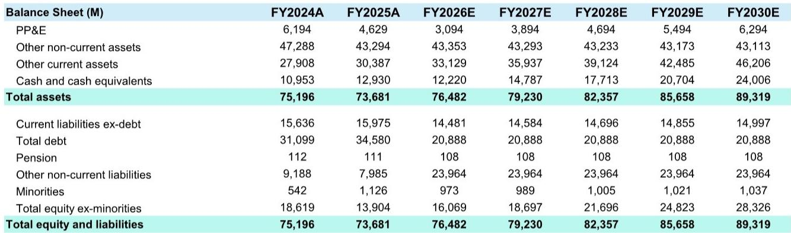
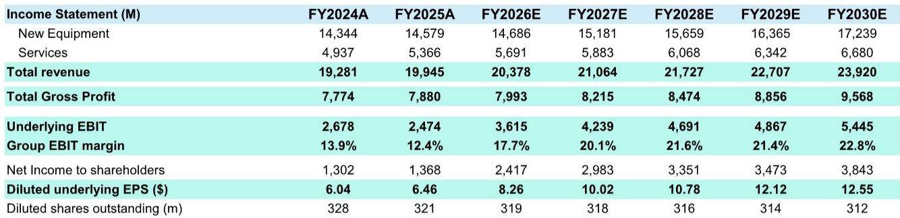
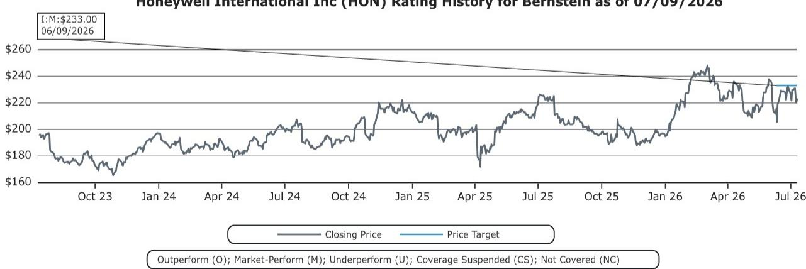

# Bernstein：利润率从12%到20%，Bernstein看霍尼韦尔分拆后的修复

霍尼韦尔刚刚完成了近年最重大的一次资产重组——剥离航空航天业务，成立独立的HONA公司。市场原本的注意力大多集中在“瘦身后的霍尼韦尔还剩什么”，但Bernstein这份更新报告给出了一个不太一样的判断：分拆后的RemainCo本身并不贵，真正的价值增量来自其持有的量子计算公司Quantinuum股权。

，较当前报价约有7%至9%的上行空间。这个数字本身并不激进，但估值结构值得拆开来看。Bernstein将霍尼韦尔的工业业务按20倍远期市盈率定价，对应每股约204美元；在此基础上，再单独加上Quantinuum持股的每股约39美元。换句话说，如果剔除量子计算这块资产，霍尼韦尔的传统业务估值其实相当克制。

## 1. 分拆后的财务结构正在变轻，但利润率改善需要时间

剥离航空航天后，霍尼韦尔RemainCo的收入结构更加聚焦于工业自动化、建筑科技和过程控制。从Bernstein的财务预测来看，2026年预计总收入约204亿美元，2027年增至约211亿美元，增速并不快。真正值得关注的是利润率的走势。

报告显示，集团EBIT利润率将从2025年的12.4%逐步爬升至2026年的17.7%，并在2027年突破20%。这个改善幅度不小，但需要留意的是，2025年的低基数部分受到分拆相关的一次性费用影响。剔除这些扰动后，利润率修复更多反映的是业务组合优化和运营杠杆的释放，而非需求端的强劲拉动。

> **KC评论：** 利润率从12%到20%的跃升，在工业公司中并不常见。读者需要区分哪些是分拆带来的会计调整，哪些是真正的经营改善。Bernstein的预测隐含了较为乐观的假设，实际执行节奏可能更慢。

## 2. Quantinuum是估值中最大的变量，也是最大的不确定性

这份报告最特别的地方，在于它对Quantinuum的定价方式。，霍尼韦尔持有约49%的股权，折算到每股霍尼韦尔公司的价值约为39美元。这意味着。

量子计算目前仍处于商业化早期，收入贡献微乎其微，但市场对其长期潜力的定价差异极大。Bernstein选择将这部分资产单独估值并叠加到传统业务之上，而不是将其隐含在整体市盈率中。这种处理方式的好处是透明——读者可以清楚看到，如果Quantinuum的估值发生变化，对霍尼韦尔整体价值的影响有多大。

但不确定性也同样明显。量子计算的商业化时间表、技术路线竞争、以及霍尼韦尔能否持续保持控股地位，都存在不确定性。报告在不确定性部分也提到了这一点，但并未展开讨论。

## 3. 20倍市盈率的定价逻辑，隐含了对增长质量的判断

Bernstein对霍尼韦尔RemainCo的核心业务采用20倍远期市盈率，这个倍数在工业板块中属于中等偏上水平。支撑这一估值的，是公司在新设备和服务两条业务线上的稳定收入结构，以及分拆后更加清晰的战略焦点。

从收入构成看，新设备业务2026年预计约147亿美元，服务业务约57亿美元。服务业务的占比虽然不高，但毛利率通常更高，且具有更强的经常性收入特征。随着Forge等数字化产品的渗透，服务收入的占比有望逐步提升，这也是利润率改善的重要驱动力。

不过，20倍市盈率也意味着市场对霍尼韦尔的增长预期并不低。如果宏观环境走弱、LNG项目延迟或建筑自动化需求节奏变化，估值下修的不确定性同样存在。报告在不确定性部分明确列出了这些节奏变化因素，包括电力价格稳定或下跌削弱自动化研究动力、组织分拆带来的运营摩擦等。

## 4. 一个可复用的观察框架：分拆后的价值拆解法

对于正在经历分拆或资产重组的工业公司，Bernstein这份报告提供了一个清晰的估值拆解框架：将核心业务按行业可比倍数定价，再将非核心但高潜力的资产单独估值后叠加。这种方法的好处是，它强迫读者回答两个问题——核心业务到底值多少钱，以及那些“期权型”资产是否被合理定价。

具体到霍尼韦尔，核心业务的20倍市盈率是否合理，取决于其利润率能否如期改善、服务收入能否持续增长。而Quantinuum的39美元估值是否站得住，则取决于量子计算行业在未来12至24个月内的商业化进展。两者之间没有必然联系，但任何一个变量发生变化，都会直接影响整体估值。

> **KC评论：** 这种“核心+期权”的估值框架，同样适用于其他正在剥离非核心资产的工业集团。读者可以对照检查：公司是否在用一个模糊的市盈率掩盖了资产之间的价值差异。

霍尼韦尔分拆后的故事，本质上是一个关于“聚焦”和“期权”的故事。市场对RemainCo的定价已经反映了对利润率修复的预期，但Quantinuum这颗种子能长成什么样子，才是决定回报空间的关键。

For informational purposes only. Portions may be generated,translated,summarized,or edited with AI assistance based on source materials and may contain omissions or errors. Please verify independently. This is not investment,legal,tax,accounting,or other professional advice.

For informational purposes only. Portions may be generated,translated,summarized,or edited with AI assistance based on source materials and may contain omissions or errors. Please verify independently. This is not investment,legal,tax,accounting,or other professional advice.

