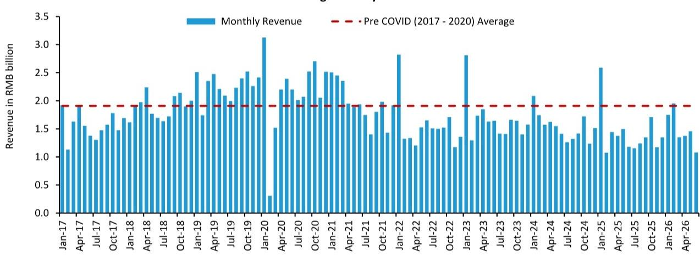
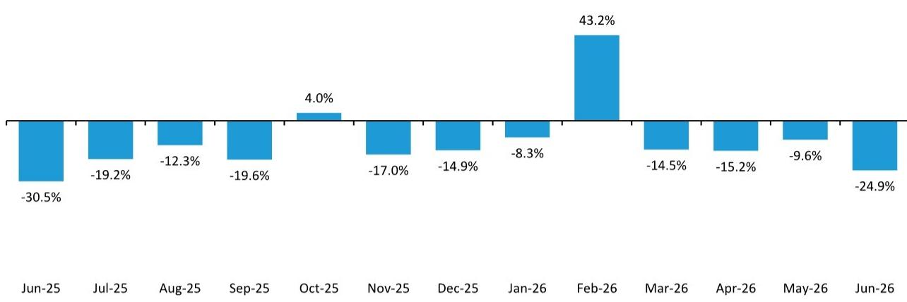
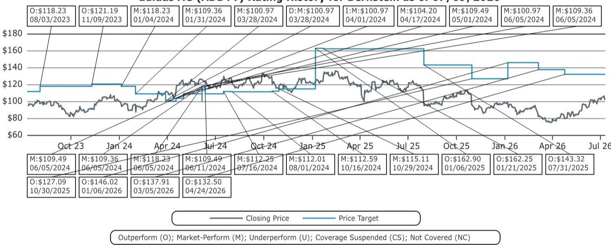

# Bernstein：批发渠道数据揭示，运动品牌中国需求未见结构性改善

Nike和Adidas在中国最大的批发合作伙伴宝胜国际，6月零售额同比下滑8.6%。这个数字本身已经足够说明问题，但更值得关注的是它的位置：这是第二季度最弱的一个月，也是过去两年中两年复合增速最差的一次。宝胜约80%的中国销售额来自Nike和Adidas产品，它的月度数据因此成为观察两大运动品牌在华批发渠道状况的实时参考。

这份Bernstein研报的核心判断是：中国运动用品需求仍然没有出现结构性改善。6月的负增长延续了今年以来的调整趋势，而宝胜的累计同比增长为-2.1%，虽然好于前两年同期，但改善幅度有限，且基数效应正在减弱。

> **KC评论：** 宝胜的月度数据之所以重要，是因为它过滤掉了品牌直营渠道和电商的噪音，直接反映批发渠道的真实库存消化和终端动销。当批发伙伴的销售连续多月低于疫情前水平，品牌方在中国市场的整体出货量就很难真正回暖。

## 1. 两年复合增速创下新低，说明不是基数问题

单月同比数据容易受到去年同期的基数干扰。Bernstein因此计算了两年复合增速。6月宝胜的两年复合增速为-24.9%，是过去两年中最差的一次。这意味着，即便剔除2025年6月那个异常低的基数，当前销售依然在加速下滑。

报告还指出，6月是宝胜连续第六年在该月份出现收入同比下降。这个时间跨度已经超出了短期库存周期或促销节奏的解释范围。它指向的是更根本的问题：中国消费者对运动鞋服的需求，至少在批发渠道层面，还没有回到疫情前的轨道。

## 2. 代工端的波动同样没有缓解

宝胜的母公司裕元工业是全球最大的运动鞋制造商，客户包括Nike、Adidas及其他西方品牌。6月裕元制造业务收入同比下滑11.8%，比5月进一步出现变化，且面临去年6月较高的比较基数。

裕元管理层在第一季度曾表示，关税相关挑战、通胀不确定性以及宏观轨迹的不确定性可能继续影响消费者信心，近期订单需求预计仍将波动。研报认为，过去六个月裕元的收入增长基本处于负值区间且波动剧烈，说明制造端同样没有看到稳定的复苏信号。

## 3. 宏观与地缘不确定性叠加，短期难以改善

Bernstein在报告中列出了几个仍在发酵的外部变量：贸易与关税环境的不确定性可能影响中国本地就业和消费信心；中东地区的扰动则可能通过推高能源价格和干扰航运，给全球供应链带来额外成本。

这些因素对运动品牌的影响不是线性的。批发渠道的库存消化需要终端需求配合，而终端需求又受到就业、收入预期和消费信心的多重制约。当批发伙伴的月度收入持续低于疫情前水平，品牌方在中国市场的出货策略就只能保持谨慎。

## 4. 一个可复用的观察框架：批发渠道是领先指标

对于关注运动品牌中国业务的研究者，宝胜的月度数据提供了一个比品牌季度财报更及时的观察窗口。品牌直营渠道的增速可能因为促销或新品拉动而短期改善，但批发渠道的销售反映的是经销商对终端需求的真实判断。当批发伙伴连续多月负增长，品牌方的出货量和利润率都会承压。

Bernstein在这份报告中维持了对Nike和Adidas的积极评级，但报告本身提供的证据表明，中国市场的复苏路径仍然需要更多时间验证。批发渠道的数据没有给出拐点信号，这是当前最值得关注的结论。

For informational purposes only. Portions may be generated,translated,summarized,or edited with AI assistance based on source materials and may contain omissions or errors. Please verify independently. This is not investment,legal,tax,accounting,or other professional advice.

For informational purposes only. Portions may be generated,translated,summarized,or edited with AI assistance based on source materials and may contain omissions or errors. Please verify independently. This is not investment,legal,tax,accounting,or other professional advice.

