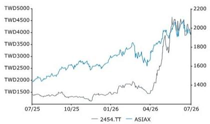
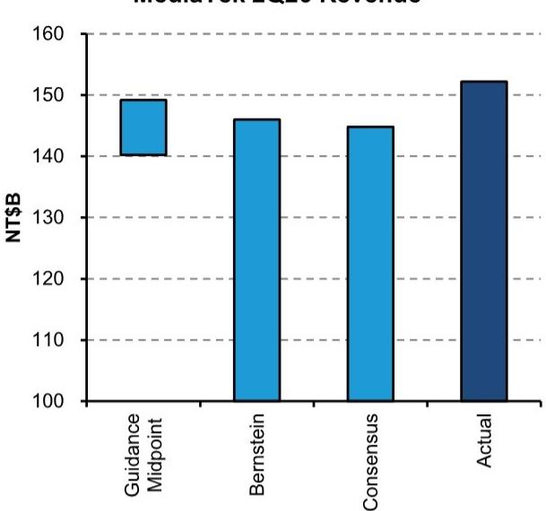
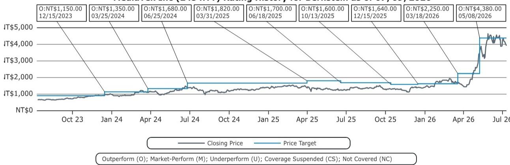

# 亚洲半导体与设备及全球存储

## 联发科技

**评级：优于市场表现**

**目标报价**

**2454.TT**

**4,380.00 新台币**

Edward Hou, CFA  
+852 2123 2623  
edward.hou@bernsteinsg.com

Mark Li  
+852 2123 2645  
mark.li@bernsteinsg.com

Yipin Cai, CFA +852 2123 2669 yipin.cai@bernsteinsg.com

# 快评：联发科2026年第二季度营收超出指引上限及市场预期

联发科今日下午公布6月营收为新台币580亿元，环比增长22%，同比增长3%。2026年第二季度总营收为新台币1520亿元，环比增长2%，同比增长1%。这比市场预期高出约5%，比指引上限高出约2%。汇率因素可能带来1.3%的正面影响，但不足以完全解释这一超出预期的表现（图表1）。

我们目前对联发科ASIC营收的模型预测为：2026年20亿美元、2027年150亿美元、2028年220亿美元。然而，近期调研显示竞争环境更为有利。结合TPU部署的扩大，这表明我们目前的2028年预测存在上行风险。我们也持续看到联发科与谷歌合作深化的迹象，这应有助于其逐步扩大在客户支出中的份额。

另一方面，智能手机业务仍面临挑战。我们最新的中国智能手机追踪报告（链接）显示，高存储价格给各价格区间带来压力。由于OEM厂商提价以及入门级机型供应减少，平均售价同比显著上升。但这导致了需求抑制和手机库存升高，OEM厂商可能面临销售困难。此外，联发科与台湾其他IC设计公司据报道（链接）已对多条产品线提价10-15%，包括智能手机SoC和PMIC，原因是元件短缺、产能限制以及原材料和物流成本上升。虽然这些定价行动应有助于抵消成本通胀并支持利润率，但我们预计2026年下半年及可能到2027年，终端市场需求将面临进一步变化。尽管如此，我们认为TPU驱动的增长足以弥补智能手机业务的变化。

联发科股价自5月下旬高点已回调约15%，可能反映了近期市场情绪变化及年初以来强劲上涨后的获利了结。我们建议关注AI ASIC的增长前景，并重申对联发科的"优于市场表现"评级。

| 报告每股收益 | 2025财年实际 | 2026财年预期 | 2027财年预期 |
|---|---|---|---|
| 2454.TT (新台币) | 66.17 | 69.52 | 170.50 |

*数值单位为十亿；来源：彭博、Bernstein估计与分析。

| 财务数据 | 2025财年实际 | 2026财年预期 | 2027财年预期 | 年复合增长率 |
|---|---|---|---|---|
| 营收（百万） | 595,966 | 652,535 | 1,117* | 36.9% |
| 毛利率（%） | 47.5 | 46.0 | 44.5 | -- |
| 营业利润率（%） | 17.4 | 16.3 | 25.3 | -- |
| 净利润率（%） | 17.8 | 17.1 | 24.5 | -- |
| 净资产回报表现（%） | 26.4 | 27.8 | 57.6 | -- |

| 截止日期 | 2026年7月9日 |
|---|---|
| 2454.TT 收盘价（新台币） | 3,925.00 |
| 目标报价（新台币） | 4,380.00 |
| 上行/（下行）空间 | 12% |
| 52周区间 | 4,970.00/1,130.00 |
| ASIAX | 1,937.03 |
| 财年结束 | 12月 |
| 股息率 | 1.4% |
| 市值（新台币）（十亿） | 6,295.29 |
| 企业价值（新台币）（十亿） | 6,147.65 |

| 表现 | 年初至今 | 1个月 | 6个月 | 12个月 |
|---|---|---|---|---|
| 相对表现（%） | 174.5 | (5.5) | 176.4 | 180.4 |
| ASIAX（%） | 18.4 | 0.9 | 14.7 | 34.6 |
| 相对表现（%） | 156.0 | (6.4) | 161.7 | 145.8 |

来源：彭博、Bernstein估计与分析。

价格表现，1年  

| 估值指标 | 2025财年实际 | 2026财年预期 | 2027财年预期 |
|---|---|---|---|
| 报告市盈率（倍） | 59.3 | 56.5 | 23.0 |
| 股息率（%） | 1.4 | 1.3 | 1.9 |
| 调整后市盈率（倍） | 59.3 | 56.5 | 23.0 |
| 企业价值/EBITDA（倍） | 48.6 | 47.3 | 20.0 |
| 企业价值/EBIT（倍） | 59.4 | 57.7 | 21.7 |

联发科2026年第二季度营收

图表1：联发科2026年第二季度营收为新台币1520亿元，比指引中点和市场预期高出约5%。汇率因素可能带来1.3个百分点的正面影响。  
  
来源：公司数据、彭博、Bernstein估计与分析

## 研究启示

我们给予联发科"优于市场表现"评级。我们的1年目标报价为新台币4,380.00元。

## BERNSTEIN代码表

| 代码 | 评级 | 货币 | 2026年7月9日收盘价 | 目标报价 | 过去12个月相对表现 | 报告每股收益 | 报告市盈率（倍） |
|---|---|---|---|---|---|---|---|
| 2454.TT (联发科) | O | 新台币 | 3,925.00 | 4,380.00 | 145.8% | 新台币 66.17 | 69.52 | 170.50 | 59.3 | 56.5 | 23.0 |
| ASIAX | | | 1,937.03 | | | | | | | |

O - 优于市场表现，M - 与市场表现一致，U - 低于市场表现，NR - 未评级，CS - 暂停覆盖

来源：彭博、Bernstein估计与分析。

## I. 必要披露

本披露中提及的"Bernstein"或"公司"指以下实体：Bernstein Institutional Services LLC（2024年4月1日起）、Bernstein & Co., LLC（2024年4月1日前）、Bernstein Autonomous LLP、BSG France S.A.（2024年4月1日起）、Bernstein (Hong Kong) Limited 盛博香港有限公司、Bernstein (Canada) Limited、Bernstein (India) Private Limited（SEBI注册号INH000006378）、Bernstein (Singapore) Private Limited、Bernstein Japan KK（サンフォード・C・バーンスタイン株式会社）以及根据Bernstein与SG之间的全球服务协议受雇于SG Africa Technologies & Services为Bernstein制作报告的分析师。

Bernstein是SG（SG）与AllianceBernstein, L.P.（AB）合资企业的一部分。除非特别说明，就本披露而言，提及Bernstein的"关联方"均指SG和AB及其各自的关联方。

## 估值方法

## 联发科技

我们设定新台币4,380元的1年目标报价，基于22倍市盈率乘以我们对未来第五至第八季度每股收益新台币199元的预测。

## 风险

## 联发科技

我们的联发科目标报价存在多项下行风险：（1）5G市场来自高通的竞争压力加大；（2）5G普及速度放缓，尤其是在中国市场；（3）全球智能手机需求变化；（4）智能手机以外业务多元化进展较慢；（5）半导体行业整体周期变化。

## 评级定义、基准与分布

## 股票评级定义

## Bernstein品牌

Bernstein品牌根据未来12个月相对于基准指数的相对表现预测对股票进行评级：美国和加拿大上市股票相对于标普500指数，欧洲交易所及亚太地区以外新兴市场交易所上市股票相对于彭博欧洲发达市场大盘和中盘价格回报指数欧元（EDME），日本交易所上市股票相对于彭博日本大盘和中盘价格回报指数美元（JPL），亚洲（除日本）交易所上市股票相对于彭博亚洲除日本大盘和中盘价格回报指数（ASIAX）——除非另有说明。

Bernstein品牌有三个评级类别：

- 优于市场表现：股票将跑赢市场指数超过15个百分点
- 与市场表现一致：股票将与市场指数表现一致，在正负15个百分点范围内
- 低于市场表现：股票将落后市场指数超过15个百分点

暂停覆盖：Bernstein品牌下对某公司的覆盖已暂停。评级和目标报价暂时失效，不再有效，因此不应再依赖。

未评级：当目前无法准确估值股票或准确预测公司表现时分配的评级。覆盖分析师可能继续发布关于该公司的研究报告，向读者更新事件和进展。

未覆盖（NC）表示未覆盖的公司。

Bernstein品牌股票评级基于12个月的时间范围。

## Autonomous品牌——普通股

Autonomous品牌按如下方式对普通股进行评级。我们使用的基准包括：发达欧洲银行和支付领域使用彭博欧洲600金融价格回报指数（E600BK）和彭博欧洲发达市场金融大盘和中盘价格回报指数欧元（EDMFI），欧洲保险公司使用彭博欧洲600保险价格回报指数（E600IN），美国银行和支付覆盖使用标普500和标普金融指数，美国保险使用S5LIFE，美国非寿险公司覆盖使用标普保险精选行业指数（SPSIINS），新兴市场银行、保险公司和支付使用彭博新兴市场金融大盘、中盘和小盘价格回报指数（EMLSF）。评级相对于行业（而非市场）给出。

Autonomous品牌有三个普通股评级类别：

- 优于市场表现（OP）：股票将跑赢相关指数超过10个百分点
- 中性（N）：股票将与市场指数表现一致，在正负10个百分点范围内
- 低于市场表现（UP）：股票将落后相关指数超过10个百分点

暂停覆盖：Autonomous研究品牌下对某公司的覆盖已暂停。评级和目标报价暂时失效，不再有效，因此不应再依赖。

未评级：当目前无法准确估值股票或准确预测公司表现时分配的评级。覆盖分析师可能继续发布关于该公司的研究报告，向读者更新事件和进展。

标记为"重点推荐"（例如，重点推荐优于市场表现FOP、重点推荐低于市场表现FUP）的是我们的核心观点。

未覆盖（NC）表示未覆盖的公司。

Autonomous品牌普通股评级基于12个月的时间范围。

## Autonomous品牌——优先股

Autonomous品牌有三个优先股评级类别：

- 优于市场表现（OP）：该优先工具的总回报预计在未来六个月内优于在类似行业或评级类别中运营的其他发行人的优先证券。
- 中性（N）：该优先工具的总回报预计在未来六个月内与在类似行业或评级类别中运营的其他发行人的优先证券表现一致。
- 低于市场表现（UP）：该优先工具的总回报预计在未来六个月内落后于在类似行业或评级类别中运营的其他发行人的优先证券。

Autonomous优先股评级基于6个月的时间范围。

## AUTONOMOUS信用研究

如果本报告包含对信用工具的研究交流（定义见市场滥用条例第3(1)(35)条），以下信息旨在满足其披露要求。

本报告还可能包含对Autonomous或Bernstein其他分析师就本文提及的发行人股权证券所发表意见的引用。请注意，本报告作者发布的信用工具研究交流可能与本文所含发行人的股权证券分析师的公开观点不同，反之亦然。

## 信用评级定义

Autonomous品牌有三个信用评级类别：

- 信用优于市场表现（C-OP）：参考信用工具的总回报预计在未来六个月内优于在类似行业或评级类别中运营的其他发行人的债券信用利差。
- 信用中性（C-N）：参考信用工具的总回报预计在未来六个月内与在类似行业或评级类别中运营的其他发行人的债券信用利差表现一致。
- 信用低于市场表现（C-UP）：参考信用工具的总回报预计在未来六个月内落后于在类似行业或评级类别中运营的其他发行人的债券信用利差。

Autonomous信用评级基于6个月的时间范围。

可应要求提供本报告作者制作的所有研究交流清单及信用评级历史。

公司自行决定何时启动、更新和停止研究覆盖。公司已建立、维护并依赖信息壁垒，以控制公司内部一个或多个领域（即私密侧）的信息流向其他领域、部门、集团或关联方（即公开侧）。

## 股票评级/投资银行服务分布

| 股票评级 | 市场滥用条例（MAR）和FINRA评级类别 | 全球评级分布 | 投资银行关系* |
|---|---|---|---|
| 优于市场表现 | 买入 | 51.2% | 15.3% |
| 与市场表现一致（Bernstein品牌）/ 中性（Autonomous品牌） | 持有 | 35.8% | 16.2% |
| 低于市场表现 | 卖出 | 13.1% | 13.6% |

*这些数字代表每个股票评级类别中，Bernstein关联方在过去12个月内提供过投资银行服务的公司百分比。
截至2026年6月30日。所有数字每季度更新。

## 价格图表/评级与目标报价历史

联发科技（2454.TT）Bernstein评级历史，截至2026年7月9日  
  
上述图表中的所有目标报价和收盘价数据均以本报告代码表中注明的货币计价。

## 其他事项

雇用本报告所列分析师的法人实体及其所在地可通过其电话号码的国家代码确定，如下所示：

+1 Bernstein Institutional Services LLC；美国纽约州纽约市
+44 Bernstein Autonomous LLP；英国伦敦
+212 SG Africa Technologies & Services；摩洛哥卡萨布兰卡
+33 BSG France S.A.；法国巴黎
+34 BSG France S.A.；西班牙马德里
+41 Bernstein Autonomous LLP；瑞士日内瓦
+49 BSG France S.A.；德国法兰克福
+91 Bernstein (India) Private Limited；印度孟买
+852 Bernstein (Hong Kong) Limited 盛博香港有限公司；中国香港
+65 Bernstein (Singapore) Private Limited；新加坡
+81 Bernstein Japan KK；日本东京

如果本报告由非美国关联公司雇用的研究分析师编写，则该分析师（除非下文另有明确说明）未注册为Bernstein Institutional Services LLC或任何其他SEC注册经纪交易商的关联人士，也未获得FINRA研究分析师的许可或资格。因此，该分析师可能不受FINRA关于（其中包括）研究分析师与主题公司沟通、研究分析师与投资银行人员互动、研究分析师参与与投资银行交易相关的招揽和营销活动、研究分析师公开露面以及研究分析师账户持有证券交易等限制的约束。

如果本报告由SG Africa Technologies & Services（SG集团公司的一部分）雇用的研究分析师编写，则根据Bernstein与SG之间的全球服务协议，该报告是代表Bernstein公司编写的。

## 认证

本报告中主要负责内容编写的每位研究分析师证明，本出版物中表达的所有观点准确反映了该分析师对任何及所有主题证券或发行人的个人观点，并且该分析师的报酬中没有任何部分直接或间接与本出版物中的具体建议或观点相关。

## II. 附加全球冲突披露

公司自行决定何时启动、更新和停止研究覆盖。公司已建立、维护并依赖信息壁垒，以控制公司内部一个或多个领域（即私密侧）的信息流向其他领域、部门、集团或关联方（即公开侧）。

## III. 其他重要信息和披露

"Bernstein"和"Autonomous"研究产品保持独立品牌。

- Bernstein制作多种不同类型的研究产品，包括但不限于"Autonomous"和"Bernstein"品牌下的基本面分析和定量分析。一种研究产品中包含的建议可能与另一种研究产品中的建议不同，无论是由于时间范围、方法论或其他方面的差异。此外，一个品牌下发布的研究产品中的观点或建议可能与另一个品牌下相同类型研究产品中的观点或建议不同。两个品牌的研究评级系统以及与这些评级系统相关的其他信息包含在前一节中。

- Autonomous作为以下实体内的独立业务部门运营：Bernstein Institutional Services LLC、Bernstein Autonomous LLP、Bernstein (Hong Kong) Limited 盛博香港有限公司和Bernstein (India) Private Limited。有关"Autonomous"品牌产品（包括某些销售材料）的信息，请访问：www.autonomous.com。有关Bernstein品牌产品的信息，请访问：www.bernsteinresearch.com。

分析师的薪酬基于其对研究业务的整体贡献，衡量标准包括客户渗透率、生产力和投资观点的主动性。没有分析师因在产生投资银行收入方面的表现或贡献而获得薪酬。

本报告由独立分析师制作，定义见欧盟596/2014市场滥用条例（"MAR"）第3(1)(34)(i)条以及该条例作为英国国内法一部分的同等规定。

致美国读者：Bernstein Institutional Services LLC是一家在美国证券交易委员会（"SEC"）注册的经纪交易商，是美国金融业监管局（"FINRA"）的成员，在美国分发本出版物并对其内容负责。如果本材料包含对债务产品的分析，则该材料仅供机构读者使用，不适用于为零售读者准备的债务研究的独立性和披露标准。

Bernstein Institutional Services LLC可能作为自营交易主体或作为他人（包括关联方）的代理人，买卖本报告主题的任何证券。本报告不旨在满足任何特定个人、实体或账户的目标或需求。

致加拿大读者：如果本出版物涉及加拿大注册的公司，则由Bernstein (Canada) Limited在加拿大分发，该公司由加拿大投资监管组织许可和监管。如果本出版物涉及非加拿大注册的公司，则由Bernstein Institutional Services LLC（受SEC和FINRA许可和监管）根据国际交易商豁免在加拿大分发。

本文件不得传递给加拿大的任何人，除非该人符合NI 31-103第1.1节定义的"许可客户"资格。

致巴西读者：本报告由Bernstein Institutional Services LLC编制，Banco BTG Pactual S.A.（"BTG"）负责在巴西分发本报告。

致英国读者：本出版物已由Bernstein Autonomous LLP在英国发布或批准发布，该公司由金融行为监管局授权和监管，地址为60 London Wall, London EC2M 5SH，电话+44 (0)20-7170-5000。在英格兰和威尔士注册，编号OC343985。

本文件仅分发给以下人士：（i）具有《2000年金融服务和市场法（金融促进）令2005》（经修订，"金融促进令"）第19(5)条所述投资相关事务专业经验的人士，（ii）属于金融促进令第49(2)(a)至(d)条（"高净值公司、非法人协会等"）的人士，（iii）在英国境外的人士，或（iv）可以合法地传达或促使其传达与发行或销售任何证券相关的投资活动邀请或诱因（根据FSMA第21条的含义）的人士（所有此类人士统称为"相关人士"）。本文件仅针对相关人士，非相关人士不得依据或依赖本文件行事。本文件相关的任何投资或投资活动仅适用于相关人士，并将仅与相关人士进行。

致欧洲经济区成员国读者：本出版物由BSG France SA分发，该公司由审慎监管和决议局（ACPR）和金融市场管理局（AMF）授权和监管。

致香港读者：本出版物由Bernstein (Hong Kong) Limited 盛博香港有限公司在香港分发，该公司由香港证券及期货事务监察委员会（中央实体编号AXC846）许可和监管，可进行第4类（就证券提供意见）受规管活动，并受SFC公开登记册中注明的许可条件约束。本出版物仅面向《证券及期货条例》（第571章）定义的专业读者。本报告的目的仅为提供对其中提及的发行人的分析，不旨在违反香港法律的任何目的。

致新加坡读者：本出版物由Bernstein (Singapore) Private Limited在新加坡分发，仅面向《新加坡证券及期货法2001》（"SFA"）定义的认可读者或机构读者。新加坡的接收者应就本出版物引起或与之相关的事项联系Bernstein (Singapore) Private Limited。Bernstein (Singapore) Private Limited受新加坡金融管理局监管，并根据SFA持有资本市场服务牌照，可进行证券和集体投资计划等资本市场产品的交易，并作为豁免财务顾问提供关于证券的建议以及发布和分析报告。Bernstein (Singapore) Private Limited在新加坡注册，公司注册号20213710W，地址为8 Marina Boulevard, #12-01, Marina Bay Financial Centre, Singapore 018981，电话+65-6326-7000。

致中华人民共和国读者：本文件中提及的证券未在中华人民共和国（就本目的而言，不包括香港和澳门特别行政区或台湾，"中国"）发售或销售，且不得在违反中国任何适用法律的情况下直接或间接在中国发售或销售。

本文件不构成向中国任何人发售或招揽购买任何证券的要约，如果在该中国进行此类要约或招揽是非法的。

我们不表示本文件可以在中国合法分发，或者任何证券可以在中国根据任何适用的注册或其他要求合法发售，或根据任何可用的豁免发售，也不承担促进任何此类分发或发售的责任。特别是，我们未采取任何行动允许在中国公开发售任何证券或分发本文件。因此，不得通过本文件或任何其他文件在中国境内发售或销售证券。除非在会导致遵守任何适用法律法规的情况下，不得在中国分发或发布本文件或任何广告或其他发售材料。

致日本读者：本出版物由Bernstein Japan KK（サンフォード・C・バーンスタイン株式会社）在日本分发，该公司在日本注册为金融工具业务运营商，受关东财务局监管（注册号：关东财务局长（金商）第3387号），并由金融厅监管。它也是日本投资管理协会的成员。本出版物仅面向日本的合格机构读者，定义见《金融工具和交易法》第2条第(3)款第(i)项。

对于通过Daiwa集团株式会社（"Daiwa"）获得Bernstein网站访问权限的日本机构客户读者，您对本文件的访问不应被理解为Bernstein正在为您提供任何目的的研究交流。虽然Bernstein编制了本文件，但您的关系是与Daiwa的关系，并将继续保持与Daiwa的关系，Bernstein与您没有任何合同关系，也不对您承担任何义务。

致澳大利亚读者：Bernstein (Hong Kong) Limited 盛博香港有限公司负责在澳大利亚分发研究。它受美国法律下的证券交易委员会和英国法律下的金融行为监管局监管，这与澳大利亚法律不同。Bernstein (Hong Kong) Limited 盛博香港有限公司根据《公司法2001》免于持有澳大利亚金融服务许可证，可向批发客户提供以下金融服务：

- 提供金融产品建议；
- 交易金融产品；
- 为金融产品做市；以及
- 提供托管或存管服务。

致印度读者：本出版物由Bernstein (India) Private Limited（SCB India）在印度分发，该公司由印度证券交易委员会（"SEBI"）根据《SEBI（研究分析师）条例2014》许可和监管，注册号INH000006378，并作为股票经纪商注册，注册号INZ000213537。SCB India目前从事研究和股票经纪服务业务。更多信息请访问www.bernsteinresearch.in。

- SCB India是一家根据《公司法2013》于2017年4月12日成立的私人有限公司，公司识别号U65999MH2017FTC293762，注册办公室位于Level 3A, 4th Floor, First International Financial Centre, Plot Nos C-54 and C-55, G Block, Near CBI Office, Bandra Kurla Complex, Bandra (East), Mumbai 400098, Maharashtra, India（电话：+91-22-68421401）。
- 有关SCB India关联方（即关联公司/集团公司）的详细信息，请发送电子邮件至MUM-BERNSTEIN-InCompliance@bernsteinsg.com。
- 截至本报告日期，SCB India没有任何纪律处分历史。
- 除上述说明外，SCB India和/或其关联方（即关联公司/集团公司）、编写本报告的研究分析师及其亲属：
  - 在主题公司中没有财务利益；
  - 不实际/实益拥有主题公司百分之一或以上的证券；
  - 未从事任何针对印度公司的投资银行活动；
  - 在过去十二个月内未管理或共同管理任何印度公司的公开发行；
  - 在过去12个月内未从主题公司获得投资银行服务或商人银行服务的任何报酬；
  - 在过去十二个月内未从主题公司获得经纪服务报酬；
  - 未从主题公司或第三方获得与本报告中的具体建议或观点相关的任何报酬或其他利益；以及
  - 目前没有，但将来可能，担任本报告所覆盖公司金融工具的做市商。
  - 截至本报告日期，与主题公司没有任何利益冲突。
- 除上述说明外，在本研究报告分发日期之前的十二个月内，主题公司不是SCB India的客户。SCB India及其关联方（即关联公司/集团公司）在过去十二个月内未从主题公司获得除投资银行、商人银行或经纪服务以外的产品或服务的报酬。
- 编写本报告的主要研究分析师、分析师团队成员及其家庭成员不是本报告所覆盖公司的高级职员、董事、员工或顾问委员会成员。
- 我们的合规官/申诉官是Rupal Talati女士，可通过电话+91-22-68421451或MUM-BERNSTEIN-InCompliance@bernsteinsg.com / Scbin-investorgrievance@bernsteinsg.com联系。
- SCB India的研究读者章程和条款条件可在其网站上获取，可通过Bernstein (India) Private Limited (https://bernsteinresearch.in/) 查阅。
- 免责声明：SEBI的注册和NISM的认证绝不保证中介机构的业绩或为读者提供任何回报保证。证券市场的投资面临市场风险。投资前请仔细阅读所有相关文件。

致瑞士读者：本文件由Bernstein Autonomous LLP在瑞士提供，仅面向《瑞士集体投资计划法》（"CISA"）第10条及相关条例定义的合格读者，并严格遵守适用的瑞士法律法规。本文件中提及的产品可能不适合所有类型的读者。本文件基于瑞士银行家协会（SBA）2008年1月发布的《金融研究独立性指引》。

致中东读者：Bernstein Autonomous LLP, DIFC分支的主要办公室位于Gate Village 06, DIFC, Dubai, UAE。Bernstein Autonomous LLP, DIFC分支由迪拜金融服务局（DFSA）监管，注册号CL10040，获准安排交易投资和提供金融产品建议。所有通信和服务仅面向专业客户和市场对手方（定义见DFSA规则手册）。非专业客户和市场对手方的人士，如零售客户，不是我们通信或服务的预期接收者。

## 法律声明

所有研究出版物通过公司密码保护的网站bernsteinresearch.com和autonomous.com向客户发布。某些（但非全部）研究出版物也通过第三方供应商提供给客户，或通过替代电子方式作为便利重新分发给客户。

本出版物已根据公司投资研究利益冲突管理政策发布和分发，该政策副本可从Bernstein Institutional Services LLC, Director of Compliance, 245 Park Avenue, New York, NY 10167获取。有关Bernstein业务的额外披露和信息可在我们的网站www.bernsteinresearch.com上获取。

本文所述的证券可能并非在所有司法管辖区或对某些类别的读者都有资格销售，前提是该许可情况与本文所述实体持有的许可证不一致。本文件仅在法律允许的情况下分发。本出版物不针对或意图分发给任何位于任何地方、州、国家或其他司法管辖区的公民、居民或人士，如果此类分发、出版、可用性或使用违反法律或法规，或会使本文提及的任何实体或其任何子公司或关联方受制于该司法管辖区的任何注册或许可要求。本出版物基于我们认为可靠的公开来源，但我们不对出版物的准确性或完整性作任何陈述。我们不承担通知您报告信息或此处意见任何变更的义务。本出版物由本文提及的实体编制和发布，分发给符合条件的对手方或专业客户。本出版物不是购买或出售任何证券的要约，也不构成投资、法律或税务建议。本文提及的投资可能不适合您。读者必须根据自己的具体情况，在咨询专业顾问后做出自己的投资决策。研究价值可能波动，以外币计价的投资可能因汇率波动而价值波动。关于投资过去表现的信息不一定是未来表现的指南、指标或保证。

本报告面向并仅适用于我们的客户，这些客户是前述监管机构定义的"合格对手方"、"专业客户"、"机构读者"和/或"专业读者"，不得重新分发给前述监管机构定义的零售客户。收到本报告的零售客户应注意，本文所述实体的服务不适用于他们，不应依赖本文材料做出投资决策。此类行为的结果不会使本文所述实体对由此产生的任何损失承担责任，因为本文所述实体未注册/授权/许可与零售客户交易，也不会与零售客户签订任何合同协议/安排。本报告受客户可能与本文所述实体签订的任何协议条款和条件的约束。所有研究报告通过电子方式发布到我们的客户门户，同时分发给符合条件的客户。

本报告中的信息由Bernstein仅为客户的内部业务使用而编制。客户可以存储、显示、分析、重新格式化并打印本报告中的信息，仅用于此有限用途。未经Bernstein明确书面同意，客户不得复制、更改、创作衍生作品、转售、逆向工程、商业利用、共享或分发本文所含的任何部分信息，用于任何目的。这些限制包括提取数据或使用内容开发指数或其他产品。此外，您不得使用本报告或本报告的任何部分来训练或微调任何第三方机器学习或人工智能系统，或作为任何此类系统的提示或输入。未经Bernstein明确书面同意，您也不得在您自己的内部机器学习或人工智能系统中进行上述任何操作。

Bernstein可能在其材料准备过程中使用人工智能工具。任何此类材料在发布前均经过Bernstein研究分析师的审查。

本报告仅为信息目的编制，基于我们认为可靠的当前公开信息，但本文所述实体不保证或陈述（明示或暗示）本文所含信息来源或数据准确、完整、不具误导性或适合预期目的，即使本文所述实体依赖信誉良好或可信的数据提供商，也不应依赖于此。所表达的意见是作者截至材料日期当天的当前意见，我们不承担通知您报告信息或此处意见任何变更的义务。

本文中对SG的任何引用纯粹基于公开可用信息的事实性引用，仅用于比较目的。它们不构成对SG证券的意见或建议。

本出版物由本文提及的实体编制和发布，分发给符合条件的对手方或专业客户。本报告中的信息旨在广泛传播，不构成购买或出售任何证券、投资、法律或税务建议的要约，也不构成前述任何监管机构定义的个人建议。它不考虑个别读者的特定投资目标、财务状况或需求。本报告未经前述任何监管机构审查，也不代表前述监管机构的任何官方建议。本文提及的投资可能不适合您。读者必须在咨询财务顾问关于投资产品适用性的建议后，考虑任何接收建议者的特定投资目标、财务状况或特定需求，然后才能承诺购买投资产品。

本文所含分析基于众多假设。不同的假设可能导致实质上不同的结果。本报告中的信息不构成或构成任何出售或发行股份的要约，或任何购买或认购股份的要约，或诱导参与任何其他投资活动的一部分。本报告中提及的任何证券或金融工具的价值可能随市场条件波动。关于投资过去表现的信息不一定是未来表现的指南、指标或保证。本报告研究分析师提及的未来表现估计基于可能因市场波动/波动等不可预见因素而无法实现的假设。对于以客户本国货币以外的外币计价的证券或金融工具，汇率变动将对其价值产生有利或不利的影响。在根据本报告中的任何建议采取行动之前，接收者应考虑投资本报告中提及的主题证券或金融工具的适当性，并在必要时寻求独立的专业建议。

本文所述的证券可能并非在所有司法管辖区或对某些类别的读者都有资格销售，前提是该许可情况与本文所述实体持有的许可证不一致。本文件仅在法律允许的情况下分发。它不针对或意图分发给任何位于任何地方、州、国家或其他司法管辖区的公民、居民或人士，如果此类分发、出版、可用性或使用违反法律或法规，或会使本文所述实体受制于该司法管辖区的任何法规或许可要求。

来源：彭博指数服务有限公司。BLOOMBERG®是Bloomberg Finance L.P.及其关联方（统称"Bloomberg"）的商标和服务标志。Bloomberg或Bloomberg的许可方拥有彭博指数的所有专有权利。Bloomberg或Bloomberg的许可方不批准或认可本材料，也不保证本文任何信息的准确性或完整性，也不对由此获得的结果作任何明示或暗示的保证，并且在法律允许的最大范围内，不对与此相关的任何伤害或损害承担责任。

未经本文所述实体事先同意，不得复制、分发或传输本材料的任何部分或以其他方式提供。版权所有：Bernstein Institutional Services LLC, Bernstein Autonomous LLP, BSG France S.A., Bernstein (Hong Kong) Limited 盛博香港有限公司, Bernstein (Canada) Limited, Bernstein (India) Private Limited (SEBI registration no. INH000006378), Bernstein (Singapore) Private Limited and Bernstein Japan KK (サンフォード・C・バーンスタイン株式会社)。保留所有权利。本文所含的商标和服务标志是其各自所有者的财产。任何未经授权的使用或披露均被严格禁止。如果未经授权的使用对本文所述实体以及Bernstein和Autonomous品牌下发布的研究造成任何诽谤和/或声誉风险，本文所述实体可能寻求法律行动。
