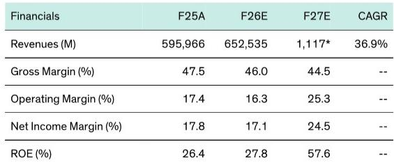
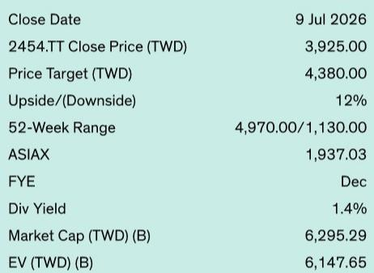

# Bernstein：联发科报价回调15%，Bernstein称AI ASIC增长前景被低估

联发科6月营收新台币580亿元，第二季度总营收达1520亿元，环比增长2%，同比增长1%，分别超出市场共识约5%和公司指引上限约2%。这份来自Bernstein的快速解读报告，核心判断并非营收超预期本身，而是营收结构正在发生根本性切换——智能手机业务持续调整，但AI ASIC的增长已足以覆盖手机端的变动，且竞争环境比此前预期的更有利。

报告明确指出，汇率因素仅贡献约1.3个百分点的顺风，无法完全解释超预期部分。这意味着营收超预期背后有更结构性的驱动力。

## 1. 智能手机业务正面临双重因素：成本推升与需求变化

报告引用了Bernstein最新的中国智能手机追踪数据，显示高内存价格正在对所有价格段形成不确定性。终端厂商提价以及入门级机型减少，导致平均售价同比显著上升，但这一趋势正在引发需求变化和渠道库存堆积。报告判断，OEM厂商可能面临销售挑战。

与此同时，联发科及台湾其他IC设计公司已被报道在多个产品线提价10%-15%，包括智能手机SoC和电源管理IC，原因涉及元件短缺、产能限制以及原材料和物流成本上升。这些提价行动虽有助于对冲成本通胀并支撑利润率，但报告预期将对2026年下半年乃至2027年的终端市场需求形成进一步影响。

> **KC评论：** 这里的关键不是提价本身，而是提价发生在需求已经变化的背景下。报告隐含的逻辑是：成本推动的涨价可能加速需求调整。这张图里最容易被忽略的是“入门级机型减少”这个信号——它意味着低端市场正在被压缩，而这恰恰是联发科的传统优势区间。

## 2. AI ASIC才是真正的结构性变量，竞争格局比预期更有利

与手机业务的不确定性形成对照，报告对联发科AI ASIC业务的展望显著上调。Bernstein目前模型显示，联发科ASIC营收在2026-2028年分别达到20亿、150亿和220亿美元。但近期调研显示，竞争环境比此前假设的更友好，加上TPU部署范围持续扩大，报告认为2028年预测存在上行空间。

报告还特别提到，联发科与谷歌的合作关系正在深化，这应能支撑其在客户中的份额持续增长。从营收规模看，2028年220亿美元的ASIC营收如果实现，将远超公司当前整体营收体量，这意味着AI业务正在从“第二曲线”变成“主引擎”。

## 3. 报价回调15%后，市场关注点应重新校准

联发科报价自5月下旬高点已回调约15%，报告将其归因于市场情绪变化以及年初以来强劲上涨后的获利了结。但Bernstein认为，读者应将注意力集中在AI ASIC的增长前景上。

从估值角度看，报告给出的2027年预估市盈率约为23倍，相较于2025年的59倍和2026年的56.5倍，估值压缩幅度显著。这种压缩的前提是2027年EPS从2026年的约69.5元新台币跃升至170.5元新台币——增长主要来自AI ASIC业务的放量。报告隐含的判断是，如果AI ASIC增长如期兑现，当前估值水平并未充分反映这一结构性变化。

> **KC评论：** 观察联发科的关键不再是手机SoC市占率或季度营收是否超预期，而是ASIC客户导入节奏和TPU部署密度。报告给出的2028年220亿美元ASIC营收目标，如果按季度拆解，2027年下半年到2028年上半年将是增速最陡的阶段。这个时间窗口决定了估值重估的节奏。

---

For informational purposes only. Portions may be generated,translated,summarized,or edited with AI assistance based on source materials and may contain omissions or errors. Please verify independently. This is not investment,legal,tax,accounting,or other professional advice.

For informational purposes only. Portions may be generated,translated,summarized,or edited with AI assistance based on source materials and may contain omissions or errors. Please verify independently. This is not investment,legal,tax,accounting,or other professional advice.

