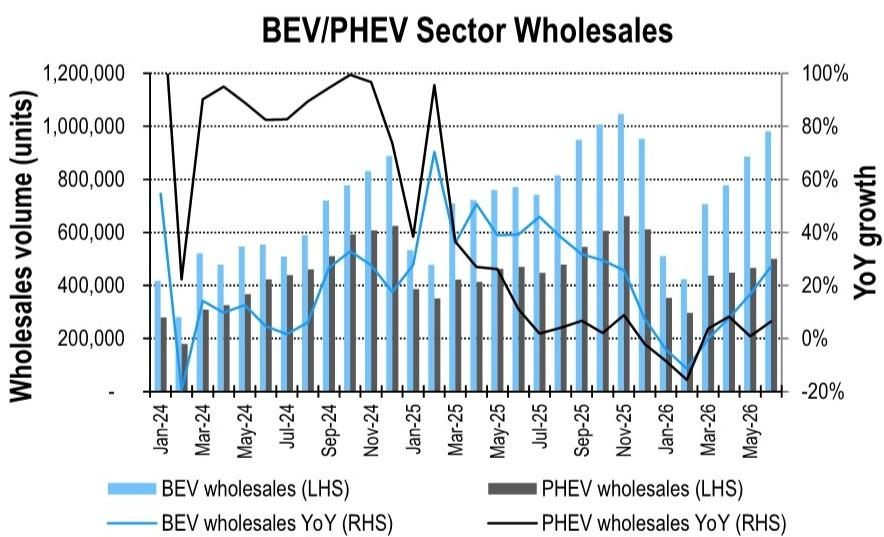

# 中国汽车制造商

## 6月新能源数据库更新；前五名集中度57.1%（环比+0.1个百分点）

## 研究观点

乘联会公布6月新能源乘用车批发销量为148万辆，同比增长19%/环比增长10%。6月新能源渗透率达到62.8%（同比+13.0个百分点/环比+1.7个百分点）。当月，纯电动乘用车批发量同比增长27%/环比增长11%至98.09万辆，插电混动乘用车同比增长6%/环比增长7%至50.05万辆。2026年上半年新能源乘用车批发量同比增长5%至679万辆，其中纯电动同比增长8%至429万辆，插电混动同比持平于250万辆。6月前五名集中度为57.1%，环比+0.1个百分点/同比-1.4个百分点。

比亚迪6月批发销量39.73万辆，同比增长5%/环比增长5%，当月市场占有率26.8%（同比-3.6个百分点/环比-1.1个百分点）。宋DM/秦7 PHEV环比+9%/+13%至6.75万/1.92万辆，海豚环比+15%至2.55万辆。比亚迪纯电动出口销售占比6月为43.6%（环比-10.9个百分点/同比-19.9个百分点，受插电混动车型上量影响），综合全球出口均价为34.5万元（环比+3%/同比+1%）。

吉利6月新能源批发销量同比增长30%/环比增长21%至15.88万辆，市场占有率10.7%（同比+0.9个百分点/环比+1.0个百分点）。极氪7X环比-5%至0.73万辆，极氪9X/8X环比-24%/-18%至0.64万/0.47万辆。银河星舰7/星耀8 PHEV环比+37%/+26%至1.94万/0.26万辆。

奇瑞6月新能源销量同比增长61%/环比增长13%至10.69万辆，市场占有率7.2%（同比+1.9个百分点/环比+0.2个百分点）。

长城汽车6月新能源销量同比-5%/环比+14%至3.46万辆。欧拉5销量环比+157%至0.50万辆，高山6月录得0.53万辆（环比-12%），坦克400/500 PHEV录得0.17万/0.23万辆（环比-17%/-20%）。

特斯拉中国6月销量8.91万辆，同比增长24%/环比增长4%。Model 3/Y销量分别为3.26万/5.65万辆，环比+5%/+3%。

蔚来批发销量同比增长63%/环比增长8%至4.06万辆，6月市场占有率2.7%（同比+0.7个百分点/环比持平）。ES8环比-22%至0.90万辆。ES6/EC6环比-30%/-4%至0.12万/0.05万辆。ET5/ET5T环比-12%/-19%至0.06万/0.18万辆。乐道L90录得0.35万辆，L80录得0.41万辆。

小鹏批发销量同比增长16%/环比增长25%至4.01万辆，6月市场占有率2.7%（同比-0.1个百分点/环比+0.3个百分点）。P7/G6销量环比+10%/+1%至0.65万/0.66万辆。MONA M03录得1.42万辆（环比持平）。

理想汽车6月销量同比-15%/环比-7%至3.09万辆，6月市场占有率2.1%（同比-0.8个百分点/环比-0.4个百分点）。L9/L8/L7/L6环比+138%/+33%/-69%/-82%至0.61万/0.06万/0.08万/0.09万辆。i6/i8录得2.15万/0.08万辆（环比+3%/-50%）。

华为问界6月销量同比-30%/环比持平至3.03万辆，市场占有率2.0%（同比-1.4个百分点/环比-0.2个百分点）。零跑6月批发销量同比增长95%/环比增长14%至9.34万辆，市场占有率6.3%（同比+2.4个百分点/环比+0.3个百分点）。

Jeff Chung $^{AC}$ +852-2501-2787 jeff.m.chung@citi.com

+852-2501-8483

kyle.wu@citi.com

图1. 主要厂商新能源乘用车批发销量（辆）

<table><tr><td rowspan="2"></td><td colspan="6">2026年6月</td><td colspan="4">2026年上半年</td></tr><tr><td>销量</td><td>同比</td><td>环比</td><td>市占率</td><td>同比</td><td>环比</td><td>销量</td><td>同比</td><td>市占率</td><td>同比</td></tr><tr><td>比亚迪</td><td>397,292</td><td>5%</td><td>5%</td><td>26.8%</td><td>-3.6ppt</td><td>-1.1ppt</td><td>1,777,375</td><td>-16%</td><td>26.2%</td><td>-6.4ppt</td></tr><tr><td>吉利</td><td>158,849</td><td>30%</td><td>21%</td><td>10.7%</td><td>0.9ppt</td><td>1.0ppt</td><td>794,536</td><td>10%</td><td>11.7%</td><td>0.5ppt</td></tr><tr><td>奇瑞</td><td>106,922</td><td>61%</td><td>13%</td><td>7.2%</td><td>1.9ppt</td><td>0.2ppt</td><td>441,678</td><td>29%</td><td>6.5%</td><td>1.2ppt</td></tr><tr><td>零跑</td><td>93,376</td><td>95%</td><td>14%</td><td>6.3%</td><td>2.4ppt</td><td>0.3ppt</td><td>356,487</td><td>61%</td><td>5.3%</td><td>1.8ppt</td></tr><tr><td>特斯拉中国</td><td>89,091</td><td>24%</td><td>4%</td><td>6.0%</td><td>0.2ppt</td><td>-0.3ppt</td><td>467,949</td><td>28%</td><td>6.9%</td><td>1.3ppt</td></tr><tr><td>长安</td><td>72,194</td><td>-17%</td><td>14%</td><td>4.9%</td><td>-2.2ppt</td><td>0.2ppt</td><td>325,829</td><td>-17%</td><td>4.8%</td><td>-1.3ppt</td></tr><tr><td>上汽通用五菱</td><td>69,419</td><td>12%</td><td>7%</td><td>4.7%</td><td>-0.3ppt</td><td>-0.1ppt</td><td>267,875</td><td>-26%</td><td>3.9%</td><td>-1.7ppt</td></tr><tr><td>上汽集团</td><td>64,931</td><td>307%</td><td>40%</td><td>4.4%</td><td>3.1ppt</td><td>1.0ppt</td><td>238,439</td><td>221%</td><td>3.5%</td><td>2.4ppt</td></tr><tr><td>蔚来</td><td>40,597</td><td>63%</td><td>8%</td><td>2.7%</td><td>0.7ppt</td><td>0.0ppt</td><td>191,123</td><td>68%</td><td>2.8%</td><td>1.1ppt</td></tr><tr><td>小鹏</td><td>40,126</td><td>16%</td><td>25%</td><td>2.7%</td><td>-0.1ppt</td><td>0.3ppt</td><td>165,977</td><td>-16%</td><td>2.4%</td><td>-0.6ppt</td></tr><tr><td>小米汽车</td><td>34,738</td><td>36%</td><td>6%</td><td>2.3%</td><td>0.3ppt</td><td>-0.1ppt</td><td>185,055</td><td>17%</td><td>2.7%</td><td>0.3ppt</td></tr><tr><td>长城汽车</td><td>34,610</td><td>-5%</td><td>14%</td><td>2.3%</td><td>-0.6ppt</td><td>0.1ppt</td><td>144,430</td><td>-10%</td><td>2.1%</td><td>-0.3ppt</td></tr><tr><td>北汽新能源</td><td>31,900</td><td>99%</td><td>33%</td><td>2.2%</td><td>0.9ppt</td><td>0.4ppt</td><td>120,240</td><td>55%</td><td>1.8%</td><td>0.6ppt</td></tr><tr><td>广汽新能源</td><td>31,431</td><td>29%</td><td>-9%</td><td>2.1%</td><td>0.2ppt</td><td>-0.4ppt</td><td>190,524</td><td>44%</td><td>2.8%</td><td>0.8ppt</td></tr><tr><td>理想汽车</td><td>30,895</td><td>-15%</td><td>-7%</td><td>2.1%</td><td>-0.8ppt</td><td>-0.4ppt</td><td>193,472</td><td>-5%</td><td>2.9%</td><td>-0.3ppt</td></tr><tr><td>问界</td><td>30,345</td><td>-30%</td><td>0%</td><td>2.0%</td><td>-1.4ppt</td><td>-0.2ppt</td><td>160,609</td><td>-5%</td><td>2.4%</td><td>-0.2ppt</td></tr><tr><td>华晨宝马</td><td>2,103</td><td>-14%</td><td>-21%</td><td>0.1%</td><td>-0.1ppt</td><td>-0.1ppt</td><td>14,455</td><td>-50%</td><td>0.2%</td><td>-0.2ppt</td></tr><tr><td>其他</td><td>152,633</td><td>5%</td><td>2%</td><td>10.3%</td><td>-1.5ppt</td><td>-0.7ppt</td><td>751,765</td><td>17%</td><td>11.1%</td><td>1.2ppt</td></tr><tr><td>新能源乘用车合计</td><td>1,481,452</td><td>19%</td><td>10%</td><td></td><td></td><td></td><td>6,787,818</td><td>5%</td><td></td><td></td></tr></table>

© 2026 Citi Inc. 未经Citi书面许可不得转载。
来源：Citi，乘联会

图2. 纯电动/插电混动板块批发销量

© 2026 Citi Inc. 未经Citi书面许可不得转载。
来源：Citi，乘联会

如果您有视觉障碍并希望就本文件中图表的详细信息与Citi代表沟通，请致电美国1-888-500-5008（TTY：711），或从美国境外拨打+1-210-677-3788

## 附录A-1

## 分析师认证

主要负责本研究报告编制和内容的研究分析师要么在作者栏中以"AC"标识，要么以粗体列在与该分析师相关的内容旁。如果作者栏中指定了多位AC分析师，每位分析师仅就本研究报告的整体内容进行认证，但以下内容除外：(a) 归属于以粗体列出的另一位AC认证分析师的内容，以及(b) 仅针对特定发行人的观点，该观点归属于下方该发行人价格图表或评级历史表中标识的另一位AC认证分析师。每位分析师就其负责的报告部分认证：(1) 其中表达的观点准确反映了他们对每个提及的发行人和证券的个人观点，并且是独立编制的，包括对Citi Global Markets Inc.及其关联公司；(2) 研究分析师的薪酬的任何部分过去、现在或将来都不会直接或间接与本报告中该研究分析师表达的具体建议或观点相关。

## 重要披露

分析师薪酬由Citi管理层和Citi高级管理层确定，并基于旨在惠及Citi Global Markets Inc.及其关联公司（"公司"）读者客户的活动和服务。薪酬不与特定交易或建议挂钩。与所有公司员工一样，分析师的薪酬受到公司整体盈利能力的影响，包括投资银行、销售和交易以及自营交易收入。股票研究分析师薪酬的一个考量因素是安排机构客户与被覆盖公司管理团队之间的企业接触活动。通常，当分析师对公司持积极看法时，公司管理层更有可能参与。

对于公司并非做市商的Product中推荐的金融工具，公司是该等金融工具（及其任何基础工具）的流动性提供者，并可能就此类工具的交易担任主事人。公司是可能与Product中推荐证券挂钩的可交易金融工具的常规发行人。公司定期交易Product中讨论的发行人证券。公司可能以与Product不一致的方式进行证券交易，并将就Product所覆盖的证券以主事人身份向客户买入或卖出。

除非另有说明，研究分析师或其团队成员均未在过去12个月内实地考察过已提供研究观点的公司的重大运营情况。

有关本Citi产品（"Product"）所涉及公司的重要披露（包括历史披露副本），请联系Citi，地址：388 Greenwich Street, 6th Floor, New York, NY, 10013，收件人：Legal/Compliance [E6WYB6412478]。此外，除估值与风险评估及历史披露外，相同的重要披露载于公司披露网站：

https://www.citivelocity.com/cvr/eppublic/citi\_research\_disclosures。估值与风险评估可在关于标的公司的最新研究报告/报告的正文中找到。根据《市场滥用条例》，Citi在过去12个月内发布的所有建议的历史记录可通过Citi Velocity (https://www.citivelocity.com/cv2) 或您的标准分发门户访问。历史披露（最多过去三年）将应要求提供。

## Citi股票评级分布

<table><tr><td></td><td colspan="3">12个月评级</td><td colspan="3">催化剂观察</td></tr><tr><td>数据截至2026年7月1日</td><td>买入</td><td>持有</td><td>卖出</td><td>买入</td><td>持有</td><td>卖出</td></tr><tr><td>Citi全球基本面覆盖（中性=持有）</td><td>61%</td><td>32%</td><td>7%</td><td>36%</td><td>48%</td><td>16%</td></tr><tr><td>各评级类别中为投资银行客户的公司的百分比</td><td>38%</td><td>42%</td><td>27%</td><td>42%</td><td>37%</td><td>36%</td></tr></table>

## Citi基本面研究投资评级指南：

Citi股票建议包括投资评级和可选的风险评级以突出高风险股票。风险评级同时考虑价格波动性和基本面标准。股票将没有风险评级或被分配高风险评级。

投资评级：Citi投资评级为买入、中性及卖出。我们的评级是分析师对预期总回报（"ETR"）和风险的预期函数。ETR是未来12个月内股票预测价格升值（或贬值）加上股息回报表现的和。目标价格基于12个月的时间范围。投资评级定义为：买入（1）ETR为15%或以上，或高风险股票为25%或以上；卖出（3）为负ETR。任何未被分配买入或卖出的被覆盖股票均为中性（2）。对于评级为中性（2）的股票，如果分析师认为缺乏足够的估值驱动因素和/或投资催化剂以形成正面或负面的投资观点，经Citi管理层批准，他们可以选择不分配目标价格，从而不推导ETR。Citi可能因监管和/或内部政策原因暂停其评级和目标价格，并分配"评级暂停"状态。Citi也可能因其他特殊情况（例如缺乏对分析师论点至关重要的信息、公司证券交易暂停）影响公司和/或公司证券交易而暂停其评级和目标价格，并分配"审查中"状态。在这两种情况下，评级和目标价格将在评级历史价格图表中分别显示为"—"和"-"。在2022年4月11日之前，Citi将两种情况均分配"审查中"状态，而在2020年11月11日之前仅在特殊情况下分配。在实际可行的情况下，分析师将尽快发布重新建立评级和投资论点的说明。投资评级由上述范围在首次覆盖、投资和/或风险评级变更或目标价格变更时确定（受有限的管理酌情权限制）。有时，由于市场价格波动和/或其他短期波动或交易模式，预期总回报可能超出这些范围。此类临时偏差将被允许，但将接受研究管理部门的审查。您买入或卖出证券的决定应基于您个人的投资目标，并应在评估股票的预期表现和风险后做出。

## 催化剂观察/短期观点（"STV"）评级披露：

催化剂观察和STV上行/下行提示：Citi还可能包括催化剂观察或STV上行或下行提示，以表明分析师预期股价将在指定的30天或90天期间内因一个或多个影响公司或市场的特定短期催化剂或事件而相对上涨（下跌）。当分析师对股价将受到影响有高度信心时，将发布催化剂观察；当信心水平中等时，将发布STV。催化剂观察或STV上行/下行提示将在指定的30/90天期限结束时自动到期。如果股价表现（按市场收盘计算）相对于提示方向超过15%，催化剂观察也将自动移除（除非分析师推翻）。分析师也可以在指定期限结束前通过发布的研究说明移除催化剂观察或STV提示。催化剂观察/STV上行或下行提示可能不同于且不影响股票的基本面股票评级，后者反映较长期的总相对回报预期。就FINRA评级分布披露规则而言，催化剂观察/STV上行提示对应买入建议，催化剂观察/STV下行提示对应卖出建议。任何未被分配催化剂观察上行、催化剂观察下行、STV上行或STV下行提示的股票被视为催化剂观察/STV无观点。就FINRA评级分布披露规则而言，我们在催化剂观察/STV上行/下行评级系统的评级分布表中将催化剂观察/STV无观点对应为持有。然而，我们重申我们不认为无观点是一项建议。对于所有催化剂观察/STV上行/下行提示，存在催化剂和相关的股价变动可能不会如预期实现的风险。

## 研究分析师关联/非美国研究分析师披露

本报告作者的雇佣法律实体列于下方（其监管机构进一步列于下文）。编制本报告的非美国研究分析师（即除被标识为受雇于Citi Global Markets Inc.的分析师外的所有下述研究分析师）未在FINRA注册/具备研究分析师资格。该等研究分析师可能不是成员组织的关联人士（但受雇于成员组织的关联公司），因此可能不受FINRA规则2241关于与标的公司沟通、公开露面以及研究分析师账户持有证券交易的限制。

Citi Global Markets Asia Limited

Jeff Chung; Kyle Wu

## 其他披露

<table><tr><td>建议中提及的任何工具的价格均为前一交易日该工具主要市场的收盘价，除非另有说明。</td></tr><tr><td>本研究报告中任何建议的完成和首次分发时间均为Product顶部显示的东部日期时间。如果Product引用其他分析师的观点，请参阅价格图表或评级历史表以了解该观点的完成和首次分发的日期/时间。</td></tr><tr><td>各司法管辖区的法规要求，如果建议与作者先前就同一金融工具或发行人发布的任何建议不同，且该建议在过去12个月内已发布，则需指明变更和先前建议的日期。对于基本面覆盖，请参阅本披露附录中的价格图表或评级变更历史，或发行人披露摘要 https://www.citivelocity.com/cvr/eppublic/citi_research_disclosures。</td></tr><tr><td>Citi已实施识别、考虑和管理因发布或分发投资研究而产生的潜在利益冲突的政策。这些政策的描述可在 https://www.citivelocity.com/cvr/eppublic/citi_research_disclosures 找到。</td></tr><tr><td>过去12个月每个季度末所有Citi研究建议中相当于"买入"、"持有"、"卖出"的比例（以及其中在过去12个月内获得Citi投资公司服务的百分比显示在括号中）如下：2026年第一季度买入33%（63%），持有44%（52%），卖出23%（46%），相对价值0.5%（89%）；2025年第四季度买入33%（63%），持有44%（50%），卖出23%（46%），相对价值0.4%（91%）；2025年第三季度买入33%（61%），持有44%（52%），卖出23%（50%），相对价值0.4%（80%）；2025年第二季度买入33%（63%），持有44%（51%），卖出23%（49%），相对价值0.4%（86%）。为披露除股票外的建议（其定义可在相应披露部分找到），"买入"指正向方向性交易思路；"卖出"指负向方向性交易思路；"相对价值"指任何不具有明确投资策略方向的交易思路。</td></tr></table>

欧洲法规要求在引用证券过往表现时提供5年价格历史。CitiVelocity的图表工具 (https://www.citivelocity.com/cv2/#go/CHARTING\_3\_Equities) 提供创建可定制价格图表的功能，包括五年选项。该工具可在CitiVelocity (https://www.citivelocity.com/) 的任何资产类别菜单下的数据与分析部分找到。如需更多信息，请联系CitiVelocity支持 (https://www.citivelocity.com/cv2/go/CLIENT\_SUPPORT)。除非另有说明，所有引用价格来源于DataCentral，该数据库从LSEG Data & Analytics获取价格信息。过往表现并非未来结果的保证或可靠指标。预测并非未来表现的保证或可靠指标。

读者在投资前应始终仔细考虑ETF的投资目标、风险、费用和开支。ETF的适用招股说明书和关键读者信息文件（如适用）应包含该ETF的此等信息和其他信息。在投资前仔细阅读任何此类招股说明书非常重要。客户可从适用的分销商或授权参与者、ETF上市的交易所和/或适用ETF发行人的适用网站获取ETF的招股说明书和关键读者信息文件。研究价值及任何应计收益可能下跌或上涨。任何过往表现、预测或预报均不预示未来或可能的表现。本文包含的任何ETF信息仅供说明之用，不应被视为出售或招揽购买任何ETF单位的要约，无论是明示还是暗示。所表达的意见是作者的意见，不一定反映ETF发行人、其任何代理人或其关联公司的观点。

Citi Global Markets India Private Limited和/或其关联公司可能不时实际或实益拥有标的发行人债务证券的1%或以上。

请注意，根据经修订的第13959号行政命令（"命令"），美国人被禁止投资于美国政府确定为命令标的的任何公司的证券。本研究无意以任何可能导致违反命令的方式使用或依赖。鼓励读者依靠自己的法律顾问就遵守命令以及美国财政部外国资产控制办公室管理和执行的其他经济制裁计划寻求建议。

本通讯针对符合以色列《研究交流、投资营销和投资组合管理法》（1995年）（"咨询法"）定义的"合格客户"的人士。在以色列境内，本通讯不针对零售客户，Citi不会向零售客户或非合格客户提供此类产品或交易。演示者未获得以色列证券管理局（"ISA"）的投资顾问或投资营销许可，本通讯不构成投资或营销建议。本文包含的信息可能涉及ISA未监管的事项。本通讯涉及的任何证券不得向任何以色列人士发售或出售，除非根据《以色列证券法》（1968年）的证券发售豁免及其下的公开发售规则。

Citi广泛并同时通过公司专有的电子分发平台（例如Citi Velocity和各种全球财富平台）向公司的机构和零售客户分发其研究内容。为方便起见，某些（但非全部）研究内容可能通过第三方聚合器分发。客户可在酌情基础上，且仅在此类研究内容已广泛分发后，通过电子邮件接收已发布的研究报告。某些研究仅向机构读者提供以满足监管要求。Citi分析师向客户提供的服务水平和类型可能因多种因素而异，例如客户对接收分析师通讯的频率和方式的个人偏好、客户的风险状况和投资焦点及视角（例如市场范围、行业特定、长期、短期等）、与公司的整体客户关系的规模和范围以及法律和监管限制。

根据Comissão de Valores Mobiliários Resolução 20和ASIC Regulatory Guide 264，Citi需要披露Citi关联公司或业务是否与标的公司有商业关系。考虑到Citi在全球100多个国家经营多项业务，Citi很可能与标的公司有商业关系。

公司推荐、要约或出售的证券：(i) 不受联邦存款保险公司保险；(ii) 不是任何受保存款机构（包括Citi）的存款或其他义务；及(iii) 受投资风险影响，包括可能损失本金金额。Product仅供信息参考，不构成购买或出售证券的要约或招揽。购买Product中提及证券的任何决定必须考虑该证券的现有公开信息或任何注册招股说明书。尽管信息来自并基于公司认为可靠的来源，但我们不保证其准确性，且信息可能不完整和经过浓缩。但请注意，公司已采取一切合理步骤确定Product重要披露部分中披露的准确性和完整性。公司的研究部门已获得本Product中提及的标的公司的协助，包括但不限于与标的公司管理层的讨论。公司政策禁止研究分析师向标的公司发送研究草稿。但应假定Product的作者已与标的公司进行讨论以确保发布前的事实准确性。关于ESG（环境、社会、治理）因素的陈述和观点通常基于标的公司的公开声明或其他公开新闻，作者可能未独立核实。ESG因素是读者在做出投资决策时可能考虑的一个考量因素。所有意见、预测和估计构成作者截至Product日期的判断，这些以及Product中包含的任何其他信息如有变更，恕不另行通知。金融工具的价格和可用性也可能随时变更，恕不另行通知。尽管公司内部其他部门为Product中讨论的公司提供建议，但在此类角色中获得的信息不用于编制Product。尽管Citi未设定预定的发布频率，但如果Product是基本面股票或信用研究报告，Citi有意提供对被覆盖发行人的研究覆盖，包括响应影响发行人的新闻。对于非基本面研究报告，Citi可能不会定期更新报告中包含的观点、建议和事实。尽管Citi维持对发行人的覆盖、提出建议或讨论发行人，但Citi可能因法律或政策原因定期被限制引用某些发行人。如果已发布的交易思路的组成部分受到限制，该交易思路将从Product中包含的任何开放交易思路列表中移除。限制解除后，如果分析师继续支持该交易思路，该交易思路将重新列入开放交易思路列表，否则将正式关闭。Citi可能向不同类别的客户提供不同的研究产品和服务（例如，基于长期或短期投资期限），这可能导致与替代研究产品中的建议相矛盾的结论或建议，可能影响证券价格，前提是每个产品与其各自的评级系统一致。

投资非美国证券（包括ADR）可能涉及某些风险。非美国发行人的证券可能未在美国证券交易委员会注册，也不受其报告要求的约束。外国证券的信息可能有限。外国公司通常不受与美国公司相当的统一审计和报告标准、实践和要求的约束。某些外国公司的证券可能流动性较低，其价格比可比的美国公司证券更波动。此外，汇率变动可能对美国读者在外国股票的研究价值及其相应的股息支付产生不利影响。ADR读者的净股息是使用预扣税率惯例估算的，被认为是准确的，但鼓励读者就精确的股息计算咨询其税务顾问。从公司收到Product的读者可能在某些州或其他司法管辖区被禁止从公司购买Product中提及的证券。请向您的财务顾问咨询更多详情。Citi Global Markets Inc.在美国对Product负责。美国读者因Product中包含的信息而下的任何订单只能通过Citi Global Markets Inc.下达。

对Product生产负责的Citi法律实体是第一位署名作者的雇佣法律实体。

Product在澳大利亚由Citi Global Markets Australia Pty Limited提供。（ABN 64 003 114 832和AFSL No. 240992），ASX集团参与者，受澳大利亚证券和投资委员会监管。Citi Centre, 2 Park Street, Sydney, NSW 2000。Citi Global Markets Australia Pty Limited不是《1959年银行法》下的授权存款机构，也不受澳大利亚审慎监管局监管。

Product在巴西由Citi Global Markets Brasil – CCTVM SA提供，该公司受CVM – Comissão de Valores Mobiliários（"CVM"）、BACEN – 巴西中央银行、APIMEC – Associação dos Analistas e Profissionais de Investimento do Mercado de Capitais和ANBIMA – Associação Brasileira das Entidades dos Mercados Financeiro e de Capitais监管。Av. Paulista, 1111 - 14º andar(parte) - CEP: 01311920 - São Paulo - SP。

本Product在智利通过Banchile Corredores de Bolsa S.A.提供，该公司是Citi Inc.的间接子公司，受Comisión Para El Mercado Financiero监管。Enrique Foster Sur, 20, piso 6, Las Condes, Santiago, Chile。

哥伦比亚共和国读者披露：本通讯或信息不构成第2555号法令2010年第2.40.1.1.2条或其修订、替代或补充法规意义上的专业研究交流。编制和分发本条所述的研究报告和一般通讯不需要成为哥伦比亚金融监管局监管的实体。

Product在德国由Citi Global Markets Europe AG（"CGME"）提供，该公司受欧洲中央银行和德国联邦金融监管局（Bundesanstalt für Finanzdienstleistungsaufsicht BaFin）监管。Börsenplatz 9, 60313 Frankfurt am Main, Germany。

除非另有说明，如果编制本报告的分析师位于香港且报告涉及"证券"（定义见香港法例第571章《证券及期货条例》），则该报告由Citi Global Markets Asia Limited在香港发布。Citi Global Markets Asia Limited受香港证券及期货事务监察委员会监管。如果报告由非香港分析师编制，请注意该分析师（及其雇佣或认可的法律实体）未在香港获得许可/注册，且他们不声称如此。请参阅"研究分析师关联/非美国研究分析师披露"部分以了解分析师雇佣实体的详细信息。

Product在印度由Citi Global Markets India Private Limited（CGM）提供，该公司作为研究分析师受印度证券交易委员会（SEBI）监管（SEBI注册号INH000000438）。CGM还积极参与印度的商人银行业务（SEBI注册号INM000010718）和股票经纪业务（SEBI注册号INZ000263033），并已就此在SEBI注册。SEBI授予的注册、孟买证券交易所（BSE）的上市以及国家证券市场研究所（NISM）的认证绝不保证中介机构的业绩或向读者提供任何回报保证。CGM的注册办公室位于1202, 12th Floor, First International Financial Centre (FIFC), G Block, Bandra Kurla Complex, Bandra East, Mumbai – 400098，注册电话：+91 22 61759999。Citi维持健全的政策、程序、控制和培训，以确保持续遵守所有适用规则和法规。本文包含的所有建议均由合格的研究分析师做出。CGM的公司识别号为U99999MH2000PTC126657，其合规官[Vishal Bohra]的联系方式为：电话：+91-022-61759994，传真：+91-022-61759851，电子邮件：cgmcompliance@citi.com。关于研究分析师的读者章程、合规审计报告和投诉信息可在

Citi Global Markets (Pty) Ltd. 在南非共和国注册成立（公司注册号2000/025866/07），其注册办公室位于145 West Street, Sandton, 2196, Saxonwold。Citi Global Markets (Pty) Ltd. 受JSE证券交易所南非、南非储备银行和金融服务委员会监管。本文包含的投资和服务不适用于南非的私人客户。

https://www.citivelocity.com/cvr/eppublic/citi\_research\_disclosures。申诉官[Niraj Mody]的联系方式为电话：+91-22-42775002，电子邮件：EMEA.CR.Complaints@citi.com。证券市场投资存在市场风险。投资前请仔细阅读所有相关文件。SEBI规定的客户条款和条件可在 https://www.citivelocity.com/rendition/authfilelinksvcs/eppublic/V1/file?paramData=ZmlsZU5hbWU9L1MzL0dETVMvcHViRGlZY2xvc3VyZUhObWxzL2dkbV9kaXNfc2ViaV9UZXJtc29mVXNILmhObWw 找到。

Product在印度尼西亚通过PT Citi Sekuritas Indonesia提供。Citibank Tower 10/F, Pacific Century Place, SCBD lot 10, Jl. Jend Sudirman Kav 52-53, Jakarta 12190, Indonesia。本Product或其任何副本不得在印度尼西亚或向任何印度尼西亚公民（无论其居住地）或印度尼西亚居民分发，除非符合适用的资本市场法律法规。本Product不是印度尼西亚的证券要约。本Product中提及的证券尚未根据相关资本市场法律法规在资本市场和金融服务局（OJK）注册，不得在印度尼西亚共和国境内或向印度尼西亚公民通过公开发售或在构成印度尼西亚资本市场法律法规意义上的要约的情况下发售或出售。

Product在日本由Citi Global Markets Japan Inc.（"CGMJ"）提供，该公司受金融厅、证券交易监督委员会、日本证券业协会、东京证券交易所和大阪证券交易所监管。Otemachi Park Building, 1-1-1 Otemachi, Chiyoda-ku, Tokyo 100-8132 Japan。如果在CGMJ研究报告中发现错误，修订版将发布在公司的Citi Velocity网站上。如果您对Citi Velocity有疑问，请致电(81 3) 6270-3019寻求帮助。

Product在沙特阿拉伯王国根据沙特法律通过Citi Saudi Arabia提供，该公司受资本市场管理局（CMA）监管，CMA许可证号17184-31。2239 Al Urubah Rd – Al Olaya Dist. Unit No. 18, Riyadh 12214 – 9597, Kingdom Of Saudi Arabia。

Product在韩国由Citi Global Markets Korea Securities Ltd.（CGMK）提供，该公司受金融委员会、金融监督院和韩国金融投资协会（KOFIA）监管。CGMK的地址为Citibank Center, 50 Saemunan-ro, Jongno-gu, Seoul 03184, Korea。KOFIA在其网站上提供研究分析师的注册信息。如果您希望查找CGMK研究分析师的KOFIA注册信息，请访问以下网站：http://dis.kofia.or.kr/websquare/index.jsp?w2xPath=/wq/fundMgr/DISFundMgrAnalystList.xml&divisionId=MDISO3002002000000&serviceId=SDISO3002002000。Product在韩国由Citibank Korea Inc.提供，该公司受金融委员会和金融监督院监管。地址为Citibank Center,
