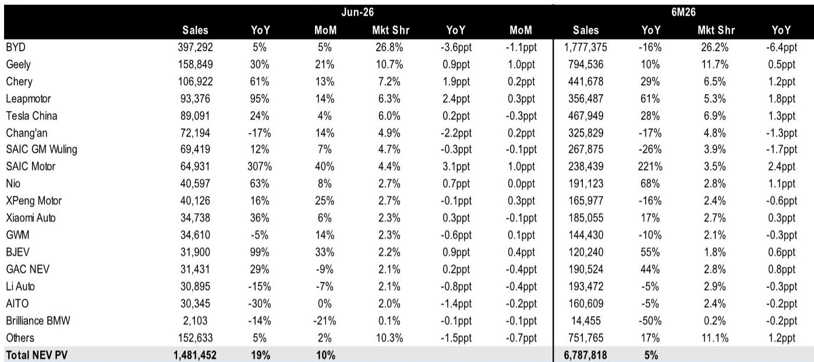
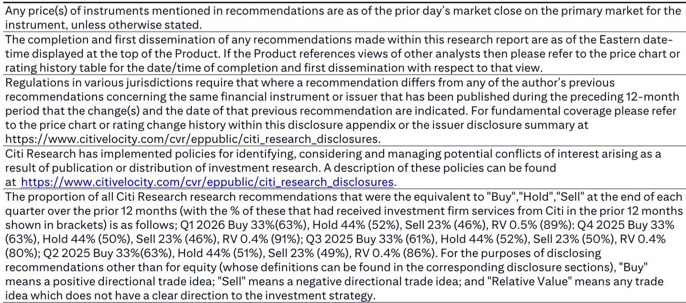

# 中国新能源汽车市场进入双速竞争：规模赢家正在巩固，创新驱动挑战者重塑格局

2026年6月，中国新能源汽车批发量达到148万辆，同比增长19%，渗透率攀升至62.8%，较去年同期提升13个百分点。电动化已不再是“是否会发生”的问题，而是已经发生。对于观察者和行业管理者而言，战略问题变成了谁能从中获益。6月数据显示，市场正分化为两条截然不同的轨迹。一组——比亚迪、吉利、奇瑞和零跑——正在快速规模化，巩固份额，并证明以量驱动的模式行之有效。另一组——理想、问界和长城——正在失去动力，尽管整体市场在扩大，但它们的销量同比下降，市场份额也在缩小。CR5集中度稳定在57.1%，但这一数字背后的构成正在发生变化，奖励规模效率，惩罚产品周期失误。赢家不仅仅是拥有最佳技术的公司，而是那些建立了运营机制，能够将创新转化为盈利性销量的公司。

## 比亚迪市场份额下降掩盖了向高价值出口和利润保护的战略转向

比亚迪6月销售39.73万辆，同比增长5%，环比增长5%，但其国内市场份额同比下降3.6个百分点至26.8%。表面上看，这似乎是竞争力下降。但深层故事有所不同。比亚迪正在有意识地调整其产品组合。其纯电出口占比在6月降至43.6%，环比下降10.9个百分点，同比下降19.9个百分点，而插混出口正在增加。更值得注意的是，其全球综合出口均价环比上涨3%，同比上涨1%，达到34.5万元。比亚迪并非在向竞争对手让出份额，而是在用国内销量换取更高利润的出口收入。该公司正利用其规模优势——仅宋DM插混在6月就售出6.75万辆——来支撑其优先考虑均价而非销量的全球定价策略。仅关注国内份额指标的观察者将错过比亚迪正在国际市场从销量领先者向价值领先者转变的教科书式过渡。

## 吉利和奇瑞证明：二线规模玩家可以通过产品节奏纪律颠覆旧有格局

吉利6月新能源汽车批发量同比增长30%，环比增长21%，达到15.88万辆，市场份额提升至10.7%——同比增加0.9个百分点，环比增加1.0个百分点。奇瑞的增长更为显著：同比增长61%，环比增长13%，达到10.69万辆，市场份额达到7.2%，同比增加1.9个百分点。将这两家公司与其他公司区分开来的不仅仅是增长率，还有增长的模式。吉利的银河星舰7插混环比增长37%至1.94万辆，而其极氪7X则下降了5%。该公司正在管理一个多品牌组合，其中插混车型正在吸收纯电竞争对手无法捕捉的需求。与此同时，奇瑞的增长是广泛的，并不依赖于单一明星车型。战略含义很明确：在一个新能源汽车渗透率超过60%的市场中，优势属于那些能够在多个价格点和动力类型中维持新车型管线的制造商，而不是将所有赌注押在一个平台上。

## 零跑同比增长95% 表明市场重心正转向大众市场可负担性

零跑6月交付9.34万辆，销量几乎比一年前翻了一番，并占据了6.3%的市场份额——同比增加2.4个百分点。这是6月数据中对长期行业结构最重要的信号。零跑不是一个高端品牌；它在10万至15万元区间竞争，这是传统内燃机销量领先者曾经主导的领域。其95%的同比增长率远超比亚迪的5%和特斯拉中国的24%。市场告诉我们，新能源汽车普及的下一阶段将由可负担性驱动，而非豪华。随着渗透率超过60%，剩余37%的市场——即后期大众市场——对价格更为敏感。零跑的轨迹表明，2027-2028年的赢家将是那些能够在15万元以下价位提供可接受续航和功能的公司。像蔚来这样份额为2.7%、同比仅增长0.7个百分点的高端品牌，如果销量增长仍然受限，将越来越难以证明其估值溢价。

## 高端市场正在经历达尔文式洗牌：理想和问界失势，蔚来和小鹏

理想6月销量同比下降15%，环比下降7%，至3.09万辆，市场份额降至2.1%——同比下降0.8个百分点。问界表现更差，同比下降30%至3.03万辆，份额损失1.4个百分点。这些并非小波动；它们代表了产品生命周期管理中的结构性挑战。理想的L7和L6车型环比分别明显回落69%和82%，表明该公司的增程SUV模式正面临核心用户群体的饱和。问界环比持平，增长0%，而整体市场增长10%，这表明其华为驱动的品牌资产并未转化为持续需求。相比之下，蔚来同比增长63%至4.06万辆，小鹏同比增长16%，环比增长25%至4.01万辆。这种分化并非关于品牌声望，而是关于产品更新周期。蔚来的乐道L90和L80子品牌在首月分别录得3500辆和4100辆的订单，表明新车型的推出仍能在高端市场产生需求。关键洞察：在一个年增长19%的市场中，任何出现同比负增长的品牌都在失去竞争相关性，资本市场对此类品牌的耐心将会缩短。

## 观察者的决策框架：沿着规模经济和产品周期动量两个维度绘制新能源汽车玩家

6月数据允许构建一个简单但有力的战略矩阵。X轴是规模经济：以相对销量和市场份额轨迹衡量。Y轴是产品周期动量：以新车型的环比增长和旧车型没有急剧下降来衡量。第一象限——高规模、高动量——包含比亚迪和吉利。这些公司有足够的销量来摊销研发和制造成本，并且它们正在推出每月都能获得份额的新车型。第二象限——低规模、高动量——包含零跑和奇瑞。这些对于寻求增长的观察者来说最具吸引力，因为它们的动量足够强劲，可以在12-18个月内将其拉入规模象限。第三象限——高规模、低动量——基本上是空的，这本身就是一个发现：没有大型玩家在没有新产品火力的情况下坐享其成。第四象限——低规模、低动量——包含理想、问界和长城。这些公司面临战略十字路口。它们拥有品牌认知度和现金储备来转向，但当前的轨迹指向持续的份额损失。对于观察者而言，该框架表明，关注点应流向第一和第二象限的公司，而第四象限的公司将需要在两个季度内展示产品周期的重置，以避免成为收购目标或利润牺牲者。

## 插混复兴正以比纯电预测更快的速度重塑竞争动态

6月的动力类型细分揭示了一个并非完全电动化的市场。纯电批发量同比增长27%至98.09万辆，但插混仅增长6%至50.05万辆。表面上看是纯电主导，但环比故事更为微妙。纯电环比增长11%，而插混增长7%。差距正在缩小。2026年上半年，纯电累计增长8%，而插混为0%。然而，比亚迪的宋DM插混和吉利的银河星舰7插混录得强劲的环比增长，而许多纯电车型——极氪7X、蔚来ES8、理想L7——则出现下滑。这种模式表明，插混在消费者面临里程焦虑或充电基础设施不足的细分市场中获胜，尤其是在新能源汽车渗透率仍较低的低线城市。这对电池供应链和充电基础设施的观察者有一个直接影响：插混在整体中的占比可能比共识预期的更长时间保持高位。那些只投资于纯电平台的公司有错过插混需求浪潮的风险，而像比亚迪和吉利这样提供两种动力类型的公司则可以捕捉不同信心水平的消费者。

*仅供参考。部分内容可能基于源材料通过AI辅助生成、翻译、总结或编辑，可能存在遗漏或错误。请独立核实。本文不构成专业建议。*

仅供参考。部分内容可能基于源材料通过AI辅助生成、翻译、总结或编辑，可能存在遗漏或错误。请独立核实。本文不构成专业建议。

