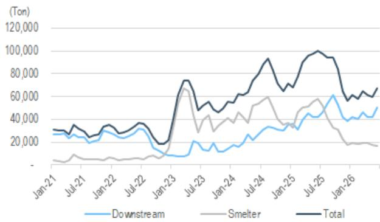
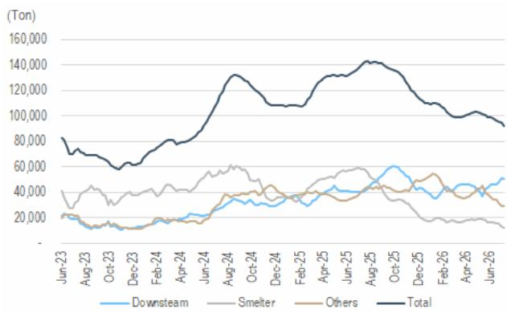
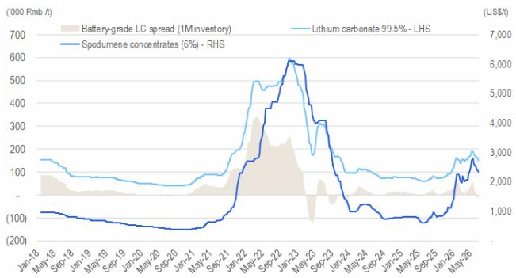
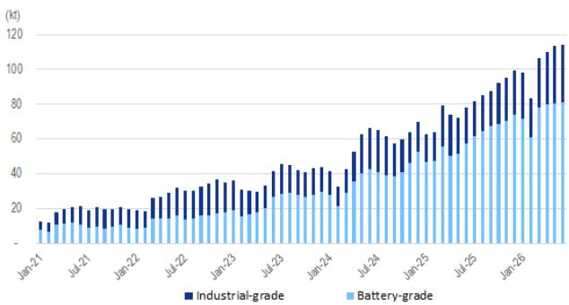
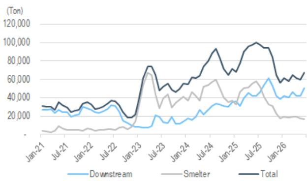
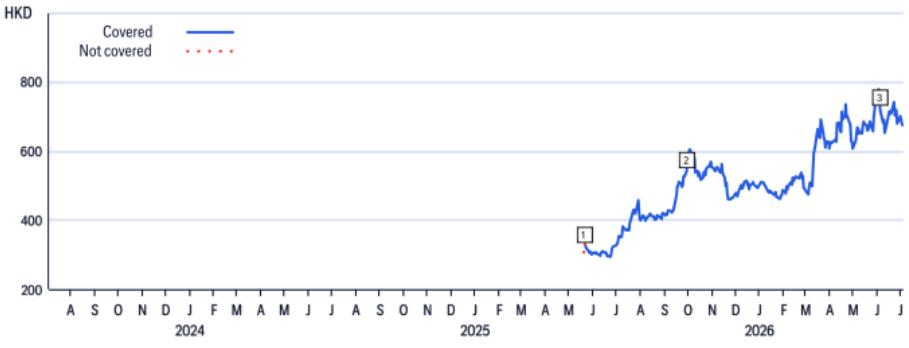
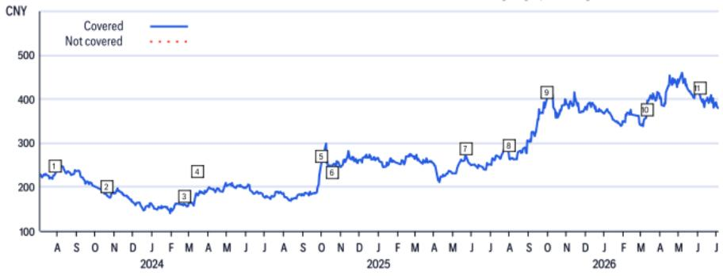
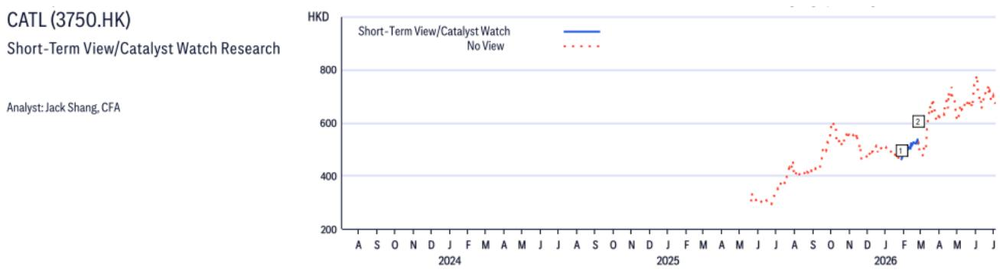
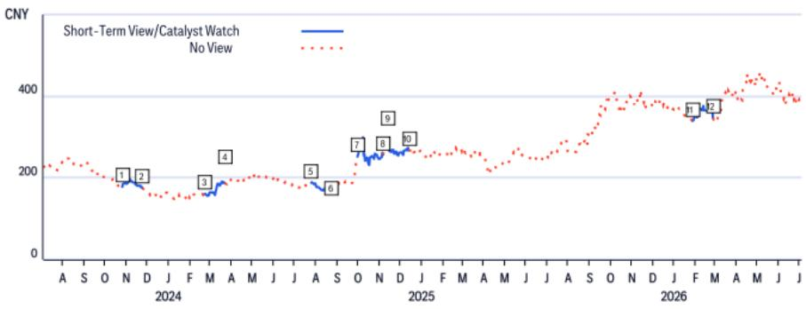

09 Jul 2026 11:45:50 ET | 12 pages

# China Battery Materials

## Lithium into 2nd week of July – Our read to the sell off this week

## CITI'S TAKE

Lithium price and equity names experienced a notable adjustment in the last two days, on (1) JXW resumption, and (2) potential proposal on LFP cathode capacity control ahead. Our read follows – (1) We expect CATL to give investors more colour on the JXW mine resumption, new battery capacity timeline, and full year battery output/shipment target in the upcoming results call of which the impact to lithium fundamental we estimate to skew to the positive, (2) we see immaterial impact from the potential capacity control proposal on LFP cathode ahead, as this echoes to our previous anti-involution call (see note) and the timeline remains uncertain, and (3) we await more details on JXW resumption (i.e. scale, cost, and etc), but we believe the market has priced in most of the recent developments over the last few weeks.

Weekly wrap-up: Lithium ASP was in the downtrend WoW during last week. Among that, Li2CO3 and LiOH ASP is quoted at Rmb158.5k/t and Rmb142.5k/t as of 9th July respectively, vs Rmb162.5k/t and Rmb158.5k/t as of 2nd July. Production wise, China Li2CO3 production was -3% WoW at 24,855 tons last week. Among that, output from brine, lepidolite, spodumene, and recycle was +2%/-20%/-3%/+1% WoW respectively. Inventory wise, total inventory of Li2CO3 came in at 92,236 tons this week (-2% WoW / -2,338 tons WoW). Within that, inventory of downstream players (mainly cathode makers), smelters, and others (mainly battery makers and traders) were -2%, -9%, -8% WoW to 50,339 tons, 12,415 tons, and 29,482 tons respectively.

Jack Shang, CFA $^{AC}$ +852-2501-2441
jack.shang@citi.com

Anna Wang
+852-2501-2739
anna.d.wang@citi.com

Jimmy Feng
+852-2501-7588
jimmy.feng@citi.com

Cynthia Wu
+852-2868-7813
cynthia.d.wu@citi.com

## Shreyas Madabushi

+91-22-4277-5048
shreyas.madabushi@citi.com

Figure 1. Lithium carbonate monthly inventory  
  
© 2026 Citi Inc. No redistribution without Citi's written permission.
Source: Citi, SMM

Figure 2. Lithium carbonate weekly inventory  
  
© 2026 Citi Inc. No redistribution without Citi's written permission.
Source: Citi, SMM

Figure 3. Spread of battery-grade LC (assume 1M inventory)  
  
© 2026 Citi Inc. No redistribution without Citi's written permission.
Source: Citi, SMM

Figure 4. Spread of battery-grade LC (assume 1M inventory)  
  
© 2026 Citi Inc. No redistribution without Citi's written permission.
Source: Citi, SMM

Figure 5. Lithium carbonate monthly production  
  
© 2026 Citi Inc. No redistribution without Citi's written permission.
Source: Citi, SMM

Figure 6. Lithium carbonate weekly production  
  
© 2026 Citi Inc. No redistribution without Citi's written permission.
Source: Citi, SMM

## CATL

(3750.HK; HK\$637.5; 1; 09 Jul 26; 16:10)

## Valuation

We value CATL-H at HK\$888/share, based on 28% premium, the historical H/A premium for CATL, on our A-share TP of Rmb603/sh. Our TP for the A-share is based on 17.5x 2026E EV/EBITDA, 0.25x SD above the stock's historical average since the listing of the A-share. We opt for an EV/EBITDA approach as it eliminates changes in capital structure. Our target price for H share implies 34.3x 26E P/E and 8.7x 26E P/B.

## Risks

Our Quant model rates the CATL-H stock High Risk for its short trading history, which we believe is unwarranted given the company's established history as an operating company and given the A-share's long history. Downside risks that could mean the CATL-H shares fail to achieve our target price include: 1) lower-than-expected EV demand; 2) competition in the EV battery market turns fierce, resulting in a market share for CATL that is lower than our expectations; and 3) higher-than-expected raw material costs.

## CATL

(300750.SZ; Rmb375.5; 1; 09 Jul 26; 15:00)

## Valuation

We value CATL-A at Rmb603/share based on 17.5x 2026E EV/EBITDA, 0.25xSD above the stock's historical average since listing. We opt for an EV/EBITDA approach as it eliminates changes in capital structure. Our target price implies 26.8x 26E P/E and 6.8x 26E P/B.

## Risks

Downside risks that could mean the CATL-A shares fail to achieve our target price include: 1) lower-than-expected EV demand; 2) competition in the EV battery market turns fierce, resulting in a market share for CATL that is lower than our expectations; and 3) higher-than-expected raw material costs.

<table><tr><td>Date122-May-25 05:00:03</td><td>Rating*1</td><td>Target Price*425.00</td><td>Closing Price326.98</td></tr></table>

If you are visually impaired and would like to speak to a Citi representative regarding the details of the graphics in this document, please call USA 1-888-500-5008 (TTY: 711), from outside the US +1-210-677-3788

## Appendix A-1

## ANALYST CERTIFICATION

The research analysts primarily responsible for the preparation and content of this research report are either (i) designated by “AC” in the author block or (ii) listed in bold alongside content which is attributable to that analyst. If multiple AC analysts are designated in the author block, each analyst is certifying with respect to the entire research report other than (a) content attributable to another AC certifying analyst listed in bold alongside the content and (b) views expressed solely with respect to a specific issuer which are attributable to another AC certifying analyst identified in the price charts or rating history tables for that issuer shown below. Each of these analysts certify, with respect to the sections of the report for which they are responsible: (1) that the views expressed therein accurately reflect their personal views about each issuer and security referenced and were prepared in an independent manner, including with respect to Citi Global Markets Inc. and its affiliates; and (2) no part of the research analyst's compensation was, is, or will be, directly or indirectly, related to the specific recommendations or views expressed by that research analyst in this report.

## IMPORTANT DISCLOSURES

  
\*Indicates Change  
Rating/target price changes above reflect Eastern Time

## CATL (300750.SZ)

Ratings and Target Price History
Fundamental Research

Analyst: Jack Shang, CFA

<table><tr><td></td><td>Date</td><td>Rating</td><td>Target Price</td><td>Closing Price</td></tr><tr><td>1</td><td>28-Jul-23 03:11:29</td><td>1</td><td>*329.00</td><td>230.05</td></tr><tr><td>2</td><td>19-Oct-23 13:49:14</td><td>1</td><td>*313.00</td><td>182.70</td></tr><tr><td>3</td><td>22-Feb-24 05:35:55</td><td>1</td><td>*287.00</td><td>160.35</td></tr><tr><td>4</td><td>15-Mar-24 13:30:59</td><td>1</td><td>*292.00</td><td>181.00</td></tr></table>

\*Indicates Change

<table><tr><td></td><td>Date</td><td>Rating</td><td>Target Price</td><td>Closing Price</td></tr><tr><td>5</td><td>07-Oct-24 09:38:25</td><td>1</td><td>*328.00</td><td>251.89</td></tr><tr><td>6</td><td>18-Oct-24 13:40:59</td><td>1</td><td>*362.00</td><td>249.89</td></tr><tr><td>7</td><td>22-May-25 05:00:03</td><td>1</td><td>*391.00</td><td>270.37</td></tr><tr><td>8</td><td>30-Jul-25 13:54:08</td><td>1</td><td>*404.00</td><td>277.09</td></tr></table>

<table><tr><td></td><td>Date</td><td>Rating</td><td>Target Price</td><td>Closing Price</td></tr><tr><td>9</td><td>29-Sep-25 13:29:31</td><td>1</td><td>*571.00</td><td>397.37</td></tr><tr><td>10</td><td>09-Mar-26 12:56:26</td><td>1</td><td>*576.00</td><td>357.50</td></tr><tr><td>11</td><td>04-Jun-26 09:26:43</td><td>1</td><td>*603.00</td><td>408.20</td></tr></table>

Rating/target price changes above reflect Eastern Time

<table><tr><td>Date</td><td>Action</td><td>ExpectedDirection</td><td>Duration</td><td>ClosingPrice</td><td></td><td>Date</td><td>Action</td><td>ExpectedDirection</td><td>Duration</td><td>ClosingPrice</td></tr><tr><td>27-Jan-26 07:40:16</td><td>Add CW</td><td>Downside</td><td>30 Days</td><td>463.00</td><td>2</td><td>24-Feb-26 02:14:39</td><td>Remove CW</td><td>Downside</td><td>30 Days</td><td>521.00</td></tr></table>

  
CW - Catalyst Watch, STV - Short-Term View  
Rating/target price changes above reflect Eastern Time

<table><tr><td></td><td>Date</td><td>Action</td><td>Expected Direction</td><td>Duration</td><td>Closing Price</td></tr><tr><td>1</td><td>26-Oct-23 22:51:21</td><td>Add CW</td><td>Upside</td><td>30 Days</td><td>178.07</td></tr><tr><td>2</td><td>26-Nov-23 11:05:17</td><td>Remove CW</td><td>Upside</td><td>30 Days</td><td>175.00</td></tr><tr><td>3</td><td>22-Feb-24 01:07:19</td><td>Add CW</td><td>Upside</td><td>30 Days</td><td>160.35</td></tr><tr><td>4</td><td>22-Mar-24 12:04:11</td><td>Remove CW</td><td>Upside</td><td>30 Days</td><td>186.51</td></tr></table>

CW - Catalyst Watch, STV - Short-Term View

<table><tr><td></td><td>Date</td><td>Action</td><td>Expected Direction</td><td>Duration</td><td>Closing Price</td></tr><tr><td>5</td><td>25-Jul-24 02:11:04</td><td>Add CW</td><td>Upside</td><td>30 Days</td><td>187.73</td></tr><tr><td>6</td><td>23-Aug-24 14:22:15</td><td>Remove CW</td><td>Upside</td><td>30 Days</td><td>181.80</td></tr><tr><td>7</td><td>07-Oct-24 05:38:25</td><td>Add CW</td><td>Upside</td><td>30 Days</td><td>251.89</td></tr><tr><td>8</td><td>06-Nov-24 21:29:06</td><td>Remove CW</td><td>Upside</td><td>30 Days</td><td>256.50</td></tr></table>

<table><tr><td colspan="2">Date</td><td>Action</td><td>Expected Direction</td><td>Duration</td><td>Closing Price</td></tr><tr><td>9</td><td>13-Nov-24 05:12:17</td><td>Add CW</td><td>Upside</td><td>30 Days</td><td>282.00</td></tr><tr><td>10</td><td>13-Dec-24 12:29:12</td><td>Remove CW</td><td>Upside</td><td>30 Days</td><td>267.03</td></tr><tr><td>11</td><td>27-Jan-26 07:40:16</td><td>Add CW</td><td>Downside</td><td>30 Days</td><td>339.40</td></tr><tr><td>12</td><td>26-Feb-26 21:27:37</td><td>Remove CW</td><td>Downside</td><td>30 Days</td><td>346.00</td></tr></table>

Rating/target price changes above reflect Eastern Time

The Firm has made a market in the publicly traded equity securities of Contemporary Amperex Technology Co Ltd on at least one occasion since 1 Jan 2025.

<table><tr><td>Citi Global Markets Inc. or its affiliates expects to receive or intends to seek, within the next three months, compensation for investment banking services from CATL.</td></tr><tr><td>Citi Global Markets Inc. or its affiliates received compensation for products and services other than investment banking services from CATL in the past 12 months.</td></tr><tr><td>Citi Global Markets Inc. or its affiliates currently has, or had within the past 12 months, the following as investment banking client(s): CATL.</td></tr><tr><td>Citi Global Markets Inc. or its affiliates currently has, or had within the past 12 months, the following as clients, and the services provided were non-investment-banking, securities-related: CATL.</td></tr><tr><td>Citi Global Markets Inc. or its affiliates currently has, or had within the past 12 months, the following as clients, and the services provided were non-investment-banking, non-securities-related: CATL.</td></tr><tr><td>Citi Global Markets Inc. and/or its affiliates has a significant financial interest in relation to CATL. (For an explanation of the determination of significant financial interest, please refer to the policy for managing conflicts of interest which can be found at www.citiVelocity.com.)</td></tr><tr><td>Analysts’ compensation is determined by Citi management and Citi’s senior management and is based upon activities and services intended to benefit the investor clients of Citi Global Markets Inc. and its affiliates (the “Firm”). Compensation is not linked to specific transactions or recommendations. Like all Firm employees, analysts receive compensation that is impacted by overall Firm profitability which includes investment banking, sales and trading, and principal trading revenues. One factor in equity research analyst compensation is arranging corporate access events between institutional clients and the management teams of covered companies. Typically, company management is more likely to participate when the analyst has a positive view of the company.</td></tr><tr><td>For financial instruments recommended in the Product in which the Firm is not a market maker, the Firm is a liquidity provider in such financial instruments (and any underlying instruments) and may act as principal in connection with transactions in such instruments. The Firm is a regular issuer of traded financial instruments linked to securities that may have been recommended in the Product. The Firm regularly trades in the securities of the issuer(s) discussed in the Product. The Firm may</td></tr></table>

engage in securities transactions in a manner inconsistent with the Product and, with respect to securities covered by the Product, will buy or sell from customers on a principal basis.

The Firm is a market maker in the publicly traded equity securities of CATL.

Citi Equity Ratings Distribution

<table><tr><td></td><td colspan="3">12 Month Rating</td><td colspan="3">Catalyst Watch</td></tr><tr><td>Data current as of 01 Jul 2026</td><td>Buy</td><td>Hold</td><td>Sell</td><td>Buy</td><td>Hold</td><td>Sell</td></tr><tr><td>Citi Global Fundamental Coverage (Neutral=Hold)</td><td>61%</td><td>32%</td><td>7%</td><td>36%</td><td>48%</td><td>16%</td></tr><tr><td>% of companies in each rating category that are investment banking clients</td><td>38%</td><td>42%</td><td>27%</td><td>42%</td><td>37%</td><td>36%</td></tr></table>

Guide to Citi Fundamental Research Investment Ratings:

Citi stock recommendations include an investment rating and an optional risk rating to highlight high risk stocks. Risk rating takes into account both price volatility and fundamental criteria. Stocks will either have no risk rating or a High risk rating assigned.

Investment Ratings: Citi investment ratings are Buy, Neutral and Sell. Our ratings are a function of analyst expectations of expected total return ("ETR") and risk. ETR is the sum of the forecast price appreciation (or depreciation) plus the dividend yield for a stock within the next 12 months. The target price is based on a 12 month time horizon. The Investment rating definitions are: Buy (1) ETR of 15% or more or 25% or more for High risk stocks; and Sell (3) for negative ETR. Any covered stock not assigned a Buy or a Sell is a Neutral (2). For stocks rated Neutral (2), if an analyst believes that there are insufficient valuation drivers and/or investment catalysts to derive a positive or negative investment view, they may elect with the approval of Citi management not to assign a target price and, thus, not derive an ETR. Citi may suspend its rating and target price and assign "Rating Suspended" status for regulatory and/or internal policy reasons. Citi may also suspend its rating and target price and assign "Under Review" status for other exceptional circumstances (e.g. lack of information critical to the analyst's thesis, trading suspension) affecting the company and/or trading in the company's securities. In both such situations, the rating and target price will show as “—” and “-” respectively in the rating history price chart. Prior to 11 April 2022 Citi assigned "Under Review" status to both situations and prior to 11 Nov 2020 only in exceptional circumstances. As soon as practically possible, the analyst will publish a note re-establishing a rating and investment thesis. Investment ratings are determined by the ranges described above at the time of initiation of coverage, a change in investment and/or risk rating, or a change in target price (subject to limited management discretion). At times, the expected total returns may fall outside of these ranges because of market price movements and/or other short-term volatility or trading patterns. Such interim deviations will be permitted but will become subject to review by Research Management. Your decision to buy or sell a security should be based upon your personal investment objectives and should be made only after evaluating the stock's expected performance and risk.

## Catalyst Watch/Short Term Views (“STV”) Ratings Disclosure:

Catalyst Watch and STV Upside/Downside calls: Citi may also include a Catalyst Watch or STV Upside or Downside call to indicate the analyst expects the share price to rise (fall) in absolute terms over a specified period of 30 or 90 days in reaction to one or more specific near-term catalysts or events impacting the company or the market. A Catalyst Watch will be published when Analyst confidence is high that an impact to share price will occur; it will be a STV when confidence level is moderate. A Catalyst Watch or STV Upside/Downside call will automatically expire at the end of the specified 30/90 day period. The Catalyst Watch will also be automatically removed if share price performance (calculated at market close) exceeds $15\%$ against the direction of the call (unless over-ridden by the analyst). The analyst may also remove a Catalyst Watch or STV call prior to the end of the specified period in a published research note. A Catalyst Watch/STV Upside or Downside call may be different from and does not affect a stock's fundamental equity rating, which reflects a longer-term total absolute return expectation. For purposes of FINRA ratings-distribution-disclosure rules, a Catalyst Watch/STV Upside call corresponds to a buy recommendation and a Catalyst Watch/STV Downside call corresponds to a sell recommendation. Any stock not assigned to a Catalyst Watch Upside, Catalyst Watch Downside, STV Upside, or STV Downside call is considered Catalyst Watch/STV No View. For purposes of FINRA ratings distribution-disclosure rules, we correspond Catalyst Watch/STV No View to Hold in our ratings distribution table for our Catalyst Watch/STV Upside/Downside rating system. However, we reiterate that we do not consider No View to be a recommendation. For all Catalyst Watch/STV Upside/Downside calls, risk exists that the catalyst(s) and associated share-price movement will not materialize as expected.

RESEARCH ANALYST AFFILIATIONS / NON-US RESEARCH ANALYST DISCLOSURES

The legal entities employing the authors of this report are listed below (and their regulators are listed further herein). Non-US research analysts who have prepared this report (i.e., all research analysts listed below other than those identified as employed by Citi Global Markets Inc.) are not registered/qualified as research analysts with FINRA. Such research analysts may not be associated persons of the member organization (but are employed by an affiliate of the member organization) and therefore may not be subject to the FINRA Rule 2241 restrictions on communications with a subject company, public appearances and trading securities held by a research analyst account.

## OTHER DISCLOSURES

Any price(s) of instruments mentioned in recommendations are as of the prior day's market close on the primary market for the instrument, unless otherwise stated.

The completion and first dissemination of any recommendations made within this research report are as of the Eastern date-time displayed at the top of the Product. If the Product references views of other analysts then please refer to the price chart or rating history table for the date/time of completion and first dissemination with respect to that view.

Regulations in various jurisdictions require that where a recommendation differs from any of the author's previous recommendations concerning the same financial instrument or issuer that has been published during the preceding 12-month period that the change(s) and the date of that previous recommendation are indicated. For fundamental coverage please refer to the price chart or rating change history within this disclosure appendix or the issuer disclosure summary at https://www.citivelocity.com/cvr/eppublic/citi\_research\_disclosures.

Citi has implemented policies for identifying, considering and managing potential conflicts of interest arising as a result of publication or distribution of investment research. A description of these policies can be found at https://www.citivelocity.com/cvr/eppublic/citi\_research\_disclosures.

The proportion of all Citi recommendations that were the equivalent to "Buy", "Hold", "Sell" at the end of each quarter over the prior 12 months (with the % of these that had received investment firm services from Citi in the prior 12 months shown in brackets) is as follows; Q1 2026 Buy 33%(63%), Hold 44% (52%), Sell 23% (46%), RV 0.5% (89%): Q4 2025 Buy 33% (63%), Hold 44% (50%), Sell 23% (46%), RV 0.4% (91%); Q3 2025 Buy 33% (61%), Hold 44% (52%), Sell 23% (50%), RV 0.4% (80%); Q2 2025 Buy 33%(63%), Hold 44% (51%), Sell 23% (49%), RV 0.4% (86%). For the purposes of disclosing

recommendations other than for equity (whose definitions can be found in the corresponding disclosure sections), "Buy" means a positive directional trade idea; "Sell" means a negative directional trade idea; and "Relative Value" means any trade idea which does not have a clear direction to the investment strategy.

European regulations require a 5 year price history when past performance of a security is referenced. CitiVelocity's Charting Tool (https://www.citivelocity.com/cv2/#go/CHARTING\_3\_Equities) provides the facility to create customisable price charts including a five year option. This tool can be found in the Data & Analytics section under any of the asset class menus in CitiVelocity (https://www.citivelocity.com/). For further information contact CitiVelocity support

(https://www.citivelocity.com/cv2/go/CLIENT\_SUPPORT). The source for all referenced prices, unless otherwise stated, is DataCentral, which sources price information from LSEG Data & Analytics. Past performance is not a guarantee or reliable indicator of future results. Forecasts are not a guarantee or reliable indicator of future performance.

Investors should always consider the investment objectives, risks, and charges and expenses of an ETF carefully before investing. The applicable prospectus and key investor information document (as applicable) for an ETF should contain this and other information about such ETF. It is important to read carefully any such prospectus before investing. Clients may obtain prospectuses and key investor information documents for ETFs from the applicable distributor or authorized participant, the exchange upon which an ETF is listed and/or from the applicable website of the applicable ETF issuer. The value of the investments and any accruing income may fall or rise. Any past performance, prediction or forecast is not indicative of future or likely performance. Any information on ETFs contained herein is provided strictly for illustrative purposes and should not be deemed an offer to sell or a solicitation of an offer to purchase units of any ETF either explicitly or implicitly. The opinions expressed are those of the authors and do not necessarily reflect the views of ETF issuers, any of their agents or their affiliates.

Citi Global Markets India Private Limited and/or its affiliates may have, from time to time, actual or beneficial ownership of 1% or more in the debt securities of the subject issuer.

Please be advised that pursuant to Executive Order 13959 as amended (the “Order”), U.S. persons are prohibited from investing in securities of any company determined by the United States Government to be the subject of the Order. This research is not intended to be used or relied upon in any way that could result in a violation of the Order. Investors are encouraged to rely upon their own legal counsel for advice on compliance with the Order and other economic sanctions programs administered and enforced by the Office of Foreign Assets Control of the U.S. Treasury Department.

This communication is directed at persons who are "Eligible Clients" as such term is defined in the Israeli Regulation of Investment Advice, Investment Marketing and Investment Portfolio Management law, 1995 (the "Advisory Law"). Within Israel, this communication is not intended for retail clients and Citi will not make such products or transactions available to retail clients or to non-Eligible Clients. The presenter is not licensed as investment advisor or investment marketer by the Israeli Securities Authority ("ISA") and this communication does not constitute investment or marketing advice. The information contained herein may relate to matters that are not regulated by the ISA. Any securities which are the subject of this communication may not be offered or sold to any Israeli person except pursuant to a security offering exemption according to the Israeli Securities Law, 1968 and the public offering rules provided thereunder.

Citi broadly and simultaneously disseminates its research content to the Firm’s institutional and retail clients via the Firm’s proprietary electronic distribution platforms (e.g., Citi Velocity and various Global Wealth platforms). As a convenience, certain, but not all, research content may be distributed through third party aggregators. Clients may receive published research reports by email, on a discretionary basis, and only after such research content has been broadly disseminated. Certain research is made available only to institutional investors to satisfy regulatory requirements. The level and types of services provided by Citi analysts to clients may vary depending on various factors such as the client’s individual preferences as to the frequency and manner of receiving communications from analysts, the client’s risk profile and investment focus and perspective (e.g. market-wide, sector specific, long term, short-term etc.), the size and scope of the overall client relationship with the Firm and legal and regulatory constraints.

Pursuant to Comissão de Valores Mobiliários Resolução 20 and ASIC Regulatory Guide 264, Citi is required to disclose whether a Citi related company or business has a commercial relationship with the subject company. Considering that Citi operates multiple businesses in more than 100 countries around the world, it is likely that Citi has a commercial relationship with the subject company.

Securities recommended, offered, or sold by the Firm: (i) are not insured by the Federal Deposit Insurance Corporation; (ii) are not deposits or other obligations of any insured depository institution (including Citibank); and (iii) are subject to investment risks, including the possible loss of the principal amount invested. The Product is for informational purposes only and is not intended as an offer or solicitation for the purchase or sale of a security. Any decision to purchase securities mentioned in the Product must take into account existing public information on such security or any registered prospectus. Although information has been obtained from and is based upon sources that the Firm believes to be reliable, we do not guarantee its accuracy and it may be incomplete and condensed. Note, however, that the Firm has taken all reasonable steps to determine the accuracy and completeness of the disclosures made in the Important Disclosures section of the Product. The Firm's research department has received assistance from the subject company(ies) referred to in this Product including, but not limited to, discussions with management of the subject company(ies). Firm policy prohibits research analysts from sending draft research to subject companies. However, it should be presumed that the author of the Product has had discussions with the subject company to ensure factual accuracy prior to publication. Statements and views concerning ESG (environmental, social, governance) factors are typically based upon public statements made by the affected company or other public news, which the author may not have independently verified. ESG factors are one consideration that investors may choose to examine when making investment decisions. All opinions, projections and estimates constitute the judgment of the author as of the date of the Product and these, plus any other information contained in the Product, are subject to change without notice. Prices and availability of financial instruments also are subject to change without notice. Notwithstanding other departments within the Firm advising the companies discussed in this Product, information obtained in such role is not used in the preparation of the Product. Although Citi does not set a predetermined frequency for publication, if the Product is a fundamental equity or credit research report, it is the intention of Citi to provide research coverage of the covered issuers, including in response to news affecting the issuer. For non-fundamental research reports, Citi may not provide regular updates to the views, recommendations and facts included in the reports. Notwithstanding that Citi maintains coverage on, makes recommendations concerning or discusses issuers, Citi may be periodically restricted from referencing certain issuers due to legal or policy reasons. Where a component of a published trade idea is subject to a restriction, the trade idea will be removed from any list of open trade ideas included in the Product. Upon the lifting of the restriction, the trade idea will either be re-instated in the open trade ideas list if the analyst continues to support it or it will be officially closed. Citi may provide different research products and services to different classes of customers (for example, based upon long-term or short-term investment horizons) that may lead to differing conclusions or recommendations that could impact the price of a security contrary to the recommendations in the alternative research product, provided that each is consistent with the rating system for each respective product.

Investing in non-U.S. securities, including ADRs, may entail certain risks. The securities of non-U.S. issuers may not be registered with, nor be subject to the reporting requirements of the U.S. Securities and Exchange Commission. There may be limited information available on foreign securities. Foreign companies are generally not subject to uniform audit and reporting standards, practices and requirements comparable to those in the U.S. Securities of some foreign companies may be less liquid and their prices more volatile than securities of comparable U.S. companies. In addition, exchange rate movements may have an adverse effect on the value of an investment in a foreign stock and its corresponding dividend payment for U.S. investors. Net dividends to ADR investors are estimated, using withholding tax rates conventions, deemed accurate, but investors are urged to consult their tax advisor for exact dividend computations. Investors who have received the Product from the Firm may be prohibited in certain states or other jurisdictions from purchasing securities mentioned in the Product from the Firm. Please ask your Financial Consultant for additional details. Citi Global Markets Inc. takes responsibility for the Product in the United States. Any orders by US investors resulting from the information contained in the Product may be placed only through Citi Global Markets Inc.

The Citi legal entity that takes responsibility for the production of the Product is the legal entity which the first named author is employed by.

The Product is made available in Australia through Citi Global Markets Australia Pty Limited. (ABN 64 003 114 832 and AFSL No. 240992), participant of the ASX Group and regulated by the Australian Securities & Investments Commission. Citi Centre, 2 Park Street, Sydney, NSW 2000. Citi Global Markets Australia Pty Limited is not an Authorised Deposit-Taking Institution under the Banking Act 1959, nor is it regulated by the Australian Prudential Regulation Authority.

The Product is made available in Brazil by Citi Global Markets Brasil - CCTVM SA, which is regulated by C
