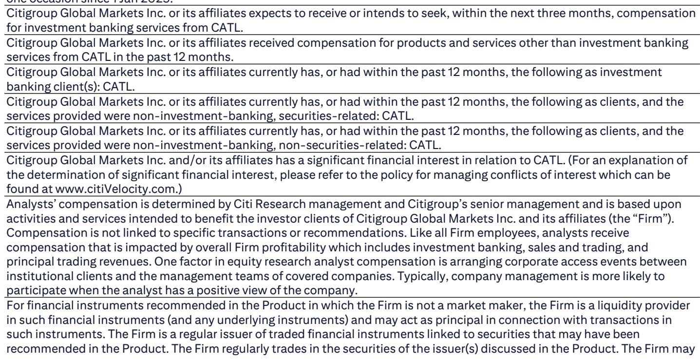
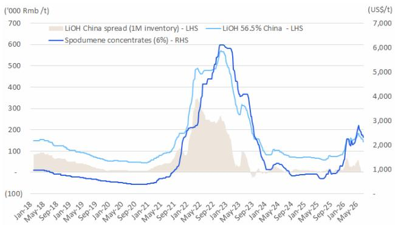

# Citi：锂价下跌库存反降，Citi认为市场误判了需求韧性

过去两天，锂盐价格与相关公司报价同步下挫。碳酸锂现货报价从7月初的每吨16.25万元降至9日的15.85万元，氢氧化锂也从15.85万元降至14.25万元。市场情绪被两则消息点燃：一是江西钨业（JXW）的复产传闻，二是磷酸铁锂正极材料产能调控的潜在政策提案。

Citi在最新发布的锂行业周报中给出了一个与市场直觉相反的判断：这两个因素的实际影响可能远小于市场定价所反映的程度。报告认为，市场在过去几周已经消化了大部分谨慎预期，而即将到来的宁德时代业绩交流会反而可能提供更清晰的正面信号。

## 1. 宁德时代的业绩交流会可能成为锂价情绪的转折点

报告的核心逻辑围绕宁德时代展开。Citi预计，在即将召开的业绩交流会上，宁德时代将就三个关键问题给出更多信息：JXW矿山的复产细节、新电池产能的时间表，以及全年电池产量与出货量目标。

Citi分析师认为，这些信息的综合影响“偏正面”。理由在于，如果宁德时代给出一个高于市场预期的全年出货指引，意味着上游锂盐的实际需求可能比当前悲观预期更强劲。市场目前对锂价的担忧，部分源于对下游需求节奏变化的假设，而宁德时代的官方指引将直接检验这一假设。

> **KC评论：** 市场往往把矿山复产等同于供给过剩，但忽略了复产背后的需求信号。如果一家占全球电池产量近四成的公司选择重启矿山，更合理的解释是它看到了足够支撑这一决策的下游订单。Citi的视角是把复产从“供给冲击”重新定义为“需求验证”。

## 2. LFP正极产能调控提案的实际影响有限

市场关注的第二个因素是磷酸铁锂正极材料产能调控提案。Citi认为这一提案的影响“微不足道”。理由有二：其一，该提案与Citi此前提出的“反内卷”判断方向一致，本质上是对行业过度竞争的纠偏，而非对需求的打压；其二，提案的时间表仍不确定，从提案到落地执行存在较长周期。

从产业逻辑看，产能调控如果落地，反而可能改善正极材料环节的供需格局和利润空间。当前LFP正极材料行业面临严重的产能过剩和价格竞争，任何形式的供给侧管理都有助于头部企业恢复定价能力。市场将其解读为利空，可能混淆了“产能限制”与“需求限制”的区别。

## 3. 库存数据正在给出一个被忽视的信号

Citi的周度库存数据值得细看。截至7月9日当周，碳酸锂总库存降至92,236吨，环比减少2,338吨。更关键的是库存结构：下游正极材料厂商的库存减少2%，冶炼厂库存减少9%，其他环节（主要是电池厂和贸易商）库存减少8%。

库存下降发生在价格下跌的背景下，这通常意味着下游正在主动去库存，而非需求崩塌。冶炼厂库存降幅最大，说明上游也在控制出货节奏。这种“上下游同步去库”的格局，往往出现在价格底部区域——一旦下游补库需求启动，价格反弹的弹性可能超出预期。

Citi报告没有给出明确的底部判断，但其数据框架提供了一个可复用的观察逻辑：当库存下降伴随价格下跌时，需要区分是需求消失还是主动去库。当前的数据更倾向于后者。

## 4. 锂行业正在从“供给故事”转向“需求验证”

过去两年，锂价的核心叙事是供给释放节奏。从澳洲锂矿扩产到非洲新矿投产，市场始终在担忧供给过剩。但Citi这份报告的隐含判断是，2026年下半年的核心变量正在从供给转向需求。

宁德时代的出货指引、LFP产能调控的进展、以及下游库存行为的变化，三者共同指向同一个问题：终端电动车和储能需求能否消化当前的锂盐产量。Citi选择在锂价急跌时发出这份报告，本身就是一个信号——他们认为市场可能过度聚焦于供给端的噪音，而低估了需求端的韧性。

对于关注锂行业的研究者而言，未来几周的观察重点不应是锂价是否继续下跌，而是宁德时代交流会给出的需求指引是否能够验证Citi的判断。如果指引超预期，当前的价格可能就是一个被情绪砸出来的窗口。

For informational purposes only. Portions may be generated,translated,summarized,or edited with AI assistance based on source materials and may contain omissions or errors. Please verify independently. This is not investment,legal,tax,accounting,or other professional advice.

