# 宏观环境观察

## 当前审慎，后续加速？

## 研究观点

26年第二季度宏观环境变化的一个未被充分关注的因素，是实际上的财政审慎。中央和地方各自通过不同渠道产生影响：中央政府收入超预期增长，同时支出进度也快于近年同期；地方政府则受到土地出让收入下降、债务约束以及优质项目缺乏的影响，通过传统方式推动增长的意愿和能力受限。我们的基准判断是，这种审慎态势将在26年下半年随着财政投放加速而有所转变，带动温和回升。我们不预期年中预算调整；相反，关注长期财政改革——解决中央与地方之间的不平衡以及人工智能时代的再分配问题——是更重要的主题。

Xiangrong Yu $^{AC}$ +852-2501-2754
xiangrong.yu@citi.com

Xinyu Ji $^{AC}$

+852-2501-2792

xinyu.ji@citi.com

26年第二季度宏观环境变化的一个未被充分关注的因素，是实际上的财政审慎。3-5月固定资产投资同比下滑5.7%，同期“两重”和设备更新补贴基本持平。5月零售额同比转负至-0.6%，部分与以旧换新政策收缩及资金拨付延迟有关。从总量看，1-5月广义财政赤字（一般预算+政府性基金）占GDP比重为2.2%，低于去年同期的2.4%。以12个月滚动计算，赤字率从2025年底的9.0%收窄至5月的8.8%。中央和地方各自通过不同渠道产生影响：

■ 中央政府的审慎是一个不那么明显但重要的因素——主要源于收入超预期，而非支出收缩。广义中央政府支出进度快于近年同期，截至5月已完成年度预算的33.3%，为五年最高，1-5月同比增长10.1%。紧缩完全来自收入端。PPI回升与税收征管加强（尤其是个人所得税，1-5月同比增长12.2%）共同推高了税收收入，导致中央盈余大于去年。

■ 地方政府是财政拖累的主要且更明显的来源——收入和支出两端均承压。与中央政府相反，前5个月广义地方政府支出同比收缩1.7%，支出进度为年度预算的34.8%，低于2025年同期的35.0%。收入端，房地产下行压力持续，广义地方政府收入同比下降2.4%；仅土地出让收入下滑就拖累4.6个百分点。与此同时，地方政府融资较为低迷，26年第二季度专项债发行放缓，城投债净融资仍为负值。

图1. 1-5月广义财政赤字下降，呈现事实上的审慎  
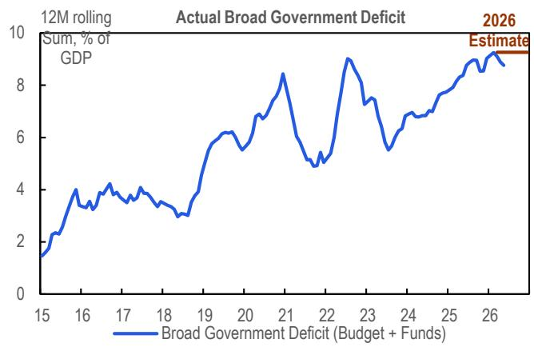  
© 2026 Citi Inc. 未经Citi书面许可不得转载。  
来源：财政部、国家统计局、全国人大、CEIC、Citi

图2. 中央政府支出进度快于近年，地方政府支出进度偏慢  
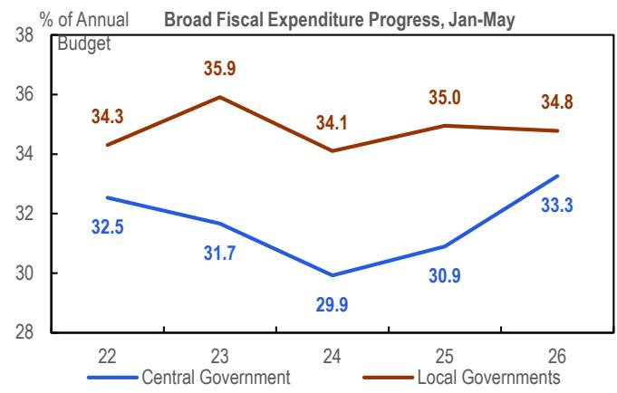  
© 2026 Citi Inc. 未经Citi书面许可不得转载。  
来源：财政部、Wind、Citi

图3. 房地产下行背景下，地方政府收入端持续承压  
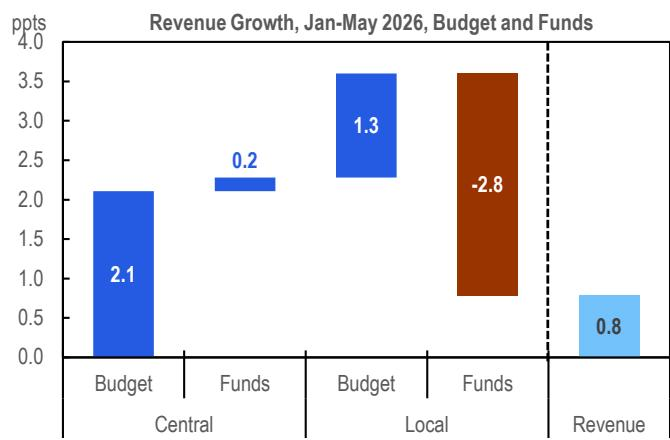  
© 2026 Citi Inc. 未经Citi书面许可不得转载。  
来源：财政部、Wind、Citi

图4. 支出端同样承压  
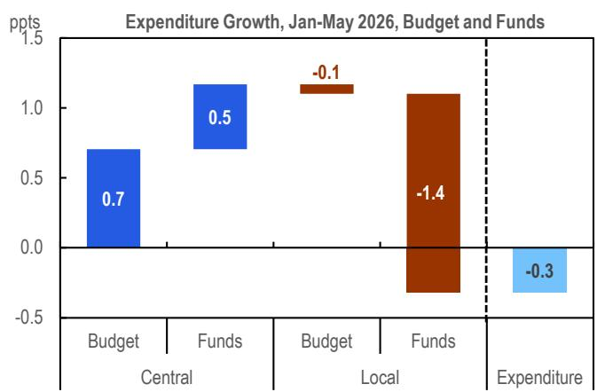  
© 2026 Citi Inc. 未经Citi书面许可不得转载。  
来源：财政部、Wind、Citi

图5. 26年上半年专项债融资进度偏慢，或出于审慎考虑  
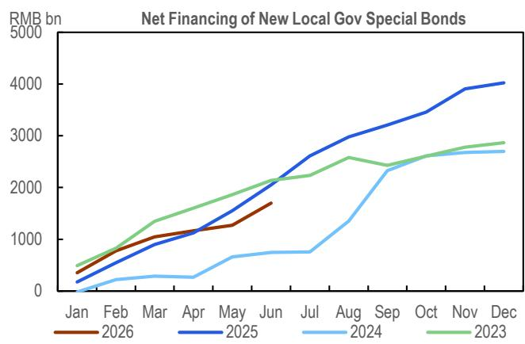  
© 2026 Citi Inc. 未经Citi书面许可不得转载。  
来源：Wind、Citi

图6. 债务化解背景下，城投债净融资深度为负  
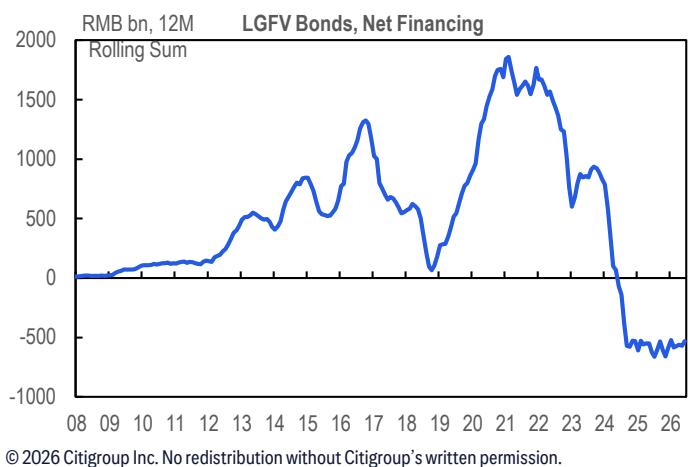  
© 2026 Citi Inc. 未经Citi书面许可不得转载。  
来源：Wind、Citi

## 地方财政的结构性压力

尽管自2024年底中央经济工作会议以来承诺了“更加积极”的财政基调，但地方官员在以传统方式推动增长方面，能力和意愿似乎都受到约束。

## 推动能力

地方政府预算空间有限：

今年收入回升的受益方不均衡地偏向中央政府。在分税制下，中央政府保留个人所得税60%的份额，而个税1-5月同比增长12.2%。中央政府也是进口相关增值税和消费税（1-5月同比增长10.4%）、证券交易印花税（1-5月同比增长88.9%）以及汽车购置税减免和出口退税政策退出的主要受益方。

房地产下行继续对地方财政收入造成较大影响。一般预算中，房地产相关税收（包括房产税、契税、土地增值税等）1-5月同比收缩4.5%。

政府性基金方面，土地出让收入降幅更大，同比下降28.7%，12个月滚动销售额仅为3.8万亿元。地方财政自给率因此持续偏低。

随着债务化解持续推进，此前的预算外融资渠道大多关闭。本轮债务置换工具——特殊再融资债券——1-5月发行规模为1.6万亿元，与去年同期的1.8万亿元相比保持平稳。但除此之外，预算外融资渠道未见复苏迹象：城投债净融资仍深度收缩，政府和社会资本合作（PPP）活动低迷，政府引导基金正转向人工智能等“新质生产力”，而非广泛的本地投资（新浪，5月29日）。

图7. 收入回升的受益方不均衡地偏向中央政府

<table><tr><td></td><td>税种（中央：地方）</td><td>2025年收入（万亿元）</td><td>26年1-5月（同比%）</td></tr><tr><td rowspan="3">共享税</td><td>增值税（50:50）</td><td>6.9</td><td>6.2</td></tr><tr><td>企业所得税（60:40）</td><td>4.1</td><td>0.2</td></tr><tr><td>个人所得税（60:40）</td><td>1.6</td><td>12.2</td></tr><tr><td rowspan="5">中央税</td><td>进口增值税和消费税</td><td>1.8</td><td>10.4</td></tr><tr><td>消费税 /1</td><td>1.7</td><td>-3.1</td></tr><tr><td>证券交易印花税</td><td>0.2</td><td>88.9</td></tr><tr><td>关税</td><td>0.2</td><td>5.6</td></tr><tr><td>车辆购置税</td><td>0.2</td><td>12.7</td></tr><tr><td rowspan="3">主要归地方</td><td>房地产相关税收</td><td>1.8</td><td>-4.5</td></tr><tr><td>城市维护建设税 /2</td><td>0.5</td><td>3.8</td></tr><tr><td>其他印花税</td><td>0.2</td><td>4.0</td></tr></table>

改革计划：1/ 消费税征收环节后移并调整覆盖范围和税率；2/ 与另外两项费用合并，设立为地方附加税  
© 2026 Citi Inc. 未经Citi书面许可不得转载。  
来源：财政部、Wind、Citi

图8. 过去12个月土地出让收入仅为3.8万亿元，低于2021年峰值9万亿元  
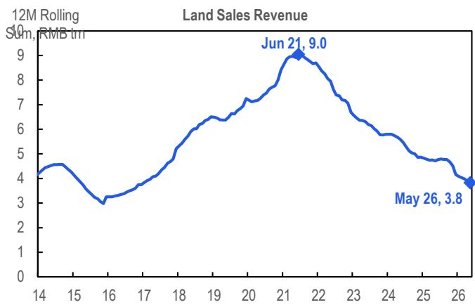  
© 2026 Citi Inc. 未经Citi书面许可不得转载。  
来源：财政部、Wind、Citi

图9. 地方财政自给率持续偏低  
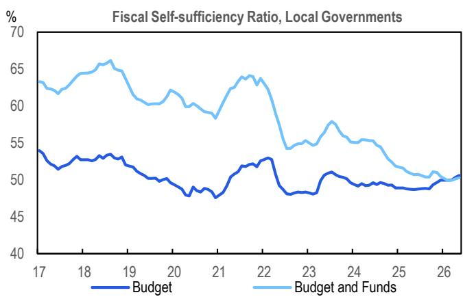  
© 2026 Citi Inc. 未经Citi书面许可不得转载。  
来源：财政部、Wind、Citi

图10. 债务化解稳步推进，预算外融资渠道大多关闭  
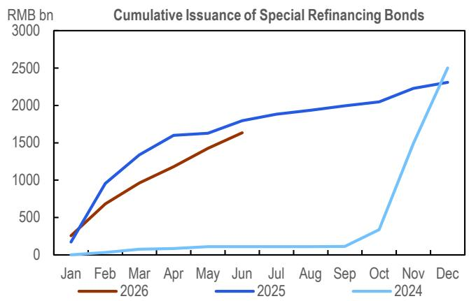  
© 2026 Citi Inc. 未经Citi书面许可不得转载。  
来源：Wind、Citi

## 推动意愿

预算紧张下的审慎态度反映了地方政府的支出意愿。支出优先级呈现出清晰的排序：社会保障 > 科技与教育 > 基础设施，这与中央政府的信号大体一致（例如，参见2024年11月财政部长的表态）。1-5月，预算内社会保障支出同比增长7.8%，科技与教育支出基本持平。基础设施支出——尽管今年预算安排了2.8%的同比增长——实际同比下降6.3%，自2025年年中以来的下滑趋势加深。近期审计报告反映的中央政府对项目的更严格审查，可能进一步强化了这种审慎。

多重考核目标也抑制了支出意愿。虽然GDP增长仍受关注，但其作为绩效指标的权重似乎在下降——基于近年趋势和今年全国目标的调整。正在进行的“树立正确的政绩观”活动，可能在明年二十一大前增加更多考量。地方官员需要应对一系列约束性要求——债务管理、金融稳定（尤其是小银行）、生产安全和社会稳定。在我们看来，以传统方式推动地方增长不太可能成为首要任务。

图11. 支出优先级：社会保障 > 科技与教育 > 基础设施  
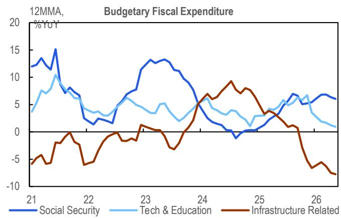  
© 2026 Citi Inc. 未经Citi书面许可不得转载。  
来源：财政部、Wind、Citi

图12. 中央政府的更严格审查可能强化审慎态度  
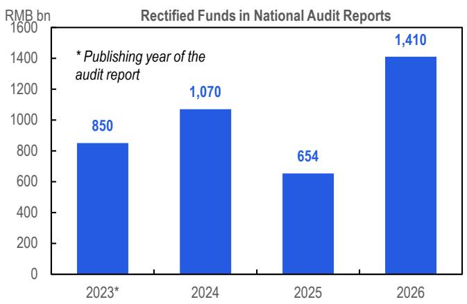  
© 2026 Citi Inc. 未经Citi书面许可不得转载。  
来源：审计署、Citi

## 后续展望

财政投放预计将在26年下半年加速（参见：26年下半年展望：人工智能超级周期切入K型经济）。这包括[1]加快专项债券发行节奏，[2]加快资金拨付，以及[3]更有效地使用8000亿元政策性金融工具。实施加速应会自然扭转26年上半年的审慎态势。“六网”等针对性举措正在推进，助力人工智能转型和稳定投资。在25年下半年低基数和中东冲突影响消退的背景下，增长有望温和回升。

年中预算调整不是我们的基准判断，全面刺激的紧迫性有限。我们认为2024年式的政策转向不太可能发生，因为尽管26年第二季度增速有所变化，全年GDP仍可能达到4.5-5.0%目标区间的下沿。此外，财政压力主要是地方性问题，市场情绪目前较2024年更为稳定。虽然不能完全排除2023年式因极端天气和夏季超强厄尔尼诺现象而进行的调整——财政部当时额外发行了1万亿元国债用于救灾（财政部，2023年10月24日）——但当前的财政背景不同。今年赤字率已设定为GDP的4%，调整空间小于2023年（当时初始目标为3%，后上调至3.8%）。

财政改革是2027年及以后值得关注的关键主题，主要有两个重点领域：

■ 重新平衡中央与地方之间的财政关系，已成为后房地产时代的高优先级议题。政策制定者已释放消费税改革和地方附加费整合的信号。虽然后续措施最早可能在今年宣布，但预计约2万亿元收入的完全重新分配可能需要数年时间才能完成。

■ 人工智能收益的再分配也是一个日益紧迫的财政议题。人工智能引领的新经济目前处于中国K型经济的核心位置，扩大了分化，并在快速应用过程中因就业替代风险增加而对消费者形成压力。我们此前曾指出[1]直接工资支持和[2]针对性的人工智能税是应对这一挑战的两个潜在可行方案。随着未来几年财政改革的深化，这两者都可能在政策讨论中获得更多关注。

图13. 年中预算调整不是我们的基准判断，全面刺激的紧迫性有限

<table><tr><td></td><td>26年第二季度</td><td>24年第三季度</td></tr><tr><td>季度GDP增速</td><td>4.5（Citi预测）</td><td>4.6</td></tr><tr><td>累计增速</td><td>4.7 vs 4.5~5.0%目标</td><td>4.8 vs ~5%目标</td></tr><tr><td>通胀</td><td>PPI约4%，CPI约1%</td><td>PPI约-2.5%，CPI约0</td></tr><tr><td>财政收入</td><td>收入增长4% vs 预算2.2%</td><td>约1.4万亿元缺口</td></tr><tr><td>地方政府债务</td><td>债务置换基本完成</td><td>城投债风险上升</td></tr><tr><td>市场表现</td><td>上证综指约4,000</td><td>上证综指约2,700</td></tr></table>

© 2026 Citi Inc. 未经Citi书面许可不得转载。  
来源：财政部、国家统计局、Wind、Citi

图14. 重新平衡中央与地方财政关系已成为高优先级议题  
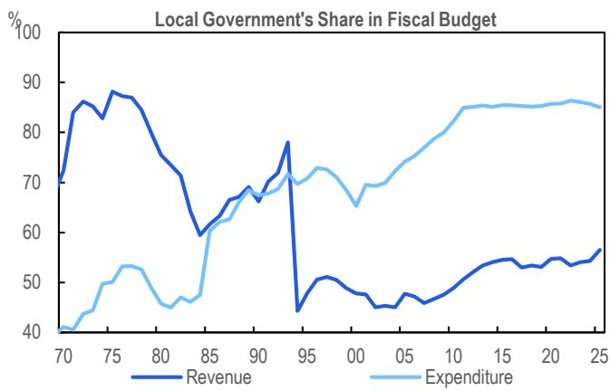  
© 2026 Citi Inc. 未经Citi书面许可不得转载。  
来源：财政部、Wind、Citi

图15. 消费税改革正在推进，部分措施可能于今年晚些时候跟进  
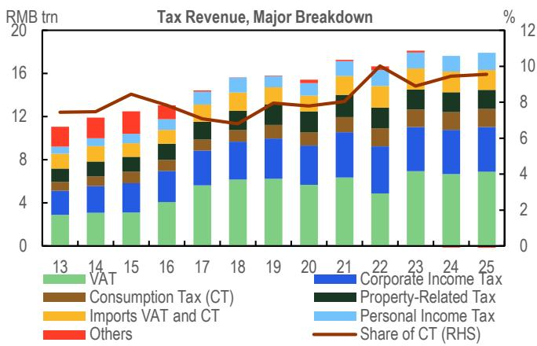  
来源：财政部、Wind、Citi  
© 2026 Citi Inc. 未经Citi书面许可不得转载。

如果您有视觉障碍并希望就本文件中图表的详细信息与Citi代表沟通，请致电美国1-888-500-5008（TTY：711），或从美国境外拨打+1-210-677-3788

## 附录A-1

## 分析师认证

主要负责本研究报告准备和内容的研究分析师要么在作者栏中以“AC”标识，要么以粗体列于其负责的内容旁。如果作者栏中指定了多位AC分析师，每位分析师仅就其负责的部分进行认证，但以下情况除外：(a) 归属于另一位以粗体列于内容旁的AC认证分析师的内容，以及(b) 仅针对特定发行人的观点，归属于下方该发行人价格图表或评级历史表中标识的另一位AC认证分析师。每位分析师就其负责的报告部分认证：(1) 其中表达的观点准确反映了其个人对每个提及的发行人和证券的看法，并且是独立准备的，包括对Citi Global Markets Inc.及其关联方；(2) 研究分析师的薪酬的任何部分过去、现在或将来都不直接或间接与本报告中该研究分析师表达的具体建议或观点相关。

## 重要披露

<table><tr><td>Citi Global Markets Inc.或其关联方在过去12个月内已从中国获得投资银行服务报酬。</td></tr><tr><td>Citi Global Markets Inc.或其关联方预计在未来三个月内将寻求从中国获得投资银行服务报酬。</td></tr><tr><td>Citi Global Markets Inc.或其关联方在过去12个月内从中国获得了投资银行服务以外的产品和服务报酬。</td></tr><tr><td>Citi Global Markets Inc.或其关联方目前拥有，或过去12个月内曾拥有以下投资银行客户：中国。</td></tr><tr><td>Citi Global Markets Inc.或其关联方目前拥有，或过去12个月内曾拥有以下客户，提供的服务为非投资银行、证券相关：中国。</td></tr><tr><td>Citi Global Markets Inc.或其关联方目前拥有，或过去12个月内曾拥有以下客户，提供的服务为非投资银行、非证券相关：中国。</td></tr><tr><td>Citi Global Markets Inc.和/或其关联方对中国拥有重大经济利益。（关于重大经济利益确定的解释，请参阅利益冲突管理政策，可在www.citiVelocity.com查阅。）</td></tr><tr><td>分析师薪酬由Citi管理层和Citi高级管理层根据旨在惠及Citi Global Markets Inc.及其关联方（“公司”）投资客户的活动和服务确定。薪酬不与特定交易或建议挂钩。与所有公司员工一样，分析师的薪酬受到公司整体盈利能力的影响，包括投资银行、销售和交易以及自营交易收入。股权研究分析师薪酬的一个因素是安排机构客户与所覆盖公司管理层之间的企业接触活动。通常，当分析师对公司持积极看法时，公司管理层更有可能参与。</td></tr><tr><td>对于产品中推荐的公司不是做市商的金融工具，公司是该金融工具（及其任何基础工具）的流动性提供者，并可能作为主体参与此类工具的交易。公司是可能与本产品中推荐证券挂钩的可交易金融工具的常规发行人。公司定期交易本产品中讨论的发行人证券。公司可能以与本产品不一致的方式进行证券交易，并将就所覆盖的证券以主体身份向客户买入或卖出。</td></tr><tr><td>除非另有说明，研究分析师或其团队成员在过去12个月内均未实地考察过已提供投资观点的公司的运营情况。</td></tr><tr><td>有关本Citi产品（“产品”）所涉及公司的重要披露（包括历史披露副本），请联系Citi，地址：388 Greenwich Street, 6th Floor, New York, NY, 10013，收件人：Legal/Compliance [E6WYB6412478]。此外，相同的重要披露（估值和风险评估以及历史披露除外）包含在公司披露网站https://www.citivelocity.com/cvr/eppublic/citi_research_disclosures上。估值和风险评估可在最近一期关于标的公司的研究笔记/报告正文中找到。根据市场滥用法规，过去12个月内发布的所有Citi建议的历史记录可通过Citi Velocity (https://www.citivelocity.com/cv2) 或您的标准分发门户访问。历史披露（最多过去三年）将根据要求提供。</td></tr><tr><td>Citi Global Markets Asia Limited Xinyu Ji; Xiangrong Yu</td></tr><tr><td>其他披露</td></tr><tr><td>建议中提及的任何工具的价格均为前一交易日该工具主要市场的收盘价，除非另有说明。</td></tr><tr><td>本研究报告中所作任何建议的完成和首次传播时间均为产品顶部显示的美国东部日期时间。如果产品引用了其他分析师的看法，请参阅价格图表或评级历史表，了解该看法的完成和首次传播日期/时间。</td></tr><tr><td>欧洲法规要求，如果建议与作者此前12个月内发布的关于同一金融工具或发行人的任何先前建议不同，则需指明变更和先前建议的日期。请参阅已发布研究中的交易历史或联系研究分析师。</td></tr><tr><td>Citi已制定政策，用于识别、考虑和管理因发布或分发投资研究而产生的潜在利益冲突。这些政策的描述可在https://www.citivelocity.com/cvr/eppublic/citi_research_disclosures找到。</td></tr><tr><td>过去12个月每个季度末，所有Citi研究建议中相当于“买入”、“持有”、“卖出”的比例（以及其中在过去12个月内获得Citi投资公司服务的百分比，括号内显示）如下：2026年第一季度 买入33%（63%），持有44%（52%），卖出23%（46%），相对价值0.5%（89%）；2025年第四季度 买入33%（63%），持有44%（50%），卖出23%（46%），相对价值0.4%（91%）；2025年第三季度 买入33%（61%），持有44%（52%），卖出23%（50%），相对价值0.4%（80%）；2025年第二季度 买入33%（63%），持有44%（51%），卖出23%（49%），相对价值0.4%（86%）。为披露非股权建议（其定义可在相应披露部分找到），“买入”表示正向方向性交易想法；“卖出”表示负向方向性交易想法；“相对价值”表示对投资策略没有明确方向的任何交易想法。</td></tr><tr><td>欧洲法规要求在引用证券过往表现时提供5年价格历史。CitiVelocity的图表工具 (https://www.citivelocity.com/cv2/#go/CHARTING_3_Equities) 提供创建可定制价格图表的功能，包括五年选项。该工具可在CitiVelocity (https://www.citivelocity.com/) 任何资产类别菜单下的数据与分析部分找到。如需更多信息，请联系CitiVelocity支持 (https://www.citivelocity.com/cv2/go/CLIENT_SUPPORT)。所有引用价格的来源，除非另有说明，均为DataCentral，其从LSEG Data & Analytics获取价格信息。过往表现并非未来结果的保证或可靠指标。预测并非未来表现的保证或可靠指标。</td></tr><tr><td>读者在投资ETF前应始终仔细考虑投资目标、风险以及ETF的费用和开支。适用的ETF招股说明书和关键读者信息文件（如适用）应包含此信息及其他关于该ETF的信息。在投资前仔细阅读任何此类招股说明书非常重要。客户可从适用的分销商或授权参与者、ETF上市的交易所以及/或适用的ETF发行人网站获取ETF的招股说明书和关键读者信息文件。研究价值及任何应计收益可能上升或下降。任何过往表现、预测或预报均不预示未来或可能的表现。本文件所含关于ETF的任何信息仅供说明之用，不应被视为以明示或暗示方式出售或招揽购买任何ETF单位的要约。所表达的意见为作者的意见，不一定反映ETF发行人、其任何代理人或其关联方的观点。</td></tr><tr><td>Citi Global Markets India Private Limited和/或其关联方可能不时实际或实益拥有标的发行人1%或以上的债务证券。</td></tr><tr><td>请注意，根据经修订的第13959号行政命令（“命令”），美国人士被禁止投资美国政府确定为命令标的的任何公司的证券。本研究不旨在以任何可能导致违反命令的方式使用或依赖。鼓励读者依靠自己的法律顾问就遵守命令以及美国财政部外国资产控制办公室管理和执行的其他经济制裁计划提供建议。</td></tr><tr><td>本通讯面向符合以色列《投资咨询、投资营销和投资组合管理法》（1995年）（“咨询法”）定义的“合格客户”的人士。在以色列境内，本通讯不面向零售客户，Citi不会向零售客户或非合格客户提供此类产品或交易。演讲者未获得以色列证券管理局（“ISA”）的投资顾问或投资营销许可，本通讯不构成投资或营销建议。本文所含信息可能涉及ISA未监管的事项。本通讯所涉任何证券不得向任何以色列人士发售或出售，除非根据1968年《以色列证券法》规定的证券发售豁免及其中规定的公开发售规则。</td></tr></table>

## 研究分析师隶属关系/非美国研究分析师披露

本报告作者的雇佣法律实体如下所列（其监管机构进一步列于下文）。编制本报告的非美国研究分析师（即除被标识为受雇于Citi Global Markets Inc.的分析师外的所有列名分析师）未在FINRA注册/取得研究分析师资格。此类研究分析师可能不是成员组织的关联人士（但受雇于成员组织的关联方），因此可能不受FINRA规则2241关于与标的公司沟通、公开露面以及交易研究分析师账户持有证券的限制。

Citi广泛并同时通过公司专有的电子分发平台（例如Citi Velocity和各种全球财富平台）向公司的机构和零售客户分发其研究内容。为方便起见，某些（但非全部）研究内容可能通过第三方聚合器分发。客户可酌情通过电子邮件接收已发布的研究报告，且仅在此类研究内容已广泛分发之后。某些研究仅提供给机构读者以满足监管要求。Citi分析师向客户提供的服务水平和类型可能因多种因素而异，例如客户对与分析师沟通频率和方式的个人偏好、客户的风险状况和投资重点及视角（例如市场整体、特定行业、长期、短期等）、与公司整体客户关系的规模和范围以及法律和监管限制。

根据Comissão de Valores Mobiliários Resolução 20和ASIC Regulatory Guide 264，Citi需要披露Citi关联公司或业务是否与标的公司有商业关系。鉴于Citi在全球100多个国家经营多项业务，Citi很可能与标的公司有商业关系。

公司推荐、提供或销售的证券：(i) 不受联邦存款保险公司保险；(ii) 不是任何受保存款机构（包括Citibank）的存款或其他义务；(iii) 面临投资风险，包括可能损失本金。产品仅供参考，不构成购买或出售证券的要约或招揽。任何购买产品中提及证券的决定都必须考虑该证券的现有公开信息或任何注册招股说明书。尽管信息来自并基于公司认为可靠的来源，但我们不保证其准确性，且信息可能不完整和经过浓缩。但请注意，公司已采取一切合理措施确定产品重要披露部分所披露信息的准确性和完整性。公司的研究部门已获得本产品提及的标的公司的协助，包括但不限于与标的公司管理层的讨论。公司政策禁止研究分析师向标的公司发送研究草稿。但应假定产品作者已与标的公司讨论以确保发布前的事实准确性。关于ESG（环境、社会、治理）因素的陈述和观点通常基于标的公司的公开声明或其他公开新闻，作者可能未独立核实。ESG因素是读者在做出投资决策时可能考虑的一个因素。所有意见、预测和估计构成作者截至产品日期的判断，这些以及产品中包含的任何其他信息如有变更，恕不另行通知。金融工具的价格和可用性也可能随时变更。尽管公司内部其他部门向本产品讨论的公司提供建议，但在此类角色中获得的信息不用于产品的准备。虽然Citi未设定预定的发布频率，但如果产品是基本面股权或信用研究报告，Citi旨在提供对所覆盖发行人的研究覆盖，包括回应影响发行人的新闻。对于非基本面研究报告，Citi可能不定期更新报告中的观点、建议和事实。尽管Citi保持对发行人的覆盖、提出建议或讨论发行人，但Citi可能因法律或政策原因被定期限制引用某些发行人。如果已发布交易想法的组成部分受到限制，该交易想法将从产品中包含的任何开放交易想法列表中删除。限制解除后，如果分析师继续支持该交易想法，它将重新列入开放交易想法列表，否则将正式关闭。Citi可能向不同类别的客户提供不同的研究产品和服务（例如，基于长期或短期投资视野），这可能导致不同的结论或建议，可能影响证券价格，与替代研究产品中的建议相反，前提是每种产品都符合各自产品的评级体系。

投资非美国证券，包括美国存托凭证，可能涉及某些风险。非美国发行人的证券可能未在美国证券交易委员会注册，也不受其报告要求的约束。关于外国证券的信息可能有限。外国公司通常不受与美国公司相当的统一审计和报告标准、实践和要求的约束。某些外国公司的证券可能流动性较低，价格波动性高于可比美国公司。此外，汇率变动可能对美国读者投资外国股票的价值及其相应股息支付产生不利影响。美国存托凭证读者的净股息是使用预扣税率惯例估算的，视为准确，但鼓励读者咨询其税务顾问以获取精确的股息计算。从公司收到产品的读者可能被禁止在某些州或其他司法管辖区从公司购买产品中提及的证券。请向您的财务顾问咨询更多详情。Citi Global Markets Inc.对美国的产品负责。美国读者根据产品所含信息发出的任何订单只能通过Citi Global Markets Inc.下达。

负责产品生产的Citi法律实体是第一位列名作者的雇佣法律实体。

产品在澳大利亚通过Citi Global Markets Australia Pty Limited提供。（ABN 64 003 114 832和AFSL No. 240992），ASX集团参与者，受澳大利亚证券与投资委员会监管。Citi Centre, 2 Park Street, Sydney, NSW 2000。Citi Global Markets Australia Pty Limited不是1959年《银行法》下的授权存款机构，也不受澳大利亚审慎监管局监管。

产品在巴西由Citi Global Markets Brasil - CCTVM SA提供，受CVM - Comissão de Valores Mobiliários（“CVM”）、BACEN - 巴西中央银行、APIMEC - Associação dos Analistas e Profissionais de Investimento do Mercado de Capitais和ANBIMA – Associação Brasileira das Entidades dos Mercados Financeiro e de Capitais监管。Av. Paulista, 1111 - 14º andar(parte) - CEP: 01311920 - São Paulo - SP。

本产品在智利通过Banchile Corredores de Bolsa S.A.提供，该公司是Citi Inc.的间接子公司，受Comisión Para El Mercado Financiero监管。Enrique Foster Sur, 20, piso 6, Las Condes, Santiago, Chile。

哥伦比亚共和国读者披露：本通讯或信息不构成2010年第2555号法令第2.40.1.1.2条或其修改、替代或补充法规意义上的专业研究交流。编制和分发本条所述的研究报告和一般通讯不需要成为哥伦比亚金融监管局监管的实体。

产品在德国由Citi Global Markets Europe AG（“CGME”）提供，受欧洲中央银行和德国联邦金融监管局（Bundesanstalt für Finanzdienstleistungsaufsicht BaFin）监管。Börsenplatz 9, 60313 Frankfurt am Main, Germany。

除非另有说明，如果编制本报告的分析师位于香港且报告涉及“证券”（定义见香港法例第571章《证券及期货条例》），则报告由Citi Global Markets Asia Limited在香港发布。Citi Global Markets Asia Limited受香港证券及期货事务监察委员会监管。如果报告由非香港分析师编制，请注意该分析师（及其雇佣或认可的法律实体）未在香港获得许可/注册，且不声称如此。请参阅“研究分析师隶属关系/非美国研究分析师披露”部分了解分析师雇佣实体的详细信息。

产品在印度由Citi Global Markets India Private Limited（CGM）提供，受印度证券交易委员会（SEBI）监管，作为研究分析师（SEBI注册号INH000000438）。CGM还积极参与印度的商人银行业务（SEBI注册号INM000010718）和股票经纪业务（SEBI注册号INZ000263033），并已就此向SEBI注册。SEBI的注册、在孟买证券交易所（BSE）的登记以及印度国家证券管理学院（NISM）的认证均不以任何方式保证中介机构的业绩或向读者提供任何回报保证。CGM的注册办公室位于1202, 12th Floor, First International Financial Centre (FIFC), G Block, Bandra Kurla Complex, Bandra East, Mumbai – 400098，注册电话：+91 22 61759999。Citi维持健全的政策、程序、控制和培训，以确保持续遵守所有适用的规则和法规。本文所含所有建议均由合格的研究分析师做出。CGM的公司识别号为U99999MH2000PTC126657，其合规官[Vishal Bohra]的联系方式为：电话：+91-022-61759994，传真：+91-022-61759851，电子邮件：cgmcompliance@citi.com。关于研究分析师的读者章程、合规审计报告和投诉信息可在https://www.citivelocity.com/cvr/eppublic/citi\_research\_disclosures找到。申诉官[Niraj Mody]的联系方式为：电话：+91-22-42775002，电子邮件：EMEA.CR.Complaints@citi.com。证券市场投资存在市场风险。投资前请仔细阅读所有相关文件。SEBI规定的客户条款和条件可在https://www.citivelocity.com/rendition/authfilelinksvcs/eppublic/V1/file?paramData=ZmlsZU5hbWU9L1MzL0dETVMvcHViRGlzY2xvc3VyZUhObWxzL2dkbV9kaXNfc2ViaV9UZXJtc29mVXNILmhObWw找到。

产品在印度尼西亚通过PT Citi Sekuritas Indonesia提供。Citibank Tower 10/F, Pacific Century Place, SCBD lot 10, Jl. Jend Sudirman Kav 52-53, Jakarta 12190, Indonesia。本产品及其任何副本不得在印度尼西亚或向任何印度尼西亚公民（无论其居住地）或印度尼西亚居民分发，除非符合适用的资本市场法律法规。本产品不是印度尼西亚的证券要约。本产品中提及的证券尚未根据相关资本市场法律法规在资本市场和金融服务局（OJK）注册，不得在印度尼西亚共和国境内或向印度尼西亚公民通过公开发售或在构成印度尼西亚资本市场法律法规意义上的要约的情况下发售或出售。

产品在日本由Citi Global Markets Japan Inc.（“CGMJ”）提供，受金融厅、证券交易监督委员会、日本证券业协会、东京证券交易所和大阪证券交易所监管。Otemachi Park Building, 1-1-1 Otemachi, Chiyoda-ku, Tokyo 100-8132 Japan。如果在CGMJ研究报告中发现错误，修订版将发布在公司Citi Velocity网站上。如果您对Citi Velocity有疑问，请致电(81 3) 6270-3019寻求帮助。

产品根据沙特法律在沙特阿拉伯王国通过Citi Saudi Arabia提供，受资本市场管理局（CMA）监管，CMA许可证号(17184-31)。2239 Al Urubah Rd – Al Olaya Dist. Unit No. 18, Riyadh 12214 – 9597, Kingdom Of Saudi Arabia。

产品在韩国由Citi Global Markets Korea Securities Ltd.（CGMK）提供，受金融委员会、金融监督院和韩国金融投资协会（KOFIA）监管。CGMK的地址为Citibank Center, 50 Saemunan-ro, Jongno-gu, Seoul 03184, Korea。KOFIA在其网站上提供研究分析师的注册信息。如果您希望查找CGMK研究分析师的KOFIA注册信息，请访问以下网站：http://dis.kofia.or.kr/websquare/index.jsp?w2xPath=/wq/fundMgr/DISFundMgrAnalystList.xml&divisionId=MDISO3002002000000&serviceId=SDISO3002002000。产品在韩国由Citibank Korea Inc.提供，受金融委员会和金融监督院监管。地址为Citibank Center, 50 Saemunan-ro, Jongno-gu, Seoul 03184, Korea。本研究报告仅面向韩国《金融投资服务和资本市场法》及其施行令定义的“专业读者”。

产品在马来西亚由Citi Global Markets Malaysia Sdn Bhd（注册号199801004692 (460819-D)）（“CGMM”）向其客户提供，CGMM对其内容负责（就CGMM的客户而言）。CGMM受马来西亚证券委员会监管。请就产品产生或与之相关的任何事宜联系CGMM，地址：Level 43 Menara Citibank, 165 Jalan Ampang, 50450 Kuala Lumpur, Malaysia。

产品在墨西哥由Citi México Casa de Bolsa, S.A. de C.V., Grupo Financiero Citi México提供，该公司是Citi Inc.的全资子公司，受Comision Nacional Bancaria y de Valores监管。Prolongación Reforma 1196, 24 floor, Colonia Santa Fe, Alcaldía Cuajimalpa de Morelos, C.P. 05348, Ciudad de México。

产品在波兰由Biuro Maklerskie Banku Handlowego（DMBH）提供，DMBH是Bank Handlowy w Warszawie S.A.的独立部门，后者是Citi Inc.的子公司，受Komisja Nadzoru Finansowego监管。Biuro Maklerskie Banku Handlowego (DMBH), ul.Senatorska 16, 00-923 Warszawa。

产品在新加坡通过Citi Global Markets Singapore Pte. Ltd.（“CGMSPL”）提供，CGMSPL持有资本市场服务和豁免财务顾问牌照，受新加坡金融管理局监管。请就本文件分析产生或与之相关的任何事宜联系CGMSPL，地址：8 Marina View,
