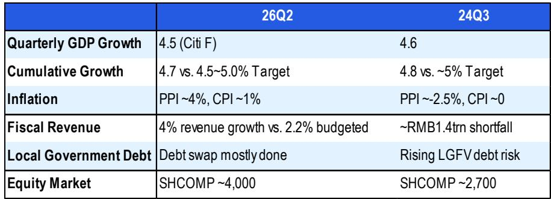
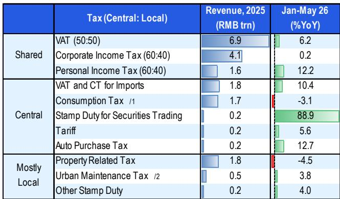

# China's Fiscal Adjustment: A Structural Shift in the New Baseline

The moderation in China's second-quarter economic activity has been widely attributed to changes in consumer confidence, property sector adjustments, and external factors. However, these familiar explanations may obscure a less visible and more consequential driver: a de facto fiscal tightening that has constrained the government's own spending capacity at a time when private demand is adjusting. Between January and May, the broad fiscal deficit—combining the general budget and government fund accounts—stood at just 2.2 percent of GDP, below the 2.4 percent recorded in the same period a year earlier. On a rolling twelve-month basis, the deficit has narrowed from 9.0 percent of GDP at end-2025 to 8.8 percent by May. This is not a cyclical pause. It reflects a deliberate, structural compression in fiscal space that stems from two distinct but reinforcing dynamics: the central government's revenue outperformance creating an unexpected surplus, and local governments' simultaneous constraints and cautious approach to spending.

The consequences are already visible in hard data. Fixed asset investment declined 5.7 percent year-on-year in the March-to-May period, even as subsidies for key infrastructure projects and equipment upgrades remained flat. Retail sales turned negative in May, falling 0.6 percent year-on-year, partly due to the scale-back of trade-in programs and delays in fund disbursement. The moderation is not a mystery. It is the logical outcome of a fiscal system in which the central government is running ahead of its spending plan while local governments—the traditional engines of stimulus—are navigating challenges from falling land revenue, debt constraints, and a shifting set of policy incentives.

This is not a temporary condition that will reverse automatically. The tightening reflects deep-seated structural features of China's fiscal architecture that have been exacerbated by the property adjustment and the ongoing debt resolution campaign. Those expecting a quick pivot to broad-based stimulus may be disappointed. The base case is for fiscal deployment to accelerate in the second half of the year, but that acceleration will be modest, targeted, and insufficient to restore the growth momentum of prior cycles. The real story is about the long-term recalibration of China's fiscal system, including the redistribution of revenue between central and local governments and the emerging imperative to manage the fiscal consequences of AI-driven economic divergence.

## The Central Government Is Running a Surplus, Not Because It Is Spending Less, but Because It Is Collecting More

The conventional narrative about Chinese fiscal policy focuses on spending restraint. But the central government's contribution to the current tightening is more subtle and more instructive. Broad central government spending through May reached 33.3 percent of the annual budget, a five-year high for this point in the year, and grew a solid 10.1 percent year-on-year in the first five months. The tightening has come entirely from the revenue side. A combination of producer price reflation and stricter tax collection has boosted tax receipts well above budgeted levels, creating a central surplus larger than last year's.

Personal income tax revenue surged 12.2 percent year-on-year in the January-to-May period, and under the tax-sharing system, the central government retains 60 percent of that revenue. Strong import-related value-added tax and consumption taxes grew 10.4 percent year-on-year, securities transaction duties jumped 88.9 percent, and the phase-out of the auto-purchase tax cut and export VAT rebates further bolstered central coffers. The central government is not tightening because it wants to. It is tightening because revenue is flowing in faster than it can be deployed, and because the policy calculus does not yet favor a mid-year budget revision to increase spending authority.

This dynamic matters because it means that the central government has the fiscal space to act but is choosing not to do so aggressively. The constraint is not financial; it is strategic. Policymakers appear to be prioritizing long-term fiscal sustainability and reform over short-term demand support, especially given that GDP growth, while moderating, is still on track to reach the lower end of the 4.5 to 5.0 percent target range. For observers, this implies that the central government's willingness to deploy stimulus is conditional on a sharper change in growth or a material shift in market sentiment, neither of which appears imminent.

## Local Governments Are the Primary Source of Fiscal Drag, and Their Constraints Are Structural, Not Cyclical

The local government side of the fiscal picture is more straightforward and more pronounced. Unlike the central government, local authorities are squeezed from both directions. Broad local government spending contracted 1.7 percent year-on-year in the first five months, and the spending progress decelerated to 34.8 percent of the annual budget, down from 35.0 percent in the same period of 2025. On the revenue side, the property adjustment continues to exact a heavy toll. Broad local government revenue fell 2.4 percent year-on-year, with slumping land sales alone creating a drag of 4.6 percentage points. The rolling twelve-month value of land sales has fallen to approximately 3.8 trillion renminbi, down from a peak of 9 trillion in 2021.

The traditional off-budget financing channels that local governments relied on to circumvent fiscal constraints are mostly closed. Net bond financing by local government financing vehicles remains deeply negative as the debt resolution campaign continues. Special local government bond issuance slowed in the second quarter, and public-private partnership activity is subdued. Government-guided funds are pivoting away from broad-based local investment toward "new productive forces" such as artificial intelligence, which are unlikely to generate the same multiplier effects on employment and local economic activity as traditional infrastructure spending.

The result is that local governments are operating with tight budgets and limited flexibility. Their fiscal self-sufficiency ratio remains depressed, and they lack the revenue base to mount a meaningful stimulus effort even if they wanted to. But the evidence suggests that many local officials do not want to stimulate in the old way, even if the funding were available.

## Local Officials Face a Fundamentally Different Set of Incentives That Dampens the Willingness to Spend

The willingness of local governments to stimulate the economy has been shaped by a clear shift in priorities that predates the current moderation. Expenditure patterns reveal a pecking order: social security spending rose 7.8 percent year-on-year in the January-to-May period, technology and education spending was nearly flat, and infrastructure spending—despite a 2.8 percent increase in this year's budget—dropped 6.3 percent year-on-year, deepening a trend that began in mid-2025.

This ordering is not accidental. It reflects signals from the central government, including public statements from the Ministry of Finance about expenditure priorities, and it is reinforced by tighter scrutiny of project quality as documented in recent audit reports. Local officials are navigating a complex set of binding constraints: debt management targets, financial stability requirements, production safety mandates, and social stability obligations. The campaign to establish the "correct view of political performance" adds further caution, especially with the 21st Party Congress scheduled for next year.

The implication is that even if fiscal space were to open up—through a mid-year budget revision or faster bond issuance—the transmission mechanism from fiscal spending to economic growth would be weaker than in previous cycles. Local officials are not incentivized to ramp up infrastructure spending indiscriminately. They are incentivized to prioritize social stability, debt reduction, and compliance with central directives. For observers, this means that fiscal acceleration in the second half of the year is likely to produce a mild rebound at best, not the kind of broad-based stimulus that would lift all sectors.

## A Decision Framework for Observers: Distinguishing Between the Base Case, the Tail Risks, and the Long-Term Structural Shift

The current fiscal environment creates a clear decision framework for observers. The base case is that fiscal deployment accelerates in the second half of 2026, driven by faster issuance of special bonds, quicker fund disbursement, and more effective use of the 800 billion renminbi policy-financing tool. This acceleration should lead to a natural reversal of the first-half tightening, aided by a low base from the second half of 2025 and the fading impact of the Middle East conflict. Growth should stage a mild rebound, but it will not be sufficient to restore the trajectory of prior cycles.

The tail risk that observers should monitor is a mid-year budget revision, which would signal that policymakers see the moderation as sufficiently significant to warrant additional stimulus. The conditions for such a revision are not met today. GDP growth, while moderating, is still within the target range. Fiscal stress is concentrated at the local level, not the central level. Market sentiment is more stable than it was in 2024, when a policy pivot occurred. And the fiscal headroom is narrower this year, with the deficit already set at 4 percent of GDP compared to the 3 percent initial target in 2023 that was later raised to 3.8 percent. A natural disaster—similar to the extreme weather events that prompted a revision in 2023—could change this calculus, but it is not the base case.

The long-term structural shift is the most important dimension for strategic observers. The fiscal relationship between central and local governments is undergoing a fundamental rebalancing that will take years to complete. Policymakers have already signaled reforms to the consumption tax and a consolidation of local surcharges, which could redirect an estimated 2 trillion renminbi in revenue from central to local governments. But the full reallocation will be gradual and politically complex.

Even more consequential is the emerging fiscal imperative to redistribute the gains from the AI-driven economy. The AI-led new economy is widening the divergence in China's K-shaped growth pattern, creating job displacement risks and an overhang on consumer confidence. Direct wage support and targeted AI taxes are two potential policy responses that could gain traction as fiscal reforms deepen. For observers, the key insight is that China's fiscal policy is no longer a cyclical tool that can be deployed quickly to manage demand. It is becoming a structural instrument for managing the distributional consequences of technological change and demographic transition. The era of predictable, large-scale fiscal stimulus is evolving. The new era is one of targeted, constrained, and reform-oriented fiscal management, and strategies must adapt accordingly.

*For informational purposes only. Portions may be generated, translated, summarized, or edited with AI assistance based on source materials and may contain omissions or errors. Please verify independently. This is not professional advice.*

For informational purposes only. Portions may be generated, translated, summarized, or edited with AI assistance based on source materials and may contain omissions or errors. Please verify independently. This is not professional advice.

