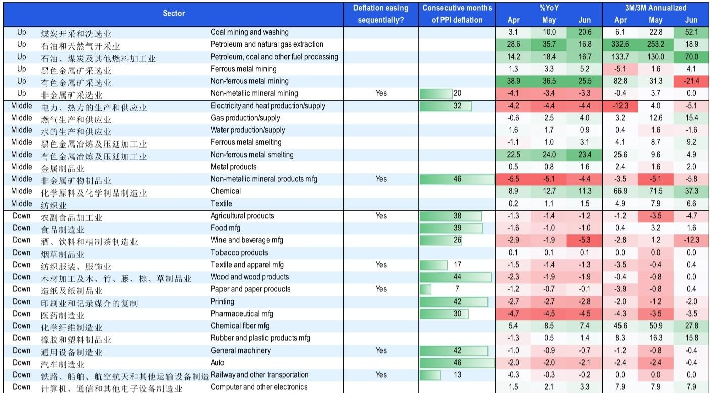
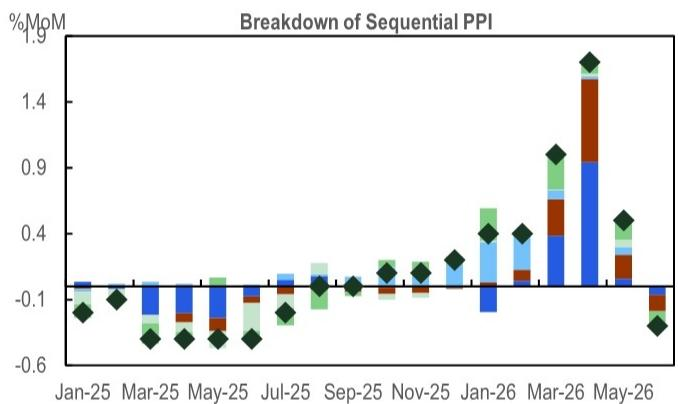
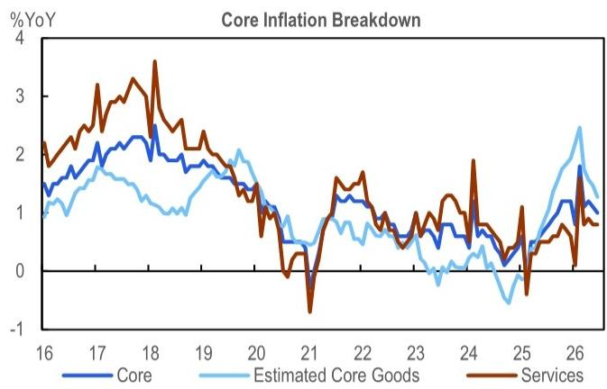

# 关于中国通胀趋势的观察：进入平台期，关注政策信号

6月通胀数据小幅低于预期，主要受外部能源和黄金价格波动影响，而非国内需求出现明显变化。CPI同比从1.2%降至1.0%，PPI环比转负至-0.3%，但核心CPI环比-0.1%基本符合季节性，服务CPI在旅游旺季前也保持稳定。这份报告的核心判断是：下半年通胀路径将趋于平坦——能源冲击消退后，AI相关领域和猪周期底部将提供零星支撑，但宏观环境下的需求仍在调整仍是底色。

报告特别指出，二季度名义GDP增速可能继续上行。CPI季度均值从一季度的0.8%升至1.1%，PPI从-0.6%升至3.6%，GDP平减指数可能回到1.5%-2%区间。即使实际增速节奏变化至4.5%，名义增速仍有望挑战2023年中以来的高位。这意味着，市场对价格变化的叙事需要更精细地区分：总量价格指数受基数效应和外部因素支撑，但结构上，需求端并未出现广泛修复。

## 1. 能源冲击消退，但国内煤价和AI相关领域接力

6月PPI环比转负，能源和化工相关行业影响约0.2个百分点。石油和天然气开采价格环比骤降11.8%，燃料加工下降1.9%，中东冲突溢价正在快速回吐。但国内煤价进入夏季用电高峰后逆势上涨，煤炭开采PPI环比升至5.6%，同比达20.6%，并开始向黑色金属冶炼传导（同比升至5.2%）。

更值得关注的信号来自AI相关领域。计算机和电子设备制造业PPI同比升至3.3%，创1996年以来新高，环比仍维持0.7%的增速，3个月年化增速稳定在7.9%。统计局特别指出，VR设备环比涨8.4%，可穿戴设备涨3.4%，工业PC涨3.3%。这不是一次性的价格脉冲，而是持续数月的上行趋势。

> **观察：** 这张图的关键不是AI相关领域本身有多大，而是它正在同时影响CPI和PPI两个维度。CPI中的通信设备价格已创历史新高，PPI中的电子制造业价格也在加速。当市场习惯用“价格变化”概括中国价格环境时，AI相关领域已经走出了独立行情。这提醒我们，总量指标可能掩盖结构分化。

## 2. 猪周期接近底部，但食品端整体仍平稳

猪肉价格6月环比仅下降0.8%，是四个月来最小降幅。报告认为，猪周期节奏变化可能接近尾声，下半年有望提供CPI的边际支撑。但其他食品价格表现平稳：蔬菜环比-1.0%，水果-2.0%，只有鸡蛋因高温天气环比大涨5.8%。

极端天气的影响正在显现。厄尔尼诺现象对夏季供给条件的扰动可能加大价格波动，但判断是“更多波动”而非“趋势上行”。食品通胀整体仍处于低位，同比-1.6%，与5月基本持平。猪周期的底部确认需要更多数据，但方向性信号已经出现。

## 3. 核心商品通胀降至一年低点，但结构性分化加剧

核心CPI同比降至1.0%，其中核心商品通胀进一步节奏变化至1.3%，为一年来最低。黄金价格环比回落5.9%，与能源一起构成了6月CPI的主要影响项。耐用消费品价格表现分化：通信设备CPI升至7.6%的历史新高，汽车CPI仍维持在-1.1%，家电价格从3.4%回落至2.2%。

服务CPI在旅游旺季前表现平淡，环比0.0%，同比0.8%。报告表述为“lackluster but steady”——没有出现变化，但也没有改善。这反映出宏观环境的典型特征：高端消费和AI相关领域有价格上行，但大众消费和服务需求仍缺乏动能。

报告对下半年通胀路径的判断是“plateauing”——平坦化而非加速或减速。能源冲击的基数效应将逐步消退，猪周期和AI相关领域提供零星支撑，但国内需求在结构分化下可能持续偏弱。报告特别提到，即将召开的重要会议可能释放更多信号，而供给端的相关政策能否有效托底价格，将是下半年的关键变量。

For informational purposes only. Portions may be generated,translated,summarized,or edited with AI assistance based on source materials and may contain omissions or errors. Please verify independently. This is not investment,legal,tax,accounting,or other professional advice.

