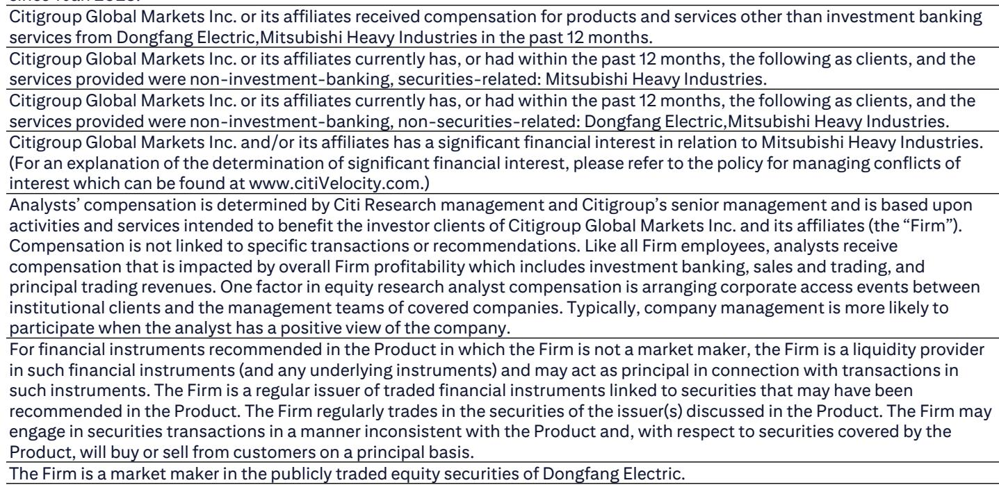
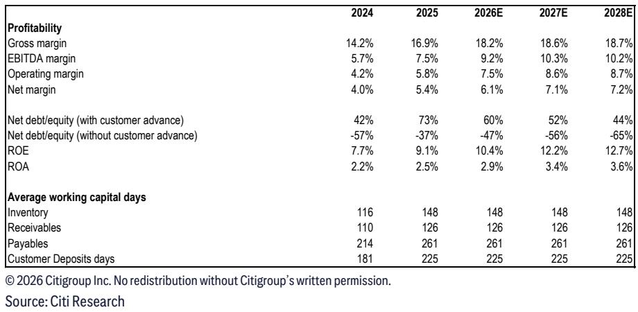
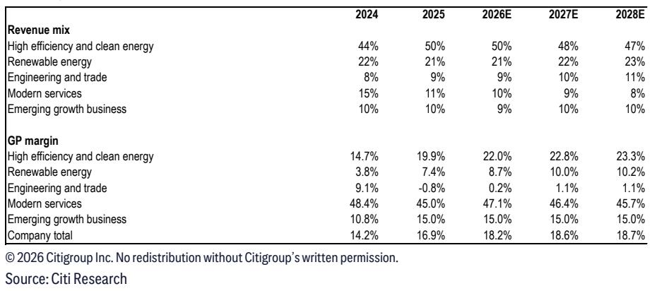

# Citi：东方电气燃气轮机正从数据中心需求中获取超额订单

Citi在7月9日与东方电气管理层交流后发布报告，核心判断是：这家中国发电设备制造商正在经历一轮由海外数据中心驱动的燃气轮机订单增长，其产品结构正在从传统煤电向高毛利的燃气轮机、抽水蓄能设备迁移。报告同时指出，市场对其燃气轮机出口收入的预期可能过于乐观——2026-2027年每年约20亿元人民币的燃气轮机出口收入，仅占公司总营收不到3%。

东方电气今年前5个月新订单同比增长10%，与全年目标一致。截至5月底，在手订单达1500亿元人民币，较2025年底增长7%。这份报告的独特价值在于，它详细拆解了燃气轮机业务从产能扩张到订单落地的完整链条，并给出了一个可验证的观察框架：数据中心对燃气轮机的需求，正在从加拿大向美国市场延伸。

## 1. 燃气轮机产能弹性较高扩张，但订单已覆盖未来两年全部产能

东方电气目前拥有每年10-12台50MW燃气轮机的生产能力。一期扩产计划研究7.6亿元人民币，预计2027年底将产能提升至每年30台。二期扩产已在规划中。关键约束在于：公司目前在手订单已达20台，这意味着2025-2026年的产能将全部被占用，交付周期长达12个月。

> **KC评论：** 产能利用率100%且交付周期长达一年，意味着新订单的营收确认时间点存在较大不确定性，正是对燃气轮机出口收入实现节奏的审慎判断。

## 2. 加拿大数据中心订单已落地，美国市场是下一个变量

2026年上半年，东方电气签署了10台燃气轮机出口订单，单价在1.5亿至2亿元人民币之间，毛利率超过30%。这批产品将用于加拿大数据中心，订单由客户在中国的代表处下达。同一客户可能在2026年下半年追加10台订单。美国数据中心的询价已经出现，但需要等待美国UL认证——加拿大认证已经完成。公司此前已向哈萨克斯坦出口过50MW燃气轮机。

东方电气50MW燃气轮机的能源转换效率为64%，比西门子同类产品低2个百分点。公司认为自身在定价和交付周期上具有竞争力。80%-90%的销售款项在产品交付时收取，这意味着现金流与交付节奏高度同步。

## 3. 抽水蓄能设备将成为下一个营收增长极

东方电气预计，其水电设备营收将从2025年的39亿元人民币，增长至2029/2030年的100亿元人民币，其中80%来自抽水蓄能设施。中国在“十五五”期间（2026-2030年）规划新增100GW抽水蓄能装机容量，到2030年底全国抽水蓄能总装机将达到约160GW，是2025年底62GW的2.6倍。这一建设规模与300GW电化学储能共同构成460GW储能资源体系，目标是支撑非化石能源发电占比在2030年达到50%。

水电设备毛利率预计从2025年的12%提升至15%-18%，主要驱动力正是抽水蓄能设备占比上升。全球最大的水电项目——西藏雅鲁藏布江下游水电站——的新订单预计从2028年开始释放。

## 4. 煤电招标量下降，但存量订单支撑2026年营收增长

东方电气判断，中国燃煤发电设备市场招标量将从过去每年80GW下降至2026-2030年的每年50GW。但基于在手订单，公司2026年煤电设备营收仍将同比增长。2x1000MW火电设备的销售价格为11亿元人民币，公司预计该业务毛利率稳定在20%-22%区间，与2025年的20.7%基本持平。

核电设备方面，公司预计中国“十五五”期间每年新批核电机组维持在10台。其核电设备营收有望从2025年的57亿元人民币，增长至未来每年80亿元人民币，具体取决于交付进度。风电设备营收预计2026年同比增长10%至200亿元人民币，但毛利率（2025年为3%）将持续处于低位。

这份报告提供了一个清晰的观察框架：东方电气的价值重估，取决于燃气轮机出口订单能否从加拿大延伸至美国市场，以及抽水蓄能设备毛利率能否如期改善。两个变量都指向同一个方向——数据中心和电网灵活性研究，正在重塑中国发电设备制造商的收入结构。

For informational purposes only. Portions may be generated,translated,summarized,or edited with AI assistance based on source materials and may contain omissions or errors. Please verify independently. This is not investment,legal,tax,accounting,or other professional advice.

For informational purposes only. Portions may be generated,translated,summarized,or edited with AI assistance based on source materials and may contain omissions or errors. Please verify independently. This is not investment,legal,tax,accounting,or other professional advice.

