# Global Technology & Communications

## Citi CIO Survey: IT Budgets Improve As AI Moves Higher In Priority

## CITI'S TAKE

Our 2Q26 survey (N=100) of key IT decision makers suggests an improved spending backdrop vs. last Q with both US and EMEA NTM IT budgets accelerating as AI continues to rise in investment prioritization. Overall forward IT budget growth expectations rose to +3.3% from +2.6% in the Mar-26 survey, which was 0.8 pts above the 7-year historical average. Data/AI remained the top priority for respondents and gained further share followed by cybersecurity, (2) digital transformation, (3) and customer-facing applications (#4). We summarize takeaways by sector for Software, European Tech, Internet, Hardware, IT Services, and Communications Services and Infrastructure.

Global IT Budgets Accelerate with Growth in Both US and EMEA — CIOs are expecting IT budgets to grow +3.3% over the next twelve months, seeing an acceleration of 0.7 pts from the March Survey, which is above the historical average. EMEA saw another modest acceleration, moving up 0.8 pts to 3.9%, while the US accelerated by 0.6 pts to +3.0%.

Data Analytics/AI Top Investment Priority, Ahead of Cybersecurity — NTM cyber budget growth decelerated ~1pt with the remaining 2nd-ranked in CIO investment priorities, with a widened gap to data analytics/AI in 1st-place. We continue to see positive trends in tokenization helping to fuel the #1 category. We'd note respondents citing GenAI investments fueling cyber spend and cyber holding the #1 spot as a tool consolidation destination as reasons to stay constructive on category spend trends, and by extension platform consolidators with broad AI portfolio exposure/tangible momentum. Interestingly, web security leapt into top-priority cohort (likely spurred by surge in malicious and legitimate agentic/bot internet traffic vols + expanded API surfaces which we prognosticated), while Identity, Endpoint, Cloud, Network security practices collectively continue to demonstrate budgetary resilience.

AI Trends — MSFT remained the top vendor that CIO are considering increasing spend on with AI followed by Amazon and Google. In terms of cutting spend for AI investments, the most noted vendors included Cisco, Dell, IBM and ServiceNow. It's estimated that AI currently represents ~6.5% of the IT Budget with 69% (previously 73%) of funding coming from new/additional funding and 50% (previously 47%) majority of CIOs expecting AI to drive headcount reduction over the next 6-12 months, and an increase in CIOs seeing AI spending cannibalizing other areas of the budget (nearly ~50% vs. 40% in March and 30% in December). There was also a slightly positive trend of AI use cases moving into production which increase to 24% (previously 22%) while PoC went up to 40% (previously 37%).

Tyler Radke AC +1-415-951-1660
tyler.radke@citi.com

Fatima Boolani
+1-212-816-9115
fatima.boolani@citi.com

Steven Enders, CFA
+1-415-951-1745
steven.enders@citi.com

Michael Rollins, CFA
+1-212-816-1116
michael.rollins@citi.com

Balajee Tirupati, CFA
+44-20-7500-6682
balajee.tirupati@citi.com

Asiya Merchant, CFA
+1-415-951-1752
asiya.merchant@citi.com

Ronald Josey
+1-212-816-4545
ronald.josey@citi.com

Pavan Daswani, CFA

George Kurosawa, CFA

Mark Zhang

Yitchuin Wong

Peter Griffith

Andrew Girard, CFA

Joel Omino

Roberta Versiani

Michael Cadiz

Adrienne Colby

## Sector-Specific Impacts

■ Application + Data/Analytics Software (Radke) – We continue to see mixed and bifurcated enterprise software read-throughs following our CIO survey as AI spending is increasingly cannibalizing other parts of the portfolio. Data analytics/AI remains the top priority, while digital transformation stayed at (#3) and consumer-facing apps moving up 2 spots to #4.

For hyperscaler and cloud consumption peers, survey results were relatively positive with 38% of CIOs seeing consumption spending growth YoY uptick slightly (vs. 31% in the March survey) and 52% seeing consistent spending vs. last year (from 50% in the March Survey). LTM public cloud infrastructure spending expectations downticked to ~6% and NTM public cloud downticked to 7% (vs. 8% for NTM/LTM in our last survey). It is unsurprising to see Data Analytics/GenAI at the top spot again as recent data points from multiple conferences intra Q, Snowflake Summit, Databricks events, AWS Summits and Cannes all reinforced the strategic imperative of a modern data architecture platform on the path to productionalizing Agentic and AI PoCs. While we continued to see an increasing demand for Agentic AI among enterprises, we did witness a much greater % of respondents indicating AI funding is negatively impacting the overall IT Budget, which signal increasing cannibalization. Overall, we continue to see the most positive read-throughs to hyperscalers such as (MSFT and CRWV,) and AI platform/consumption names (MDB, SNOW, PLTR), which can benefit from increased enterprise AI workloads that could start to contribute more meaningfully over the next few quarters.

Customer-facing applications moved to #4 (previously #6) in the list of most important CIO priorities. In terms of vendor consolidation, customer-facing app development/deployed was less of a priority moving to #11 from #8 last survey. Salesforce (CRM) shifted down to 6th (previously 4th) on rankings for vendors that CIOs are considering cutting spending to invest on AI which could point to positive demand signals in the 2H. We also view this trend as a positive readthrough for design and UI-focused providers like Figma.

Cloud communications (MSFT, NICE, ZM, and CRM) moved to the #9 CIO priority (previously #8). CIOs are increasingly looking to consolidate spending in the category with cloud communications moving to the #4 priority (from #7 previously). In terms of GenAI funding, customer support has been one of the first categories to exhibit customer-facing production use cases as companies take advantage of copilot (agent, supervisor, and back-office workflows) and virtual agents (self-service) to improve the customer and employee experience. Data transformation within large organizations has led to increased importance for modern UC/CCaaS platform as legacy vendors near EOL dates. We remain focused on trends at BPO customers who we believe will be the first to show agent headcount reductions.

■ Cybersecurity (Boolani) – Identity, Endpoint, and Web security are the top 3 cyber sub-categories that CIOs rank as a top investment priority, displacing Cloud and Network security. Regarding CIO's top 3 priorities collectively, Identity, Cloud and Network security are the top sub-categories, with Network returning to this cohort and displacing Analytics QoQ. We'd also note the much tighter distribution of rankings QoQ (~10pts between 1st place and 7th place in top-3 rankings vs ~26pts last Q). Web security earning top investment priority status intrigues, and we believe this stems from the potential for faster and more volumetric AI-crafted DDoS attacks and malicious bot traffic, and overall explosive growth trends of AI/Agentic internet traffic. We'd also argue that a significantly larger and growing volume of API surfaces/interfaces (thanks to AI overall and capabilities like MCP) are potentially necessitating a renewed emphasis around security as another potential contributing factor. We surmise security for Agents/NHI's is also fueling the continued high prioritization of Identity security (treating Agents as identities that need to be protected/routed/authenticated), while endpoint security likely remains high-priority as this is also a 'frontline defense' against AI-driven threats. From a CIO wallet share perspective, CRWD, PANW (including CyberArk), MSFT remain the largest share winners over the NTM.

- Identity security climbed to overall top priority status (from 3rd-place-tie last Q) at 18% of CIOs, and continues to lead from a top-3-ranking perspective (though down to 40% from 49%). This across-the-board high priority ranking continues to reinforce that in an agentic world, ID hygiene is a critical first line of defense and architectural investment focus, designed to tackle privilege sprawl increasingly spanning humans and machine/NHI risks. Higher propensity to procure identity security from hyperscalers QoQ leans more favorable for MSFT vs. independents OKTA and PANW/Idira (but sample size is arguably small here).

- Web security earning the 3rd-highest top investment priority status likely signals growing concern and preparation for AI-driven attacks to web properties and web-facing infra as AI/Agentic automation enables/enhances the speed, volumes and efficacy of DDoS, bot attacks, while also stoking financial burdens of illegitimate traffic (agents, crawlers, NHI traffic that is costly to absorb but not revenue-generating and potentially revenue exfiltrating as LLMs trawl for content to train on). This bodes well for CDN vendors (NET/AKAM/FSLY with WAF/DDoS/bot protection/API security capabilities) in addition to cyber platforms. While loathe to call this a trend, we think there are enough ingredients here to advocate for a steady "web security spending renaissance".

- Although Cloud security lost its status as the overall top CIO priority (identity/endpoint/web/user security leapfrogged it), from a top-3 perspective the sub-sector remains in 2nd place, demonstrating some sustained cyber budget and mindshare resiliency. We believe the growing/maturing AI adoption we've highlighted should also drive cloud usage/migration, in turn expanding the 'attackable' cloud infrastructure estate for enterprises and sustaining cloud security demand.

- Network security fell from #3 to #5 in top priority rankings, though improved from #7 to #3 regarding CIO's top 3 priorities. Similar to Cloud security, the stability/improvement in the top-3 rankings despite ceding ground as a top-most priority demonstrates some budgetary/mindshare resilience, even as growing AI/Agentic implementations bring other security sub-categories to the forefront. We surmise this has to do with a combo of exploding network traffic, raising capacity demands and pre-buying as the component environment remains punitive.

- Endpoint security retained 2nd place across CIO's highest priority list and 5th place when CIOs ranked their top 3 priorities, sustaining key vendor observations that AI adoption is driving acceleration in endpoint demand as the sub-category is a critical defense/enforcement line against AI-driven attacks.

- Data security remained 9th-ranked as a top priority and tied for 5th place as a top-3 priority (vs 6th last Q). Despite its importance in enabling/securing AI adoption, we believe the space continues to be fractionalized with varying vendor strategies/use cases (cyber resilience, backup, DLP) and asset consolidations (platform vendors acquiring into the space).

■ Back Office Software (Enders) – Improving budget growth expectations ahead of historical average levels indicates a largely healthy overall spend backdrop and sets up an improved beat-and-raise profile into Q2 where companies should be in a better position to roll Q1 upside into full year outlooks. The main point of caution we see is potentially EMEA where survey data indicates a net worsening of 3mo macro conditions, although EMEA budget growth expectations still appear healthy which could mean enterprises are proceeding with purchases despite macro uncertainty. The rank order of priority across Back Office categories is largely unchanged with Automation remaining a top priority, Fins/ERP largely neutral, and Productivity and HR apps as still net negatives. From a q/q perspective, Fins/ERP, Productivity, and HR categories saw improvements in the absolute level of budget prioritization, which could help set up better-than-feared results, while Automation saw a slight decline. AI budgets continue to be largely funded by incremental funding, although we note an increasing share of respondents expecting traditional IT budgets to face some level of disruption, increasing pressure on companies in our coverage space to rapidly prove out commercial AI strategies and drive accelerating growth in order to be viewed as net beneficiaries. Similarly, we have seen a generally increasing share of respondents anticipating AI to drive reductions in organizational headcount over time, with the largest cohort expecting impacts in the 6-12mo timeframe, leaving us incrementally cautious on primarily seat-based models (MNDY, ASAN, BOX, BL, HR Software).

■ Internet (Josey) – Cloud Providers Benefiting from GenAI Demand: Our 2Q CIO Survey points to a stronger cloud-demand backdrop, with participants expecting public cloud infrastructure services spend growth to accelerate to +6.9% over the NTM vs. 5.5% over the LTM with 38% of respondents suggesting consumption spending growth is ahead of last year (vs. 31% in March and 36% in December). Our survey participants expect global IT budgets to grow 3.3% over the NTM, an acceleration vs. +2.6% in 1Q with US IT budgets to grow 3.0% over the NTM (vs. +2.4% in 1Q). Net-net, we are incrementally confident in our 2Q26 revenue growth projections for both AWS (+29.5% Y/Y) and Google Cloud (+65% Y/Y), both of which might prove conservative.

- AI Spending Continues to be Additive to IT Budgets: Data Analytics and AI were listed as the top CIO investment priorities. 69% of respondents note GenAI funding is coming from new/additional sources, down slightly from 73% in 1Q, and 59% of CIOs expect AI investments and related savings to reduce headcount (same as 1Q) with 86% expecting these savings within the next 2 years (same as 1Q). And while our survey suggests AI accounts for ~6.5% of CIO budgets today, CIOs expect to increase spend on AI by ~10% over the NTM. significantly above overall budget growth of +6.9%, with most planning to do so with Microsoft followed by Amazon and Google.

- LLM usage—Google's Gemini was the #4 (14% of CIOs) most used LLM in production, two AI labs, and Microsoft, which had 25%, 23%, and 20% of CIO adoption, respectively. New this quarter, we asked CIOs average LLM contract length and 96% are longer than 1 year, with 31% 2+ years in length. To that, 53% of CIOs (vs. 56% in 1Q) are most likely to run LLM workloads on the public cloud vs. on-prem or private cloud environments, further supporting our view that AI adoption remains a core driver of public cloud infrastructure demand.

- European Technology (Tirupati) –The survey suggests rather resilient European CIO investment sentiment despite continued adverse opinion of the macro evolution. For European CIOs we highlight: i) macro sentiment remained cautious with ~62% of respondents stating macro condition has deteriorated over the quarter, ii) continued sequential recovery in expenditure expectation with NTM IT budget growth view of +3.9% (highest in 9-qtrs), and ahead of the trend rate and the LTM estimated growth (of +3.8%), and iii) average change in the IT budget over the trailing three month period at +1.8% with ~12% of respondents citing decrease in budget vs. ~38% citing increase. The budget sentiment for France appears to have recovered in this survey after muted investment view since 2024 – we acknowledge limited size (n=9) and adverse macro view of respondents, but note a reversal in investment sentiment in France could be particularly positive for Capgemini. AI is overarching theme for the sector – where survey takeaways are broadly consistent with previous quarters in majority of respondents (~69%) citing AI funding being incremental, while ~50% also expecting AI investments having negative impact on traditional IT budgets and leading to headcount reduction. Data and AI stay top investment priority and both back office and front office projects continue to be seen as most impacted categories (from the increased spend in AI projects). Into the earnings season investor sentiment for the sector is in check and focus is on the implications of macro uncertainty and possible growth deceleration (also on tougher comps) when a broader sector de-rating has limited room for relative outperformance. We expect another quarter of steady updates and appreciate the sector's resilience credentials (against macro volatility), still do not see in line prints to be catalyst enough for sentiment / trade reversal. For relative appeal, SAP stands out where we see relative valuation headroom and scope of slightly better than expected bookings evolution being received favourably.

■ Communication Services and Infrastructure (Rollins) – We view survey results as neutral to positive for the communications infrastructure industry, as overall trends continue to move in an encouraging direction. IT budget expectations NTM accelerated to +3.3% from +2.6% in March, which represents 120bps growth from the year ago level. US expectations went up to 3.0% NTM, up from 2.4% in March and above last year's 2.8%. EMEA performance was also stronger, up 3.9% NTM vs March level of 3.1% and significantly above last year's 0.6%. Data analytics/AI/data warehouse stayed as #1 priority in the next 12 months, followed by IT security and digital transformation projects, which is consistent with the prior period priorities and a good indication for our comms Business and Infrastructure companies. Within comm infrastructure and data centers specifically, overall demand indicators remain positive for both hyperscale and retail. The majority of IT budget revisions stayed the same in the last 3 months, while upward budget revisions increased slightly and downward budget revisions decreased slightly. The average trailing IT budget revision was +2.0%, which is above March's level and a positive to neutral indication in our view. Cloud consumption is also generally consistent with last year, but now with a slightly higher percentage stating consumption spending is ahead of last year with no plans to pull back (from 31% in March to 38% in June), which we view favorably. We maintain our Buys on EQIX and DLR, and we maintain Neutral ratings on CCOI and LUMN. EQIX is our top-ranked stock within our coverage, and we continue to view the company as a beneficiary as the demand for agentic AI for the enterprise expands and companies also employ a hybrid/multi-source architecture for AI workloads.

- Hardware (Merchant) – According to survey respondents, on an NTM vs LTM basis spending on Datacenter infrastructure and public cloud are better, while PC spending intentions declined. To us this suggests hardware spend remains resilient but more selective, with incremental budgets skewing toward core infrastructure and storage offsetting PC declines where win 10 refresh is likely winding down.

As it relates to AI impacts on hardware budgets, the survey notes 45% of respondents are not expecting it to impact IT Hardware budgets, (flat from 45% prior) while 33% noted an increase in their hardware budgets from AI impacts compared to 35% previously. 21% noted a decrease compared to 17% prior. To us, this suggests AI is emerging as a more incremental positive to IT hardware budgets.

In terms of pricing adjustments impacting NTM budgets, weighted-average revisions increased across all hardware categories, led by storage and networking. We note that AI server spend may be increasingly funded through other AI/modernization budgets rather than core IT allocations, which likely understates the full extent of pricing uplift in the survey's responses. To us, this suggests pricing pressures recently seen from components price increases may be increasingly absorbed via incremental budget flexibility.

53% of survey respondents reported they are likely to run their LLM workloads on public cloud followed by 27% Hybrid and 17% Private cloud, with another 3% indicating preference for on prem. Data indicates a 3% decrease in respondents running their LLM workloads on public cloud compared to 1Q26 survey, offset with a 5% increase in hybrid and 2% increase in on prem. For those preferring to shift workloads to private dedicated servers, cost consideration decreased vs. 4Q25 survey (to 33% from 38%) while OEMs offering attractive subscriptions is now the largest factor at 67% vs 63% prior. To us, this suggests that while public cloud retains its structural offsets around scale efficiencies flexible consumption models from OEMs especially in periods of price increases are an attractive viable alternative.

IT Servies (Keane) - As we continue to monitor the evolution of IT budgets in the AI world within the IT services industry, a major trend we are seeing is that enterprise clients/CIOs are reallocating spend from the AI productivity gains to invest in AI-related agents/implementations/systems to keep pace with (or catch up on) the rapidly evolving technologies. Currently, in order to fund these AI investments, we are seeing a negative impact to consulting testing and systems integration work, which can be seen in Accenture's recent consulting revenue growth, moving from 5.3% CC Y/Y last fiscal year to just 1% this past quarter. We think that industry level implications include an increased focus by IT services providers on winning where CIOs are spending (i.e. GenAI, Security, etc.) and in bundled (aka larger) deals in order to help limit the cannibalistic headwinds to their respective consolidated growths. In particular, we think that several of these organizations have already begun adjusting their go-to-market strategies. Indeed, in recent months, security-based solutions and implementations have become a rising theme. Last quarter, ACN announced definitive agreements to acquire runZero, NetRise, and a majority stake in Dragos, all established cybersecurity platforms, while CTSH has increased investment in its "Secure AI Services" arm, partnering with the likes of CrowdStrike, Palo Alto, and Zscaler to better support clients with integrated agentic security systems. We think that such developments further emphasize the survey's findings that customer CIOs are increasingly seeking to enhance their organizations' security measures in an era when "offensive security" is the new norm against GenAI threats from bad actors.

This is a follow-up to our prior survey published in March — Global Technology & Communications: Citi CIO Survey: IT Budgets Moderate Post 4Q Budget Flush

# June 2026 CIO Survey Results IT Budget Growth Expectations Moderated to +2.6%

Figure 1. Global IT budget growth expectations for the NTM accelerated to +3.3% from +2.6% in the Mar-26 survey  
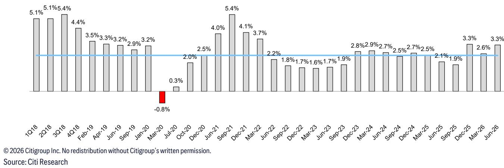

Figure 2. US IT budget growth expectations for the NTM increased to +3.0%, slightly above the historical average  
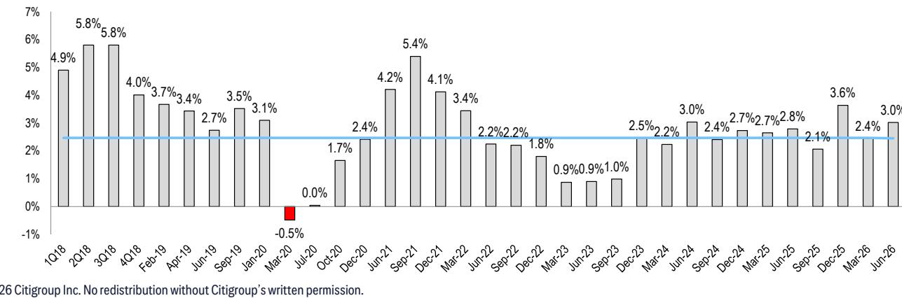

Figure 3. EMEA IT budget growth expectations for the NTM increased to +3.9% from +3.1% in March survey, above the historical average  
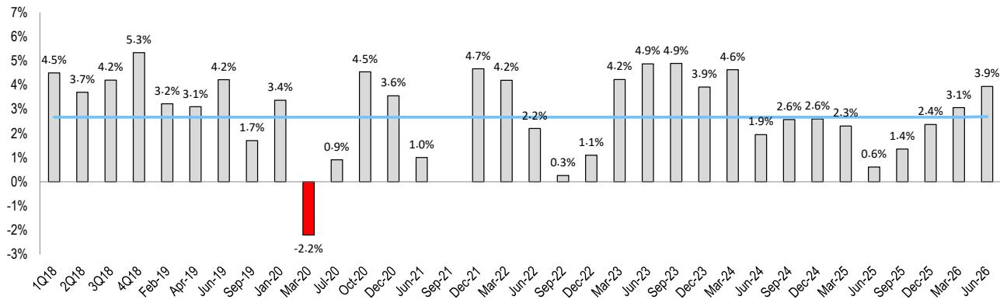

Net Investment Priorities: Data Analytics/AI at #1, Cybersecurity at #2, Digital Transformation Projects at #3, and Customer-facing apps at #4

Figure 4. Top CIO Investment Priorities

Net results of responses of the following two questions: For the next twelve months, which three initiatives have become a higher investment priority? Since the beginning of the year, which three initiatives have become a lower investment priority?

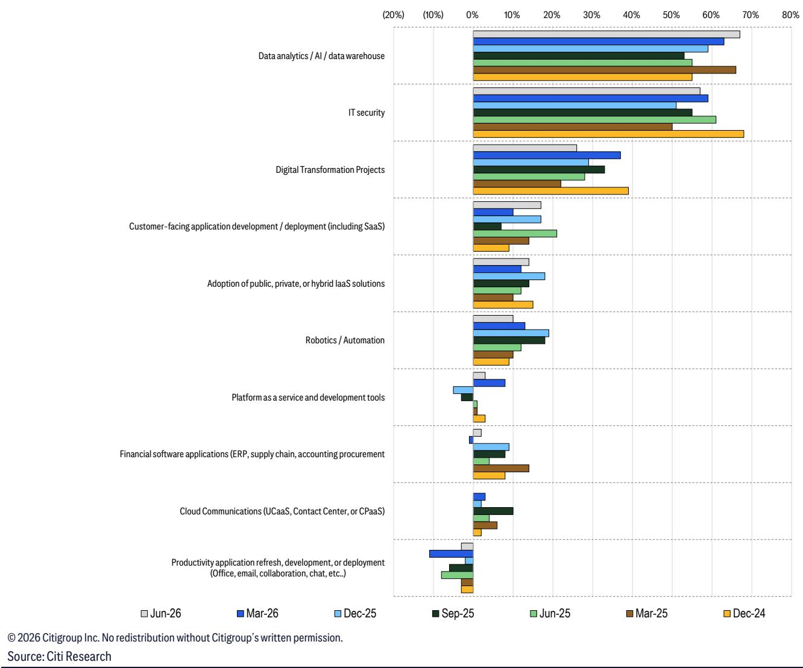

Figure 5. Overall trailing-3-month change in macro conditions were neutral in the US but negative in EMEA
How would you categorize the 3-month change in global economic conditions that impact your business?

<table><tr><td>Trailing-3-Month Change in Macro Conditions</td><td>All</td><td>U.S.</td><td>EMEA</td></tr><tr><td>Improving Substantially (+2)</td><td>3%</td><td>4%</td><td>0%</td></tr><tr><td>Improving Slightly (+1)</td><td>21%</td><td>26%</td><td>8%</td></tr><tr><td>About the Same (0)</td><td>38%</td><td>41%</td><td>31%</td></tr><tr><td>Worsening Slightly (-1)</td><td>32%</td><td>26%</td><td>50%</td></tr><tr><td>Worsening Substantially (-2)</td><td>6%</td><td>4%</td><td>12%</td></tr><tr><td>Total</td><td>-0.17</td><td>0.00</td><td>-0.65</td></tr></table>

© 2026 Citi Inc. No redistribution without Citi's written permission.  
Source: Citi

Figure 6. Majority of CIO IT budgets stayed the same in the trailing 3 months and percentage of upward budget revisions increased slightly to 28% vs. 25% in March survey  
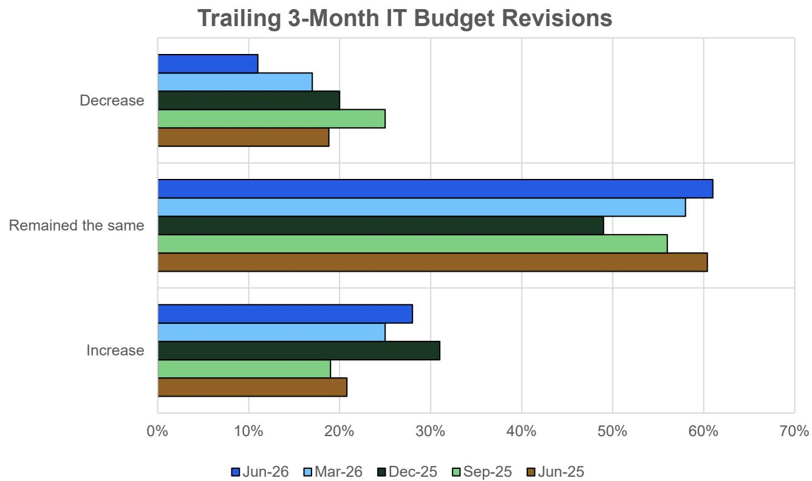  
Source: Citi  
© 2026 Citi Inc. No redistribution without Citi's written permission.

Over the past 3 months, how has your IT budget been incrementally revised?  
Figure 7. Trailing 3-month period IT budget revision was +2% for companies that revised budgets (driven by +2.1% revision in US, slightly offset by +1.8% revision in EMEA), vs +0.8% in March Survey  
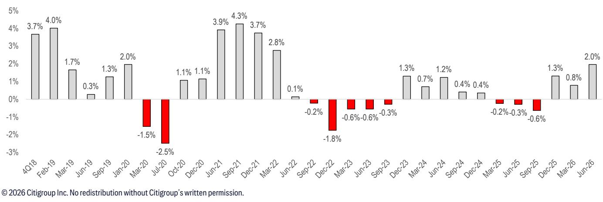

Figure 8. Most respondents have seen software vendors keep prices the same or raise them over the past 3 months
Over the past three months, how would you broadly characterize the pricing behavior of the software vendors you utilize?  
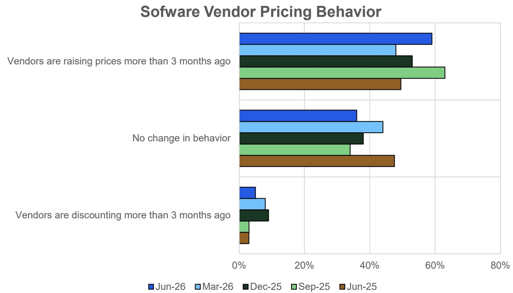

## Legacy Outsourcing, Upgrading/Refreshing PCs, and HR Software Apps Among Lowest CIO Net Investment Priorities

Figure 9. Lowest CIO Investment Priorities  
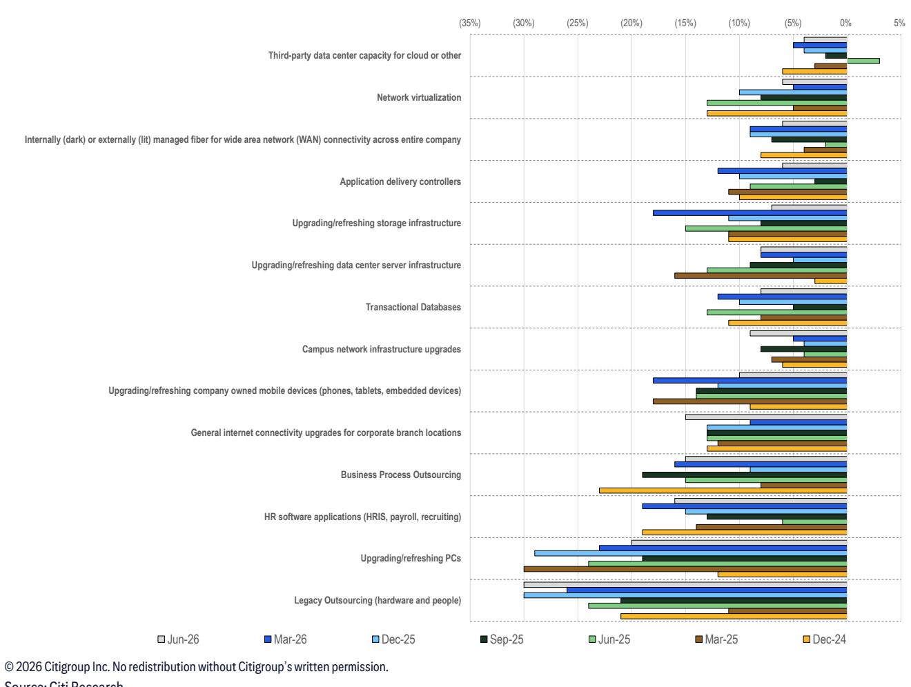

## Cloud Consumption Spending Broadly Consistent with Last Year

Figure 10. Cloud Consumption spend consistent or growing Y/Y  
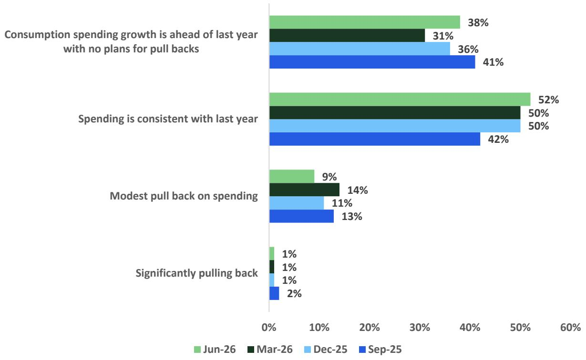  
© 2026 Citi Inc. No redistribution without Citi's written permission.
Source: Citi

## Public Cloud Infrastructure Services Spending Expected to Grow an Average of 7% in the NTM, vs. 6% in the LTM

Figure 11. How has your spending on public cloud infrastructure services (IaaS, PaaS etc.) changed over the prior twelve months, and how do you expect it to change over the next twelve months?

<table><tr><td>Spending on Public Cloud Infrastructure Services (IaaS, PaaS etc.)</td><td>LTM</td><td>NTM</td></tr><tr><td>Grow greater than 25%</td><td>4%</td><td>6%</td></tr><tr><td>Grow between 10%-25%</td><td>17%</td><td>20%</td></tr><tr><td>Grow between 0%-9%</td><td>60%</td><td>57%</td></tr><tr><td>Decline between 0%-9%</td><td>10%</td><td>10%</td></tr><tr><td>Decline between 10%-25%</td><td>4%</td><td>2%</td></tr><tr><td>Decline by greater than 25%</td><td>2%</td><td>2%</td></tr><tr><td>Don't know/Cannot discuss</td><td>3%</td><td>3%</td></tr><tr><td>Average Change in Spending</td><td>6%</td><td>7%</td></tr></table>

© 2026 Citi Inc. No redistribution without Citi's written permission.
Source: Citi  
Figure 12. Public Cloud Spending Expectations  
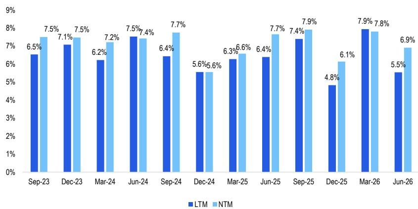  
© 2026 Citi Inc. No redistribution without Citi's written permission.
Source: Citi

# Cybersecurity, IT Consultant Engagement, and Data analytics/GenAI/Data Warehouse are Top 3 Categories Where CIOs are Looking to Consolidate

Figure 13. In which categories are you looking to consolidate spend with a small number of vendors?  
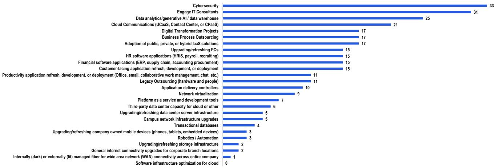

## AI Still Makes Up Small Percentage of IT budget

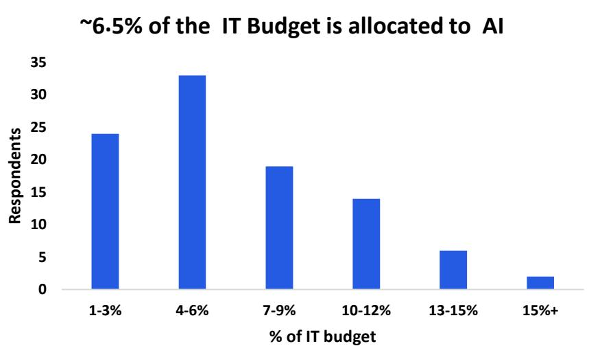  
© 2026 Citi Inc. No redistribution without Citi's written permission.
Source: Citi

Majority of CIOs looking to invest in AI with Microsoft, followed by Amazon and Google  
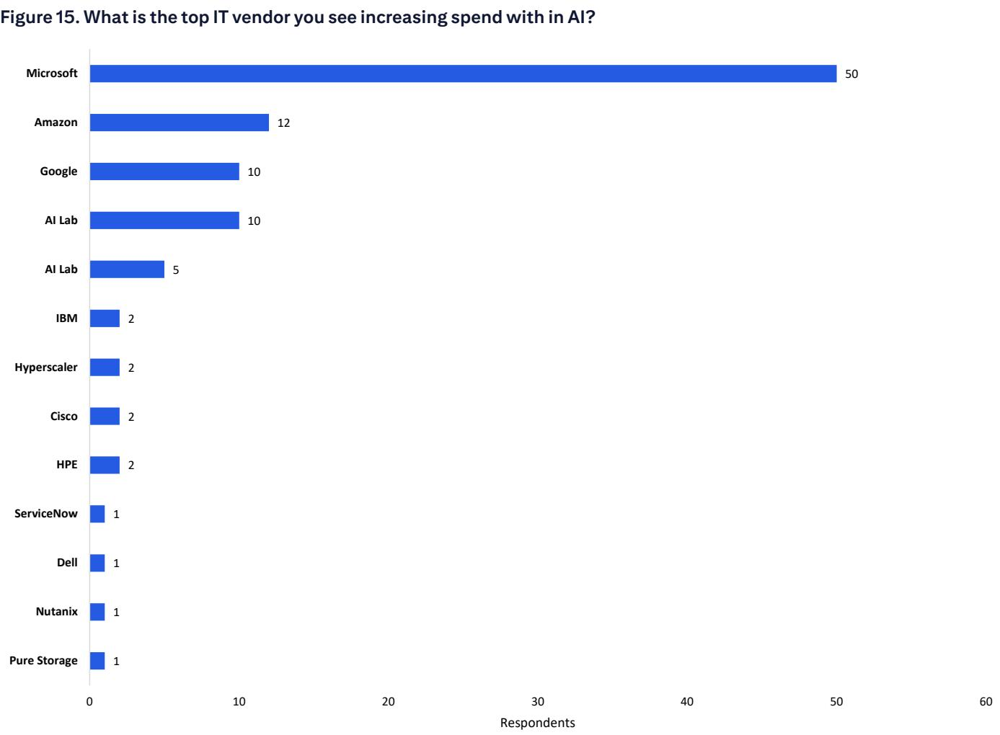  
© 2026 Citi Inc. No redistribution without Citi's written permission.
Source: Citi

Figure 16. What IT vendor do you see your organization cutting spend on to invest in AI?  
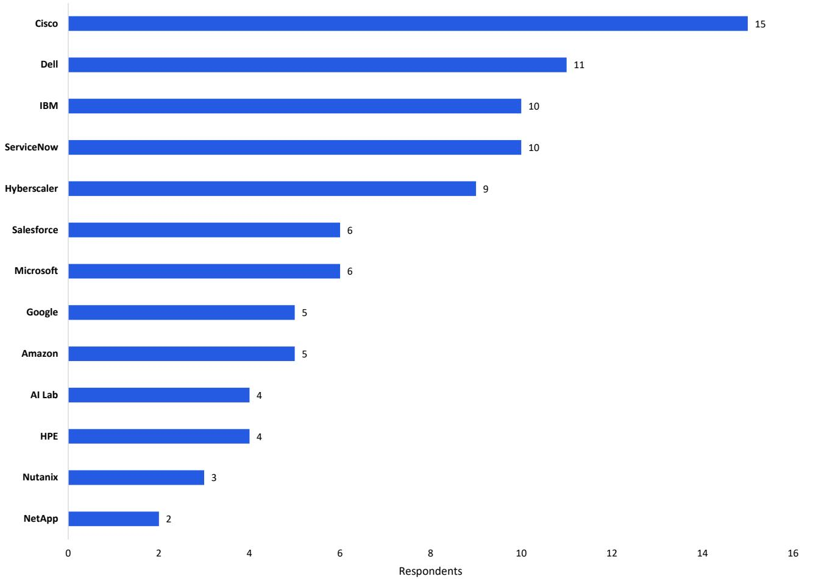  
© 2026 Citi Inc. No redistribution without Citi's written permission.
Source: Citi

# Generative AI Funding Mostly from New/Additional Funding and 59% of CIOs Expect These Investments to Reduce Headcount

Figure 17. Where is funding for Generative AI coming from?  
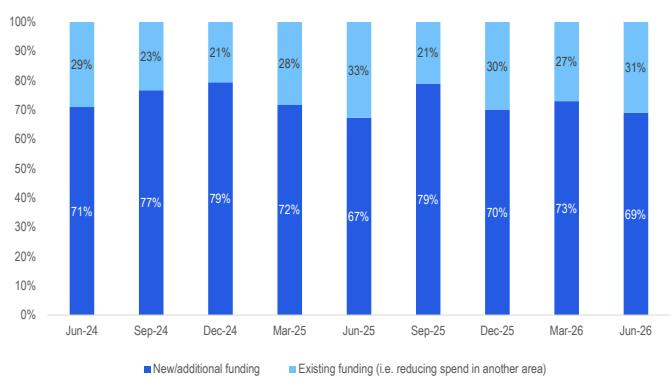  
© 2026 Citi Inc. No redistribution without Citi's written permission.
Source: Citi

Figure 18. Do you see AI investments and related savings driving a reduction in your organization's headcount?  
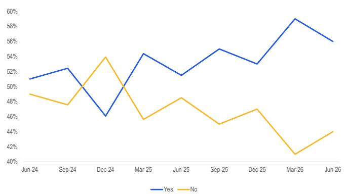  
© 2026 Citi Inc. No redistribution without Citi's written permission.
Source: Citi

Figure 19. How much does your organization expect to increase/decrease spend on AI in the next twelve months?  
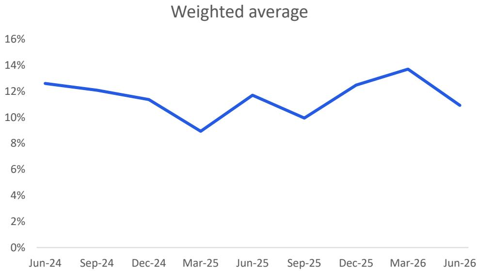  
© 2026 Citi Inc. No redistribution without Citi's written permission.
Source: Citi

Source: Citi

Figure 20. How much will your headcount be reduced from AI initiatives?  
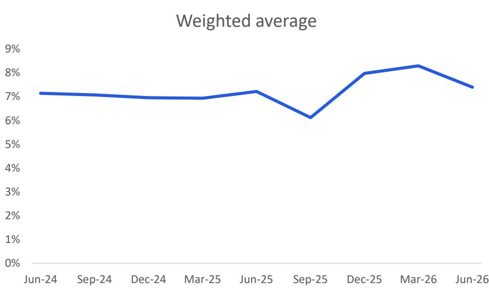  
© 2026 Citi Inc. No redistribution without Citi's written permission.  
Source: Citi

Figure 21. How long will it take to see the impact of reducing headcount from AI?

<table><tr><td colspan="2">Length of time till reduction of headcount from GenAI?</td></tr><tr><td>Next 6 months</td><td>0%</td></tr><tr><td>6-12 months</td><td>50%</td></tr><tr><td>1-2 years</td><td>36%</td></tr><tr><td>2+ years</td><td>14%</td></tr><tr><td colspan="2">© 2026 Citi Inc. No redistribution without Citi's written permission.</td></tr><tr><td colspan="2">Source: Citi</td></tr></table>

Figure 22. What percentage of AI use cases are in the testing phase?  
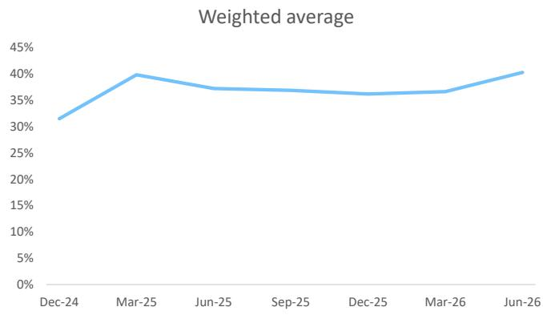  
© 2026 Citi Inc. No redistribution without Citi's written permission.

Figure 23. What % of AI use cases are in production?  
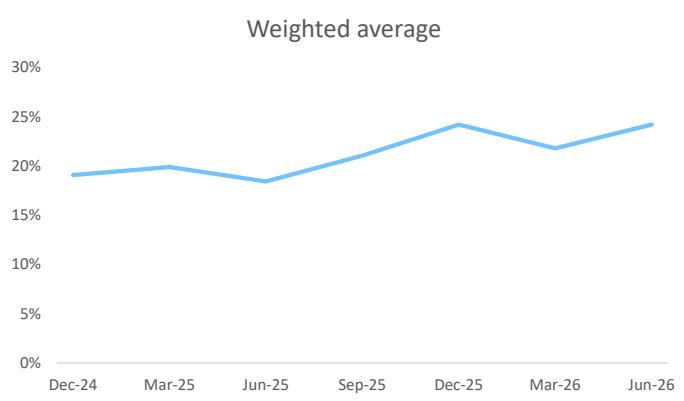  
© 2026 Citi Inc. No redistribution without Citi's written permission.
Source: Citi

## AI Impacts on Traditional IT Budgets

Figure 24. Has the increased budgets on AI negatively impacted other traditional IT budgets?  
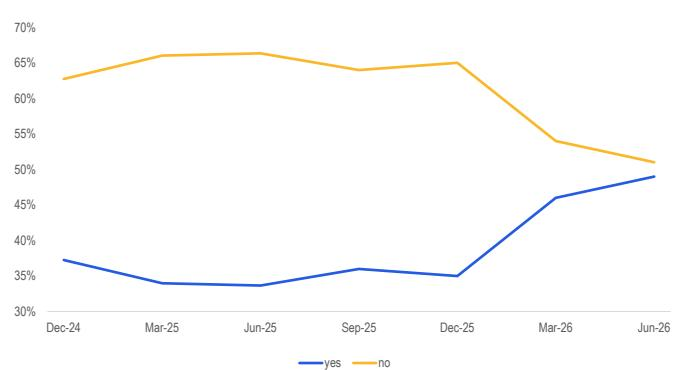  
© 2026 Citi Inc. No redistribution without Citi's written permission.
Source: Citi  
Figure 25. What percentage of other traditional IT budgets are impacted?

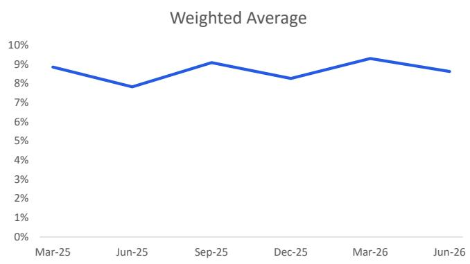  
© 2026 Citi Inc. No redistribution without Citi's written permission.
Source: Citi

Figure 26. What categories are negatively impacted by the increased budgets in AI projects?  
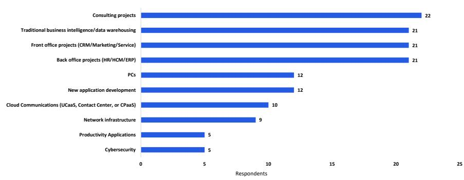  
© 2026 Citi Inc. No redistribution without Citi's written permission.
Source: Citi

Figure 27. What impact do you expect AI investments across the broader IT environment will have on your Hardware budgets?

<table><tr><td colspan="2">GenAI Impact on Hardware Budgets</td></tr><tr><td>Materially increase the hardware budget</td><td>7%</td></tr><tr><td>Modestly increase the hardware budget</td><td>26%</td></tr><tr><td>No change to the hardware budget</td><td>45%</td></tr><tr><td>Modestly decrease the hardware budget</td><td>19%</td></tr><tr><td>Materially decrease the hardware budget</td><td>2%</td></tr><tr><td>Too early/don't know</td><td>1%</td></tr><tr><td colspan="2">© 2026 Citi Inc. No redistribution without Citi's written permission.</td></tr><tr><td colspan="2">Source: Citi</td></tr></table>

## LLM Usage and Development Still Early but Driving Demand for Public Cloud Workloads

Figure 28. Which vendors are you currently using for LLM capabilities (in production)?  
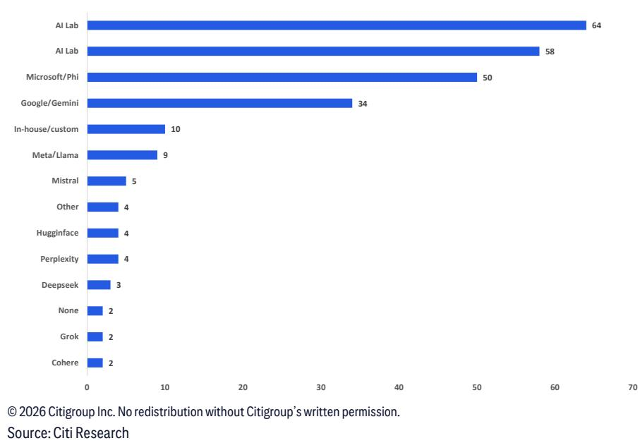

Figure 29. Where are you most likely to run your LLM workloads?  
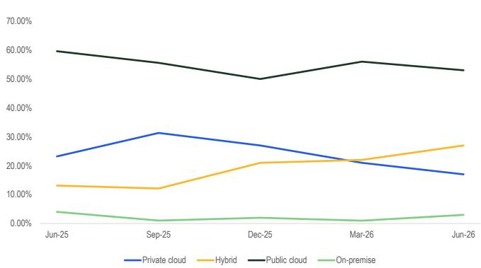  
© 2026 Citi Inc. No redistribution without Citi's written permission.
Source: Citi

Figure 30. How much of the AI/ML budget over the next twelve months is allocated towards LLM usage/development?  
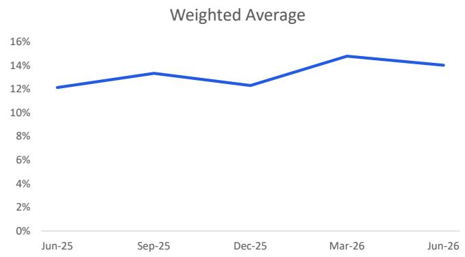  
© 2026 Citi Inc. No redistribution without Citi's written permission.
Source: Citi

Figure 31. How many LLM vendors
