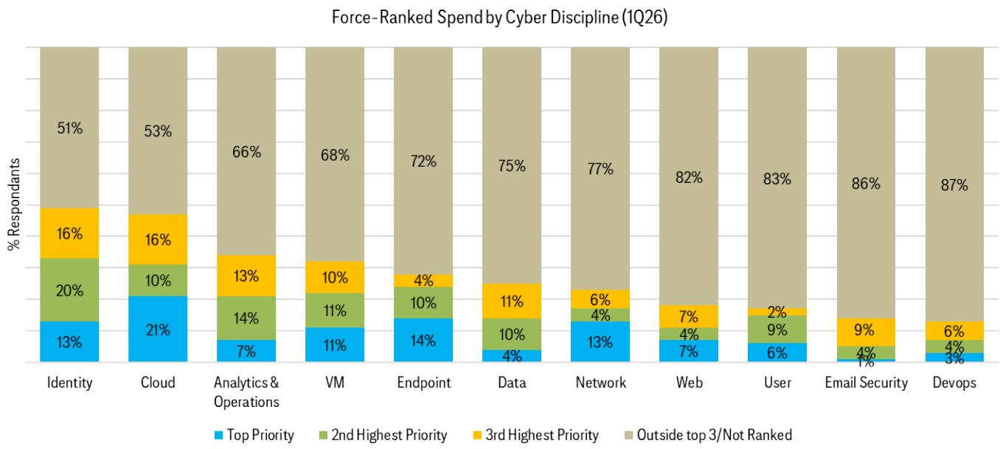
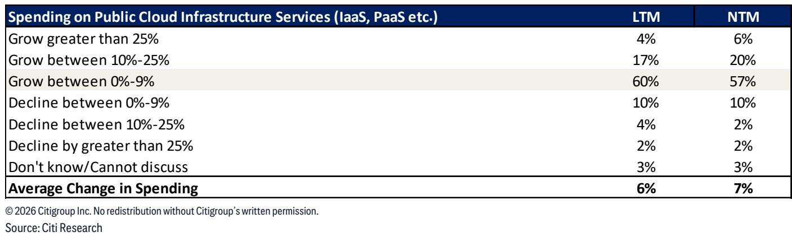

# Citi：Citi调查，数据中心仍是AI落地关键载体，EQIX获关注

这份来自Citi的2Q26 CIO调查（样本量100位关键IT决策者）释放了一个清晰信号：全球IT预算增长预期正在回升，未来12个月增速从3月调查的+2.6%提升至+3.3%，高出七年历史均值0.8个百分点。但真正值得关注的不是预算总量，而是结构变化——AI正从“额外投入”变成“替代性投入”，开始影响传统IT开支。

调查显示，数据与AI连续多个季度稳居CIO研究优先级首位，且与其他类别的差距在扩大。网络安全紧随其后，但预算增速已环比节奏变化约1个百分点。数字转型、客户导向应用分列第三和第四。值得注意的是，Web安全首次进入高质量优先级队列，这与Citi此前预判的AI驱动恶意流量激增趋势吻合。

## 1. AI预算占比已达6.5%，但近半数CIO开始看到“挤占效应”

AI目前约占IT预算的6.5%，CIO预计未来12个月将在此基础再增约10%，远超整体预算增速。但资金来源正在变化：69%的受访者表示AI投入来自新增预算（低于3月的73%），而约50%的CIO认为AI支出正在影响其他IT领域——这一比例在3月为40%，去年12月仅为30%。报告指出，这种“挤占效应”正在加速，对以席位订阅模式为主的软件公司构成不确定性。

> **KC评论：** 关键不在于AI预算本身有多大，而在于它从哪里来。当新增预算占比下降、挤占效应上升，意味着企业开始用AI替换而非叠加传统IT支出。这对依赖用户数增长而非AI驱动的软件公司是结构性挑战。

## 2. 微软仍是AI研究首选，但云厂商格局出现微妙变化

在CIO计划增加AI投入的供应商中，微软继续排名第一，亚马逊和谷歌紧随其后。但在考虑减少AI相关支出的供应商名单中，思科、戴尔、IBM和ServiceNow被提及最多。Salesforce在“为研究AI而调整开支”的排名中从第4位降至第6位，Citi认为这可能暗示下半年需求信号改善。

云基础设施方面，38%的CIO表示消费支出增速同比提升（3月为31%），52%表示持平。但公共云基础设施支出预期略有调整：过去12个月增速预期降至约6%，未来12个月降至7%。Citi认为，AI工作负载向生产环境迁移（从22%升至24%）和概念验证项目增加（从37%升至40%）仍是云需求的核心驱动力。

## 3. Web安全异军突起，网络安全子领域出现优先级洗牌

网络安全子领域的优先级排序正在发生显著变化。身份安全跃升至整体第一优先级（上季度并列第三），18%的CIO将其列为首要研究方向。端点安全保持第二。Web安全首次进入前三，Citi认为这背后是AI驱动的DDoS攻击、恶意机器人流量激增，以及AI/Agentic互联网流量增长带来的安全需求。

云安全虽然失去了整体第一优先级的地位，但在CIO的“前三优先级”排名中仍居第二，显示出预算韧性。网络安全从第三降至第五，但在前三优先级中从第七升至第三。Citi提出一个值得追踪的判断：Web安全可能正在进入一轮“支出复兴”，利好具备WAF、DDoS防护、机器人管理和API安全能力的CDN厂商和安全平台。

## 4. 欧洲CIO对宏观环境看法变化，但预算预期反而创9个季度新高

一个看似矛盾的发现来自欧洲：约62%的欧洲CIO认为宏观环境在过去三个月出现变化，但未来12个月IT预算增长预期却达到+3.9%，为9个季度以来最高，且高于历史趋势线和过去12个月的实际增速。法国市场在经历了2024年以来的研究仍在调整后，本次调查出现变化信号——尽管样本量有限（n=9），但对Capgemini等本地IT服务商可能构成积极信号。

Citi认为，欧洲科技板块的防御性特征在宏观波动中依然有效，但“符合预期”的业绩已不足以驱动估值修复。SAP因其相对估值空间和略好于预期的订单趋势，在板块中具备相对吸引力。

## 5. 通信基础设施需求信号积极，数据中心仍是AI落地的关键载体

通信服务与基础设施板块的CIO调查结果被Citi评为“中性偏积极”。IT预算上修比例略有增加，下修比例略有减少，过去三个月平均预算修正幅度为+2.0%，高于3月水平。云消费趋势与去年基本一致，但表示消费支出“领先去年且无计划缩减”的受访者比例从31%升至38%。

Citi特别指出，企业对Agentic AI的需求扩展，以及企业采用混合/多云架构处理AI工作负载的趋势，对数据中心运营商构成持续利好。EQIX被列为该板块首选标的。

---

这份调查的核心启示在于：AI正在从“预算增量”变成“预算替代”，而这一转变对不同供应商的影响高度分化。那些能够将AI能力转化为平台粘性和消费增长的公司，正在获得更多预算份额；而那些依赖传统席位模式或尚未证明AI商业路径的公司，则面临越来越大的不确定性。

For informational purposes only. Portions may be generated,translated,summarized,or edited with AI assistance based on source materials and may contain omissions or errors. Please verify independently. This is not investment,legal,tax,accounting,or other professional advice.

For informational purposes only. Portions may be generated,translated,summarized,or edited with AI assistance based on source materials and may contain omissions or errors. Please verify independently. This is not investment,legal,tax,accounting,or other professional advice.

