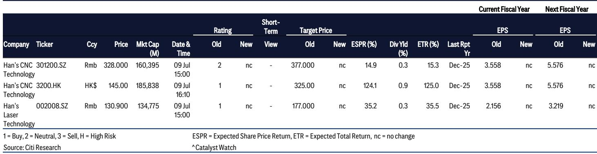
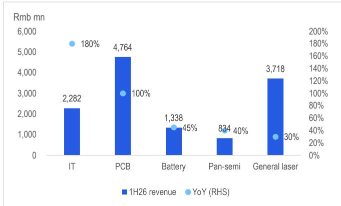
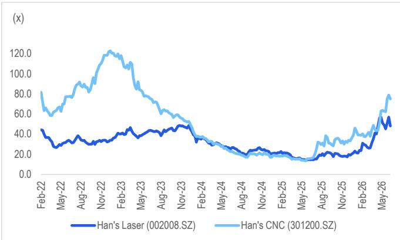

# Citi：大族激光与数控业绩表现，AI服务器需求成核心引擎

Citi最新报告指出，中国PCB设备龙头大族激光与大族数控在2026年第二季度交出了远超市场预期的成绩单。大族激光当季净利润同比增长176%-207%，大族数控更是录得294%-362%的同比增幅。两家公司业绩表现的共同引擎，是AI服务器和数据中心对高端PCB设备的强劲需求。

这份报告的核心判断是：AI驱动的PCB设备需求周期，已从概念验证进入业绩兑现阶段。大族激光的IT设备业务在1H26同比增长180%至23亿元，大族数控的营收同比至少弹性较高至48亿元，两者均创下历史同期新高。

## 1. 大族激光的业绩增长来自四条业务线的共振

Citi拆解了大族激光1H26的营收结构：IT设备业务（主要来自苹果供应链）同比增长180%至23亿元，电池设备增长45%至13亿元，泛半导体设备增长40%，通用激光设备达到37亿元。报告特别强调，IT设备业务仍是未来较强劲的正面催化剂，驱动力来自新一代iPhone（包括折叠机型）的发布以及3D打印/增材制造技术的采用。

> **KC评论：** 大族激光的业绩结构显示，它已不是单纯的激光设备制造商。苹果供应链的激光焊接与切割设备、电池厂商的扩产设备、AMOLED重复订单，这三条线同时发力，说明公司正在多个高景气赛道同时获取份额。

## 2. 大族数控的爆发力来自AI PCB设备的直接拉动

大族数控的业绩增速更快，Citi认为这主要得益于其对AI产品的更高收入敞口。具体产品包括CCD背钻和用于mSAP SLP/高端HDI的激光钻孔设备。报告将大族数控与台厂大量科技（3167.TW）的趋势进行对比，认为两者均受益于AI PCB的溢出效应——不仅包括机械钻孔设备，还包括用于800G/1.6T光模块的超快激光钻孔设备。

Citi对大族数控相关市场（301200.SZ）更新公司观点，主要原因是估值已较高；但对H股（3200.HK）更新公司观点，认为其提供了更好的不确定性回报比。

## 3. 估值框架的参照系是2017年苹果订单驱动的强周期

Citi在报告中反复提及一个历史参照：2017年苹果订单驱动的强上升周期。分析师认为，当前IT和PCB设备的周期，有望推动大族激光2026-27年核心利润复合增长率达到约65%，并引发报价重估，与2018年峰值市盈率持平。

对于大族数控，Citi认为81%的2026-27年盈利复合增长率足以支撑其当前估值，较相关市场估值有25%的折价。

> **KC评论：** Citi用2017年作为估值锚点值得关注。当时苹果订单周期带动大族激光报价大幅上涨，而当前周期叠加了AI PCB和苹果新品的双重驱动。但需要留意的是，2017年后的节奏变化周期同样剧烈，设备股的周期性特征并未消失。

## 4. 不确定性因素集中在需求波动和竞争加剧

报告明确列出了潜在不确定性：AI PCB设备需求不及预期、毛利率受零部件成本上升挤压、行业设备供给增加导致价格竞争加剧。对于大族激光，还需关注苹果订单不及预期、汽车销售走弱影响高功率激光设备需求、新技术替代激光设备等不确定性。

Citi的排序仍是大族激光（002008.SZ）优于大族数控H股（3200.HK）优于大族数控相关市场（301200.SZ）。这一排序反映了对估值、流动性和业绩确定性的综合考量。

For informational purposes only. Portions may be generated,translated,summarized,or edited with AI assistance based on source materials and may contain omissions or errors. Please verify independently. This is not investment,legal,tax,accounting,or other professional advice.

For informational purposes only. Portions may be generated,translated,summarized,or edited with AI assistance based on source materials and may contain omissions or errors. Please verify independently. This is not investment,legal,tax,accounting,or other professional advice.

