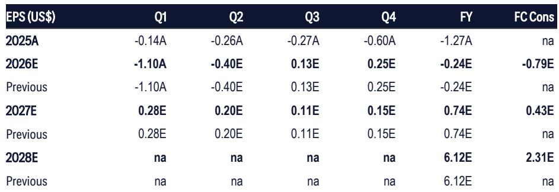
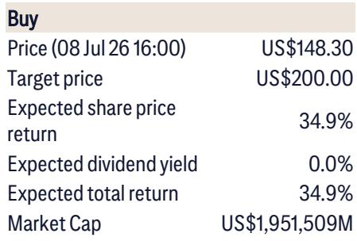
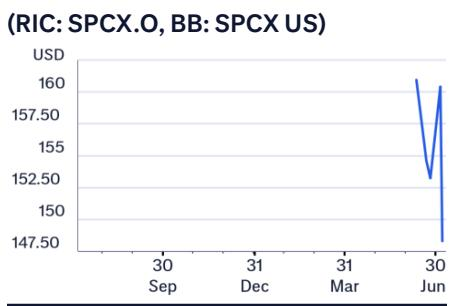

# Citi：太空AI工程问题已解决，成本才是真正瓶颈

Citi近期举办了一场超过十小时的太空宏观环境与人工智能“教学研讨会”，邀请了多位行业专家、前监管官员和初创公司创始人。这场密集讨论传递出一个核心信号：太空宏观环境不再是一个愿景驱动的概念，而是正在进入一个由公共部门与商业研究相互强化的历史性研究周期。报告认为，这一周期可能持续十年以上，其规模与影响力或可类比互联网驱动的科技繁荣。

这场讨论覆盖了从轨道AI卫星、月球法律框架到发射监管和工业气体需求等多个维度。但贯穿始终的一条主线是：技术工程问题已基本解决，当前的核心矛盾正在转向单位宏观环境性和基础设施规模化的节奏。

## 1. 轨道AI卫星的工程问题已解决，瓶颈在于成本

多位来自领先卫星公司的专家在研讨会上明确指出，轨道AI卫星不仅在物理上可行，而且关键工程问题已经得到解决。目前的主要障碍是单位宏观环境性——构成工程解决方案的先进材料和组件成本仍然过高。这一判断在当天早些时候关于天基太阳能电池板的讨论中也得到了呼应。

这意味着，太空AI的商业化落地不再是一个“能不能做”的问题，而是一个“什么时候成本降到可接受水平”的问题。对于关注这一赛道的公司而言，判断成本曲线的下降速度比判断技术可行性更具实际意义。

## 2. 发射能力有望大幅扩张，但监管和供应链需同步跟进

前美国联邦航空管理局商业航天运输办公室副主任Michael O'Donnell在研讨会上表示，未来每年实现数千次发射并非天方夜谭。他的乐观态度甚至让Citi分析师感到意外。O'Donnell强调，实现这一目标需要FAA在资源和人员方面进行大量研究，但不存在结构性障碍。他同时指出，推动发射能力大幅扩张的一个关键动因是：如果美国不保持其在发射领域的势头，中国将超越美国——这在许多人看来是不可接受的不确定性。

此外，Citi的供应链专家指出，目前太空供应链条件灵活、交付周期短，尽管航天级组件制造难度高，但供应链问题不会阻碍即将到来的发射节奏提升和卫星制造扩产。

> **KC评论：** 发射能力的扩张是太空宏观环境规模化的前提条件。O'Donnell的判断意味着，监管层面的瓶颈可能比技术层面的瓶颈更容易通过研究解决。但“数千次发射”这一数字本身仍是一个方向性目标，实际节奏取决于FAA的机构能力建设和资金到位情况。

## 3. 月球资源争夺已进入“先到先得”阶段

关于月球活动的法律框架，专家指出目前处于一种不寻常的“灰色地带”。同时，月球上不同区域的商业价值差异显著。这两点结合起来，形成了一个强有力的论点：那些希望建立月球存在的国家必须尽快行动，否则可能被更早到达的国家排挤出去。

这一判断将太空宏观环境的竞争从近地轨道延伸到了月球。对于从事月球基础设施、资源开发和相关法律服务的公司而言，时间窗口可能比预想的更短。

## 4. Starlink的移动服务路径：自建网络而非收购

来自Morgan Lewis和Recon Analytics的行业专家认为，Starlink要成为完整的移动服务提供商，很可能需要地面解决方案。在美国市场，自建网络被视为更可能的路径，而非收购电信公司或成为移动虚拟网络运营商。作为回应，传统电信和有线电视运营商可能会更积极地推出以光纤/有线宽带为核心的融合服务套餐。

这意味着，Starlink的移动战略将直接与现有电信基础设施形成竞争，而非简单的合作或补充。这一路径选择将对美国电信市场的竞争格局产生深远影响。

Citi的这场研讨会覆盖了太空宏观环境的多个维度，但最值得关注的不是任何一个单一判断，而是这些判断共同指向的方向：太空宏观环境正在从研发阶段转向规模化建设阶段。技术可行性的问题已经基本解决，接下来的竞争将围绕成本、监管、基础设施和先发优势展开。对于产业决策者而言，现在需要判断的不是“太空宏观环境会不会来”，而是“自己的公司在哪个环节可以建立不可替代的位置”。

For informational purposes only. Portions may be generated,translated,summarized,or edited with AI assistance based on source materials and may contain omissions or errors. Please verify independently. This is not investment,legal,tax,accounting,or other professional advice.

For informational purposes only. Portions may be generated,translated,summarized,or edited with AI assistance based on source materials and may contain omissions or errors. Please verify independently. This is not investment,legal,tax,accounting,or other professional advice.

