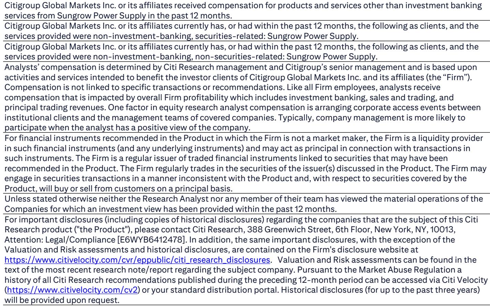
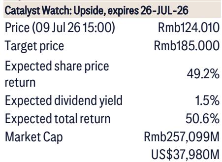
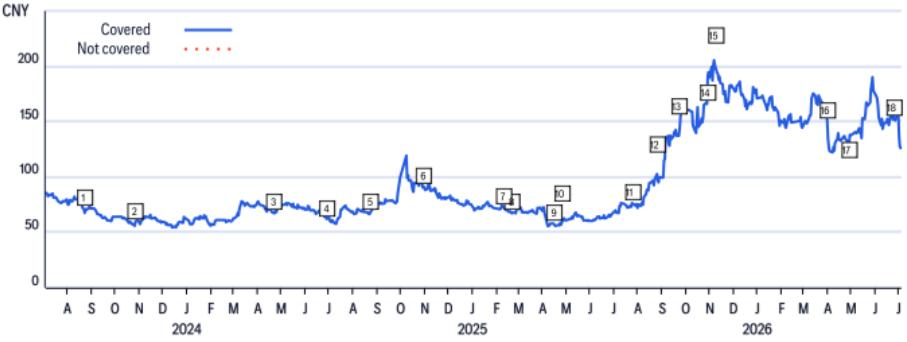

# Citi：阳光电源固态变压器，从光伏到AI数据中心，Citi称市场尚未充分定价

阳光电源今天在合肥总部发布了10kV商用固态变压器（SST），一场产品发布会之所以值得关注，是因为台下坐着英伟达、亚马逊和微软的代表。这份Citi研究笔记的核心判断是：这款产品不是实验室样品，而是已经具备量产条件、瞄准800V高压直流AI数据中心市场的商业化产品。报告认为，这是未来12个月阳光电源最明确的观察催化剂。

产品本身的技术参数足够硬。从10-13.8kV交流直接转换为800V直流，省去了传统数据中心2-3级变压器和整流设备；峰值转换效率98.5%，比传统变压器高出3-5个百分点；设备体积只有传统油浸变压器的三分之一，数据中心占地面积可减少70%。这些数字放在一起，意味着AI数据中心供电架构正在发生结构性变化。

## 1. 五年研发、每年超5亿投入，门槛已经筑起

这款SST不是短期跟风产品。Citi报告披露，阳光电源为此投入了五年持续研发，年均资本开支超过5亿元人民币，参与研发的专家超过300人。核心壁垒在于自研的碳化硅高频拓扑和高频磁性材料技术——这两项技术决定了转换效率和设备小型化的上限。

从竞争角度看，全球能做10kV级商用SST且拿到中国电网级认证、具备批量出口能力的公司，目前只有阳光电源一家。Citi明确写道，这是“中国首款获得电网级认证的商用中压SST，并具备批量出口海外算力中心的资质”。先发优势和认证壁垒，构成了这个细分赛道的护城河。

> **KC评论：** 五年、每年5亿、300人，这三个数字比任何技术描述都更能说明问题。AI数据中心供电架构的竞争，已经进入重投入、长周期的阶段，不是靠一两个工程师就能翻盘的。

## 2. 美国三大客户到场，市场验证已经开始

英伟达、亚马逊和微软的代表出现在合肥发布会现场，这不是礼节性站台。Citi认为，这些美国公司对新产品有实质性兴趣。阳光电源的目标是在2026年底前拿到美国UL电网安全认证，2026年下半年向潜在客户提供样品，2027年开始交付。

这个时间表意味着什么？AI数据中心建设正在从“抢GPU”进入“抢电力基础设施”的阶段。800V高压直流架构相比传统供电方案，在效率、空间和安全性上的优势，已经让头部云厂商愿意提前介入供应链验证。Citi报告还指出，这款产品在成本和交付周期上相比海外供应商有竞争力，后续还可拓展到风光储电站、海上风电、直流微电网和氢电解系统四个场景。

## 3. 估值层面，市场尚未充分定价这一新业务

当前报价仅对应13.6倍2027年预期市盈率。报告测算阳光电源2025-2028年每股收益年复合增速为17%。这个增速预期中，SST带来的增量收入尚未被市场充分消化。

需要留意的是，产品从认证到放量仍有不确定性。UL认证时间、客户验证周期、海外贸易政策变化，都是影响实际交付节奏的变量。Citi在观察提示中也列出了海外贸易摩擦加剧可能影响产品出口。

但就当前节点而言，一个拥有三家美国高质量科技客户关注、具备量产能力、且技术壁垒明确的商业化产品，在AI基础设施研究热潮中，属于稀缺标的。市场对阳光电源的定价，可能正在从“光伏逆变器+储能系统集成商”切换到“AI数据中心电力基础设施供应商”的新框架。

For informational purposes only. Portions may be generated,translated,summarized,or edited with AI assistance based on source materials and may contain omissions or errors. Please verify independently. This is not investment,legal,tax,accounting,or other professional advice.

For informational purposes only. Portions may be generated,translated,summarized,or edited with AI assistance based on source materials and may contain omissions or errors. Please verify independently. This is not investment,legal,tax,accounting,or other professional advice.

