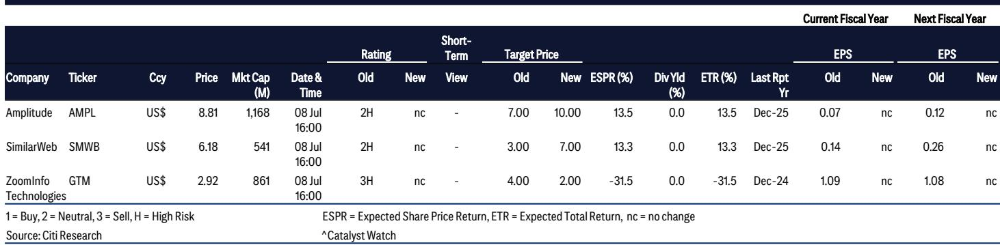
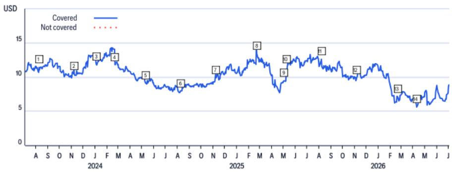
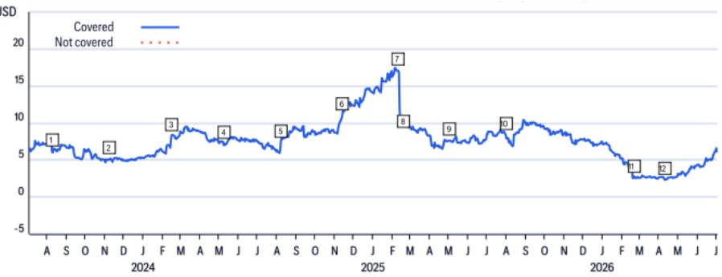

# Enterprise AI Spending Is Real,But It Is Not a Broad Software Recovery

Enterprise software spending improved in the second quarter of 2026. That is the headline. The reality beneath it is far more specific and far more strategic. After a weaker first quarter,technology budgets loosened. Some delayed projects moved forward. Partner commentary suggests that transactions which slipped earlier in the year found closure in the second quarter. But this improvement is not a rising tide that lifts all software companies. It is a concentrated flow of capital toward a narrow set of beneficiaries,primarily those positioned at the intersection of enterprise AI adoption and modern data infrastructure. For investors and corporate strategists,the critical question is not whether spending is improving,but where it is improving and why the distribution of that spending is so uneven.

The implications extend beyond stock selection. The pattern of spending concentration reflects a structural shift in how enterprises prioritize technology investments. AI is no longer an experimental budget line. It is becoming the organizing principle of enterprise architecture. Companies that sit at the data layer,the infrastructure layer,and the AI enablement layer are capturing the majority of incremental dollars. Companies that lack a credible AI narrative,particularly in traditional application software categories,face consolidation pressure,heightened ROI scrutiny,and weakening pricing power. The bifurcation is not temporary. It is the new normal.

## Spending Improvement Is Concentrated Among Data Infrastructure and AI-Enablement Platforms,Not Spread Across the Software Sector

The improvement in second-quarter spending is real but narrow. Conversations at the Snowflake Summit,Databricks events,AWS Summits,and the Cannes Lions festival all reinforced a consistent pattern:enterprises are prioritizing investments in modern data architecture as a prerequisite for AI deployment. Data management companies,cloud infrastructure providers,and AI-native platforms are the primary recipients of incremental budget dollars. This is not a recovery for the software sector broadly. It is a reallocation of spending toward a specific stack.

The evidence from the first quarter to the second quarter supports this interpretation. The first quarter was notably soft. Several enterprises delayed technology decisions,partly due to macro uncertainty and partly due to the complexity of integrating AI into existing workflows. By the second quarter,some of those delayed projects closed. But the projects that closed were not evenly distributed across the software landscape. They skewed heavily toward cloud migration,data modernization,and AI infrastructure. Traditional application software,particularly categories that have relied on price increases rather than product innovation,saw limited benefit. The spending improvement is real,but it is also concentrated,and that concentration is the defining feature of the current environment.

## Modern Data Architecture Has Become the Non-Negotiable Foundation for Enterprise AI Deployment,Benefiting a Concentrated Group of Platforms

Enterprises are moving from AI experimentation to broader deployment,and that transition has exposed a critical bottleneck:data readiness. Across CIO conversations,industry conferences,and customer discussions,data modernization is consistently cited as the most important prerequisite for successful AI deployment. Without clean,accessible,and well-governed data,AI models 报告观点. Without scalable data infrastructure,AI workloads cannot move from prototype to production. This reality has made modern data platforms strategically essential.

Snowflake,Databricks,MongoDB,and Palantir are increasingly occupying central positions in enterprise AI architectures. Their platforms are not just storage and compute layers. They are becoming the operational backbone for AI workloads,handling data ingestion,transformation,governance,and orchestration. The hyperscalers,particularly Microsoft Azure,are also beneficiaries because they provide the underlying cloud infrastructure and the model marketplace that enterprises use to route workloads. The strategic importance of these platforms is reflected in their spending trajectories. They are capturing incremental enterprise AI spending while many traditional software categories are experiencing flat or declining budgets.

The shift from experimentation to deployment also changes the competitive dynamics. During the experimentation phase,enterprises were willing to try multiple models and platforms. During the deployment phase,they consolidate around a smaller number of strategic partners. This consolidation favors platforms that offer end-to-end capabilities,deep enterprise integration,and robust governance tools. It disadvantages point solutions that address only one part of the AI stack. The data layer is where the consolidation is happening,and the companies that own that layer are the ones benefiting from the spending improvement.

## The Enterprise Focus Is Shifting from Token Maximization to AI Optimization,Favoring Platforms That Manage Cost and Workload Efficiency

One of the most notable shifts in enterprise AI behavior during the second quarter was the growing emphasis on cost efficiency. Earlier phases of AI adoption prioritized access to leading models and maximizing model performance. Enterprises wanted the best possible output,and they were willing to spend aggressively on compute and API calls to get it. That mindset is changing. As AI workloads scale,enterprises are increasingly focused on managing costs,optimizing workloads across multiple models,and improving the overall return on their AI investments.

At the Cannes Lions festival,many organizations discussed routing workloads across different models based on cost and complexity. Instead of using the most expensive frontier model for every task,they are using smaller,cheaper models for routine tasks and reserving high-cost models for complex reasoning. They are also placing greater emphasis on controlling token consumption,reducing waste,and measuring the business impact of each AI deployment. This shift from token maximization to AI optimization has significant implications for which platforms benefit.

Microsoft is well positioned in this environment because of its role as an agnostic model marketplace. Azure AI provides access to multiple models from OpenAI,Meta,Anthropic,and others,with tools for routing workloads based on cost and performance. MongoDB,Snowflake,and Palantir are also positioned to benefit because their platforms help customers manage,govern,and operationalize AI at scale. The platforms that help enterprises control costs and improve efficiency will capture more spending than the platforms that simply provide model access. The era of unlimited AI spending is over. The era of AI ROI is beginning.

## AI Infrastructure Economics Will Dominate Earnings Season,with Capex,Utilization,and Returns Under Intense Scrutiny

Beyond software fundamentals,the economics of AI infrastructure will be a central focus of the upcoming earnings season. Investors have moved beyond the question of whether AI demand is real. The demand is clearly insatiable,as evidenced by the capacity sold-out positions at neoclouds and hyperscalers. The question now is whether the unprecedented capital spending on data centers,GPUs,and networking infrastructure will translate into sustainable returns and durable competitive advantages.

Hyperscaler commentary on capacity,utilization rates,and monetization trends will be among the most important topics this earnings season. Microsoft,Amazon,and Google are spending tens of billions of dollars on AI infrastructure. Investors want to know whether that spending is generating measurable revenue growth,whether utilization rates are improving,and whether the long-term return on invested capital justifies the current level of investment. The answers will not be uniform across the hyperscalers. Companies that can demonstrate strong monetization of their AI investments will be rewarded. Companies that show signs of overcapacity or weak utilization will face scrutiny.

The neoclouds,such as CoreWeave,face a particularly challenging earnings setup. These companies have historically guided for strong demand but have also delivered negative profit revisions post-earnings due to expansive spending on data centers and infrastructure. The elevated capex and interest costs create a pattern where strong demand signals are offset by weak near-term profitability. Investors should expect volatility in neocloud stocks post-earnings,with the positive demand narrative competing against the negative profit revision risk. The infrastructure economics debate is not a distraction. It is the most important strategic question for the AI ecosystem.

## A Decision Framework for Navigating the Bifurcated Software Market

For investors and corporate strategists,the current environment requires a disciplined framework for allocating capital and attention. The following decision logic is derived from the patterns observed in the second quarter and is designed to help navigate the bifurcated software market.

First,assess whether a company sits at the data layer,the infrastructure layer,or the AI enablement layer. If the answer is yes,the company is likely a beneficiary of the spending improvement. If the answer is no,the company faces headwinds from consolidation pressure and heightened ROI scrutiny. This is the primary filter. Companies like MongoDB,Snowflake,and Palantir pass this filter. Traditional application software companies that lack an AI narrative do not.

Second,evaluate whether the company's AI monetization is tied to consumption or subscription. Consumption-based models,such as those used by Snowflake and MongoDB,benefit directly from increased AI workload volume. Subscription-based models,particularly those tied to seat count,face structural headwinds as enterprises optimize AI costs and reduce per-seat spending. The shift from token maximization to AI optimization favors consumption models over seat-based models.

Third,assess the company's exposure to competitive disruption from AI-native alternatives. Companies in categories such as customer relationship management,content management,and digital analytics face elevated risk from AI-native startups that can deliver comparable functionality at lower cost. Companies in data infrastructure,cloud platforms,and AI orchestration face lower disruption risk because their platforms are becoming more strategically embedded in enterprise architectures.

Fourth,consider the company's capital intensity and return profile. Companies with high capital spending relative to revenue,particularly neoclouds and infrastructure providers,face earnings volatility and investor skepticism about returns. Companies with asset-light models and strong free cash flow generation are better positioned to weather the uncertainty around AI infrastructure economics.

Fifth,monitor the go-to-market execution risk. Several companies,including Adobe and ZoomInfo,are undergoing significant changes in their go-to-market strategies,including leadership transitions and workforce reductions. These changes create execution risk and can push out near-term bookings growth. Companies with stable leadership and consistent go-to-market execution are preferable in the current environment.

This framework is not exhaustive,but it captures the key dimensions of differentiation in the current software market. The companies that score well on these dimensions are the ones that are capturing incremental enterprise AI spending. The companies that score poorly are the ones facing consolidation pressure and margin compression. The bifurcation is not going away. It is intensifying.

---

*For informational purposes only. Portions may be generated,translated,summarized,or edited with AI assistance based on source materials and may contain omissions or errors. Please verify independently. This is not investment,legal,tax,accounting,or other professional advice.*

For informational purposes only. Portions may be generated,translated,summarized,or edited with AI assistance based on source materials and may contain omissions or errors. Please verify independently. This is not investment,legal,tax,accounting,or other professional advice.
