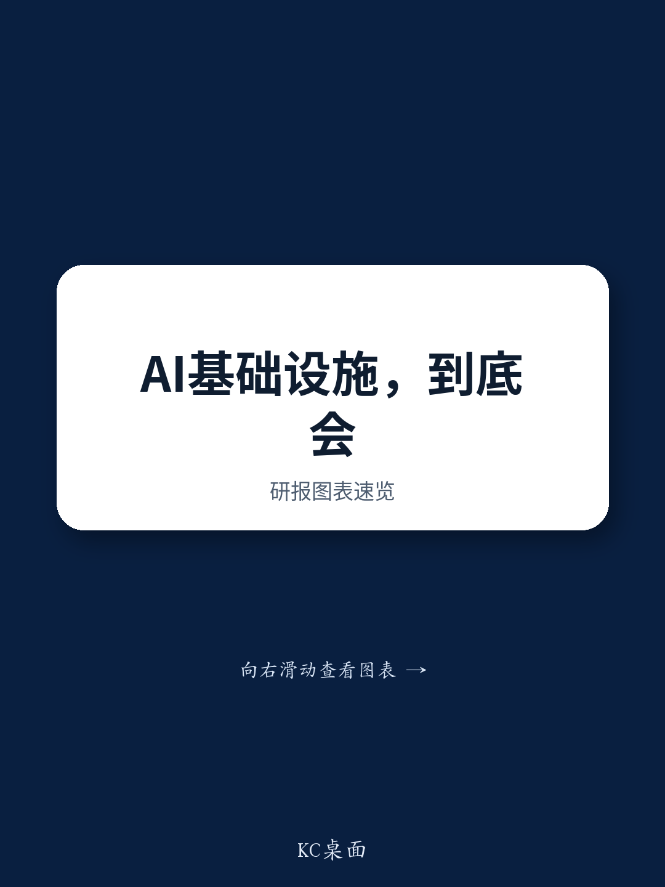

# GS：微软取消数据中心协议非需求见顶，电力才是真正约束

这份来自GS专家网络系列的报告，核心判断与市场主流担忧正好相反。前微软AI转型总监William Fong在2026年7月的读者交流中明确提出，AI基础设施不仅不存在过度建设不确定性，反而面临来自Agentic AI和企业内部未训练数据的双重需求支撑。更值得关注的信号是：企业正在将AI工作负载从云端拉回本地和边缘，原因不是技术保守，而是成本、延迟和数据主权的三重权衡。

报告揭示了一个正在发生的结构性变化——AI的算力需求正在从“集中训练”向“混合推理”迁移，而这场迁移的真正瓶颈不是芯片，是内存供应。

## 1. Agentic AI正在把工作负载从云端拉回本地，企业计算厂商迎来结构性利好

Fong观察到，企业正在部署一种混合计算策略：将单个AI代理放在本地运行，以获得毫秒级延迟和严格的数据隐私保护，同时将复杂的多代理编排层留在云端。这种模式并非过渡方案，而是基于三个硬约束的理性选择——token成本、延迟和数据主权。

对DELL、HPE这类企业计算厂商而言，这意味着一个可量化的增量市场。报告没有给出具体数字，但逻辑链条清晰：当AI代理从云端下沉到本地服务器、PC甚至IoT设备，企业硬件采购的驱动力就从“替换周期”变成了“新工作负载部署”。这不是一个短期的capex脉冲，而是与Agentic AI渗透率挂钩的结构性需求。

> **KC评论：** 市场此前对AI基础设施的讨论几乎都集中在训练侧的GPU集群上。这份报告提醒我们，推理侧的硬件需求可能被低估了——尤其是当推理从云端走向边缘，硬件形态从GPU集群变成通用服务器和终端设备时，受益者会从芯片公司扩散到整个企业硬件生态。

## 2. 微软取消数据中心MOU不是需求见顶，而是电力瓶颈的筛选结果

报告回应了市场一个关键疑虑：微软近期取消了与前比特币挖矿云服务商的数据中心谅解备忘录，是否意味着AI训练需求在软化？Fong的解读非常直接——取消的原因不是需求不足，而是这些站点无法获得有保障的电力供应，无法满足现代AI集群的能源需求。

这个细节值得反复推敲。它说明当前AI基础设施扩张的真正约束已经从“能不能买到GPU”变成了“能不能拿到电”。那些无法锁定长期电力合同的站点，即使有GPU供应，也会被淘汰。这不是需求见顶的信号，而是供给侧的优胜劣汰。

同时，Fong强调，全球绝大部分数据仍未被训练——互联网数据只占企业系统内数据的约三分之一。这意味着训练需求远未饱和，只是形态在变化：从“训练互联网数据”转向“训练企业私有数据”，而这恰恰需要更靠近数据源的计算基础设施。

## 3. 企业正在用硬件效率换预算，旧服务器替换周期成为AI研究的资金来源

报告提供了一个被多数讨论忽略的视角：企业从哪里找钱来买AI硬件？答案不是削减其他IT预算，而是通过基础设施效率提升来释放资金。

具体路径有两条。第一，用最新一代高能效服务器替换老旧CPU。以Arm AGI CPU为例，单机架性能弹性较高，功耗降低50%，一台新服务器可以替代多台旧设备。这种替换带来的电费节省和机房空间释放，直接转化为AI硬件采购预算。第二，AI应用本身正在产生可量化的ROI——编码助手和客服代理是最成熟的两个场景。企业将减少人力的运营节省重新投入AI基础设施，形成“效率提升-成本节省-再研究”的正循环。

这意味着AI基础设施的研究并非零和博弈。它不是从其他IT项目中抢预算，而是通过提升整体IT效率来创造新预算。这个机制如果成立，将显著降低企业AI研究的门槛，并延长硬件升级周期的持续性。

For informational purposes only. Portions may be generated,translated,summarized,or edited with AI assistance based on source materials and may contain omissions or errors. Please verify independently. This is not investment,legal,tax,accounting,or other professional advice.

For informational purposes only. Portions may be generated,translated,summarized,or edited with AI assistance based on source materials and may contain omissions or errors. Please verify independently. This is not investment,legal,tax,accounting,or other professional advice.

