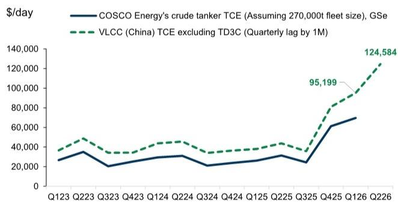
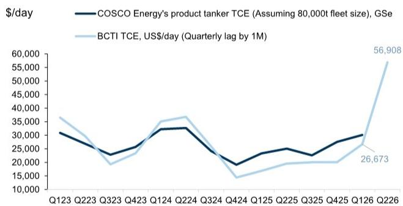
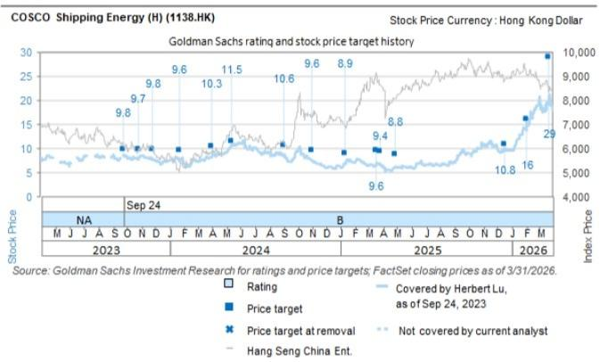
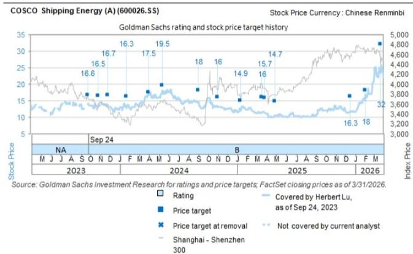

# 研究笔记

## 中远海能 (1138.HK)

### 2Q26业绩基本符合预期，被困波斯湾油轮收入贡献显著降低

<table><tr><td>1138.HK</td><td>12个月目标价：HK$30.00</td><td>现价：HK$13.08</td><td>潜在空间：129.4%</td></tr><tr><td>600026.SS</td><td>12个月目标价：Rmb33.00</td><td>现价：Rmb15.77</td><td>潜在空间：109.3%</td></tr></table>

7月10日收盘后，中远海能发布了1H26初步业绩，1H26报告净利润约Rmb45亿，经常性净利润约Rmb44亿。这意味着2Q26净利润约Rmb23亿（环比+7%），2Q26经常性净利润约Rmb24亿（环比+15%）（见图表1），基本符合我们的预期，略高于读者与我们交流中提到的区间。另一方面，中远海能2Q26净利润的环比增速低于另一家中国上市油轮同行招商轮船（601872.SS，未覆盖）的环比增速（50%）。我们将中远海能的相对表现归因于其船队中有7艘油轮（包括3艘VLCC、3艘LR2和1艘巴拿马型）自霍尔木兹海峡关闭（2026年2月28日起）以来被困在波斯湾内，这些油轮无法向客户收取滞期费以补偿闲置时间（参见2026年3月报告），因此在2Q26期间只能贡献非常低的收入，而招商轮船没有油轮被困在波斯湾。

展望未来，鉴于所有被困在波斯湾的中远海能油轮已在霍尔木兹海峡于6月暂时重新开放后驶出，我们预计中远海能将从3Q26起追赶同行。除业绩外，我们认为市场关注点仍将集中在运费率上，在我们的基准情景中，我们预测2026年全年平均运费率为US$150k/天（而当前股价隐含约90k），这将受到霍尔木兹海峡正式重新开放及随后补库需求的推动。我们维持对H股/A股每股HK$30/Rmb33的目标价不变。

对于原油油轮，基于VLCC TCE（美国墨西哥湾-中国和西非-中国航线），我们估计2Q26行业平均VLCC TCE约为US$125k/天（环比+31%），考虑到收入确认相对于行业报价有1个月的滞后，这与同行的管理层评论基本一致（参见2026年7月报告）。对于成品油轮，我们估计2Q26行业BCTI TCE约为US$57k/天（环比+113%）。我们认为，中远海能位于波斯湾以外的VLCC在2Q26达到了行业水平的TCE，而成品油轮表现不及行业，原因是自2026年3月11日起中国暂停了成品油出口，而中远海能对中国航线的敞口较高。

图表1：中远海能季度业绩

<table><tr><td>百万人民币</td><td>1H26初步</td><td>1Q26报告</td><td>2Q26隐含</td><td>环比百万人民币</td><td>%</td></tr><tr><td>净利润</td><td>4,500</td><td>2,173</td><td>2,327</td><td>153</td><td>7%</td></tr><tr><td>调整后净利润</td><td>4,400</td><td>2,050</td><td>2,350</td><td>301</td><td>15%</td></tr><tr><td>- 一次性项目</td><td>100</td><td>124</td><td>-24</td><td></td><td></td></tr></table>

来源：公司数据，GS全球投资研究

图表2：中远海能被困在波斯湾内的油轮

<table><tr><td>被困在波斯湾内的船舶</td><td>霍尔木兹海峡关闭日期</td><td>离开波斯湾日期</td><td>被困在波斯湾内的天数</td></tr><tr><td>Cospearl Lake 远珍湖</td><td>2026/2/28</td><td>2026/4/11</td><td>42</td></tr><tr><td>Yuan Hua Hu 远花湖</td><td>2026/2/28</td><td>2026/5/13</td><td>74</td></tr><tr><td>Yuan Gui Yang 远贵洋</td><td>2026/2/28</td><td>2026/5/20</td><td>81</td></tr><tr><td>Tong Lin Wan 桐林湾</td><td>2026/2/28</td><td>2026/4/6</td><td>37</td></tr><tr><td>Nan Lin Wan 楠林湾</td><td>2026/2/28</td><td>2026/4/8</td><td>39</td></tr><tr><td>Song Lin Wan 松林湾</td><td>2026/2/28</td><td>2026/4/22</td><td>53</td></tr><tr><td>Hua Lin Wan 桦林湾</td><td>2026/2/28</td><td>2026/5/27</td><td>88</td></tr><tr><td>总计</td><td></td><td></td><td>414</td></tr></table>

来源：GS全球投资研究整理的数据

图表3：中远海能平均原油油轮TCE（GS估计，包括现货和长期合同）与中国平均VLCC TCE（不包括TD3C）

注：中远海能原油油轮TCE是假设其原油油轮船队（包括自有和租赁）全部在现货市场的平均现货费率

图表4：中远海能成品油轮TCE（GS估计）与BCTI TCE

注：中远海能成品油轮TCE是假设其成品油轮船队（包括自有和租赁）全部在现货市场的平均现货费率
已根据收入确认目的调整1个月滞后
来源：公司数据，GS全球投资研究，克拉克森
已根据收入确认目的调整1个月滞后
来源：公司数据，GS全球投资研究，克拉克森

## 研究观点 - 中远海能

中远海能是一家中国能源材料（如石油、天然气）航运公司，拥有全球（上市公司中）最大的油轮船队。中远海能拥有62艘原油油轮（包括45艘VLCC）和31艘成品油轮，属于其自有国际贸易船队，另有54艘油轮属于其国内贸易船队（截至2024年底）。历史上，中远海能的原油油轮业务通常占其利润的50%以上。该公司在全球海运原油油轮市场（按周转量计）占有5%的份额，在成品油轮市场占有1%的份额（截至2023年8月）。我们对中远海能持积极看法，原因如下：1）供给：由于订单量仍处于低位、船队老化以及更严格的环境保护措施要求淘汰航速较慢的船舶，运力增加有限；2）需求：由于对俄罗斯原油/成品油实施制裁后航线改道、全球炼油厂布局调整以及迪拜/WTI价差扩大可能刺激亚洲从美国墨西哥湾的进口，运输距离增加导致需求结构性提升；3）中远海能的敞口：拥有最大的上市油轮船队，对原油和成品油运输具有多元化的敞口，并且更多地暴露于VLCC，后者承运长途原油。我们认为，上行周期可能持续更长时间，并伴随潜在的回报表现提升，从而支撑更高的估值。我们对中远海能（A/H股）给予积极评级。

## 目标价风险与方法论 - 中远海能

我们对中远海能A/H股（600026.SS/1138.HK）给予积极评级，12个月目标价分别为Rmb33.0/HK$30.0。我们使用市净率方法推导目标价，使用估计的可持续回报表现得出A股的理论目标FY26E市净率为3.1倍。然后我们应用H股/A股折价（20%）得出H股目标市净率为2.5倍。

主要下行风险：（1）OPEC减产；（2）运力交付超出预期；（3）宏观环境变化导致石油消费需求走弱。

## 附录

## 分析师认证

我们，Herbert Lu和Wing Huang，特此证明本报告中表达的所有观点准确反映了我们个人对标的公司及其证券的看法。我们还证明，我们的薪酬中没有任何部分直接或间接与本报告中提出的具体建议或观点相关。

除非另有说明，本报告封面所列人员为GS全球投资研究部分析师。

撰稿作者：Herbert Lu GS（亚洲）有限责任公司，Simon Cheung, CFA GS（亚洲）有限责任公司，Wing Huang GS（亚洲）有限责任公司。

除非另有说明，本报告撰稿作者披露中列出的个人是GS全球投资研究部分析师。

## GS因子概况

GS因子概况通过将股票的关键属性与市场（即我们的评级股票池）及其行业同行进行比较，为股票提供研究背景。所描绘的四个关键属性是：增长、财务回报、倍数（例如估值）和综合（增长、财务回报和倍数的组合）。增长、财务回报和倍数是使用每只股票特定指标的标准化排名计算得出的。然后将各指标的标准化排名进行平均，并转换为相关属性的百分位数。每个指标的具体计算可能因财年、行业和地区而异，但标准方法如下：

增长基于股票的前瞻性销售增长、EBITDA增长和每股收益增长（对于金融股，仅每股收益和销售增长），较高的百分位数表示增长较高的公司。财务回报基于股票的前瞻性回报表现、资本回报率和现金回报率（对于金融股，仅回报表现），较高的百分位数表示财务回报较高的公司。倍数基于股票的前瞻性市盈率、市净率、价格/股息、EV/EBITDA、EV/FCF和EV/债务调整后现金流（对于金融股，仅市盈率、市净率和价格/股息），较高的百分位数表示交易倍数较高的股票。综合百分位数计算为增长百分位数、财务回报百分位数和（100% - 倍数百分位数）的平均值。

财务回报和倍数使用GS分析师对未来至少三个季度后的财年末的预测。增长使用未来至少七个季度后的财年与未来至少三个季度后的财年相比的输入数据（所有指标均按每股计算）。

有关我们如何计算GS因子概况的更详细说明，请联系您的GS代表。

## 并购排名

在我们的全球覆盖范围内，我们使用并购框架研究股票，考虑定性因素和定量因素（可能因行业和地区而异），以纳入某些公司可能被收购的潜在可能性。然后我们分配一个并购排名，作为对我们评级覆盖范围内的公司进行评分的方法，从1到3，其中1表示公司成为收购目标的可能性高（30%-50%），2表示可能性中等（15%-30%），3表示可能性低（0%-15%）。对于排名为1或2的公司，根据我们的标准部门指南，我们在目标价中纳入并购组成部分。并购排名3被视为不重要，因此不计入我们的目标价，并且可能在研究中讨论或不讨论。

## Quantum

Quantum是GS的专有数据库，提供详细的财务报表历史、预测和比率的访问。它可用于对单个公司进行深入分析，或比较不同行业和市场的公司。

## 披露

## 其他披露

## 克拉克森研究服务有限公司

克拉克森研究服务有限公司未对评论中包含的任何统计数据或信息的内容进行审查，所有统计数据和信息均由GS & Co.从标准的CRSL公开来源获得。此外，CRSL未对信息进行任何形式的尽职调查，如首次公开募股或债券配售等融资文件所需的那样。因此，依赖评论中包含的统计数据和信息将由依赖信息的一方自行承担风险，CRSL不承担因依赖统计数据或信息而产生的任何责任。就来自CRSL的统计和图形市场信息而言，CRSL指出此类信息来自CRSL数据库和其他来源。CRSL已告知：（i）CRSL数据库中的某些信息来自估计或主观判断；（ii）其他海事数据收集机构数据库中的信息可能与CRSL数据库中的信息不同；（iii）虽然CRSL在编制该统计和图形信息时已采取合理谨慎措施，并相信其准确无误，但数据编制受到有限的审计和验证程序，因此可能包含错误；（iv）CRSL、其代理人、高级职员和员工不承担因依赖此类信息或以任何其他方式遭受的任何损失的责任；（v）提供此类信息并不免除进行适当进一步查询的必要性；（vi）提供此类信息并不表示CRSL认可任何商业政策和/或任何结论；（vii）航运是一个多变且周期性的行业，任何关于它的预测都不可能非常准确。

中远海能（A股）和中远海能（H股）的评级相对于其覆盖范围内的其他公司：中国国航（A股）、中国国航（H股）、中远海控（A股）、中远海控（H股）、中远海能（A股）、中远海能（H股）、中远海运港口、中国东方航空（A股）、中国东方航空（H股）、招商局港口、中国南方航空（A股）、中国南方航空（H股）、东方航空物流、广东松发陶瓷、广州白云国际机场、海南美兰国际机场、和记港口信托、上海国际港务、上海国际机场、春秋航空、扬子江船业

## 公司特定监管披露

以下披露涉及GS集团（及其关联公司，“GS”）与GS全球投资研究覆盖的公司之间的关系，并在本研究中提及。

截至本报告前一个月末，GS实益拥有普通股1%或以上（不包括根据美国证券法无需汇总的关联公司和业务部门持有的头寸）：中远海能（A股）（Rmb15.77）和中远海能（H股）（HK$13.08）

GS做市该证券或其衍生品：中远海能（A股）（Rmb15.77）和中远海能（H股）（HK$13.08）

评级/投资银行关系分布 GS投资研究全球股票覆盖范围

<table><tr><td rowspan="2"></td><td colspan="3">评级分布</td><td colspan="3">投资银行关系</td></tr><tr><td>买入</td><td>持有</td><td>卖出</td><td>买入</td><td>持有</td><td>卖出</td></tr><tr><td>全球</td><td>50%</td><td>34%</td><td>16%</td><td>65%</td><td>60%</td><td>45%</td></tr></table>

截至2026年4月1日，GS全球投资研究对3,074只股票进行了评级。GS将股票指定为买入和卖出，列入各种区域投资清单；未如此指定的股票被视为中性。此类指定等同于FINRA规则要求的上述披露目的的买入、持有和卖出。请参阅下面的“评级、覆盖范围和相关定义”。投资银行关系图表反映了每个评级类别中GS在过去十二个月内提供投资银行服务的标的公司的百分比。

## 目标价和评级历史图表

  
所示目标价应结合所有先前发布的GS报告（可能包含或不包含目标价）以及公司、其行业和金融市场的发展情况来考虑。

  
所示目标价应结合所有先前发布的GS报告（可能包含或不包含目标价）以及公司、其行业和金融市场的发展情况来考虑。

## 目标价历史表格

## 中远海能（A股）（600026.SS）

## 中远海能（H股）（1138.HK）

<table><tr><td>报告日期</td><td>目标价（Rmb）</td><td>收盘价（Rmb）</td><td>报告日期</td><td>目标价（HK$）</td><td>收盘价（HK$）</td></tr><tr><td>2026-4-27</td><td>33.00</td><td>21.50</td><td>2026-4-27</td><td>30.00</td><td>17.73</td></tr><tr><td>2026-3-22</td><td>32.00</td><td>23.46</td><td>2026-3-22</td><td>29.00</td><td>19.21</td></tr><tr><td>2026-2-3</td><td>18.00</td><td>15.87</td><td>2026-2-3</td><td>16.00</td><td>14.20</td></tr><tr><td>2025-12-18</td><td>16.30</td><td>11.85</td><td>2025-12-18</td><td>10.80</td><td>9.92</td></tr><tr><td>2025-4-30</td><td>14.70</td><td>10.29</td><td>2025-4-30</td><td>8.80</td><td>6.16</td></tr><tr><td>2025-3-27</td><td>15.70</td><td>11.41</td><td>2025-3-27</td><td>9.40</td><td>6.84</td></tr><tr><td>2025-3-19</td><td>16.00</td><td>11.39</td><td>2025-3-19</td><td>9.60</td><td>6.60</td></tr><tr><td>2025-1-10</td><td>14.90</td><td>12.12</td><td>2025-1-10</td><td>8.90</td><td>6.74</td></tr><tr><td>2024-11-1</td><td>16.00</td><td>13.22</td><td>2024-11-1</td><td>9.60</td><td>7.43</td></tr><tr><td>2024-9-2</td><td>18.00</td><td>14.42</td><td>2024-9-2</td><td>10.60</td><td>8.68</td></tr><tr><td>2024-5-14</td><td>19.50</td><td>17.96</td><td>2024-5-14</td><td>11.50</td><td>10.80</td></tr><tr><td>2024-4-1</td><td>17.50</td><td>16.73</td><td>2024-4-1</td><td>10.30</td><td>8.11</td></tr><tr><td>2024-1-24</td><td>16.30</td><td>13.22</td><td>2024-1-24</td><td>9.60</td><td>7.65</td></tr><tr><td>2023-11-27</td><td>16.70</td><td>13.63</td><td>2023-11-27</td><td>9.80</td><td>7.84</td></tr><tr><td>2023-10-27</td><td>16.50</td><td>13.53</td><td>2023-10-27</td><td>9.70</td><td>8.12</td></tr><tr><td>2023-9-24</td><td>16.60</td><td>14.02</td><td>2023-9-24</td><td>9.80</td><td>8.57</td></tr></table>

表格中显示的目标价未针对公司行动进行调整。

## 监管披露

## 美国法律法规要求的披露

请参阅上述公司特定监管披露，了解本报告中提及的公司所需的任何以下披露：待定交易中的经理或联合经理；1%或其他所有权；某些服务的报酬；客户关系类型；先前期间的已管理/联合管理公开发行；董事职位；对于股票，做市和/或专家角色。GS作为自营交易或可能作为自营交易本报告中讨论的发行人的债务证券（或相关衍生品）。

以下是额外要求的披露：所有权和重大利益冲突：GS政策禁止其分析师、向分析师报告的专业人士及其家庭成员持有分析师覆盖范围内任何公司的证券。分析师薪酬：分析师的薪酬部分基于GS的盈利能力，其中包括投资银行收入。分析师作为高级职员或董事：GS政策通常禁止其分析师、向分析师报告的人士或其家庭成员在分析师覆盖范围内的任何公司担任高级职员、董事或顾问。非美国分析师：非美国分析师可能不是GS & Co. LLC的关联人士，因此可能不受FINRA规则2241或FINRA规则2242关于与标的公司沟通、公开露面以及交易分析师所覆盖证券的限制。

美国以外司法管辖区法律和法规要求的额外披露
以下披露是所指示司法管辖区要求的，除非已根据美国法律法规在上文作出。澳大利亚：GS Australia Pty Ltd及其关联公司不是澳大利亚的授权存款机构（如《1959年银行法》（联邦）所定义），不提供银行服务，也不在澳大利亚开展银行业务。除非GS另有约定，本研究及其任何访问权限仅面向《澳大利亚公司法》含义内的“批发客户”。在编制研究报告时，GS Australia全球投资研究部门的成员可能会参加由作为其研究报告标的的公司和其他实体主办或组织的实地考察和其他会议。在某些情况下，如果GS Australia认为在实地考察或会议的具体情况下是适当和合理的，此类实地考察或会议的费用可能部分或全部由相关发行人承担。如果本文档内容包含任何金融产品建议，则仅为一般性建议，由GS在未考虑客户的目标、财务状况或需求的情况下编制。客户在根据任何此类建议采取行动之前，应考虑该建议是否适合其自身的目标、财务状况和需求。某些GS Australia和New Zealand的利益披露以及GS的澳大利亚卖方研究独立性政策声明的副本可在以下网址获取：https://www.goldmansachs.com/disclosures/australia-new-zealand/index.html。巴西：有关CVM第20号决议的披露信息可在https://www.gs.com/worldwide/brazil/area/gir/index.html获取。在适用的情况下，根据CVM第20号决议第20条的定义，本研究报告内容的巴西注册主要分析师是本报告开头指定的第一作者，除非文本末尾另有说明。加拿大：此信息仅供您参考，在任何情况下均不应被解释为GS & Co. LLC为在加拿大购买加拿大证券而进行的广告、要约或招揽。GS & Co. LLC未在加拿大任何司法管辖区根据适用的加拿大证券法注册为交易商，通常不允许交易加拿大证券，并且可能被禁止在加拿大的某些司法管辖区销售某些证券和产品。如果您希望在加拿大交易任何加拿大证券或其他产品，请联系GS Canada Inc.（GS集团公司的关联公司）或其他注册的加拿大交易商。香港：有关本研究中提及的覆盖公司证券的进一步信息，可向GS（亚洲）有限责任公司索取。印度：有关本研究中提及的标的公司或公司的进一步信息，可从GS（印度）证券私人有限公司获取，研究分析师 - SEBI注册号INH000001493，地址：10th Floor, Ascent-Worli, Sudam Kalu Ahire Marg, Worli, Mumbai-400 025, India，企业身份号U74140MH2006FTC160634，电话+91 22 6616 9000，传真+91 22 6616 9001。GS可能实益拥有本研究报告提及的标的公司或公司1%或以上的证券（如印度《1956年证券合同（监管）法》第2(h)条所定义）。SEBI的注册和NISM的认证绝不保证中介机构的业绩或向读者提供任何回报保证。GS（印度）证券私人有限公司合规官和读者投诉联系详情、年度合规审计报告副本以及其他相关信息和披露可在此链接找到：https://www.goldmansachs.com/worldwide/india/research-analyst。日本：见下文。韩国：除非GS另有约定，本研究及其任何访问权限仅面向《金融服务和资本市场法》含义内的“专业读者”。有关本研究中提及的标的公司或公司的进一步信息，可从GS（亚洲）有限责任公司首尔分行获取。新西兰：GS新西兰有限公司及其关联公司不是新西兰的“注册银行”或“存款接受者”（如《1989年新西兰储备银行法》所定义）。除非GS另有约定，本研究及其任何访问权限仅面向《2008年金融顾问法》含义内的“批发客户”。某些GS Australia和New Zealand的利益披露副本可在以下网址获取：https://www.goldmansachs.com/disclosures/australia-new-zealand/index.html。俄罗斯：在俄罗斯联邦分发的研究报告不属于俄罗斯立法定义的广告，而是信息和分析，其主要目的不是推广产品，并且不提供俄罗斯立法关于评估活动含义内的评估。研究报告不构成俄罗斯法律法规定义的个人化研究交流，不针对特定客户，并且是在未分析客户的财务状况、投资概况或风险状况的情况下编制的。GS不对客户或任何其他人基于本研究报告可能做出的任何投资决定承担任何责任。新加坡：GS（新加坡）私人有限公司（公司编号：198602165W），受新加坡金融管理局监管，接受对本研究的法律责任，如有任何由此产生或与此相关的事宜，应与其联系。台湾：此材料仅供参考，未经许可不得转载。读者应仔细考虑自身的投资风险。投资结果由个人读者自行负责。英国：在英国可能被归类为零售客户（如金融行为监管局规则所定义）的人士，应结合先前关于本研究中提及的覆盖公司的GS报告阅读本研究，并应参考GS International已发送给他们的风险警告。这些风险警告的副本以及本报告中使用的某些金融术语的词汇表，可向GS International索取。

欧盟和英国：有关欧洲委员会授权法规（EU）（2016/958）第6(2)条的披露信息（包括该授权法规在英国脱离欧盟和欧洲经济区后转化为英国国内法律和法规的情况），关于研究交流或其他建议或暗示投资策略的信息的客观呈现技术安排以及特定利益或利益冲突迹象的披露的技术监管标准，可在https://www.gs.com/disclosures/europeanpolicy.html获取，其中说明了与投资研究相关的利益冲突管理欧洲政策。

日本：GS Japan Co., Ltd.是一家金融工具交易商，在关东财务局注册，注册号Kinsho 69，并且是日本证券交易商协会、日本金融期货协会、第二类金融工具交易商协会和日本投资管理协会的成员。股票买卖需支付预先与客户确定的佣金加上消费税。请参阅公司特定披露，了解日本证券交易所、日本证券交易商协会或日本证券金融公司要求的任何适用披露。

## 评级、覆盖范围和相关定义

买入（B）、中性（N）、卖出（S）分析师推荐股票作为买入或卖出，列入各种区域投资清单。被指定为买入或卖出投资清单取决于股票相对于其覆盖范围的潜在总回报。任何未被指定为买入或卖出投资清单且具有有效评级（即，不是评级暂停、未评级、早期生物技术、覆盖暂停或未覆盖）的股票被视为中性。每个区域管理区域信念清单，这些清单选自各自区域投资清单中的报告评级股票，代表侧重于潜在总回报大小和/或在其各自覆盖区域内实现回报的可能性的研究交流。此类股票在信念清单中的添加或移除由各自区域的审查委员会或其他指定委员会管理，并不代表分析师对此类股票的投资评级发生变化。

潜在总回报代表当前股价与目标价之间的上行或下行差异，包括目标价相关时间范围内预期支付的所有已付或预期股息。所有覆盖的股票都需要目标价。潜在总回报、目标价和相关时间范围在每份添加或重申投资清单成员资格的报告中有说明。

覆盖范围：每个覆盖范围内的所有股票列表可通过主要分析师、股票和覆盖范围在https://www.gs.com/research/hedge.html获取。

未评级（NR）。当GS在此公司的合并或战略交易中担任顾问角色时，当由于GS参与交易而存在法律、监管或政策限制时，以及在某些其他情况下，根据GS政策，投资评级、目标价和盈利预测（如相关）将被移除。早期生物技术（ES）。当此公司既没有通过II期临床试验的药物、治疗或医疗设备，也没有分销后II期药物、治疗或医疗设备的许可证时，根据GS政策，不分配投资评级和目标价。评级暂停（RS）。GS已暂停此股票的投资评级和目标价，因为没有足够的基本面基础来确定投资评级或目标价。先前的投资评级和目标价（如有）对此股票不再有效，不应依赖。覆盖暂停（CS）。GS已暂停对此公司的覆盖。未覆盖（NC）。GS不覆盖此公司。

## 全球产品；分发实体

GS International（“GSI”），由审慎监管局（“PRA”）授权并由金融行为监管局（“FCA”）和PRA监管，已批准本研究在英国的分发。

欧洲经济区：GS Bank Europe SE（“GSBE”）是一家在德国注册的信贷机构，在单一监管机制内，受欧洲中央银行直接审慎监管，并在其他方面受德国联邦金融监管局（Bundesanstalt für Finanzdienstleistungsaufsicht, BaFin）和德意志联邦银行监管，并在欧洲经济区内传播研究。

## 一般披露

本研究仅供我们的客户使用。除与GS相关的披露外，本研究基于我们认为可靠的当前公开信息，但我们不声明其准确或完整，也不应依赖于此。本文包含的信息、意见、估计和预测截至本文日期，如有更改，恕不另行通知。我们寻求适时更新我们的研究，但各种法规可能阻止我们这样做。除某些定期发布的行业报告外，大多数报告根据分析师的判断不定期发布。

GS开展全球全方位服务的综合投资银行、投资管理和经纪业务。我们与全球投资研究所覆盖的相当大比例的公司存在投资银行和其他业务关系。GS & Co. LLC，美国经纪交易商，是SIPC的成员（https://www.sipc.org）。

我们的销售人员、交易员和其他专业人士可能提供与本研究中表达的意见相反的口头或书面市场评论或交易策略给我们的客户和自营交易部门。我们的资产管理领域、自营交易部门和投资业务可能做出与本研究中提出的建议或观点不一致的投资决策。

本报告中指定的分析师可能不时与我们的客户（包括GS销售人员和交易员）讨论，或在本研究中讨论，交易策略，这些策略涉及可能对本研究中讨论的股票市场价格产生近期影响的催化剂或事件，这种影响可能在方向上与分析师对此类股票的已发布目标价预期相反。任何此类交易策略都不同于且不影响分析师对此类股票的基本面评级，该评级反映了股票相对于其覆盖范围的潜在回报，如本文所述。

我们及我们的关联公司、高级职员、董事和员工将不时持有本研究中提及的任何证券或衍生品的多头或空头头寸，作为自营交易，并买入或卖出，除非GS政策或法规禁止。

在GS安排的会议上第三方演讲者所持的观点，包括来自GS其他部门的个人，不一定反映全球投资研究的观点，也不是GS的官方观点。

本文引用的任何第三方，包括任何销售人员、交易员和其他专业人士或其家庭成员，可能持有与本文指定分析师表达的观点不一致的所述产品的头寸。

本研究不构成在任何司法管辖区出售或招揽购买任何证券的要约，如果此类要约或招揽在该司法管辖区是非法的。它不构成个人推荐，也未考虑个别客户的具体投资目标、财务状况或需求。客户应考虑本研究中的任何建议或推荐是否适合其特定情况，并在适当的情况下寻求专业建议，包括税务建议。本研究中提及的投资的价值和价格以及从中获得的收入可能会波动。过去的表现不是未来表现的指南，未来回报不保证，并且可能发生原始资本的损失。汇率波动可能对某些投资的价值或价格或从中获得的收入产生不利影响。

某些交易，包括涉及期货、期权和其他衍生品的交易，会带来重大风险，不适合所有读者。读者应查看当前的期权和期货披露文件，可从GS销售代表或https://www.theocc.com/about/publications/character-risks.jsp和https://www.goldmansachs.com/disclosures/cftc_fcm_disclosures获取。在期权策略中，交易成本可能很高，例如价差策略需要多次买入和卖出期权。将根据要求提供支持文件。

全球投资研究提供的不同服务水平：GS全球投资研究向您提供的服务水平和类型可能与向GS内部和其他外部客户提供的服务不同，取决于各种因素，包括您个人对接收通信频率和方式的偏好、您的风险状况和研究重点及视角（例如，市场范围、行业特定、长期、短期）、您与GS的整体客户关系的规模和范围，以及法律和监管限制。例如，某些客户可能要求在特定证券的研究发布时收到通知，某些客户可能要求将分析师基本面分析所依据的特定数据通过数据馈送或其他方式以电子方式交付给他们。分析师对股票的基本面研究观点（例如，评级、目标价或对盈利预测的重大变化）的任何变更，都不会在通过电子方式发布到我们内部客户网站或通过其他方式向所有有权接收此类报告的客户广泛传播之前，传达给任何客户。

所有研究报告同时通过电子方式发布到我们的内部客户网站，向所有客户提供。并非所有研究内容都重新分发给我们的客户或提供给第三方聚合商，GS也不对第三方聚合商重新分发我们的研究负责。对于与一只或多只证券、市场或资产类别相关的研究、模型或其他数据（包括相关服务），请联系您的GS代表或访问https://research.gs.com。

披露信息也可在https://www.gs.com/research/hedge.html或联系研究合规部，地址：200 West Street, New York, NY 10282获取。

## © 2026 GS.

您仅可为自己使用而存储、显示、分析、修改、重新格式化并打印通过此服务提供给您的信息。未经GS明确书面同意，您不得转售或逆向工程此信息以计算或开发任何指数用于披露和/或营销，或创建任何其他衍生作品或商业产品、数据或产品。未经GS明确书面同意，您不得以任何格式向任何第三方发布、传输或以其他方式复制此信息的全部或部分。前述限制包括但不限于使用、提取、下载或检索此信息的全部或部分，以训练或微调机器学习或人工智能系统，或向任何此类系统提供或复制此信息的全部或部分作为提示或输入。
