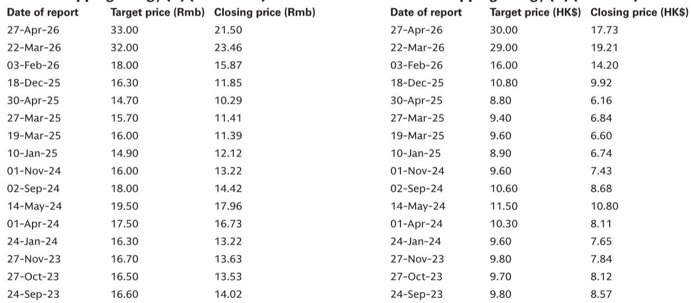
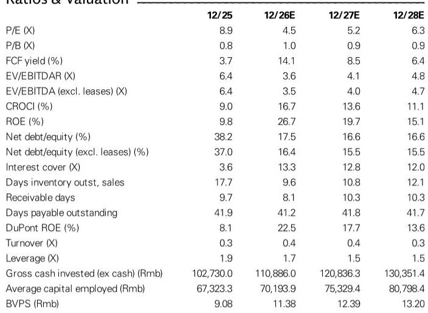
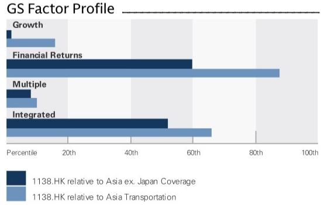

# 中远海能二季度表现属一次性事件，非结构性问题——修复行情正在启动

中远海能公布2026年第二季度净利润约23亿元人民币，环比仅增长7%。这一数字基本符合分析师预期，但与同期利润环比增长50%的关键同行招商轮船相比明显落后。这种差异并非中远海能业务模式弱化的信号，而是特殊、临时性运营限制的直接结果：2026年2月28日霍尔木兹海峡关闭后，中远海能有7艘油轮被困在波斯湾内。这些船舶无法收取滞期费来补偿闲置时间，因此在第二季度贡献的收入极少。对观察者而言，关键点在于，随着海峡在6月暂时重新开放，所有7艘被困油轮现已驶出。该公司有望从2026年第三季度开始追赶同行，而市场尚未完全计入这一恢复的幅度。

当前公司报价隐含的2026年平均运费约为每日9万美元。某全球研究机构报告的基本情景预测为每日15万美元。这一差距——隐含费率与预测费率之间67%的差异——是定义该观察机会的核心张力。市场实际上正在贴现一种情景，即霍尔木兹海峡重新开放及随后的补库需求未能实现。如果这些事件如预期发生，2026年下半年的盈利轨迹将大幅超过当前估值所反映的水平。第二季度数据虽然增长温和，但实际上证实了该公司在海湾以外的核心船队以行业标准的定期租船等价费率运营。疲弱仅限于一个特定的、可解决的问题。

这一点现在很重要，因为第三季度将是首次在没有海湾相关拖累的情况下，对中远海能的盈利能力进行清晰解读。第二季度业绩已显示，该公司在海湾以外运营的超大型油轮达到了行业标准的TCE费率。成品油轮板块表现不佳，但原因不同——中国自2026年3月11日起暂停成品油出口，而中远海能对中国航线的较高敞口造成了暂时的逆风。该政策暂停是一个可能逆转的独立变量，但即使持续，历史上占中远海能利润超过50%的原油油轮业务也应推动复苏。

该报告明确指出，市场的焦点将从已报告盈利转向运费轨迹。第二季度数据是向后看的，且受到一次性干扰的影响。前瞻性案例基于三个结构性支柱：低订单簿带来的有限运力增加、面临更严格环保法规的老化全球船队（这会降低航速并加速拆解），以及因制裁引发的航线改道和炼厂错位导致的更长运输距离所带来的结构性需求提升。中远海能作为全球最大的上市油轮运营商，在其自有国际贸易船队中拥有45艘超大型油轮，是参与这一主题最直接的途径。

## 七艘油轮干扰扭曲了二季度比较，掩盖了潜在实力

第二季度报告中相对少见最重要的事实是，中远海能相对于招商轮船的表现不佳，完全归因于七艘被困船舶——三艘超大型油轮、三艘LR2型油轮和一艘巴拿马型油轮——它们在波斯湾内被困了37至88天不等。这些船舶无法赚取滞期费来补偿闲置时间，因此它们贡献的收入远低于正常运营条件下的水平。招商轮船在海湾没有被困油轮，因此其盈利反映了该期间高运费的充分收益。

被困油轮总共损失了414个船日的有效运力。作为参照，2026年第二季度行业超大型油轮平均TCE约为每日12.5万美元，环比增长31%。如果这七艘船以该费率运营，它们本季度将产生约5200万美元的额外收入——相对于报告的23亿元人民币净利润而言，这是一个显著的波动。中远海能与同行之间的差距并非反映船队质量、租船策略或运营能力。这是地理和时机造成的机械性结果。

霍尔木兹海峡于6月暂时重新开放，所有七艘船现已离开海湾。被困时间最长的船舶“华林湾”号被困88天，于5月27日离开。最后一艘离开的是“远贵洋”号，在81天后于5月20日离开。从2026年第三季度起，中远海能船队中的每艘船都将在开放水域运营。因此，该公司的盈利应趋近于行业平均水平，环比增速应显著加快。

## 运费是真正的盈利驱动因素，当前报价隐含深度悲观情景

市场目前对中远海能股票的定价水平，隐含2026年全年平均运费约为每日9万美元。某全球研究机构报告的基本情景预测为每日15万美元。这不是边际差异——这是67%的差距，直接转化为盈利能力。基本情景假设霍尔木兹海峡正式重新开放以及随后的补库需求，鉴于已经发生的暂时重新开放，这两种情况都是合理的结果。

当前报价中隐含的运费表明，市场正在赋予重新开放失败或补库需求疲弱的情景以高概率。但第二季度的证据表明并非如此。行业超大型油轮TCE费率在2026年第二季度平均为每日12.5万美元，环比增长31%，这甚至是在任何补库需求出现之前。成品油轮费率，以BCTI TCE衡量，平均约为每日5.7万美元，环比飙升113%。潜在需求环境强劲，供应侧仍然受限。

中远海能自身的预测数据强化了这一点。该公司2026年每股收益预估为2.52元人民币，从2025年的0.79元人民币上升——增长219%。基于当前报价，2026年隐含市盈率仅为4.5倍。该估值正在计入2027年和2028年盈利的显著下降，每股收益预估分别为2.19元和1.80元人民币。但即使是这些前瞻性预估也代表了回归正常化盈利能力，而非崩溃。当前报价相对于A股提供了129%的空间。

考虑到地缘政治事件的不确定性，市场的怀疑是可以理解的，但风险回报权衡是不对称的。基本情景提供了显著的上行空间。下行情景中，运费保持在隐含的每日9万美元水平，该公司仍能产生强劲的自由现金流，2026年预估自由现金流回报表现为14.1%，股息回报表现为11.3%。该股票并非为完美定价。它是为尚未实现的悲观结果定价的。

## 油轮持续上行周期的结构性案例在供应、需求和中远海能定位方面依然完好

油轮股票的周期性论点众所周知，但结构性论点常被忽视。在供应侧，全球原油油轮订单簿相对于现有船队仍然较低。老化船舶面临更严格的环保法规，要求降低航速或加速拆解。国际海事组织的碳强度法规正促使老旧、效率较低的船舶比新造船更快速地退出市场。这种供应限制并非一年现象——它将持续数年。

在需求侧，对俄罗斯出口实施制裁后，原油和成品油流量的改道已永久性地增加了运输距离。曾经短途运往欧洲炼厂的俄罗斯原油，现在需要更长的航线运往亚洲。与此同时，全球炼油产能的错位——中东和亚洲新炼厂投产，而欧洲和美国老旧炼厂关闭——正在创造更长途的贸易模式。迪拜原油与WTI原油基准价差的扩大，进一步激励亚洲从美国墨西哥湾进口，这是全球最长的原油运输航线之一。

中远海能处于捕捉这些趋势的独特位置。该公司运营着全球最大的上市油轮船队，其自有国际贸易船队拥有62艘原油油轮和31艘成品油轮，另有54艘油轮在其国内船队中。其超大型油轮船队尤其暴露于长途原油航线，这是上行周期中最盈利的板块。历史上，原油航运占公司利润的50%以上。按周转量计算，该公司还拥有全球海运原油油轮市场5%的份额，赋予其规模和定价权。

该报告的研究主题基于三个支柱：有限的运力增加、更长运输距离带来的结构性需求提升，以及中远海能作为最大上市运营商的直接敞口。这些支柱均未削弱。第二季度的干扰是一个已经解决的暂时性冲击。基础主题依然完好，公司在正常化环境中的盈利能力远高于当前报价所隐含的水平。

## 观察者的决策框架：区分暂时性噪音与结构性信号

第二季度业绩呈现了对分析纪律的经典考验。诱惑在于将7%的环比增长率外推，并得出公司盈利势头正在放缓的结论。这将是一个错误。正确的方法是将盈利分解为两个部分：来自海湾被困船舶的贡献和来自船队其他部分的贡献。被困船舶几乎没有任何贡献。船队其他部分的表现达到了行业标准水平。

因此，观察者的决策框架应聚焦于三个问题。首先，被困船舶是否已获释？答案是肯定的——所有七艘船在海峡于6月暂时重新开放后均已驶出。其次，公司盈利是否会在2026年第三季度与同行趋同？答案几乎是肯定的，因为相对少见在2026年第二季度拖累中远海能的因素是海湾干扰，而该因素已不再适用。第三，霍尔木兹海峡保持开放且补库需求实现的概率是多少？这是关键变量，且本质上具有不确定性，但报告的基本情景假设正式重新开放，而已经发生的暂时重新开放提供了支持性证据。

关注结构性供需动态的观察者将认识到，第二季度的噪音与长期主题无关。该公司2026年净资产回报表现预计将达到26.7%，高于2025年的9.8%。净负债权益比预计将从38.2%降至17.5%。自由现金流回报表现预计将达到14.1%。这些并非一家衰退公司的数字。它们是一家处于市场尚未完全定价的强劲上行周期早期阶段的公司的数字。

该主题的风险在于欧佩克减产、运力交付超出预期，或宏观环境走弱削弱石油消费需求。这些是真实的风险，并在报告中披露。但它们并非新风险。它们在整个上行周期中一直存在，市场已将其贴现至当前报价中。第二季度业绩并未改变风险状况。它们只是确认了公司的运营限制是暂时的，修复行情即将开始。

*仅供参考。部分内容可能基于源材料通过人工智能辅助生成、翻译、总结或编辑，可能存在遗漏或错误。请独立核实。本文不构成专业建议。*

仅供参考。部分内容可能基于源材料通过人工智能辅助生成、翻译、总结或编辑，可能存在遗漏或错误。请独立核实。本文不构成专业建议。

