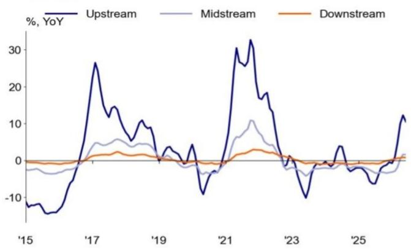
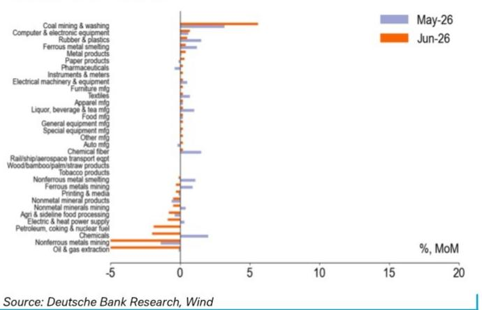
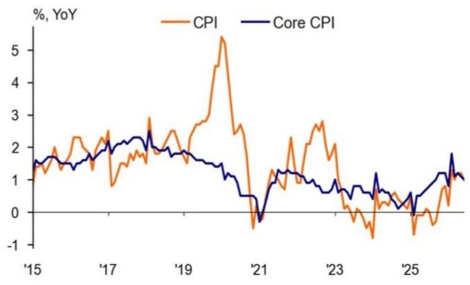
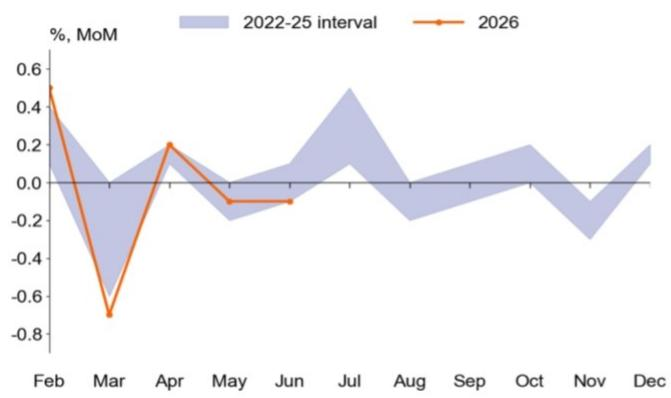
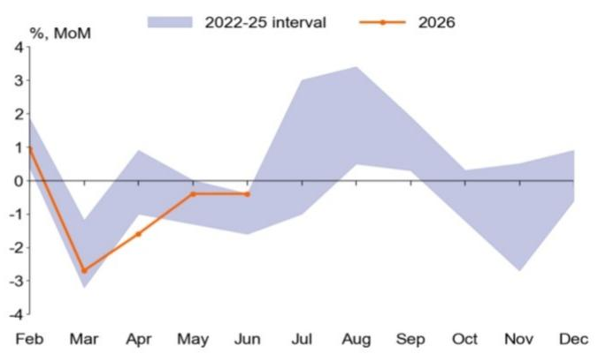
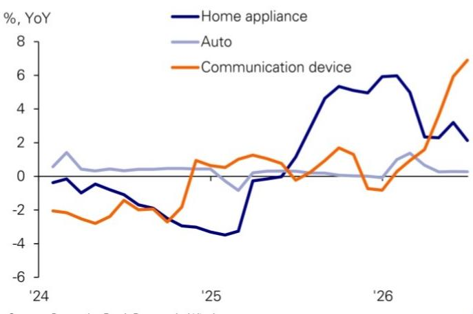
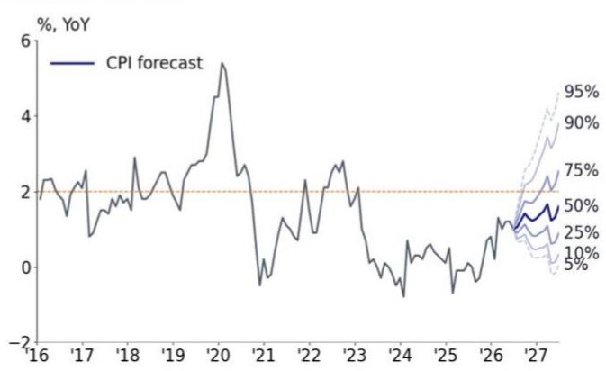

## Economics China Macro

## Inflation monitor: Reflation taking a pause

China's reflation is taking a pause. Both CPI and PPI recorded declines on a month-on-month basis, with most components decelerating from May. The decline is broader than lower oil prices; it reflects that softening domestic demand is starting to negatively impact China's reflation momentum.

Headline CPI fell to 1.0% YoY and -0.3% MoM due to sharp declines in energy and subdued food inflation, while core inflation also decreased, though services and AI-related product prices remained relatively resilient.

\- Energy prices fell sharply by 4.5% MoM, reducing the contribution to CPI by 0.2ppt. Food inflation also remained subdued at -1.6% YoY.

\- Core inflation edged down 0.1ppt to 1.0% YoY, the lowest reading since September last year (after Lunar New Year adjustment). On a sequential basis, it fell 0.1% MoM, marking a second consecutive monthly decline.

\- Consumer goods prices showed weakness, dropping by 0.5ppt to 1.1% YoY. Prices of home appliances and autos saw moderation, likely resulting from diminished impact from trade-in subsidies.

\- Prices of services and AI-related products remained relatively resilient. Services inflation held steady at 0.8% YoY, with inflation in education, tourism and recreation edging up by 0.1ppt on YoY horizon. Meanwhile, communication device prices accelerated by a further 1.0ppt to 7.6% YoY.

PPI rose to 4.1% YoY due to base effect; however, it declined by 0.3% MoM as the oil-price shock on upstream and midstream faded, while only limited pass-through to downstream industries emerged amid weak domestic demand.

\- Oil-price shock in upstream and midstream sectors is fading. PPI inflation in fossil-fuel-related industries turned sharply negative on a MoM basis, weighing on prices for chemicals, plastics and rubber products.

\- There are signs that previous price hikes are being passed through to some downstream sectors, such as equipment, furniture, automobiles and communication devices. However, the pass-through remains modest, constrained by soft domestic demand.

We reiterate our full-year CPI inflation forecast at 1.3% and PPI inflation forecast to 3.0%, both of which have been revised down in our H2 outlook. The latest June data confirms that softening domestic demand has increasingly transmitted into price dynamics, preventing price transmission from upstream to downstream products. Looking forward, we expect more supportive domestic policy in the second half, fiscal spending in particular, will help revert the recent slip in consumer prices. Absent such policy support, we see risk of CPI inflation weakening further.

Figure 1: Momentum slowed across upstream and midstream  
  
Source: DB, Wind

Figure 2: Limited pass-through to downstream industries emerged  

Figure 3: Energy prices' contribution to CPI dropped by 0.2ppt  
  
Jan-24 Apr-24 Jul-24 Oct-24 Jan-25 Apr-25 Jul-25 Oct-25 Jan-26 Apr-26

Figure 4: Headline CPI and core CPI slowed in June  

Figure 5: Core inflation underperformed seasonality  
  
Source: DB, Wind

Figure 6: Food inflation remained in negative territory  
  
Source: DB, Wind

Figure 7: Consumer goods prices showed weakness  
  
Source: DB, Wind

Figure 8: We have revised down our full-year CPI forecast to 1.3%  
  
Source: DB, Wind

Figure 9: June inflation momentum

<table><tr><td>%, YoY</td><td>Weight</td><td>21 avg</td><td>22 avg</td><td>23 avg</td><td>24 avg</td><td>25 avg</td><td>Jan-26</td><td>Feb-26</td><td>Mar-26</td><td>Apr-26</td><td>May-26</td><td>Jun-26</td></tr><tr><td>Headline CPI</td><td></td><td>0.9</td><td>2.0</td><td>0.2</td><td>0.2</td><td>0.0</td><td>0.2</td><td>1.3</td><td>1.0</td><td>1.2</td><td>1.2</td><td>1.0</td></tr><tr><td>Core CPI</td><td></td><td>0.8</td><td>0.9</td><td>0.7</td><td>0.5</td><td>0.8</td><td>0.8</td><td>1.8</td><td>1.1</td><td>1.2</td><td>1.1</td><td>1.0</td></tr><tr><td>Food, Tobacco, Alcohol &amp; Dining Out</td><td>30%</td><td>-0.3</td><td>2.5</td><td>0.3</td><td>-0.1</td><td>-0.6</td><td>-0.2</td><td>1.4</td><td>0.4</td><td>-0.8</td><td>-0.9</td><td>-0.8</td></tr><tr><td>Clothing</td><td>5%</td><td>0.3</td><td>0.5</td><td>1.0</td><td>1.4</td><td>1.5</td><td>1.9</td><td>1.9</td><td>1.6</td><td>1.5</td><td>1.4</td><td>1.4</td></tr><tr><td>Housing</td><td>22%</td><td>0.8</td><td>0.7</td><td>0.0</td><td>0.1</td><td>0.1</td><td>-0.1</td><td>-0.2</td><td>-0.2</td><td>-0.2</td><td>-0.2</td><td>-0.3</td></tr><tr><td>Household Articles &amp; Services</td><td>6%</td><td>0.4</td><td>1.2</td><td>0.1</td><td>0.5</td><td>0.9</td><td>2.6</td><td>2.8</td><td>1.5</td><td>1.4</td><td>1.8</td><td>1.3</td></tr><tr><td>Transportation &amp; Communication</td><td>14%</td><td>4.2</td><td>5.2</td><td>-2.3</td><td>-1.9</td><td>-2.6</td><td>-3.4</td><td>-0.7</td><td>0.9</td><td>4.6</td><td>5.4</td><td>4.1</td></tr><tr><td>Recreation Education &amp; Cultural Services</td><td>11%</td><td>1.9</td><td>1.8</td><td>2.0</td><td>1.5</td><td>0.8</td><td>0.0</td><td>2.0</td><td>1.1</td><td>1.3</td><td>1.3</td><td>1.4</td></tr><tr><td>Medicine &amp; Healthcare</td><td>9%</td><td>0.4</td><td>0.6</td><td>1.1</td><td>1.3</td><td>0.8</td><td>1.7</td><td>1.9</td><td>1.9</td><td>2.2</td><td>2.1</td><td>2.3</td></tr><tr><td>Others</td><td>3%</td><td>-1.3</td><td>1.6</td><td>3.2</td><td>3.8</td><td>9.2</td><td>13.2</td><td>15.4</td><td>13.5</td><td>11.0</td><td>9.9</td><td>6.6</td></tr><tr><td>Headline PPI</td><td></td><td>8.1</td><td>4.2</td><td>-3.0</td><td>-2.1</td><td>-2.6</td><td>-1.4</td><td>-0.9</td><td>0.5</td><td>2.8</td><td>3.9</td><td>4.1</td></tr><tr><td>Mining &amp; Quarrying</td><td></td><td>34.8</td><td>18.7</td><td>-7.6</td><td>-2.8</td><td>-8.9</td><td>-8.1</td><td>-5.3</td><td>2.0</td><td>10.6</td><td>15.8</td><td>16.5</td></tr><tr><td>Raw Materials</td><td></td><td>15.9</td><td>10.7</td><td>-4.3</td><td>-1.6</td><td>-3.4</td><td>-2.0</td><td>-1.9</td><td>1.1</td><td>7.1</td><td>9.2</td><td>8.6</td></tr><tr><td>Manufacturing</td><td></td><td>6.6</td><td>1.6</td><td>-3.3</td><td>-2.9</td><td>-2.4</td><td>-0.4</td><td>0.3</td><td>0.9</td><td>1.5</td><td>2.3</td><td>3.0</td></tr></table>

Source: DB, Wind
