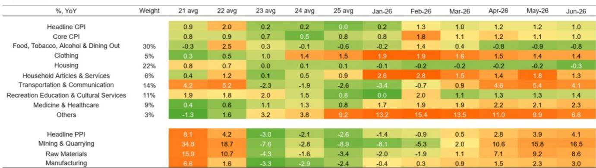
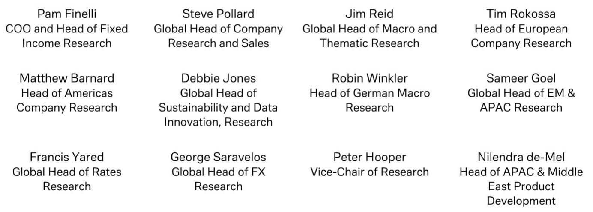
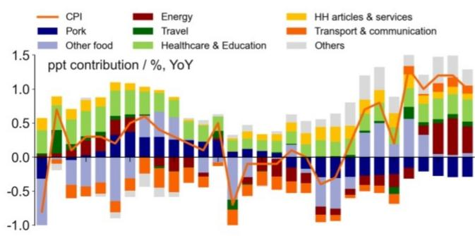

# DB：中国再通胀进入“中场休息”，消费价格韧性减弱

中国6月通胀数据传递了一个清晰但容易被忽视的信号：再通胀进程正在暂停，而非逆转。DB最新研报指出，CPI和PPI双双环比回落，且回落范围比油价下跌本身更广——这背后是国内需求走软对价格动能的实质性侵蚀。

6月CPI同比降至1.0%，环比下降0.3%。能源价格环比骤降4.5%，将CPI贡献拉低0.2个百分点。食品通胀依然仍在调整，同比为-1.6%。更值得关注的是核心CPI——同比微降至1.0%，为去年9月以来最低；环比连续第二个月下滑，跌幅0.1%。这意味着剔除能源和食品后的价格韧性也在减弱。

PPI同比虽因基数效应升至4.1%，但环比已转为-0.3%。上游和中游的油价冲击效应正在消退，而下游行业的价格传导仍十分有限。报告认为，这恰恰是需求不足的体现——企业无法将成本上涨完全转嫁给消费者。

## 1. 消费品价格走弱，补贴效应正在递减

家电和汽车价格出现节奏变化。报告分析，这很可能与以旧换新补贴的边际效应递减有关。消费品价格同比涨幅回落0.5个百分点至1.1%，是影响CPI的主要因素之一。补贴政策在初期确实拉动了需求，但随着时间推移，其对价格的支撑力度正在减弱。

> **KC评论：** 补贴效应递减是一个值得持续跟踪的信号。如果后续没有新的财政刺激接力，消费品价格可能进一步承压。这反过来也会影响企业定价能力和利润预期。

## 2. 服务和AI相关产品价格是少数韧性点

并非所有领域都在走弱。服务通胀持稳于0.8%，教育、旅游和娱乐价格同比微升0.1个百分点。通信设备价格更是加速上涨，同比升至7.6%，较上月再提高1.0个百分点。报告认为，这与AI相关产品需求持续旺盛有关。

这种分化意味着，当前的价格疲软更多是周期性的、需求侧的，而非全面价格变化。结构性增长领域——尤其是与AI、数字化相关的产品和服务——仍在享受定价权。

## 3. 上游涨价向下游传导受阻，症结在内需

PPI数据提供了另一个观察视角。化石燃料相关行业PPI环比大幅转负，影响化工、塑料和橡胶产品价格。与此同时，部分下游行业——设备、家具、汽车、通信设备——确实出现了价格传导迹象，但幅度有限。

报告明确指出，这种有限的传导“受制于疲软的国内需求”。换句话说，上游成本上涨无法顺畅地推高终端价格，因为消费者不愿意或无力接受涨价。这形成了一个典型的利润挤压格局：上游企业面临成本不确定性，下游企业面临定价困难。

## 4. 政策窗口已打开，财政支出是关键变量

DB维持全年CPI 1.3%、PPI 3.0%的预测，这两个数字已在其中期展望中被下调。6月数据确认了需求走软正在向价格端传导，且速度在加快。

报告认为，下半年更积极的国内政策——尤其是财政支出——将有助于扭转近期消费价格的回落。如果没有这样的政策支持，CPI存在进一步走弱的不确定性。这是一个明确的政策预期指引：市场不应期待价格自发修复，而应关注财政端是否会有实质性的加码。

> **KC评论：** 对于观察宏观环境的读者来说，6月通胀数据提供了一个实用的分析框架：不要只看CPI和PPI的同比数字，而要关注环比变化、补贴政策节奏、以及上游向下游的价格传导效率。这三个维度比单一的通胀读数更能反映真实的需求温度。

For informational purposes only. Portions may be generated,translated,summarized,or edited with AI assistance based on source materials and may contain omissions or errors. Please verify independently. This is not investment,legal,tax,accounting,or other professional advice.

For informational purposes only. Portions may be generated,translated,summarized,or edited with AI assistance based on source materials and may contain omissions or errors. Please verify independently. This is not investment,legal,tax,accounting,or other professional advice.

