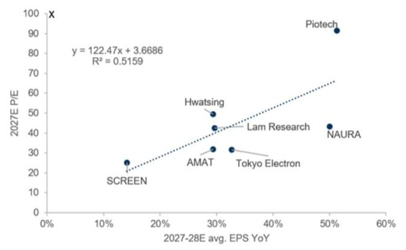
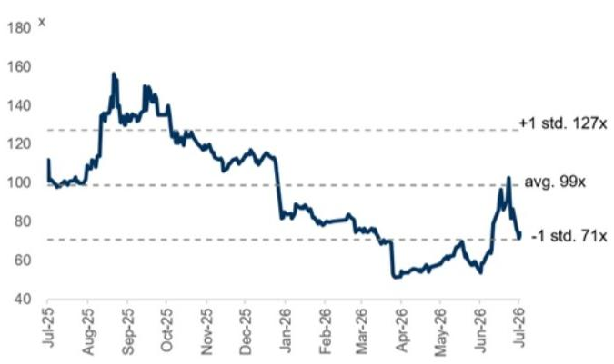
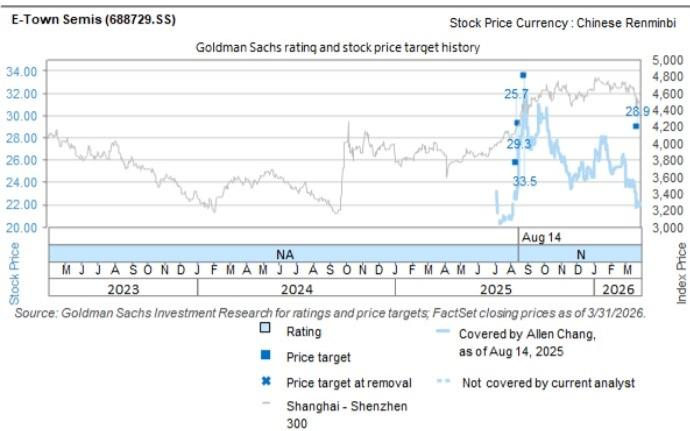

## E-Town Semis (688729.SS): Riding on memory and advanced node capacity expansion in local market; maintain Neutral on fair valuation

We remain positive on the China Semi supply chain, riding on rising advanced node capacity expansion and the generative AI trend supporting China semis ecosystem development. Media reports (Link) of a long-term supply agreement between CXMT and Tencent for server DRAM chips indicate strong demand from local clients and mix upgrade towards high-end applications. We expect E-Town to benefit from the China Semi capex uptrend, along with its supply chain switching to China suppliers, driving the company's revenue growth and profitability improvement. The company's 1Q26 gross margin was higher than our estimate, representing 3 consecutive quarters with gross margin over $40\%$ , while 1Q26 revenue was lower than our estimate, which we attribute to new products' ramp up taking more time. We maintain our Neutral rating as we believe the positives are largely priced in.

Earnings revision: We factor in E-Town's 4Q25 and 1Q26 results and revise down our 2026E net income by $5\%$ , mainly on lower revenues. We lower our 2026E revenue to reflect the 1Q26 revenue miss due to new products' ramp up taking more time, but raise 2027-28E revenues as we expect E-Town to benefit from memory and advanced node capacity expansion in the local market. We raise our 2026-28E gross margins to reflect the company moving its supply chain to China suppliers. Our 2026-28E opex ratios are largely unchanged, leading to 2026-28E net incomes $-5\% / +4\% / +6\%$ .

Exhibit 1: Earnings revision

<table><tr><td rowspan="2">Rmb mn</td><td colspan="3">2026E</td><td colspan="3">2027E</td><td colspan="3">2028E</td></tr><tr><td>Old</td><td>New</td><td>Chg</td><td>Old</td><td>New</td><td>Chg</td><td>Old</td><td>New</td><td>Chg</td></tr><tr><td>Revenue</td><td>7,131</td><td>6,204</td><td>-13%</td><td>8,762</td><td>8,938</td><td>2%</td><td>9,936</td><td>10,231</td><td>3%</td></tr><tr><td>GP</td><td>2,747</td><td>2,465</td><td>-10%</td><td>3,438</td><td>3,584</td><td>4%</td><td>3,921</td><td>4,136</td><td>5%</td></tr><tr><td>OP</td><td>1,337</td><td>1,185</td><td>-11%</td><td>1,979</td><td>2,078</td><td>5%</td><td>2,317</td><td>2,463</td><td>6%</td></tr><tr><td>Net income</td><td>1,298</td><td>1,235</td><td>-5%</td><td>1,877</td><td>1,950</td><td>4%</td><td>2,173</td><td>2,294</td><td>6%</td></tr><tr><td>Margins</td><td colspan="3"></td><td colspan="3"></td><td colspan="3"></td></tr><tr><td>Gross margin</td><td>38.5%</td><td>39.7%</td><td></td><td>39.2%</td><td>40.1%</td><td></td><td>39.5%</td><td>40.4%</td><td></td></tr><tr><td>OPM</td><td>18.7%</td><td>19.1%</td><td></td><td>22.6%</td><td>23.3%</td><td></td><td>23.3%</td><td>24.1%</td><td></td></tr><tr><td>NM</td><td>18.2%</td><td>19.9%</td><td></td><td>21.4%</td><td>21.8%</td><td></td><td>21.9%</td><td>22.4%</td><td></td></tr></table>

Source: Company data, GS Global Investment Research

Valuation: We roll over our base year to 2027E and continue to use a near-term P/E to derive our 12M TP. Our 2027E target P/E is updated to 49.9x (vs. 45.9x previously), which is derived from peers' correlation of 2027E P/E to 2027-28E avg. EPS growth, and reflects the sector re-rating on memory and advanced node capacity expansion and rising AI related end demand. With the updated target multiple and earnings estimates, our 12M TP is updated to Rmb32.9 (vs. Rmb28.9 previously). Our new TP

Allen Chang  
+852-2978-2930 |  
allen.k.chang@gs.com  
GS (Asia) L.L.C.

Verena Jeng
+852-2978-1681 | verena.jeng@gs.com
GS (Asia) L.L.C.

Yifan Hu  
+852-2978-0996 | yifan.hu@gs.com  
GS (Asia) L.L.C.

implied PEG is at 1.3x, within peers' range of 0.9x to 1.8x. The stock currently trades at 57.9x 2027E P/E, vs. our 2027E target P/E at 49.9x, implying the positives are largely priced in. Maintain Neutral.

Exhibit 2: Peers' correlation of 2027E P/E to 2027-28E avg. EPS growth  
  
Source: Company data, GS Global Investment Research, Refinitiv Eikon

Exhibit 3: E-Town Semis 12M forward P/E  
  
Source: Company data, GS Global Investment Research

Exhibit 4: E-Town and peers' PEG

<table><tr><td></td><td>Ticker</td><td>Rating</td><td>2027E PE</td><td>2027-28E avg. EPS growth</td><td>PEG</td></tr><tr><td>NAURA</td><td>002371.SZ</td><td>Buy</td><td>43.3</td><td>50%</td><td>0.9</td></tr><tr><td>Piotech</td><td>688072.SS</td><td>NC</td><td>91.5</td><td>51%</td><td>1.8</td></tr><tr><td>Hwatsing</td><td>688120.SS</td><td>Neutral</td><td>49.5</td><td>29%</td><td>1.7</td></tr><tr><td>Lam Research</td><td>LRCX</td><td>Buy</td><td>42.6</td><td>30%</td><td>1.4</td></tr><tr><td>E-Town Semi</td><td>688729.SS</td><td>Neutral</td><td>49.9</td><td>38%</td><td>1.3</td></tr></table>

Source: Company data, GS Global Investment Research, Refinitiv Eikon

Exhibit 5: E-Town P&L summary

<table><tr><td>Rmb m</td><td>1Q25</td><td>2Q25</td><td>3Q25</td><td>4Q25</td><td>1Q26</td><td>2Q26E</td><td>3Q26E</td><td>4Q26E</td><td>2022</td><td>2023</td><td>2024</td><td>2025</td><td>2026E</td><td>2027E</td><td>2028E</td><td>2029E</td><td>2030E</td></tr><tr><td colspan="18">Income statement</td></tr><tr><td>Revenues</td><td>1,160</td><td>1,322</td><td>1,314</td><td>1,280</td><td>1,037</td><td>1,230</td><td>1,962</td><td>1,975</td><td>4,763</td><td>3,931</td><td>4,633</td><td>5,076</td><td>6,204</td><td>8,938</td><td>10,231</td><td>11,317</td><td>12,318</td></tr><tr><td>GP</td><td>413</td><td>478</td><td>528</td><td>523</td><td>415</td><td>488</td><td>778</td><td>784</td><td>1,358</td><td>1,377</td><td>1,732</td><td>1,942</td><td>2,465</td><td>3,584</td><td>4,136</td><td>4,573</td><td>4,984</td></tr><tr><td>OP</td><td>97</td><td>134</td><td>202</td><td>183</td><td>114</td><td>166</td><td>450</td><td>455</td><td>385</td><td>275</td><td>494</td><td>615</td><td>1,185</td><td>2,078</td><td>2,463</td><td>2,734</td><td>3,031</td></tr><tr><td>Net income</td><td>218</td><td>130</td><td>168</td><td>155</td><td>159</td><td>168</td><td>452</td><td>455</td><td>383</td><td>309</td><td>541</td><td>671</td><td>1,235</td><td>1,950</td><td>2,294</td><td>2,514</td><td>2,765</td></tr><tr><td>EPS (Rmb)</td><td>0.07</td><td>0.04</td><td>0.06</td><td>0.05</td><td>0.05</td><td>0.06</td><td>0.15</td><td>0.15</td><td>0.14</td><td>0.12</td><td>0.20</td><td>0.23</td><td>0.42</td><td>0.66</td><td>0.78</td><td>0.85</td><td>0.94</td></tr><tr><td colspan="18">Margins</td></tr><tr><td>Gross margin</td><td>35.6%</td><td>36.1%</td><td>40.1%</td><td>40.9%</td><td>40.0%</td><td>39.7%</td><td>39.6%</td><td>39.7%</td><td>28.5%</td><td>35.0%</td><td>37.4%</td><td>38.3%</td><td>39.7%</td><td>40.1%</td><td>40.4%</td><td>40.4%</td><td>40.5%</td></tr><tr><td>OPM</td><td>8.4%</td><td>10.1%</td><td>15.3%</td><td>14.3%</td><td>11.0%</td><td>13.5%</td><td>23.0%</td><td>23.0%</td><td>8.1%</td><td>7.0%</td><td>10.7%</td><td>12.1%</td><td>19.1%</td><td>23.3%</td><td>24.1%</td><td>24.2%</td><td>24.6%</td></tr><tr><td>NM</td><td>18.8%</td><td>9.9%</td><td>12.8%</td><td>12.1%</td><td>15.4%</td><td>13.6%</td><td>23.1%</td><td>23.1%</td><td>8.0%</td><td>7.9%</td><td>11.7%</td><td>13.2%</td><td>19.9%</td><td>21.8%</td><td>22.4%</td><td>22.2%</td><td>22.4%</td></tr><tr><td colspan="18">Ratios</td></tr><tr><td>Opex ratio</td><td>27.3%</td><td>26.0%</td><td>24.8%</td><td>26.6%</td><td>29.0%</td><td>26.2%</td><td>16.7%</td><td>16.7%</td><td>20.4%</td><td>28.0%</td><td>26.7%</td><td>26.1%</td><td>20.6%</td><td>16.9%</td><td>16.4%</td><td>16.3%</td><td>15.9%</td></tr><tr><td>Tax rate</td><td>-19.0%</td><td>-0.4%</td><td>17.1%</td><td>6.2%</td><td>0.0%</td><td>0.0%</td><td>0.0%</td><td>0.0%</td><td>4.4%</td><td>-16.8%</td><td>-5.6%</td><td>1.4%</td><td>0.0%</td><td>7.2%</td><td>8.0%</td><td>9.0%</td><td>10.0%</td></tr><tr><td colspan="18">YoY</td></tr><tr><td>Revenues</td><td>15%</td><td>23%</td><td>6%</td><td>-2%</td><td>-11%</td><td>-7%</td><td>49%</td><td>54%</td><td>47%</td><td>-17%</td><td>18%</td><td>10%</td><td>22%</td><td>44%</td><td>14%</td><td>11%</td><td>9%</td></tr><tr><td>GP</td><td>12%</td><td>4%</td><td>12%</td><td>22%</td><td>0%</td><td>2%</td><td>47%</td><td>50%</td><td>39%</td><td>1%</td><td>26%</td><td>12%</td><td>27%</td><td>45%</td><td>15%</td><td>11%</td><td>9%</td></tr><tr><td>OP</td><td>23%</td><td>-7%</td><td>21%</td><td>73%</td><td>18%</td><td>24%</td><td>123%</td><td>149%</td><td>78%</td><td>-29%</td><td>80%</td><td>24%</td><td>93%</td><td>75%</td><td>19%</td><td>11%</td><td>11%</td></tr><tr><td>Net income</td><td>113%</td><td>-11%</td><td>-2%</td><td>29%</td><td>-27%</td><td>29%</td><td>170%</td><td>194%</td><td>111%</td><td>-19%</td><td>75%</td><td>24%</td><td>84%</td><td>58%</td><td>18%</td><td>10%</td><td>10%</td></tr><tr><td colspan="18">QoQ</td></tr><tr><td>Revenues</td><td>-11%</td><td>14%</td><td>-1%</td><td>-3%</td><td>-19%</td><td>19%</td><td>60%</td><td>1%</td><td></td><td></td><td></td><td></td><td></td><td></td><td></td><td></td><td></td></tr><tr><td>GP</td><td>-4%</td><td>16%</td><td>10%</td><td>-1%</td><td>-21%</td><td>18%</td><td>59%</td><td>1%</td><td></td><td></td><td></td><td></td><td></td><td></td><td></td><td></td><td></td></tr><tr><td>OP</td><td>-8%</td><td>38%</td><td>50%</td><td>-9%</td><td>-38%</td><td>45%</td><td>172%</td><td>1%</td><td></td><td></td><td></td><td></td><td></td><td></td><td></td><td></td><td></td></tr><tr><td>Net income</td><td>80%</td><td>-40%</td><td>29%</td><td>-8%</td><td>3%</td><td>5%</td><td>169%</td><td>1%</td><td></td><td></td><td></td><td></td><td></td><td></td><td></td><td></td><td></td></tr></table>

Source: Company data, GS Global Investment Research

Valuation: We derive our 12M TP of Rmb32.9 on a target P/E multiple of 49.9x 2026E EPS. Our target P/E of 49.9x is derived from the correlation between P/E and EPS growth of E-Town's peers, based on E-Town's 2027-28E EPS YoY growth.

Key risks: Faster-/slower-than-expected semis capex expansion in China; Milder-/fiercer-than-expected competition; Faster-/slower-than-expected ramp up of RTP and dry etcher's shipments

<table><tr><td>688729.SS</td><td>12m Price Target: Rmb32.90</td><td colspan="2">Price: Rmb37.57</td><td colspan="2">Downside: 12.4%</td></tr><tr><td>Neutral</td><td colspan="5">GS Forecast</td></tr><tr><td></td><td></td><td>12/25</td><td>12/26E</td><td>12/27E</td><td>12/28E</td></tr><tr><td>Market cap:</td><td>Revenue (Rmb mn) New</td><td>5,076.3</td><td>6,204.4</td><td>8,937.8</td><td>10,231.4</td></tr><tr><td>Rmb111.0bn / $16.3bn</td><td>Revenue (Rmb mn) Old</td><td>5,076.3</td><td>7,131.3</td><td>8,762.3</td><td>9,935.5</td></tr><tr><td>Enterprise value:</td><td>EBITDA (Rmb mn)</td><td>777.7</td><td>1,324.2</td><td>2,195.8</td><td>2,579.1</td></tr><tr><td>Rmb108.9bn / $16.0bn</td><td>EPS (Rmb) New</td><td>0.23</td><td>0.42</td><td>0.66</td><td>0.78</td></tr><tr><td>3m ADTV:</td><td>EPS (Rmb) Old</td><td>0.23</td><td>0.44</td><td>0.63</td><td>0.74</td></tr><tr><td>Rmb796.6mn / $117.3mn</td><td>P/E (X)</td><td>112.3</td><td>89.9</td><td>56.9</td><td>48.4</td></tr><tr><td rowspan="5">China Greater China Technology M&amp;A Rank: 3 Leases incl. in net debt &amp; EV?: Yes</td><td>P/B (X)</td><td>8.4</td><td>10.9</td><td>9.2</td><td>7.7</td></tr><tr><td>Dividend yield (%)</td><td>0.1</td><td>0.0</td><td>0.0</td><td>0.0</td></tr><tr><td>CROCI (%)</td><td>1.0</td><td>20.8</td><td>27.9</td><td>29.5</td></tr><tr><td></td><td>3/26</td><td>6/26E</td><td>9/26E</td><td>12/26E</td></tr><tr><td>EPS (Rmb)</td><td>0.05</td><td>0.06</td><td>0.15</td><td>0.15</td></tr></table>

Source: Company data, GS estimates, FactSet. Price as of 9 Jul 2026 close.

## Disclosure Appendix

## Reg AC

We, Allen Chang, Verena Jeng and Yifan Hu, hereby certify that all of the views expressed in this report accurately reflect our personal views about the subject company or companies and its or their securities. We also certify that no part of our compensation was, is or will be, directly or indirectly, related to the specific recommendations or views expressed in this report.

Unless otherwise stated, the individuals listed on the cover page of this report are analysts in GS' Global Investment Research division.

Contributing Authors: Allen Chang GS (Asia) L.L.C., Verena Jeng GS (Asia) L.L.C., Yifan Hu GS (Asia) L.L.C..

Unless otherwise stated, the individuals listed in the Contributing Authors disclosure of this report are analysts in GS' Global Investment Research division.

## GS Factor Profile

The GS Factor Profile provides investment context for a stock by comparing key attributes to the market (i.e. our universe of rated stocks) and its sector peers. The four key attributes depicted are: Growth, Financial Returns, Multiple (e.g. valuation) and Integrated (a composite of Growth, Financial Returns and Multiple). Growth, Financial Returns and Multiple are calculated by using normalized ranks for specific metrics for each stock. The normalized ranks for the metrics are then averaged and converted into percentiles for the relevant attribute. The precise calculation of each metric may vary depending on the fiscal year, industry and region, but the standard approach is as follows:

Growth is based on a stock's forward-looking sales growth, EBITDA growth and EPS growth (for financial stocks, only EPS and sales growth), with a higher percentile indicating a higher growth company. Financial Returns is based on a stock's forward-looking ROE, ROCE and CROCI (for financial stocks, only ROE), with a higher percentile indicating a company with higher financial returns. Multiple is based on a stock's forward-looking P/E, P/B, price/dividend (P/D), EV/EBITDA, EV/FCF and EV/Debt Adjusted Cash Flow (DACF) (for financial stocks, only P/E, P/B and P/D), with a higher percentile indicating a stock trading at a higher multiple. The Integrated percentile is calculated as the average of the Growth percentile, Financial Returns percentile and (100% - Multiple percentile).

Financial Returns and Multiple use the GS analyst forecasts at the fiscal year-end at least three quarters in the future. Growth uses inputs for the fiscal year at least seven quarters in the future compared with the year at least three quarters in the future (on a per-share basis for all metrics).

For a more detailed description of how we calculate the GS Factor Profile, please contact your GS representative.

## M&A Rank

Across our global coverage, we examine stocks using an M&A framework, considering both qualitative factors and quantitative factors (which may vary across sectors and regions) to incorporate the potential that certain companies could be acquired. We then assign a M&A rank as a means of scoring companies under our rated coverage from 1 to 3, with 1 representing high (30%-50%) probability of the company becoming an acquisition target, 2 representing medium (15%-30%) probability and 3 representing low (0%-15%) probability. For companies ranked 1 or 2, in line with our standard departmental guidelines we incorporate an M&A component into our target price. M&A rank of 3 is considered immaterial and therefore does not factor into our price target, and may or may not be discussed in research.

## Quantum

Quantum is GS' proprietary database providing access to detailed financial statement histories, forecasts and ratios. It can be used for in-depth analysis of a single company, or to make comparisons between companies in different sectors and markets.

## Disclosures

The rating(s) for E-Town Semis is/are relative to the other companies in its/their coverage universe: AAC, ACM Research, AMEC, ASMPT, AVC, AccoTest, Anji Micro, Asus, Auras, BOE, BYDE, Biren, CR Micro, Cambricon, Chenbro, China Mobile (HK), China Telecom, China Tower Corp., China Unicom, Chinasoft Intl, Compal, Desay SV, E Ink, E-Town Semis, EHang, Empyrean, Eoptolink, FOCI, Fositek, Foxconn Industrial Internet, Gigabyte, Gigadevice, Glodon Co., HTC Corp., Hikvision, Hon Hai, Horizon Robotics, Hua Hong, Huace Navigation, Huaqin Co.(A), Huaqin Co.(H), Hwatsing, InnoScience, Innolight, Inspur, Insta360, Inventec, JCET, Kematek, King Slide, Kingdee, Kingsoft Office, LandMark, Largan, Lenovo, Lingyi, Maxscend, Meitu, MetaX, Mitac, Montage (A), Montage (H), NAURA, NSIG, Nexchip, OmniVision, Pegatron, Pony AI Inc. (ADR), Pony AI Inc. (H), Quanta, RoboTechnik, Ruijie Networks, SG Micro, SICC, SMIC (A), SMIC (H), SZS, Sangfor, SenseTime, Shengyi Tech, Shennan Circuits, StarPower, Sunny Optical, TFC Optical, Thundersoft, Tongyu Communication, Transsion, UMT, UNIS, VPEC, Vanchip, VeriSilicon, Victory Giant, WNC, WUS, WeRide, Wistron, Wiwynn, YJ Semitech, YOFC, Yonyou, ZTE (A), ZTE (H), iFlytek

## Company-specific regulatory disclosures

The following disclosures relate to relationships between The GS Group, Inc. (with its affiliates, “GS”) and companies covered by GS Global Investment Research and referred to in this research.

There are no company-specific disclosures for: E-Town Semis (Rmb37.57)

## Distribution of ratings/investment banking relationships

GS Investment Research global Equity coverage universe

<table><tr><td rowspan="2"></td><td colspan="3">Rating Distribution</td><td colspan="3">Investment Banking Relationships</td></tr><tr><td>Buy</td><td>Hold</td><td>Sell</td><td>Buy</td><td>Hold</td><td>Sell</td></tr><tr><td>Global</td><td>50%</td><td>34%</td><td>16%</td><td>65%</td><td>60%</td><td>45%</td></tr></table>

As of April 1, 2026, GS Global Investment Research had investment ratings on 3,074 equity securities. GS assigns stocks as Buys and Sells on various regional Investment Lists; stocks not so assigned are deemed Neutral. Such assignments equate to Buy, Hold and Sell for the purposes of the above disclosure required by the FINRA Rules. See ‘Ratings, Coverage universe and related definitions’ below. The Investment Banking Relationships chart reflects the percentage of subject companies within each rating category for whom GS has provided investment banking services within the previous twelve months.

## Price target and rating history chart(s)

  
The price targets shown should be considered in the context of all prior published GS, which may or may not have included price targets, as well as developments relating to the company, its industry and financial markets.

## Target price history table(s)

## E-Town Semis (688729.SS)

<table><tr><td>Date of report</td><td>Target price (Rmb)</td><td>Closing price (Rmb)</td></tr><tr><td>25-Mar-26</td><td>28.90</td><td>22.38</td></tr><tr><td>29-Aug-25</td><td>33.50</td><td>31.35</td></tr><tr><td>18-Aug-25</td><td>29.30</td><td>27.90</td></tr><tr><td>14-Aug-25</td><td>25.70</td><td>22.46</td></tr></table>

Price targets shown in table(s) are unadjusted for corporate actions.

## Regulatory disclosures

## Disclosures required by United States laws and regulations

See company-specific regulatory disclosures above for any of the following disclosures required as to companies referred to in this report: manager or co-manager in a pending transaction; $1\%$ or other ownership; compensation for certain services; types of client relationships; managed/co-managed public offerings in prior periods; directorships; for equity securities, market making and/or specialist role. GS trades or may trade as a principal in debt securities (or in related derivatives) of issuers discussed in this report.

The following are additional required disclosures: Ownership and material conflicts of interest: GS policy prohibits its analysts, professionals reporting to analysts and members of their households from owning securities of any company in the analyst's area of coverage. Analyst compensation: Analysts are paid in part based on the profitability of GS, which includes investment banking revenues. Analyst as officer or director: GS policy generally prohibits its analysts, persons reporting to analysts or members of their households from serving as an officer, director or advisor of any company in the analyst's area of coverage. Non-U.S. Analysts: Non-U.S. analysts may not be associated persons of GS & Co. LLC and therefore may not be subject to FINRA Rule 2241 or FINRA Rule 2242 restrictions on communications with a subject company, public appearances and trading in securities covered by the analysts.

## Additional disclosures required under the laws and regulations of jurisdictions other than the United States

The following disclosures are those required by the jurisdiction indicated, except to the extent already made above pursuant to United States laws and regulations. Australia: GS Australia Pty Ltd and its affiliates are not authorised deposit-taking institutions (as that term is defined in the Banking Act 1959 (Cth)) in Australia and do not provide banking services, nor carry on a banking business, in Australia. This research, and any access to it, is intended only for “wholesale clients” within the meaning of the Australian Corporations Act, unless otherwise agreed by GS. In producing research reports, members of Global Investment Research of GS Australia may attend site visits and other meetings hosted by the companies and other entities which are the subject of its research reports. In some instances the costs of such site visits or meetings may be met in part or in whole by the issuers concerned if GS Australia considers it is appropriate and reasonable in the specific circumstances relating to the site visit or meeting. To the extent that the contents of this document contains any financial product advice, it is general advice only and has been prepared by GS without taking into account a client’s objectives, financial situation or needs. A client should, before acting on any such advice, consider the appropriateness of the advice having regard to the client’s own objectives, financial situation and needs. A copy of certain GS Australia and New Zealand disclosure of interests and a copy of GS’ Australian Sell-Side Research Independence Policy Statement are available at: https://www.goldmansachs.com/disclosures/australia-new-zealand/index.html. Brazil: Disclosure information in relation to CVM Resolution n. 20 is available at https://www.gs.com/worldwide/brazil/area/gir/index.html. Where applicable, the Brazil-registered analyst primarily responsible for the content of this research report, as defined in Article 20 of CVM Resolution n. 20, is the first author named at the beginning of this report, unless indicated otherwise at the end of the text. Canada: This information is being provided to you for information purposes only and is not, and under no circumstances should be construed as, an advertisement, offering or solicitation by GS & Co. LLC for purchasers of securities in Canada to trade in any Canadian security. GS & Co. LLC is not registered as a dealer in any jurisdiction in Canada under applicable Canadian securities laws and generally is not permitted to trade in Canadian securities and may be prohibited from selling certain securities and products in certain jurisdictions in Canada. If you wish to trade in any Canadian securities or other products in Canada please contact GS Canada Inc., an affiliate of The GS Group Inc., or another registered Canadian dealer. Hong Kong: Further information on the securities of covered companies referred to in this research may be obtained on request from GS (Asia) L.L.C. India: Further information on the subject company or companies referred to in this research may be obtained from GS (India) Securities Private Limited, Research Analyst - SEBI Registration Number INH000001493, 10th Floor, Ascent-Worli, Sudam Kalu Ahire Marg, Worli, Mumbai-400 025, India, Corporate Identity Number U74140MH2006
